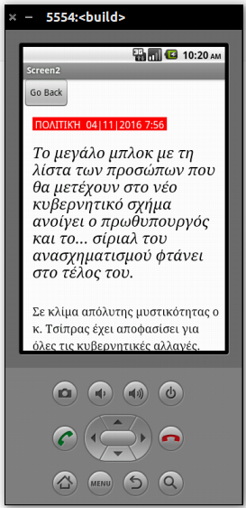

#ΙΟΝΙΟ ΠΑΝΕΠΙΣΤΗΜΙΟ
#ΤΜΗΜΑ ΠΛΗΡΟΦΟΡΙΚΗΣ
#ΜΑΘΗΜΑ: Σχεδίαση της Διάδρασης Ανθρώπου-Υπολογιστή

Επιβλέπων καθηγητής: Χωριανόπουλος Κωνσταντίνος

Φοιτητής:

ΠΑΠΑΧΡΗΣΤΟΣ ΓΕΩΡΓΙΟΣ - Π2010035 - p10papa1@ionio.gr

##Προδιαγραφές

* Συγκεντρωμένα Νέα που επιλέγει ο κατασκευαστής
* Επιλογή ενός Νέου και άνοιγμα της Ιστοσελίδας του

* Βελτιώσεις στη Τελική Παρουσίαση

Έχει γίνει προσθήκη δύο στοιχείων Επιταχυνσιόμετρων (Αισθητήρας επιτάχυνσης) για την
διαδραστικότητα με κίνηση της συσκευής. 
Όταν ο χρήστης επιταχύνει το κινητό του δεξιά πάνω από ένα κατώφλι που ορίσαμε 
τότε αλλάζει οθόνη και εισάγεται στην ιστοσελίδα που επέλεξε.
Ομοίως, μπορεί να επιστρέψει στην αρχική οθόνη όταν επιταχύνει το κινητό του κατα αριστερά.

Επίσης, έγιναν βελτιώσεις στην εμφάνιση των κουμπιών.

## Εγκατάσταση εργαλείων ανάπτυξης και τρέξιμο/αλλαγές σε υπάρχοντα

    Εργαλείο ανάπτυξης: MIT App Inventor 2
    Δανεισμός στοιχείων (ιδέες και κώδικα) από: 
Tutorial:	http://appinventor.mit.edu/explore/ai2/tutorials.html
*	http://stackoverflow.com/questions/28869954/how-can-i-open-a-web-page-in-app-inventor
*	http://www.appinventor.org/content/howDoYou/screens/share
*	http://stackoverflow.com/questions/27872652/how-to-pass-data-between-screens-using-intent-in-mit-app-inventor

##  Title: Get News (Οι σημαντικότερες ειδήσεις)

--------- Screen 1 --------- 

Ο χρήστης όταν ανοίγει την εφαρμογή πρέπει να πατήσει το κουμπί Get or Update
για να ξεκινήσει η λήψη του Πηγαίου Κώδικα ιστοσελίδων που έχουν
οριστεί από τον κατασκευαστή.
Ο αλγόριθμος εντοπίζει τα σημεία κλειδιά μέσα στο Πηγαίο Κώδικα και συγκεκριμένα
τον τίτλο, href της εικόνας, href του Url της σημαντικότερης είδησης.

Πρωτότυπο 1

Πρωτότυπο 2

Πατώντας στον τίτλο του Άρθρου θα ανοίξει μια νέα Screen και 
θα φορτώσει η Ιστοσελίδα σε ένα εσωτερικό Broswer-το WebViewer.

--------- Screen 2 ---------

Πρωτότυπο 3

Ο Χρήστης μπορεί να επιστρέψει στην αρχική οθόνη και να δει και τις υπόλοιπες ειδήσεις.

##  Σενάριο

Η μητέρα μου έχει αγοράσει πρόσφατα ένα νέο τηλέφωνο με Android γιατί θέλει μην 'μείνει πίσω στην τεχνολογία' όπως λέει η ίδια.
Και την ενδιαφέρει πολύ να έχει ένα εικονίδιο στην επιφάνεια - μια εφαρμογή- ώστε πατώντας το να διαβάζει τα σημαντικότερα νέα
της ημέρας συγκεντρωμένα. Για αυτό που της ενδιαφέρει πιο πολύ,να κάνει κλικ και να μπαίνει στην ιστοσελίδα.
Αλλά να μπορεί να πατήσει και ένα άλλο κουμπί και να γυρίσει εκεί που ήταν.

## Tutorial / Video:  https://youtu.be/-wDrpYBHVn4

##  Online Demo http://ai2.appinventor.mit.edu/?locale=en#5905778096209920

