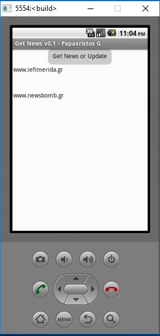

#ΙΟΝΙΟ ΠΑΝΕΠΙΣΤΗΜΙΟ
#ΤΜΗΜΑ ΠΛΗΡΟΦΟΡΙΚΗΣ
#ΜΑΘΗΜΑ: Σχεδίαση της Διάδρασης Ανθρώπου-Υπολογιστή

Επιβλέπων καθηγητής: Χωριανόπουλος Κωνσταντίνος

Φοιτητής:

ΠΑΠΑΧΡΗΣΤΟΣ ΓΕΩΡΓΙΟΣ - Π2010035 - p10papa1@ionio.gr

##Σύνοψη

Τα τελευταία χρόνια η ανάγνωση ειδήσεων μέσω διαδικτύου έχεις αυξηθεί και ξεπεράσει την ανάγνωση έντυπων 
πηγών ειδήσεων, όπως εφημερίδες, περιοδικά κτλ.
Στο επόμενο βήμα ο χρήστης κρίνει αναγκαίο την περισυλλογή των ειδήσεων που τον ενδιαφέρει μέσα από μια πηγή
και την γρήγορη και απλοική εύρεση τους. Έτσι λοιπόν δημιούργησα μια εφαρμογή για το Android η οποία θα παρουσιάζει
ειδήσεις-θέματα που έχουν περισυλλεχθεί από συγκεκριμένους ιστοχώρους που παρέχουν ειδήσεις.
Ο χρήστης μπορεί να αλληλεπιδρασει με την εφαρμογή μέσω των αισθητήρων της κινητής συσκευής για να πλοηγηθεί στα περιεχόμενα της.

#### Online Demo http://ai2.appinventor.mit.edu/?locale=en#5905778096209920

#Εισαγωγή 

##Περιγραφή της εφαρμογής - Χρήση

Ο χρήστης ανοίγει την εφαρμογή από το περιβάλλον Android και η πρώτη οθόνη που βλέπει είναι το κουμπί για έναρξη της σύνδεσης και συλλογής των δεδομένων από συγκεκριμένες ιστοσελίδες εισησιογραφικού περιεχομένου.
Πατώντας αυτό το κουμπί προβάλλονται οι δύο ( χωρίς περιορισμό της επανάληψης) πηγές που είναι σε προεπιλογή. Συγκεκριμένα για κάθε πηγή προβάλλεται η σημαντικότερη εικόνα και λεζάντα-τίτλος του.
Ο χρήστης μπορεί να πατήσει πάνω στην κάθε λεζάντα για να μεταφερθεί στην ιστοσελίδα που επιθυμεί.
Την ίδια ενέργεια μπορεί να εκτελέσει αν κουνήσει το κινητό του απότομα προς τα δεξιά.

Σε περίπτωση που επιθυμεί να επιστρέψει στην αρχική οθόνη θα πρέπει να πατήσεις το ειδικό κουμπί Go Back ή να κουνήσει το κινητό του απότομα προς τα αριστερά.

#### Tutorial / Video:  https://youtu.be/-wDrpYBHVn4

##Προδιαγραφές

#### Άνθρωπος

Απευθύνεται σε χρήστες κάθε ηλικίας που διαθέτει κινητό ή tablet με Android.

#### Πλαίσιο Χρήσης - Σκοπός

Η εφαρμογή μπορεί να χρησιμοποιηθεί από ανθρώπους που δεν μπορούν να εντοπίσουν ποιές ιστοσελίδες πρέπει να ανοίξουν ώστε να διαβάσουν τις σημαντικότερες ειδήσεις και σε χρήστες που θέλουν απλά και γρήγορα να διαβάσουν και να πλοηγηθούν στις σημαντικότερες ειδήσεις.

#### Διεργασία Χρήσης

Γίνεται με κουμπιά για την φόρτωση των νέων (όχι αυτόματα - όχι άσκοπη χρήση δεδομένων) και με την κίνηση (αριστερα ή δεξιά) για την πλήγηση μεταξύ οθονών.

#### Λόγοι Επιτυχίας

Ευκολία στη χρήση και στη συγκέντρωση των σημαντικότερων νέων με εικόνες και λεζάντες.

##Βελτιώσεις στη Τελική Παρουσίαση

Έχει γίνει προσθήκη δύο στοιχείων Επιταχυνσιόμετρων (Αισθητήρας επιτάχυνσης) για την
διαδραστικότητα με κίνηση της συσκευής. 
Όταν ο χρήστης επιταχύνει το κινητό του δεξιά πάνω από ένα κατώφλι που ορίσαμε 
τότε αλλάζει οθόνη και εισάγεται στην ιστοσελίδα που επέλεξε.
Ομοίως, μπορεί να επιστρέψει στην αρχική οθόνη όταν επιταχύνει το κινητό του κατα αριστερά.

Επίσης, έγιναν βελτιώσεις στην εμφάνιση των κουμπιών.

##  Σενάριο Χρήσης

Η μητέρα μου έχει αγοράσει πρόσφατα ένα νέο τηλέφωνο με Android γιατί θέλει μην 'μείνει πίσω στην τεχνολογία' όπως λέει η ίδια.
Και την ενδιαφέρει πολύ να έχει ένα εικονίδιο στην επιφάνεια - μια εφαρμογή- ώστε πατώντας το να διαβάζει τα σημαντικότερα νέα
της ημέρας συγκεντρωμένα. Για αυτό που της ενδιαφέρει πιο πολύ,να κάνει κλικ και να μπαίνει στην ιστοσελίδα.
Αλλά να μπορεί να πατήσει και ένα άλλο κουμπί και να γυρίσει εκεί που ήταν.

## Εγκατάσταση εργαλείων ανάπτυξης και τρέξιμο/αλλαγές σε υπάρχοντα

    Εργαλείο ανάπτυξης: MIT App Inventor 2
    Δανεισμός στοιχείων (ιδέες και κώδικα) από: 
Tutorial:	http://appinventor.mit.edu/explore/ai2/tutorials.html
*	http://stackoverflow.com/questions/28869954/how-can-i-open-a-web-page-in-app-inventor
*	http://www.appinventor.org/content/howDoYou/screens/share
*	http://stackoverflow.com/questions/27872652/how-to-pass-data-between-screens-using-intent-in-mit-app-inventor

##Διαδικασία ανάπτυξης 

Αρχικά σχεδίασα πως θα εμφανίζονται οι οθόνες και πόσες θα χρειαστεί η εφαρμογής.

Το GUI είναι πολύ σημαντικό και πρέπει να γίνει στην αρχή, αν και στον κύκλο ανάπτυξης προσαρμόζεται συνεχώς.
Στη συνέχεια υλοποίησα τις διαδικασίες που χρησιμοποιούν το διαδίκτυο και τις ειδικές εντολές
για να συνδέεται σε μια ιστοσελίδα και να διαβάζει το περιεχόμενο της - source code.

Αφού έχουμε τον πηγαίο κώδικα (τελικό) σαν μια συμβολοσειρά τότε ξεκινάει η διαδικασία εύρεσης μέσα στο κείμενο για τον εντοπισμό των ειδικών λέξεων ώστε να εξαχθεί ο σημαντικότερος Τίτλος και η Εικόνα του.

Στην συνέχεια συνδέονται όλα αυτά με την προσθήκη κουμπιών, events και αισθητήρων.

##Ενδεικτικές Οθόνες

###  Title: Get News (Οι σημαντικότερες ειδήσεις)

--------- Screen 1 --------- 

Ο χρήστης όταν ανοίγει την εφαρμογή πρέπει να πατήσει το κουμπί Get or Update
για να ξεκινήσει η λήψη του Πηγαίου Κώδικα ιστοσελίδων που έχουν
οριστεί από τον κατασκευαστή.
Ο αλγόριθμος εντοπίζει τα σημεία κλειδιά μέσα στο Πηγαίο Κώδικα και συγκεκριμένα
τον τίτλο, href της εικόνας, href του Url της σημαντικότερης είδησης.

Πρωτότυπο 1

Πρωτότυπο 2

Πατώντας στον τίτλο του Άρθρου θα ανοίξει μια νέα Screen και 
θα φορτώσει η Ιστοσελίδα σε ένα εσωτερικό Broswer-το WebViewer.

--------- Screen 2 ---------

Πρωτότυπο 3

Ο Χρήστης μπορεί να επιστρέψει στην αρχική οθόνη και να δει και τις υπόλοιπες ειδήσεις.

# Συμπεράσματα και προτάσεις για μελλοντικές βελτιώσεις 

##Συμπεράσματα 

Το αααα

##Βελτιώσεις 

Οι πιθανές βελτιώσεις αναφορικά με την εργασία προσανατολίζονται ααααα

## Βιβλιογραφικές Πηγές 

*	Chorianopoulos, Konstantinos, and Michail N. Giannakos. "Design Principles for Serious Video Games in Mathematics Education: From Theory to Practice." The International Journal of Serious Games 1.3 (2014). 
*	Kafai, Yasmin B., and Veena Vasudevan. "Constructionist Gaming Beyond the Screen: Middle School Students' Crafting and Computing of Touchpads, Board Games, and Controllers." Proceedings of the Workshop in Primary and Secondary Computing Education on ZZZ. ACM, 2015. 
*	Vogler, C., The writer’s journey: Mythic structures for writers. Studio City, CA: Michael Wiese Productions, 1998 
*	Campbell, J., The hero's journey: Joseph Campbell on his life and work (Vol. 7). New World Library, 2003 
*	Crawford, C. The Art of Computer Game Design, McGraw Hill Osborne Media, 1984 
