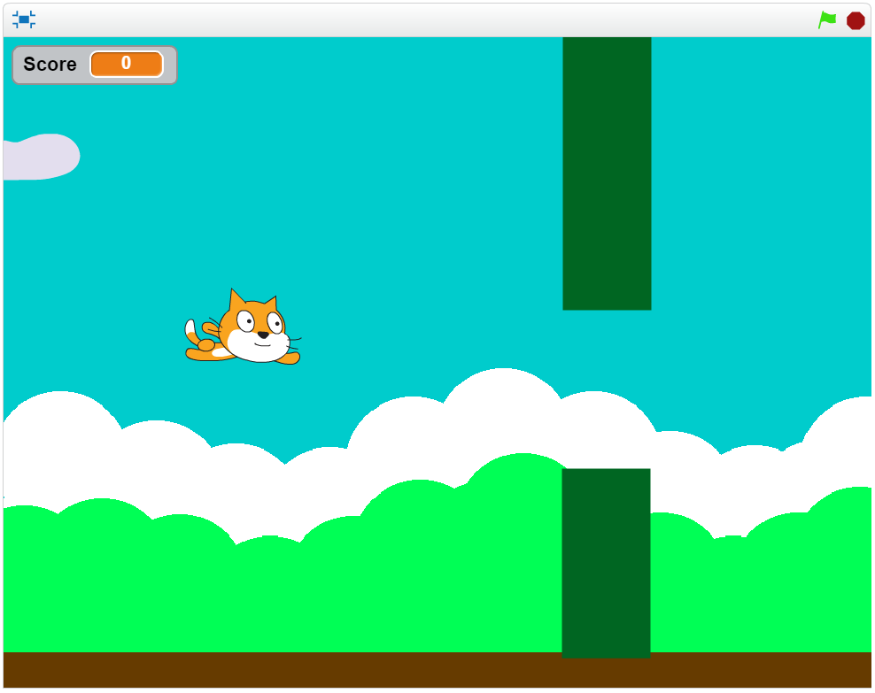

#ΙΟΝΙΟ ΠΑΝΕΠΙΣΤΗΜΙΟ 
#ΜΑΘΗΜΑ: Επικοινωνία Ανθρώπου-Υπολογιστή 

Επιβλέπων καθηγητής: Χωριανόπουλος Κωνσταντίνος 

Φοιτητής: ΝΙΚΟΛΑΟΥ ΑΧΙΛΛΕΑΣ - Π2012073 - p12niko@ionio.gr 

Θέμα εργασίας:
## Εκπαιδευτικό βιντεο-παιχνίδι με χρήση τoυ εργαλείου Scratch

Η εργασία αποτελεί εκπαιδευτικό παιχνίδι με τη χρήση του εργαλείου Scratch.
Η ιδέα για το παιχνίδι προέκυψε από το το project με όνομα Flappy math που
υπάρχει στη σελίδα "Εκπαιδευτικό βιντεο-παιχνίδι".

Το εκπαιδευτικό αντικείμενο του παιχνιδιού είναι η αριθμητική επιπέδου πρώτων
τάξεων Δημοτικού.

### Προδιαγραφές

#### Ηλικία: Δημοτικό
#### Ικανότητα: Χειρισμός με τα βελάκια και το κενό
#### Γνώσεις: Βασικές πράξεις του δημοτικού αφαίρεση, πολλαπλασιασμός.

Το παιχνίδι ακολουθεί την ιδέα του Flappy Math. Ο χαρακτήρας που χειρίζεται ο παίκτης παραμένει
σταθερός στον άξονα x της οθόνης. Με το space, τα βελάκια πάνω - κάτω ή με το κλικ του ποντικιού
ο χαρακτήρας ανεβαίνει πιο ψηλά (παίρνει ύψος) στον άξονα y. Παροδικά χάνει ύψος, οπότε πρέπει να φροντίζει
ο παίκτης να μην χάσει ύψος περισσότερο από ένα μέγιστο και ακουμπίσει στο έδαφος. Τότε το παιχνίδι τερματίζει.

Καθώς προχωράει το παιχνίδι εμφανίζοναι στην άκρη της οθόνης διάφορες αριθμητικές πράξεις. Καθώς ο χαρακτήρας προχωράει,
πιθανές απαντήσεις εμφανίζονται στην οθόνη. Ό παίκτης πρέπει να ακουμπίσει πάνω στη σωστή απάντηση για να εμφανιστεί η επόμενη
ερώτηση. Αν ακουμπήσει σε λάθος απάντηση τότε το παιχνίδι τερματίζει.

Παρακάτω φαίνονται δύο screenshots από το παιχνίδι.

## Βασική ιδέα παιχνιδιού:
Ο τρόπος χειρισμού του παιχνιδιού βασίζεται στο γνωστό παιχνίδι Flappy Bird που
έχει γίνει ευρέως γνωστό σε κινητά τηλέφωνα. Εδώ η διαφορά είναι ότι πατώντας το κενό
πλήκρο να για πάρει ύψος ο χαρακτήρας, δεν υπάρχει το "πέταγμα" που υπάρχει στο κλασσικό
Flappy bird αλλά η κίνηση είναι πιο ομαλή. Επίσης πιο ομαλή είναι και η πτώση του χαρακτήρα.
Αυτές οι αλλαγές έγιναν για να είναι πιο έυκολο το παιχνίδι. 

Καθώς προχωράει ο χαρακτήρας εμφανίζονται μπάρες-εμπόδια όπου ο παίκτης πρέπει να οδηγήσει τον
χαρακτήρα μέσα από τα ανοίγματα για να περάσει. Αν ακουμπήσει έστω και λίγο το παιχνίδι τερματίζει.

Μετά από τρία διαδοχικά περάσματα, τα εμπόδια σταματούν και εμφανίζεται πάνω αριστερά μια αριθμητική πράξη. 
Στη συνέχεια, από δεξιά προς τα αριστερά περνούν δύο πιθανές απαντήσεις. Ο παίκτης πρέπει να οδηγήσει τον
χαρακτήρα πάνω στη σωστή απάντηση. Αν ακουμπήσει τη λάθος, το παιχνίδι σταματά. Αν ακουμπήσει τη σωστή, παίρνει
έναν πόντο και στη συνέχεια σειρά έχουν τρία επόμενα διαδοχικά επμόδια για να ακολουθήσει μια ακόμα αριθμητική 
πράξη. Οι πράξεις σύνολο είναι δέκα.

Παρακάτω φαίνεται ένα screenshot από το παιχνίδι τη στιγμή που πρέπει να περάσει ο χαρακτήρας
μέσα από το εμπόδιο. Σαν το Flappy Bird.

###Στη συνέχεια παρουσιάζονται οι πράξεις αριθμητικής.

Οι πράξεις αυτές προέρχονται από κριτήριο αξιολόγησης τρίτης Δημοτικού.

