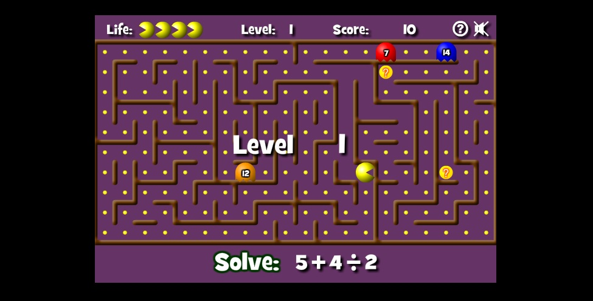
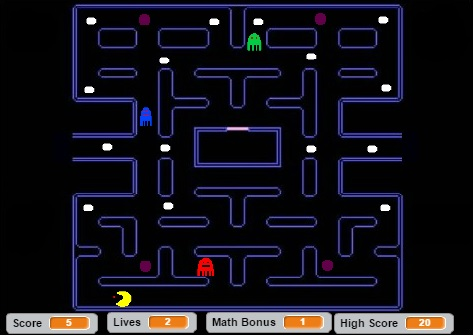
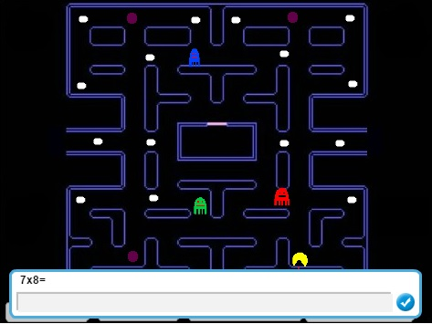

#ΙΟΝΙΟ ΠΑΝΕΠΙΣΤΗΜΙΟ 
#ΠΜΣ ΤΜΗΜΑΤΟΣ ΠΛΗΡΟΦΟΡΙΚΗΣ 
#ΜΑΘΗΜΑ: Σχεδίαση της Διάδρασης Ανθρώπου-Υπολογιστή 
 
Επιβλέπων καθηγητής: Χωριανόπουλος Κωνσταντίνος 

Φοιτητές: 

ΧΡΙΣΤΟΔΟΥΛΟΥ ΜΑΡΙΑ - Π2015001 - p15chri@ionio.gr

##Προδιαγραφές

* Άνθρωπος
* Πλαίσιο χρήσης
* Σκοπός
* Διεργασία χρήσης
* Λόγοι επιτυχίας ή αποτυχίας εφαρμογών

## Εγκατάσταση εργαλείων ανάπτυξης και τρέξιμο/αλλαγές σε υπάρχοντα

* Εργαλείο ανάπτυξης: Scratch
* Δανεισμός στοιχείων (ιδέες και κώδικα) από: https://scratch.mit.edu/projects/105862604/ 

http://www.mathplayground.com/mathman_addition.html

Πρωτότυπο 1

Πρωτότυπο 2

##Σενάριο 

* Το παιχνίδι αυτό απευθύνεται στη πρωτοβάθμια εκπαίδευση συγκεκριμένα στη Γ δημοτικού και ο σκοπός δημιουργίας του είναι για το μάθημα μαθηματικών. Στόχος του είναι η εκμάθηση των βασικών πράξεων (προσθέσεις, αφαιρέσεις, πολλαπλασιασμοί, διαιρέσεις).
* Μπορεί να χρησιμοποιηθεί κατά τη διάρκεια της διδασκαλίας κάνοντας το μάθημα ποιο ενδιαφέρον για τους μαθητές αλλά και στο σπίτι για περαιτέρω εξάσκηση.   
* Δεν χρειάζεται ο μαθητής να διαθέτει ιδιαίτερες γνώσεις χρήσης Η/Υ για την εκτέλεση του.
* Στόχος του παιχνιδιού “mathematical man” είναι να βοηθήσει τον δάσκαλο να κεντρίσει το ενδιαφέρον ακόμα και των ποιο τεμπέληδων μαθητών με ένα ποιο ευχάριστο τρόπο μέσο ενός βιντεοπαιχνιδιού.

## Online Demo (work in progress): https://scratch.mit.edu/projects/128816705/

