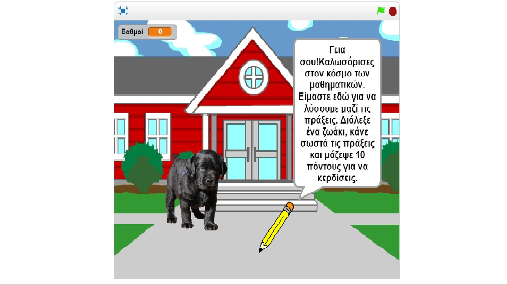
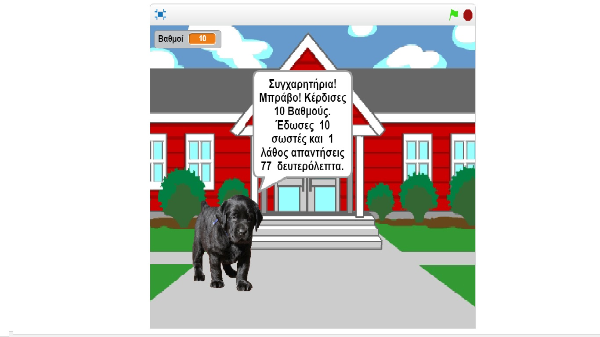

#Τίτλος Εργασίας: Εκπαιδευτικό βιντεοπαιχνίδι

Νικόλας Μούδουρος Α.Μ. Π2015004

##Παραδοτέο 1

Εκπαιδευτικό βιντεοπαιχνίδι με το εργαλείο Scratch

##Παραδοτέο 2
Προδιαγραφές
Ηλικία: 7-8
Τάξη: ΄Γ Δημοτικού
Φύλο: Και τα δύο
Ύλη ΄Γ Δημοτικού: 
http://ebooks.edu.gr/modules/ebook/show.php/DSDIM-C102/284/2023,6918/
Σχεδιασμός εφαρμογής
Εργαλείο ανάπτυξης: Scratch

Περιγραφή
Επιλέγοντας ένα από τα τέσσερα ζωάκια μας, μπορούμε να λύσουμε εξισώσεις είτε πρόσθεσης, είτε αφαίρεσης, είτε πολλαπλασιασμού είτε διαίρεσης. Με τα πλήκτρα δεξιά και αριστερά (στο πληκτρολόγιο ) το παιδί μπορεί να μεταφερθεί από το πρώτο στάδιο που είναι ο σκύλος (αφαίρεση) και η γάτα (πρόσθεση), στο δεύτερο που είναι το άλογο (πολλαπλασιασμός) και ο πιγκουίνος (διαίρεση)
Σκοπός του παιχνιδιού είναι να λύσεις ορθά τις μαθηματικές πράξεις, να μαζέψεις 10 βαθμούς (1 βαθμό για κάθε σωστή απάντηση) και να κερδίσεις.

Onlien game: https://scratch.mit.edu/projects/129335635/#player 

##Παραδοτέο 3

...

##Παραδοτέο 4

...

##Tελική Αναφορά

...
