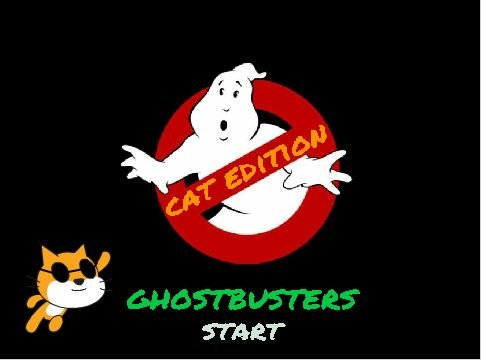
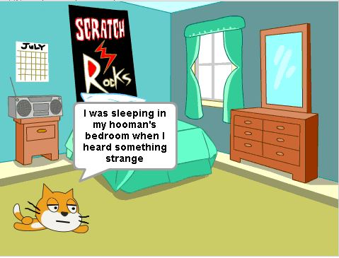
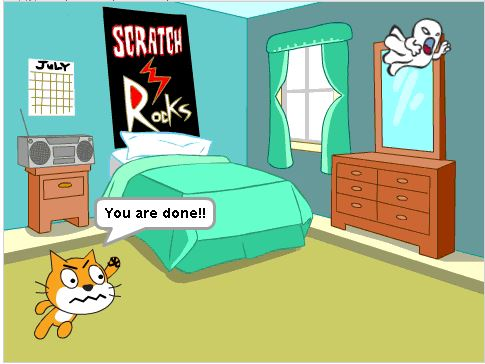
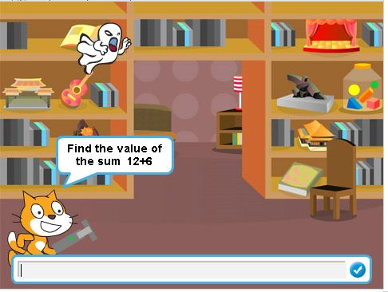

#ΙΟΝΙΟ ΠΑΝΕΠΙΣΤΗΜΙΟ 
#ΠΜΣ ΤΜΗΜΑΤΟΣ ΠΛΗΡΟΦΟΡΙΚΗΣ 
#ΜΑΘΗΜΑ: Επικοινωνία Ανθρώπου-Υπολογιστή 
 
Επιβλέπων καθηγητής: Χωριανόπουλος Κωνσταντίνος 

Φοιτήτρια:

Χριστοδούλου Χρύσω, p15chri2@ionio.gr

Α.Μ. Π2015005 

##Προδιαγραφές

Κατάλληλο για μαθητές παντός φύλου, ηλικίας 7+, συγκεκριμένα Γ’ Δημοτικού.

Σχετικό παράθεμα: http://ebooks.edu.gr/modules/ebook/show.php/DSDIM-C102/284/2023,6918/

## Εργαλείο ανάπτυξης και τρέξιμο/αλλαγές σε υπάρχοντα παραδείγματα:

*	Εργαλείο ανάπτυξης: Scratch
*	Εύρεση-δανεισμός στοιχείων(ιδέες και κώδικα):
https://scratch.mit.edu/projects/11931783/
https://scratch.mit.edu/projects/14182007/

Πρωτότυπο 1: 

Αρχική οθόνη εκκίνησης παιχνιδιού

Πρωτότυπο 2: 

Ο Πέρυ κοιμάται ξέγνοιαστος στο δωμάτιο του αφεντικού του, όταν ξαφνικά εμφανίζεται ένα φάντασμα.

Πρωτότυπο 3: 

Ο Πέρυ βρίσκει το όπλο του για να εξολοθρεύσει το φάντασμα. 

Πρωτότυπο 4: 

Ο Πέρυ ζητά βοήθεια για να μπορέσει να αφανίσει τα φαντάσματα από το σπίτι απαντώντας σωστά τις πράξεις.

##Σενάριο 

Ο Πέρυ καθώς κοιμόταν στο δωμάτιο του αφεντικού του, ξαφνικά βλέπει ένα φάντασμα. Στην συνέχεια θυμωμένος, ενώ ψάχνει το υπερόπλο του, ξαφνικά πέφτει στο δωμάτιο σαν από μηχανής θεός. Ο Πέρυ προσπαθεί να τα εξοντώσει με την δικιά μας βοήθεια. Απαντώντας σωστά σε 3 πράξεις σε κάθε πίστα (6 στάδια συνολικά) τον βοηθάμε να αφανίσει τα φαντάσματα από το σπίτι.

## Online Demo (work in progress):
 
https://scratch.mit.edu/projects/128329339/ 

