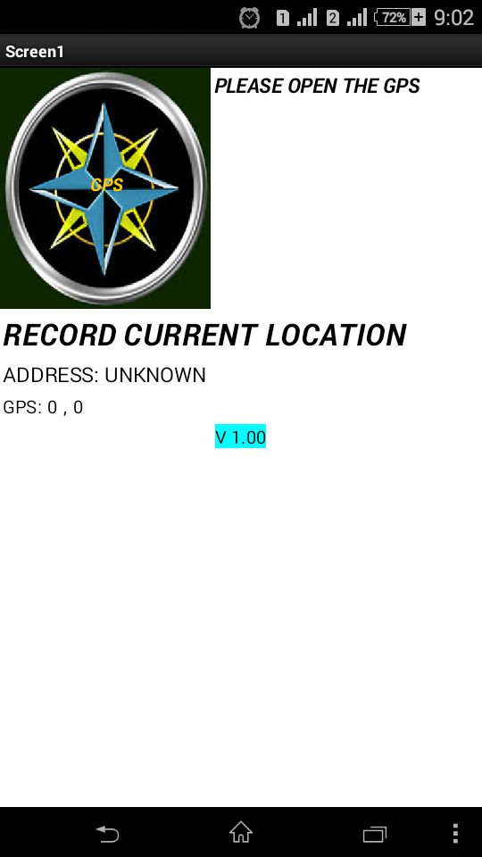
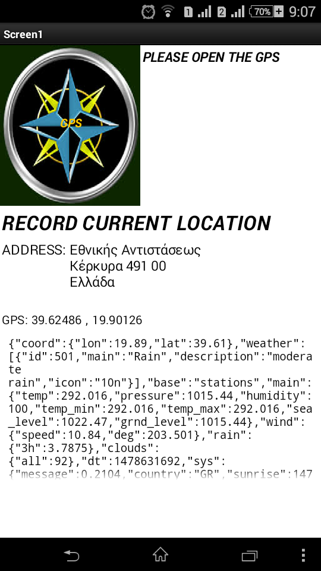
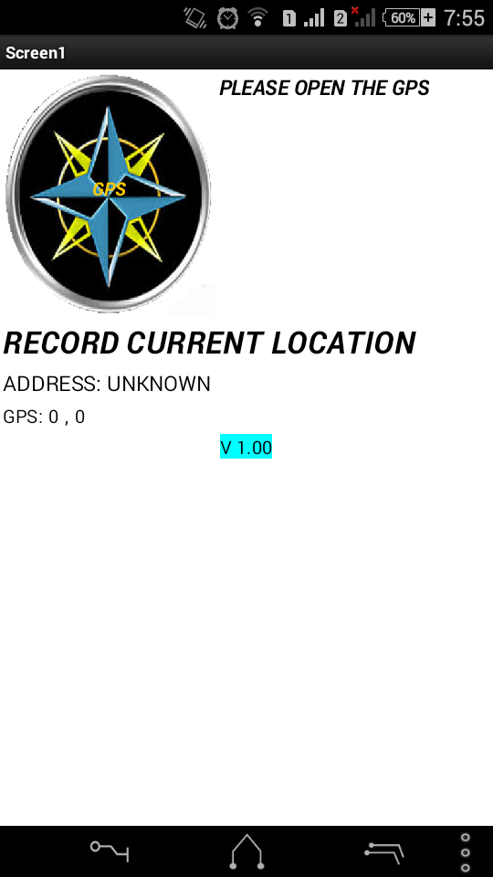
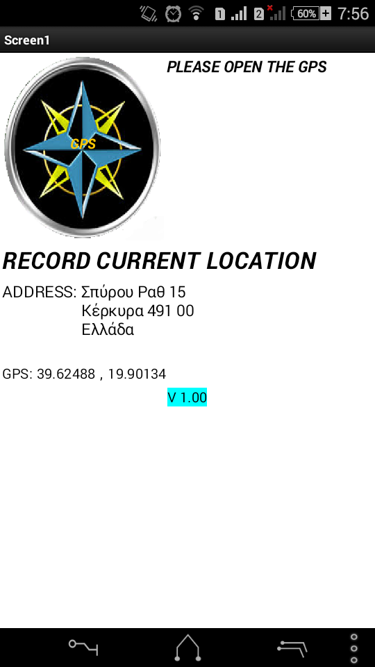
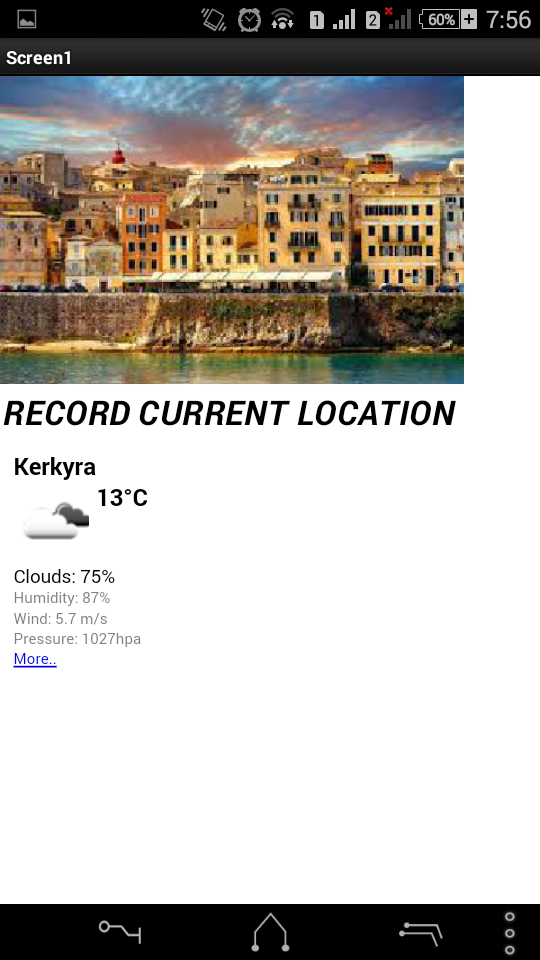

#ΕΦΑΡΜΟΓΉ
ΙΩΆΝΝΗΣ ΑΓΓΈΛΗΣ AM:Π2015006

#Παραδοτέο 0
+++ https://github.com/GIANNIS-AGGELIS/pibookgr/tree/gh-pages/_quotes
++ ...
+ ..

#Παραδοτέο 1
ΘΈΜΑ: ΕΦΑΡΜΟΓΉ ΜΕ ΕΡΓΑΛΕΊΟ ΤΟ APP INVENTOR 2

#Παραδοτέο 2

 ΕΡΓΑΛΙΟ ΑΝΑΠΤΥΞΗΣ : APP INVENTOR 2
 
 ΤΥΠΟΣ ΕΦΑΡΜΟΓΗ : ΚΑΙΡΟΣ
 
 ΕΙΝΑΙ ΝΙΑ ΑΠΛΗ ΕΦΑΡΜΟΓΗ ΠΟΥ ΔΕΙΧΝΕΙ ΤΑ ΔΕΔΟΜΕΝΑ ΤΟΥ ΚΑΙΡΟΥ ΧΡΗΣΙΜΟΠΟΙΏΝΤΑΣ ΤΟ ΓΕΩΓΡΑΦΙΚΌ ΠΛΑΤΟΣ ΚΑΙ ΜΗΚΟ ΑΠΟ ΤΟ GPS ΤΗΣ ΚΙΝΗΤΉΣ  ΣΥΣΚΕΥΉΣ.

 ΔΕΙΧΝΕΙ ΤΗΝ MAX KAI MIN ΘΕΡΜΟΚΡΑΣΙΑ ΣΕ KELVIN , THN  ΠΊΕΣΗ ΤΗΣ ΑΤΜΟΣΦΑΙΡΑΣ,THN  ΥΓΡΑΣΊΑ,THN ΟΡΑΤΌΤΗΤΑ, TON ΑΕΡΑ ,ΤΗΝ ΤΑΧΥΤΗΤΑ ΚΑΙ ΤΗΝ ΓΩΝΙΆ ΤΟΥ. 
 
 ΑΠΛΟ ΠΕΡΙΒΑΛΛΟΝ
 
 

 ΧΡΕΙΑΖΕΤΑΙ ΔΥΟ ΠΡΑΓΜΑΤΑ ΜΙΑ ΠΡΟΣΒΑΣΗ ΣΤΟ ΔΙΑΔΙΚΤΥΟ ΚΑΙ ΝΑ ΑΝΟΙΞΟΥΜΕ ΤΟ GPS
 
  
 
 
 
 
 
 
 ++ ΤΑ ΔΕΔΟΜΕΝΑ ΕΙΝΑΙ ΑΠΟ ΤΟ http://openweathermap.org/
 + ΠΡΟΒΛΗΜΑΤΑ ΕΦΑΡΜΟΓΗΣ ΤΟ ΑΡΧΕΙΟ JSON ΠΟΥ ΔΕΝ ΜΠΟΡΩ ΝΑ ΠΕΙΕΑΞΩ.
 
 
 + ΣΤΟ ΜΕΛΟΝ ΘΑ ΠΡΟΣΠΑΘΗΣΩ ΝΑ ΔΟΣΩ ΛΥΣΗ ΚΑΙ ΝΑ ΠΡΟΣΘΕΣΩ ΑΛΛΕΣ ΕΦΑΡΜΟΓΕΣ
  * Η ΦΩΤΟΓΡΑΦΙΑ ΕΙΝΑΙ ΚΟΥΜΠΙ.

#Παραδοτέο 3
+##ΠΕΡΙΓΡΑΦΗ ΕΦΑΡΜΟΓΗΣ

 ΕΙΝΑΙ ΜΙΑ ΕΦΑΡΜΟΓΗ ΓΙΑ ΟΝ ΚΑΙΡΩ. ΤΟ ΜΟΝΟ ΠΟΥ ΧΡΕΙΑΖΕΤΑΙ ΜΙΑ ΣΥΝΔΕΣΗ ΣΤΟ ΔΙΑΔΙΚΤΥΟ ΚΑΙ ΤΟ GPS.

+#ΕΡΓΑΛΕΙΑ ΠΟΥ ΧΡΗΣΙΜΟΠΟΙΗΘΗΚΑΝ

+**MIT APP INVENTOR 2**: ΕΓΙΝΕ Η ΣΧΕΔΙΑΣΗ ΚΑΙ ΥΛΟΠΟΙΗΣΗ ΤΗΣ ΕΦΑΡΜΟΓΗΣ

 ΒΑΣΙΣΤΗΚΑ ΣΕ  ΕΝΑΝ ΑΠΛΟ ΚΩΔΙΚΑ ΓΙΑ ΤΟ ΠΩΣ ΕΝΕΡΓΟΠΟΙΩ ΤΟ GPS ΚΑΙ ΝΑ ΑΠΟΘΗΚΕΥΩ ΤΑ ΔΕΔΩΟΕΝΑ ΑΠΟ ΤΟ GPS ΣΕ ΕΝΑ TinyDB  https://www.youtube.com/watch?v=RXGhhP7kWdk .
 ΤΑ ΔΕΔΟΜΕΝΑ ΤΡΑΒΑΩ ΑΠΟ ΤΟ  http://openweathermap.org/

+##ΑΛΛΑΓΕΣ
 ΤΟ ΑΡΧΕΙΟ JSON ΤΟ ΑΛΛΑΞΑ ΣΕ ΕΝΑ HTML ΕΠΕΙΔΗ ΤΟ APP INVENTOR ΔΕΝ ΕΔΙΝΕ ΤΗΝ ΔΥΝΑΤΟΤΗΤΑ ΝΑ ΤΟ ΜΟΡΦΟΠΟΙΗΣΩ .
 ΔΕΝ ΞΕΡΩ ΑΝ ΕΙΝΑΙ Η ΒΕΛΤΗΣΤΗ ΛΥΣΗ ΣΤΟ ΠΡΟΒΛΙΜΑ ΑΛΛΑ ΤΩΡΑ ΤΑ ΔΕΔΩΜΕΝΑ ΕΙΝΑΙ ΑΝΑΓΝΩΣΗΜΑ ΑΠΟ ΤΟΝ ΚΑΘΕΝΑ.
 
+##SCREENSHOT

+

+

+

+

+##ΠΡΩΤΑΣΕΙΣ ΓΙΑ ΜΕΛΟΝΤΙΚΕΣ ΒΕΛΤΙΩΣΕΙΣ 
+ΘΑ ΠΡΩΣΠΑΘΗΣΩ ΝΑ ΔΙΕΥΡΥΝΩ ΤΟΝ  ΓΕΩΓΡΑΦΗΚΟ ΜΟΥ ΧΑΡΤΗ Ή ΝΕΟ INTERFACE ΣΤΗΝ ΑΡΧΙΚΗ ΟΘΟΝΗ.

#Παραδοτέο 4

...

#Tελική Αναφορά

...
