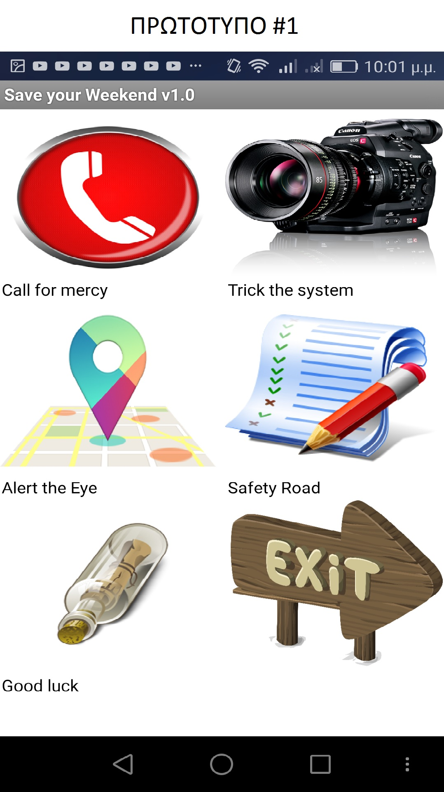
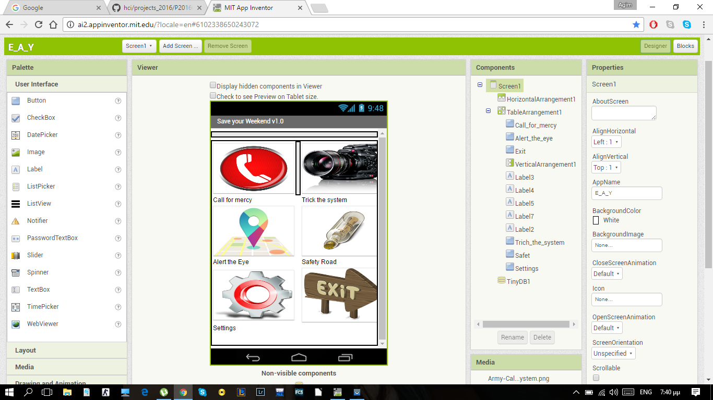
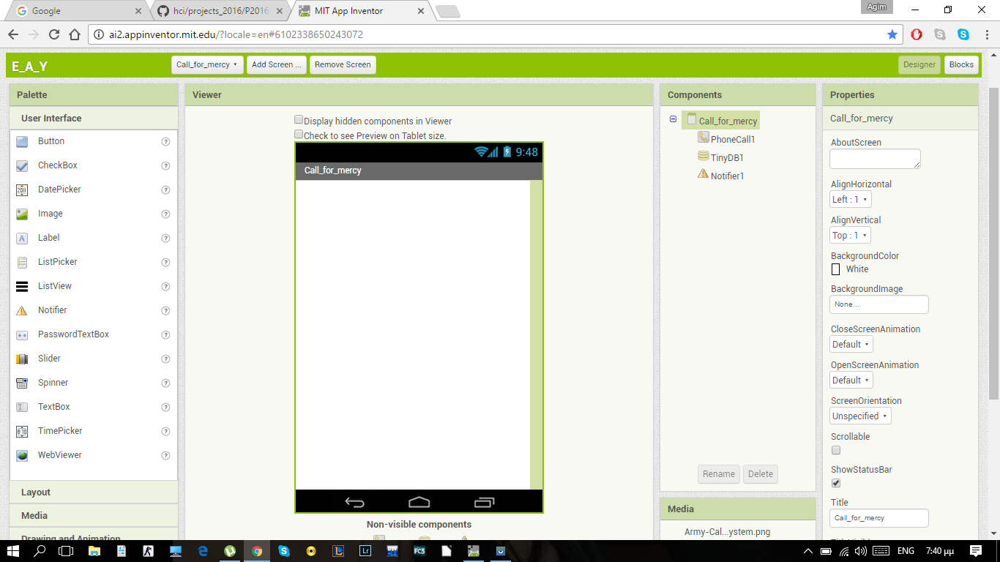
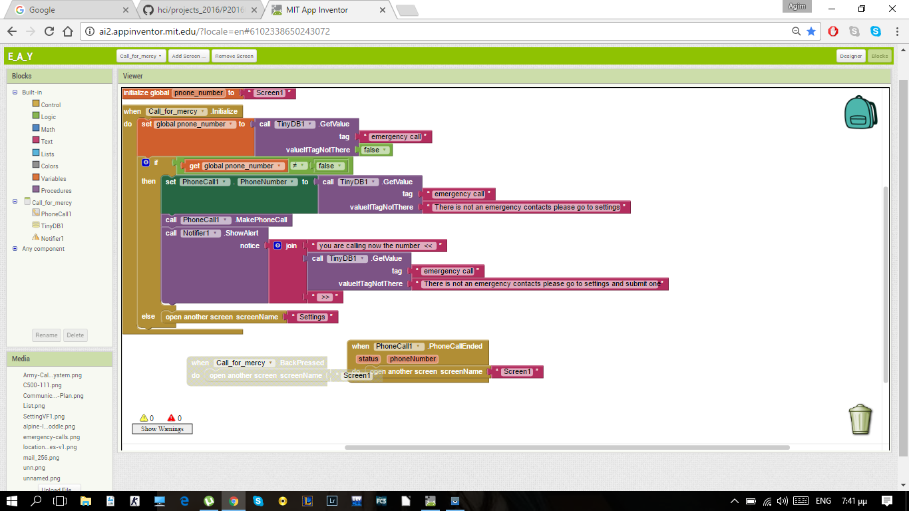
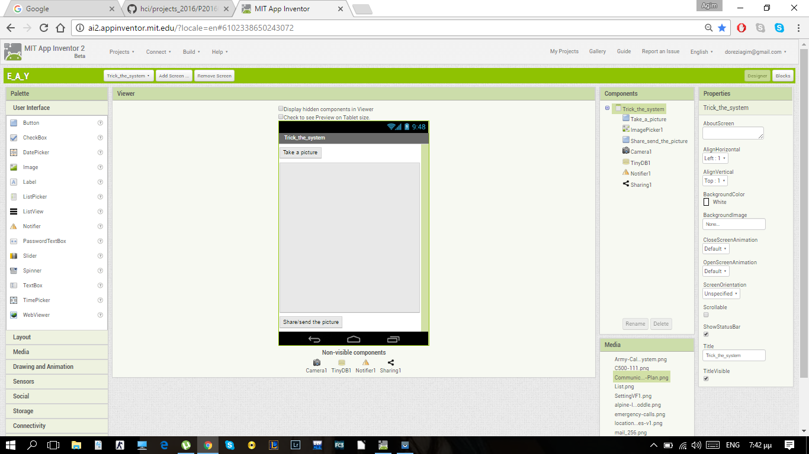
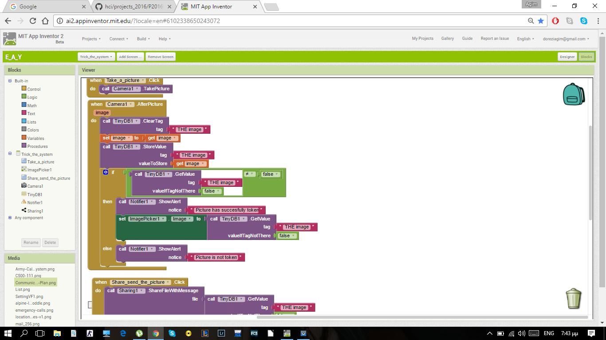
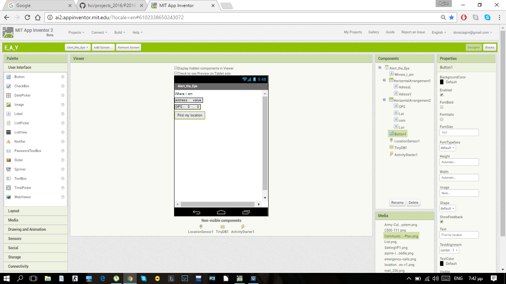
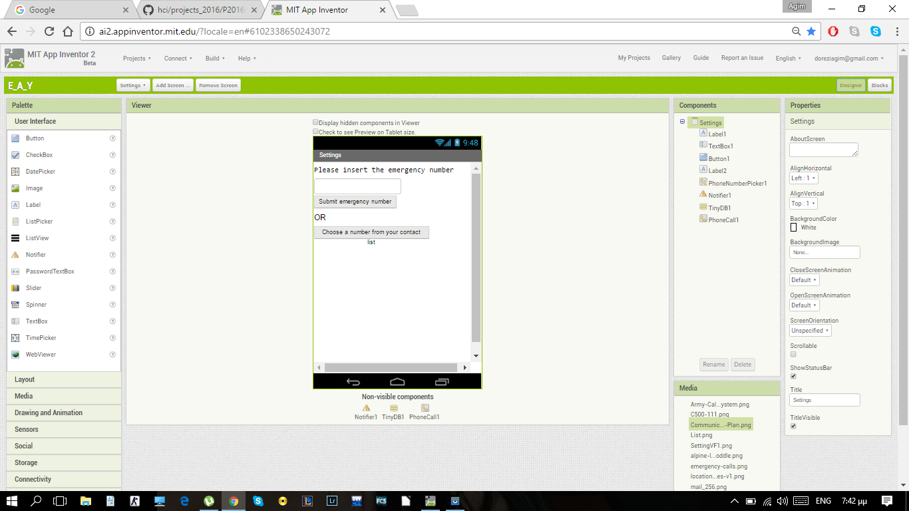
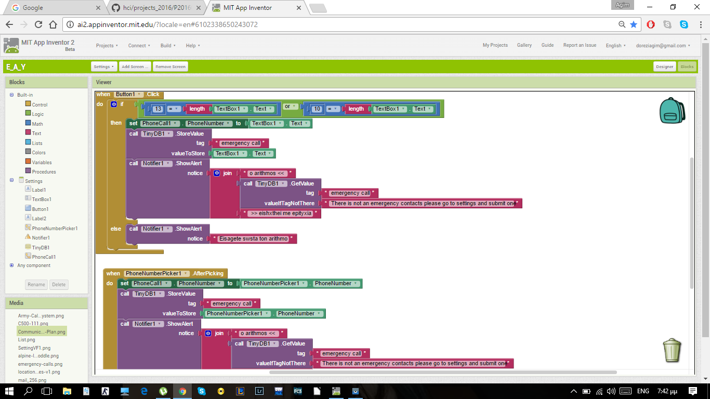
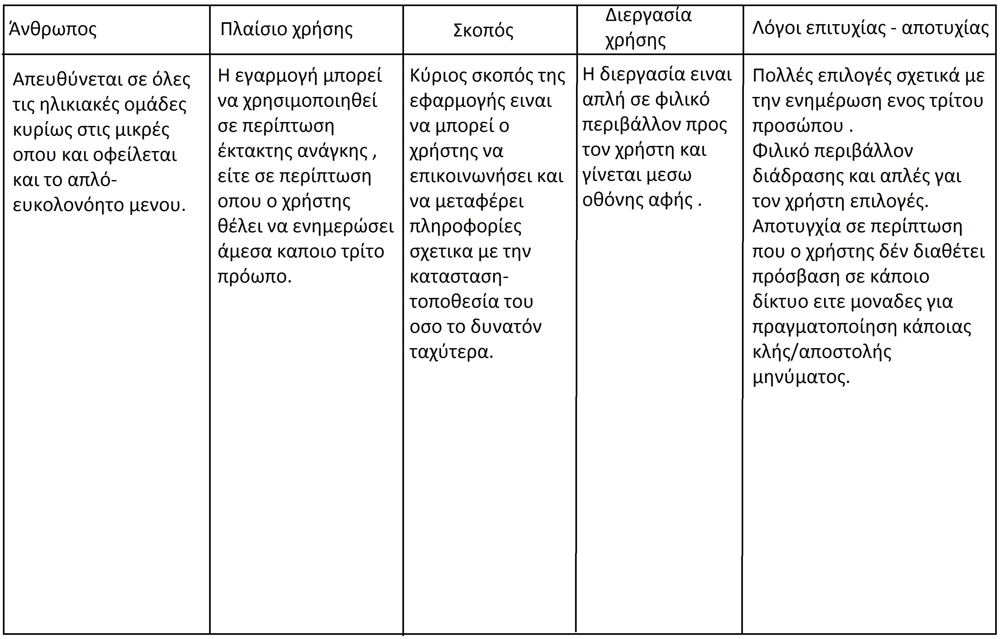

#App Inventor Apps Project
Αγκίμ Ντορέζι
ΑΜ Π2015014

##Παραδοτέο 0

https://github.com/doreziagim/pibookgr/tree/gh-pages/_quotes

##Παραδοτέο 1

Επιλέγω να αναπτύξω πρόγραμμα (application) για android περιβάλλοντα.

##Παραδοτέο 2

  **Hλικία:** Το application απευθύνεται σε άκρως ατίθασα παιδιά κάτω των 18 που θέλουν να γλυτώσουν τις "τιμωρίες".

  **Φύλο Χρηστών:** Απευθύνεται και στα δύο φύλα.

  **Λόγος δημιουργίας του παρόντως προγράμματος**  
  
  Η Επιστήμη των υπολογιστών όπως και καθε αλλος επιστημονικός κλάδος εχει ως κύριο σκοπό να κάνει τον κόσμο καλύτερο.Το να ζούμε σε μια εποχή μιας τέτοιας τεχνολογικής και πληροφοριακής έξαρσης μας δίνει ενα σημαντικό πλεονέκτημα έναντι στις υπόλοιπες επιστήμες.
  
   Εφαρμογή νέων καινοτομιών και μεθόδων για την βελτίωση του βιοτικού επιπέδου του σύγχρονου ανθρώπου ειναι πολύ αμεσότερη.Για παράδειγμα κάποια αλλαγή σε μια μέθοδο εγχείρησης ανοικτής καρδιάς με τους "πατροπαράδοτους" τρόπους απαιτεί πολλούς πόρους καθώς η κάθε αλλαγή θα πρέπει να εφαρμοστεί σε πραγματικό χωρο-χρόνο,αντίθετα όσων αφορά τους υποφαινόμενους επιστήμονες για κάθε μεταβόλη μεθόδου ανάλυσης ή διαφοροποίσης του τρόπου προσέγγισης προβλημάτων αρκεί η αλλαγή κάποιου κομματιού κώδικα ή κάποια προσθαφαίρεση μεταβλητών και συναρτήσεων.Το ποιο αξιοσημείωτο ωστόσο είναι πως ενα απο τα σημαντικότερα κομμάτια της επιστημονικής έρευνας που είναι τα πειράματα πραγματοποιούνται σε ενα ψηφιακό χωρο-χρόνο ,πράγμα που σημαίνει ελαχιστοποίηση χρόνου υλοποίησης του πειράματος και μεγιστοποίση συλλογής πληροφοριών με τους ελάχιστα απαιτούμενους πόρους.
   
   Ενα απο τα διαχρονικότερα "μότο" παρακίνησης και εμπνέυσης ειναι το ""θέλω-ουμε να αλλάξω-ουμε τον κόσμο".Όσο και και να προχωρήσει η κοινώνια ,σε οποιοδήποτε σημείο και να βρίσκεται το βιωτικό επίπεδο της κοινωνίας ο άνθρωπος θα θέλει διαρκώς να το βελτιώσει.Επομένως αποτελεί αν όχι μια κοινωνική επιταγή ,χρέος μας να αλλάξουμε τον κόσμο ως προς το καλύτερο.Η αστείρευτη επιθυμία του ανθρώπου για την εξερεύνηση του κόσμου και τον λόγο ύπαρξης του σε συνδιασμό με την ανάγκη επιβίωσης στα δρώμενα των κοινωνικών εξελίξεων τον "αναγκάζουν" να εξελίσει τον τρόπο σκέψης και δράσης του.                         
Εάν θεωρήσουμε τον κόσμο ώς ενα σύνολο και τον κάθε εναν απο εμάς ως μέρος του συνόλου ,αρκεί να αλλάξουμε τον εαυτό μας προκειμένου να επέλθει αλλαγή στον κόσμο. 

   Για να μην πολυλογώ ο λόγος που επέλεξα να δημιουργήσω το συγκεκριμένο application ειναι ειναι για να καλυψω μια πολυ βασικη μου αναγκη.Την ανάγκη να απεξαρτηθώ απο τα λαθη του αδερφού μου.Αυτή η απεξάρτηση αποτελούσε ισως απο την σημαντικότερες αναγκες μου ως έφηβος και παρακινητική δύναμη για την δημιουργία αυτου του προγράμματος την προκείμενη στιγμή.Η βασική αρχή των γονέων μου ήταν πως για κάθε "σκανδαλιά" θα επιβληθούν αντίποινα και στους δυό μας(καταλαβαίνεται λοιπον τι περνούσα).Η κύρια σκανδαλία του αδερφού μου λοιπόν ήταν να αργεί και να μήν ενημερώνει όταν βρίσκεται έξω ή να λεει ψέμματα για το πού βρίσκεται.Συνεπώς έφθασε η στιγμή αυτό να αλλάξει.

**Αποφάσισα λοιπον να δημιουργήσω ενα app που θα διευκόλυνε την ζώη όλης μου της οικογένειας αλλα και κάθε οικογένειας στην Ελλάδα που εχει τουλάχιστον ενα ζωηρό παιδι.**

##
 
**Εργαλεία ανάπτυξης:** 

 * MIT APP Inventor για την ανάπτυξη του κώδικα
 * aiStarter ως εξομοιωτής android περιβάλλοντος                      
 
##

 **Περιγραφή**
 
**<<ΤΟ ΟΡΑΜΑ>> εχει ως εξής:**

 -1- Άμεση πρόσβαση σε ταχείες κλήσεις (σε περίπτωση που έχασες καποια κλήση της μητέρας σου και θελεις να συνεχίσεις να ζεις)
 
 -2- Αποστολή φωτογραφίας(για να δείξεις οτι είσαι στο φροντιστήριο)
 
 -3- Αμεση αποστολή τοποθεσίας (ωστε να βεβαιωθουν οι δικοί σου οτι πραγματι εισαι στο φροντιστήριο και οχι στη πλατεία παίζοντας μπάλα)
 
 -4- Επιλογή για αποστολή μηνυμάτων κινδύνου-πανικού (σε περίπτωση που χάσεις τον αγωνα που έπαιζες στην πλατεία και χρειάζεσαι άμεσα        για να πληρώσεις το στοίχημα) 
 
 -5- Προεπιλεγμένα μυνήματα γαι άμεση αποστολή (ωστε να στείλεις μύνημα , γιατί δεν θέλεις να ακούσουν οι δικοί σου το βρίσιμο ,σε            περίπτωση που εγινες η αιτία που εχασε η ομάδα σου τον αγώνα) 
   
   Η λέξη κλειδι όπως έγινε αντιλιπτό ειναι το <<άμεσα>>.Θα προσπαθήσω επομένως να δημιουργήσω ενα πρόγραμμα που θα σε απαλλάξει <<άμεσα>> απο την τιμωρία λόγο των ατίθασων μικρών αδέρφών.

##

### Screenchots

First Prototype

First Try  

##Παραδοτέο 3

##Περιγραφή του application
Η εφαρμογή σε σχέση με την προηγούμενη φορά άλλαξε κατά πολύ τον τρόπο προσέγγισης και αναγκαιότητας των χρηστών.
σύμφωνα με τις επιλογές που δίνονται μέσω της αναφερόμενης εφαρμογής και το απλοικό interface η εφαρμογή θα εύρισκε πολύ μεγαλύτερη χρησιμότητα εάν χρησιμοποιούταν ως απαραίτητο εργαλείο σε περίπτωση όπου μικρής ηληκίας χρήστες χαθούν.
Η εφαρμογή διαθέτει 4 επιλογές όπου ο χρήστης μπορεί να επικοινωνήσει άμεσα/έμμεσα με ένα πρόσωπο σε περίπτωση έκτακης ανάγκης.
 
 
 -1- Άμεση κλήση με το πάτημα ενός κουμπιού του επιλεγόμενου εκ των προτέρων αριθμού.(Υπάρχει database το οποίο αποθηκεύει τον αριθμό όπου ο χρήστης θα εισάγει.Σε περίπτωση όπου ο χρήστης εισάγει λάθος αριθμό ή άλλου τύπου πέρα από αριθμούς αντικείμενο υπάρχουν κατάλληλοι έλεγχοι που το αποτρέπουν.-->Στο μέλλον θα υπάρχει κατάλληλη επιλογή όπου ο χρήστης θα μπορέσει να διαλέξει μέσα από μία βάση δεδομένων ήδη αποθηκευμένων αριθμών πέρα από των επαφών.)
 
  -2- Αποστολή φωτογραφίας η οποία θα πρέπει να ληφθεί την προκείμενη στιγμή.Με αυτό τον τρόπο ο χρήστης θα μπορέσει να στείλει την φωτογραφία μέσωω κάποιου κοινωνικού δικτύου ή σε email.(Θα υπάρξει στο μέλλον επιλογή όπου ο χρήστης θα στέλνει με συγκεκριμένο τρόπο στον παραλήπτη.πχ email σε συγκεκριμένο άτομο.)
  
  -3- Εύρεση τοποθεσίας μέσω χάρτη,καταγραφή της διεύθυνσης αυτής και αποστολή σε κάποιο συγκεκριμένο άτομο μέσω κάποιου διαδικτυαού ιστοτόπου.(Στο μέλλον θα υπάρχει λήψη στιγμιοτύποθ οθόνης με την ένδειξη στο χάρτη του που βρίσκεται ο χρήστης και αποστολή αυτού μέσω διαδικτυακού ισοτόπου)
  
  -4- Σε περίπτωση όπου ο χρήστης αδυνατεί να πληκτρολογήσει κάποιο μύνημα αλλά θα πρέπει να στείλει,τότε υπάρχει η δυνατότητα επιλογής από ένα εύρος έτοιμων μυνημάτων.(Στο μέλλον θα υπάρξει βάση δεδομένων από μυνήματα ήδη γραμμένα από όπου ο χρήστης θα μπορεί να επιλέξει και να αποστείλει σε πρόσωπο της επιλογής του.)
  
  -5- Υπάρχει ειδικό πλαίσιο όπου ο χρήστης μπορεί να διαμορφώσει ο ίδιος τον ή τους αριθμούς εκτάκτης ανάγκης.(Στο μέλλον θα υπάρχει ένας έλεγχος με κωδικό όπου μόνο εάν ο χρήστης το γνωρίζει αυτό θα μπορέσει να διαμορφώσει τους αριθμούς/επαφές έκτακτης ανάγκης.Αυτή η ρύθμιση θα είναι "κρυμμένη" μέσα στο πλαίσιο όπου θα βρίσκονται οι ρυθμίσεις.)
  
  -6- Υπάρχει και ένα κουμπί exit για την έξοδο από την εφαρμογή.(Θα υπάρχει δυνατότητα ο χρήστης να μη μπορεί να βγει από την εφαρμογή εάν δεν γνωρίζει τον κωδικό ασφαλείας."Δεν είμαι σίγουρος για την προκείμενη ιδέα ακόμα.")

##Διαδικασία ανάπτυξης
Η ιδέα προήρθε από προσωπική ανάγκη προκειμένου να μην τιμωρούμε εξ αιτίας λαθών από μικρότερα αδέρφια.Όσο υλοποιούσα την εφαρμογή καταλάβαινα πως η δημιουργία ενός τέτοιου εργαλείου θα αποτελούσε μια εξαιερτικά λυτρωτική ανάσα για τους γονείς,εφόσον σε μία τόσο γοργά αναπτυσσόμενη κοινωνία όλο και μικρότερες ηληκίες βρίσκονται με κινητά στα χέρια τους.Επομένως,θεώρησα πως θα έπρεπε να υπάρχει μία εφαρμογή αρκετά απλή προκειμένου να τη χειριστεί ένα μικρό παιδί αλλά αρκετά χρήσιμη για να δώωσει στους γονείς την απαραίτητη αίσθηση ασφάλειας ακόμα και όταν δεν έχουν την ικανότητα να βρίσκονται "άμεσα" δίπλα τους.
Έτσι λοιπόν πιστεύω πως δημιουργώ μια εφαρμογή όπου κρατά σε επαφή τον χρήστη με το ενδιαφερόμενο πρόσωπο της επιλογής του ακόμα και όταν οι αποστάσεις αποτελούν εμπόδιο.

### Screenshots

Menu

-1- Emergency call 

-2- What I am seeing now

-3- Where am I?

-5- Settings 

##MIT app inventor
Παρακάτω διαθέτω το link όπου ενσαρκώνει όλα τα προαναφερθέντα.

ai2.appinventor.mit.edu/?galleryId=4713945479512064

##Παραδοτέο 4

#ΙΟΝΙΟ ΠΑΝΕΠΙΣΤΗΜΙΟ 
#ΠΜΣ ΤΜΗΜΑΤΟΣ ΠΛΗΡΟΦΟΡΙΚΗΣ 
#ΜΑΘΗΜΑ: Σχεδίαση της Διάδρασης Ανθρώπου-Υπολογιστή 
 
Επιβλέπων καθηγητής: Χωριανόπουλος Κωνσταντίνος 

##Σύνοψη

Ο τομέας της ασφάλειας ανέκαθεν αποτελούσε , εαν όχι τον κυριότερο, εναν απο τους ποιο σημαντικούς πάραγοντες που επιρέαζαν την καθημερινότητα μας.Απο αρχαιοτάτων χρόνων ο άνθρωπος ειχε την ανάγκη του να αισθάνεται ασφάλεια απέναντι στους κινδύνους της καθημερινότητας, για αυτόν και την οικογένεια του.
Μιας και η σύγχρονη εποχή μαστίζεται απο την πολύωρη ενασχόληση των ενηλίκων με τις ογκωδεις ευθύνες της καθημερινότητας , γίνεται πλέον απαραιτητη η ανάγκη ενος εργαλειου που θα μπορεί να του παρέχει το αίσθημα ασφάλειας/σιγουριας που προαναφέρθηκε, κυρίως για τα παιδια τους.Λαμβάνοντας υπ'όψη τα προηγούμενα προσπάθησα να δημιουργήσω ,με την βοήθεια του mit app inventor εργαλειου ενα πρόγραμμα για android συσκευές μεσω της οποίας θα μπορει το παιδι να ενημερώνει τους γονείς ανα πάσα στιγμη για την τοποθεσεία του.
                                                                 :::--->>> LInk: ai2.appinventor.mit.edu/?galleryId=4713945479512064
                                                                 
##Εισαγωγή 

##Περιγραφή της εφαρμογής 

Η εφαρμογη εμπεριέχει μενουη έξι επιλογών απ'όπυ ο χρήστης θα μπορεί να πραγματοποιήσει καποια κλήση , να στείλει μηνύμα , να κάνει κοινοπποίηση την τοποθεσία του η καποια φωτογραφία και να στείλει τα στοιχεια απο την διέυθυνση που βρισκεται εκεινη την στιγμη.Η πρώτη λοιπον επιλογή δινει την δυνατότητα στον χρήστη να κανει αυτόματα κλήση σε εναν αριθμό εκτακτης ανάγκης, σε περίπτωση που ο χρήστης δεν ικανοποιήθηκε απο την κλήση βρίσκεται εκει ενα μενου με αριθμούς έκτακτης ανάγκης που μππορεί με ενα απλο αγγιγμα να καλέσει.
Δεύτερη επιλογή ειναι η λήψη φωτογραφίας και αποστολή αυτής μεσω e-mail ή κοινοποίηση σε οποιοδηποτε κοινωνικό δικτυο.
Ύστερα υπάρχει η επιλογή οπου δίνουμε την δυνατότητα στον χρήστη να εντοπίσει την τρέχουσα διεύθυνση του και αποστολη φωτογραφίας με τα στοιχεία αυτα σε κάποιο προσωπο ή κοινοποίηση της φωτογραφίας αυτή.
Σε περίπτωση που τα προηγουμενα δεν καλύπτουν τις ανάγκες του χρήστη υπάρχει η δυνατότητα να στείλει μεσώ ετοιμων μηνυμάτων αυτόματα μηνυματα σε καποίο αριθμό που εχει οριστεί.
Μιας και μιλάμε για παιδια θεωρησα πως θα έπρεπε οι γονεις να εχουν το πάνω χέρι στο ποιοι θα ειναι οι αριθμοί εκτακτης ανάγκης.Ετσι λοιπον δίνω την δυνατότητα στους γονείς μεσω συγκεκριμένου συνδιασμου πατημάτων κουμπιών να μπορουν να καθορίσουν κωδικό΄.Μόνο λοιπον μεσω αυτου του κωδικού υπάρχει η δυνατότητα να περιηγηθείς στις ρυθμίσεις.

##Προδιαγραφές 

##Επιλογή εργαλείων 

Τα εργαλεία που χρησιμοποιήσαμε ήταν τα εξής: 
 
**MIT app inventor**: Αποτελεί το κύριο εργαλείο ανάπτυξης της εφαρμογής. Το Αππ ινωεντορ είναι ένα περιβάλλον προγραμματισμού στο οποίο οι χρήστες δημιουργούν προγράμματα με το σύρσιμο δομικών στοιχείων με ενέργειες, οι οποίες ανήκουν σε ένα αντικείμενο. Είναι σχετικά εύκολο στην εκμάθηση και την χρήση καθώς σχεδιάστηκε για νέους. 
 
**Photoshop**: Το λογισμικό της εταιρείας Adobe αποτελεί ένα ιδιαίτερα εκτεταμένο και πολύπλοκο λογισμικό για την επεξεργασία εικόνων. Χρησιμοποιήσαμε το Photoshop για την επεξεργασία εικόνων και γραφικών και τα εισάγαμε αργότερα στο Scratch ως sprites, costumes και backdrops. 

##Tελική Αναφορά

...
