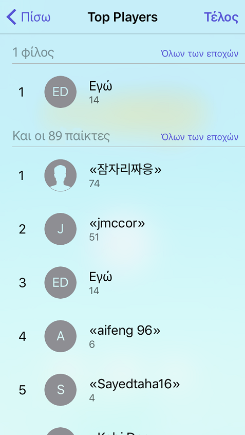
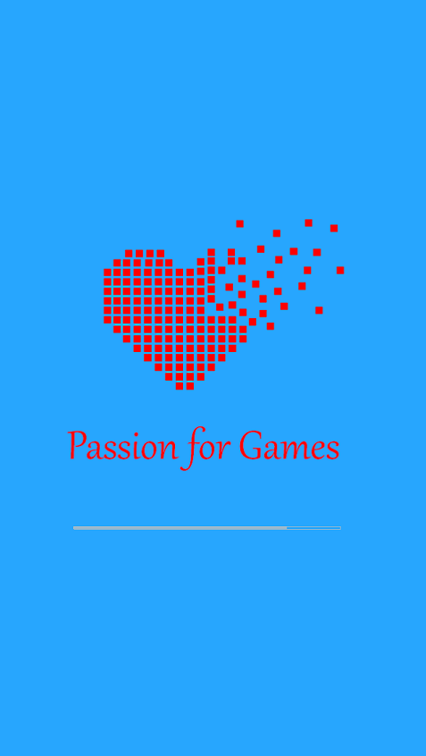
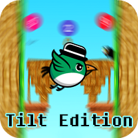
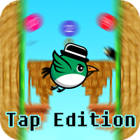

#ΙΟΝΙΟ ΠΑΝΕΠΙΣΤΗΜΙΟ 
#ΤΜΗΜΑ ΠΛΗΡΟΦΟΡΙΚΗΣ 
#ΜΑΘΗΜΑ: Επικοινωνια Ανθρωπου Υπολογιστη
##ΤΙΤΛΟΣ: Buildbox Game - Primy (Tilt and Tap Edition)
 
Επιβλέπων καθηγητής: Χωριανόπουλος Κωνσταντίνος 

ΕΡΑΛΝΤ ΝΤΟΥΖΑ - Π2015018 - p15ntou@ionio.gr 

##Προδιαγραφές

- **Ιστοσελίδα Παιχνιδιού:** [Primy Tilt Edition](http://www.aldiduzha.com/games/primy_tilt) , [Primy Tap Edition](http://www.aldiduzha.com/games/primy_tap)
- **Τρέχουσα Έκδοση:** *Tap:v1.2*, *Tilt:v1.0*
- **Μέγεθος Παιχνιδιού:** *Android=11.3MB*, *IOS=12MB*.
- **Ηλικία:** Το παιχνίδι απευθύνεται σε όλες τις ηλικίες.
- **Προϋποθέσεις:** Απαιτείται κινητό τηλέφωνο το οποίο έχει επιταχυνσιόμετρο (accelerometer). Σχεδόν όλα τα κινητά smartphone στις μέρες μας έχουν το σένσορα αυτό.
- **Στόχος:** Ο παίκτης πρέπει να μαζέψει τις μπάλες με τους μονούς αριθμούς και να αποφύγει τις μπάλες με τους ζυγούς και τα εμπόδια. 
- **ΙΔΕΑ:** Η ιδέα είναι δική μου, οι περισσότερες εικόνες έχουν δημιουργηθεί, διαμορφωθεί και επεξεργαστεί από εμένα πλην μερικών εμποδίων και των ήχων που είναι και αυτά copyright free. Όλα τα δικαιώματα του παιχνιδιού ανήκουν σε μένα.

## Εργαλείο ανάπτυξης

**Buildbox Game Maker** 

**Σημείωση:** Απαιτείται άδεια επί πληρωμή για τη λειτουργία του εργαλείου. 

## Γραφικά, ήχοι κτλ.

## Φτιάχνοντας νέα επίπεδα.

##Περιγραφή

Το συγκεκριμένο παιχνίδι αποσκοπεί στην εκμάθηση και την απομνημόνευση των μονών και των ζυγών αριθμών παίζοντας το παιχνίδι το οποίο έχει μέσα διάφορες πίστες (πάνω από 25 επίπεδα), οι οποίες απαιτούν καλά αντανακλαστικά για να επιτευχθεί υψηλό σκορ, καθώς υπάρχουν διάφορα εμπόδια τα οποία τερματίζουν το παιχνίδι. Όσο το σκορ του παίκτη μεγαλώνει, τα επίπεδα δυσκολεύουν έτσι ώστε να μη γίνεται βαρετό το παιχνίδι. Επίσης τα επίπεδα εμφανίζονται τυχαία και όχι με τη σειρά. Έτσι, όταν ξαναπαίξει, θα του εμφανιστούν διαφορετικά επίπεδα. Μόλις χάσει ο παίκτης, εμφανίζεται το σκορ του μέχρι το σημείο που έχασε.Το σκορ υπολογίζεται από τις μπάλες(μόνο μονοί αριθμοί) που έχει μαζέψει μέχρι να χάσει. Το όριο του σκορ που έχω ορίσει στα leaderboards είναι "300" για προφανείς λόγους(hacking κτλ). Ο χρήστης μπορεί να κοινοποιήσει το σκορ του σε όλα τα social networks(Facebook, Twitter κτλ).

## Σφάλματα;
Το παιχνίδι έχει βελτιωθεί, έτσι ώστε να μην υπάρχουν σχεδόν καθόλου σφάλματα. Έχω επιλέξει τους μικρότερους πόρους για το παιχνίδι (βελτιστοποιημένα γραφικά και μουσική). Μέχρι τώρα(Εδώ και 2.5 μήνες), δεν έχω παρατηρήσει κανένα σφάλμα ή να κολλάει το παιχνίδι. Επίσης στα Crash Analytics της Apple, το παιχνίδι δεν έχει δείξει κανένα πρόβλημα.(Σφάλματα:0)

**_ΟΔΗΓΙΕΣ ΠΑΙΧΝΙΔΙΟΥ:_**

**ΧΕΙΡΙΣΜΟΣ:** Ο χαρακτήρας κινείται αριστερά ή δεξιά, ανάλογα με τη κλίση(tilt) που δίνει ο χρήστης στο κινητό του. Υπάρχει επίσης και η δυνατότητα Tap to Play στην έκδοση Tap(σε κάθε άγγιγμα αλλάζει ο χαρακτήρας κίνηση 180 μοίρες). 
**ΧΑΝΕΙΣ ΟΤΑΝ:** ακουμπήσεις ένα εμπόδιο ή μια μπάλα με ζυγό αριθμό. 
**ΜΑΖΕΥΕΙΣ ΠΟΝΤΟΥΣ ΟΤΑΝ:** ακουμπάς μπάλες με μονούς αριθμούς. 
**ΣΚΟΡ:** Πόσες μονές μπάλες έχει μαζέψει ο χρήστης. 

##ΒΕΛΤΙΩΣΕΙΣ ΣΤΗ ΤΕΛΙΚΗ ΕΚΔΟΣΗ:

###*Γενικές Bελτιώσεις στη λειτουργικότητα 

###*Προσθήκη Leaderboard για App Store και Play Store 
 

###*Προσθήκη Share Βutton για κοινοποίηση του σκορ στα κοινωνικά δίκτυα 
 

###*Νέο Splash Image 
 

###<del>Παλιά Διεπαφή χρήστη</del> 
 

###Νέα Διεπαφή χρήστη 
  

###<del>Παλιό Μενού About</del> 
  

###Νέο Μενού About 
  

###Οδηγίες 
  

###+1 Point 
  

###Game Over 
  

###Νέο Game Over UI 
  

##Συμπεράσματα

Γενικά ήταν ένα αρκετά καλό project χωρίς δυσκολίες, αλλά πολύ χρονοβόρο. Τα επίπεδα χρειάζεται να τα φτιάξεις χειροκίνητα και επίσης χρειάζεται και να έχεις όρεξη να σκεφτείς καινούρια επίπεδα. Τα γραφικά, επειδή ήθελα να ήταν ξεχωριστά για αυτό το παιχνίδι, τα επεξεργάστηκα με Photoshop(ακόμα και τις μπάλες). Μου ήταν σχεδόν αδύνατο να βρω γραφικά που να ταιριάζουν με την ιδέα μου. Η διαδικασία υποβολής των παιχνιδιών ήταν πιο εύκολη στο Play Store παρά στο App Store. Η Apple επίσης χρεώνει 100$ το χρόνο για την απόκτηση λογαριασμού προγραμματιστή, ενώ η Google έχει μια χρέωση 25$ για πάντα. Αυτός πιστεύω είναι ο κύριος λόγος που οι εφαρμογές και τα παιχνίδια στο App Store είναι πιο καλογραμμένες και έχουν καλύτερα γραφικά. Διότι δε μπαίνουν στο "παιχνίδι" τυχαίοι οι οποίοι έχουν σκόπο μόνο το clickbait.(π.χ. Ινδία, Πακιστάν) Οι ίδιοι επίσης ακόμα και να έχουν τα λεφτά να δώσουν για το Developer Account, δεν μπορούν να ξεφύγουν από την Apple δίνοντας ψεύτικα στοιχεια (στο Play Store βάζεις ό,τι όνομα θες). Η γκάμα εφαρμογών και παιχνιδιών στο Play Store είναι απίστευτα μεγάλη με απότέλεσμα να μη μπορείς να έχεις αρκετές λήψεις στην εφαρμογή σου χωρίς κάποιου είδους διαφήμισης. Αντιθέτως στο App Store έχω 10πλάσια κέρδη σε σχέση με το Play Store. Η διαδικασία υποβολής μέχρι τη διαδικασία κυκλοφορίας στο μαγαζί είναι για το Play Store >5 ώρες ενώ για το App Store >1 εβδομάδα.

##ΔΙΑΘΕΣΗ ΠΑΙΧΝΙΔΙΟΥ ΚΑΙ ΛΗΨΗ:

**<del>Το παιχνίδι έκδοσης "tilt" πρόκειται να δημιοσιευτεί στο Play Store και το App Store δωρεάν μόλις γίνει η τελική παρουσίαση και αφού έχω πάρει νέες ιδέες και σχόλια από καθηγητές και φοιτητές.</del>**

###Οι εκδόσεις Tilt και Tap είναι πλέον διαθέσιμες στο App Store και το Play Store:
#----------------> 

#----------------> 

