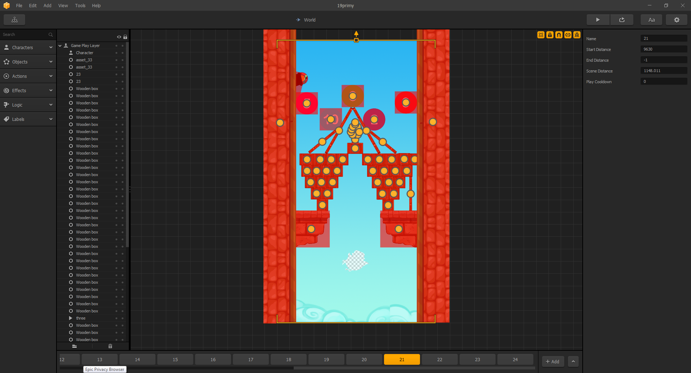
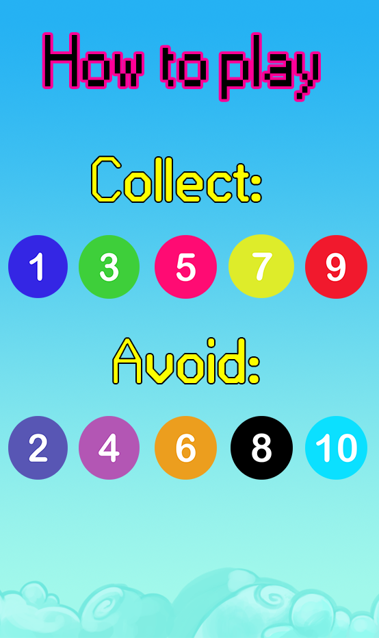

#ΙΟΝΙΟ ΠΑΝΕΠΙΣΤΗΜΙΟ 
#ΤΜΗΜΑ ΠΛΗΡΟΦΟΡΙΚΗΣ 
#ΜΑΘΗΜΑ: Επικοινωνια Ανθρωπου Υπολογιστη
 
Επιβλέπων καθηγητής: Χωριανόπουλος Κωνσταντίνος 

ΕΡΑΛΝΤ ΝΤΟΥΖΑ - Π2015018 - p15ntou@ionio.gr 

##Προδιαγραφές

- **Μέγεθος Παιχνιδιού:** *Android<13MB*, *IOS<3MB*.
- **Ηλικία:** Το παιχνίδι απευθύνεται σε όλες τις ηλικίες.
- **Προϋποθέσεις:** Απαιτείται κινητό τηλέφωνο το οποίο έχει επιταχυνσιόμετρο (accelerometer). Σχεδόν όλα τα κινητά smartphone στις μέρες μας έχουν το σένσορα αυτό.
- **Στόχος:** Ο παίκτης πρέπει να μαζέψει τις μπάλες με τους μονούς αριθμούς και να αποφύγει τις μπάλες με τους ζυγούς και τα εμπόδια. 
- **ΙΔΕΑ:** Η ιδέα είναι δική μου, οι περισσότερες εικόνες έχουν δημιουργηθεί, διαμορφωθεί και επεξεργαστεί από εμένα πλην μερικών εμποδίων και των ήχων που είναι και αυτά copyright free. Άρα όλα τα δικαιώματα του παιχνιδιού ανήκουν σε μένα.

## Εγκατάσταση εργαλείων ανάπτυξης

*	Εργαλείο ανάπτυξης: [Buildbox](https://www.buildbox.com) **Σημείωση:** Απαιτείται άδεια επί πληρωμή για τη λειτουργία του εργαλείου.

**Buildbox Game Maker** 

## Γραφικά, ήχοι κτλ.

## Φτιάχνοντας νέα επίπεδα.

##Σύντομη Περιγραφή

Το συγκεκριμένο παιχνίδι αποσκοπεί στην εκμάθηση και την απομνημόνευση των μονών και των ζυγών αριθμών παίζοντας το παιχνίδι το οποίο έχει μέσα διάφορες πίστες (συγκεκριμένα 24!), οι οποίες απαιτούν καλά αντανακλαστικά για να επιτευχθεί υψηλό σκορ, καθώς υπάρχουν διάφορα εμπόδια τα οποία τερματίζουν το παιχνίδι. Μόλις χάσει ο παίκτης, εμφανίζεται το σκορ του μέχρι το σημείο που έχασε.
Το σκορ υπολογίζεται από τις μπάλες(μόνο μονοί αριθμοί) που έχει μαζέψει μέχρι να χάσει.

**_ΣΥΝΤΟΜΕΣ ΟΔΗΓΙΕΣ ΠΑΙΧΝΙΔΙΟΥ:_**

**ΧΑΝΕΙΣ ΟΤΑΝ:** ακουμπήσεις ένα εμπόδιο ή μια μπάλα με ζυγό αριθμό. 
**ΜΑΖΕΥΕΙΣ ΠΟΝΤΟΥΣ ΟΤΑΝ:** ακουμπάς μπάλες με μονούς αριθμούς. 
**ΣΚΟΡ:** Πόσες μονές μπάλες έχει μαζέψει ο παίκτης. 

##ΕΙΚΟΝΕΣ ΑΠΟ ΤΟ ΠΑΙΧΝΙΔΙ:

###Αρχικό Μενού 
  

###Οδηγίες 
  

###+1 Point 
  

###Game Over 
  

###About 
  

**Το παιχνίδι πρόκειται να δημιοσιευτεί στο Play Store και το App Store μόλις γίνει η τελική παρουσίαση και αφού έχω πάρει ιδέες και σχόλια από καθηγητές και φοιτητές**

*Μπορείτε να κατεβάσετε τη Beta έκδοση του παιχνιδιού για Android:*
[εδώ](https://drive.google.com/file/d/0B70mxlpZoHyPZ3ZZOVJkMHUzS2s/view?usp=sharing)