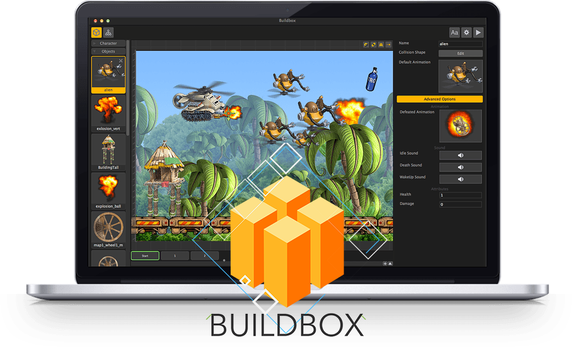
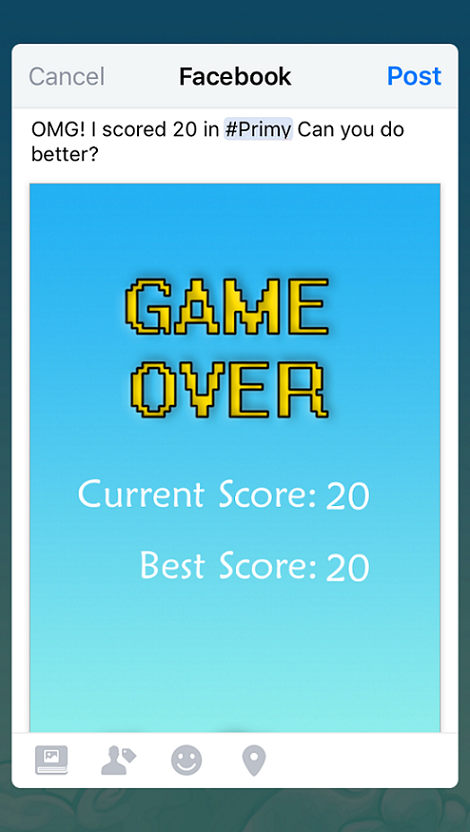
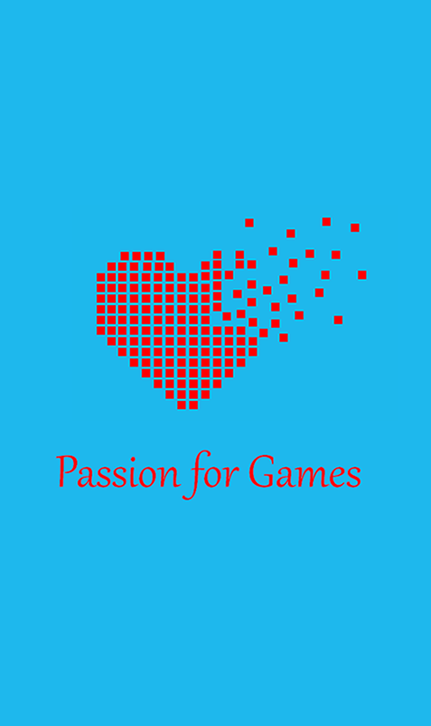
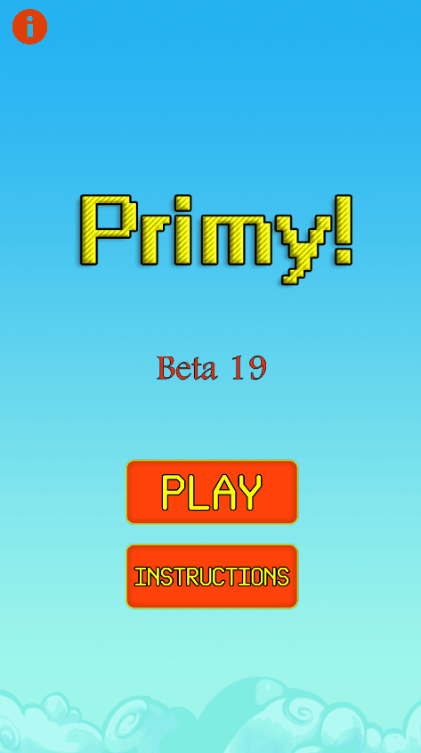
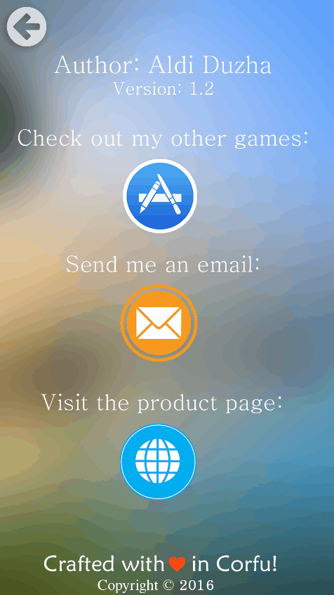
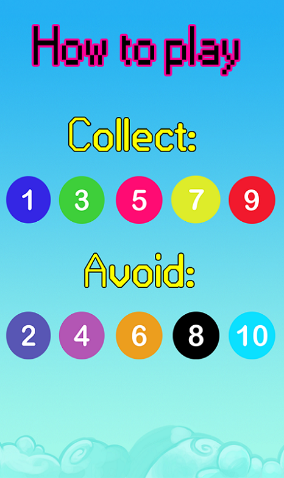
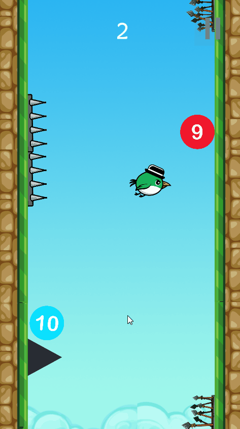
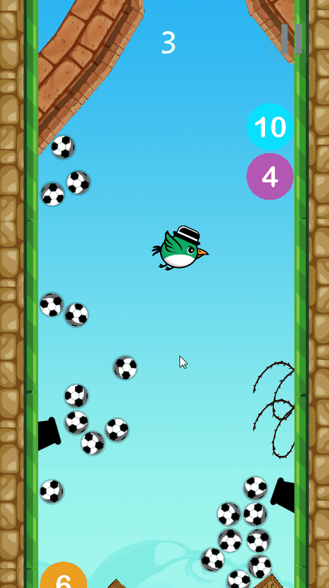
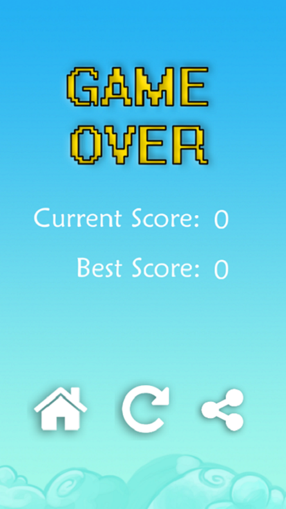

#ΙΟΝΙΟ ΠΑΝΕΠΙΣΤΗΜΙΟ 
#ΤΜΗΜΑ ΠΛΗΡΟΦΟΡΙΚΗΣ 
#ΜΑΘΗΜΑ: Επικοινωνια Ανθρωπου Υπολογιστη
 
Επιβλέπων καθηγητής: Χωριανόπουλος Κωνσταντίνος 

ΕΡΑΛΝΤ ΝΤΟΥΖΑ - Π2015018 - p15ntou@ionio.gr 

##Προδιαγραφές

- **Ιστοσελίδα Παιχνιδιού:** [Primy Tilt Edition](http://www.aldiduzha.com/games/primy_tilt)
- **Μέγεθος Παιχνιδιού:** *Android=11.3MB*, *IOS=12MB*.
- **Ηλικία:** Το παιχνίδι απευθύνεται σε όλες τις ηλικίες.
- **Προϋποθέσεις:** Απαιτείται κινητό τηλέφωνο το οποίο έχει επιταχυνσιόμετρο (accelerometer). Σχεδόν όλα τα κινητά smartphone στις μέρες μας έχουν το σένσορα αυτό.
- **Στόχος:** Ο παίκτης πρέπει να μαζέψει τις μπάλες με τους μονούς αριθμούς και να αποφύγει τις μπάλες με τους ζυγούς και τα εμπόδια. 
- **ΙΔΕΑ:** Η ιδέα είναι δική μου, οι περισσότερες εικόνες έχουν δημιουργηθεί, διαμορφωθεί και επεξεργαστεί από εμένα πλην μερικών εμποδίων και των ήχων που είναι και αυτά copyright free. Όλα τα δικαιώματα του παιχνιδιού ανήκουν σε μένα.

## Εργαλείο ανάπτυξης

**Buildbox Game Maker** 

**Σημείωση:** Απαιτείται άδεια επί πληρωμή για τη λειτουργία του εργαλείου.

##Σύντομη Περιγραφή

Το συγκεκριμένο παιχνίδι αποσκοπεί στην εκμάθηση και την απομνημόνευση των μονών και των ζυγών αριθμών παίζοντας το παιχνίδι το οποίο έχει μέσα διάφορες πίστες (πάνω από 25 επίπεδα), οι οποίες απαιτούν καλά αντανακλαστικά για να επιτευχθεί υψηλό σκορ, καθώς υπάρχουν διάφορα εμπόδια τα οποία τερματίζουν το παιχνίδι. Μόλις χάσει ο παίκτης, εμφανίζεται το σκορ του μέχρι το σημείο που έχασε.
Το σκορ υπολογίζεται από τις μπάλες(μόνο μονοί αριθμοί) που έχει μαζέψει μέχρι να χάσει.

**_ΣΥΝΤΟΜΕΣ ΟΔΗΓΙΕΣ ΠΑΙΧΝΙΔΙΟΥ:_**

**ΧΕΙΡΙΣΜΟΣ:** Ο χαρακτήρας κινείται αριστερά ή δεξιά, ανάλογα με τη κλίση(tilt) που του δίνει ο χρήστης. Υπάρχει επίσης και η δυνατότητα Tap to Play ως προαιρετική(σε κάθε άγγιγμα αλλάζει ο χαρακτήρας κίνηση 180 μοίρες). 
**ΧΑΝΕΙΣ ΟΤΑΝ:** ακουμπήσεις ένα εμπόδιο ή μια μπάλα με ζυγό αριθμό. 
**ΜΑΖΕΥΕΙΣ ΠΟΝΤΟΥΣ ΟΤΑΝ:** ακουμπάς μπάλες με μονούς αριθμούς. 
**ΣΚΟΡ:** Πόσες μονές μπάλες έχει μαζέψει ο χρήστης. 

##ΒΕΛΤΙΩΣΕΙΣ ΣΤΗ ΝΕΑ ΕΚΔΟΣΗ:

###*Γενικές Bελτιώσεις στη λειτουργικότητα 

###*Προσθήκη Leaderboard για App Store και Play Store 

###*Προσθήκη Share Βutton για κοινοποίηση του σκορ στα κοινωνικά δίκτυα 
 

###*Νέο Splash Image 
 

###<del>Παλιά Διεπαφή χρήστη</del> 
 

###Νέα Διεπαφή χρήστη 
  

###<del>Παλιό Μενού About</del> 
  

###Νέο Μενού About 
  

###Οδηγίες 
  

###+1 Point 
  

###Game Over 
  

###Νέο Game Over UI 
  

##ΔΙΑΘΕΣΗ ΠΑΙΧΝΙΔΙΟΥ ΚΑΙ ΛΗΨΗ:

**Το παιχνίδι έκδοσης "tilt" πρόκειται να δημιοσιευτεί στο Play Store και το App Store μόλις γίνει η τελική παρουσίαση και αφού έχω πάρει νέες ιδέες και σχόλια από καθηγητές και φοιτητές.**

###Μπορείτε να κατεβάσετε τη ίδια έκδοση του παιχνιδιού αλλά σε έκδοση "tap" εδώ:  

