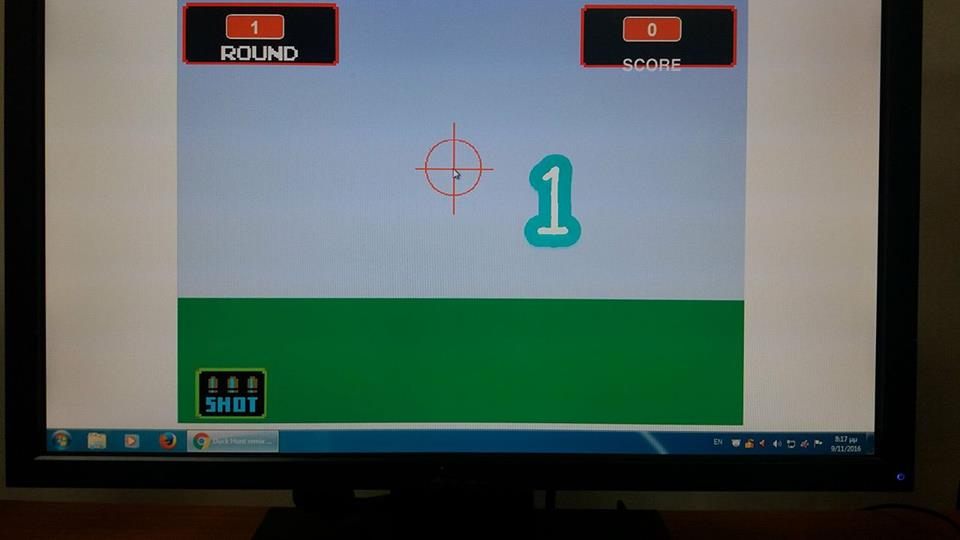

ΙΟΝΙΟ ΠΑΝΕΠΙΣΤΗΜΙΟ 
ΤΜΗΜΑ ΠΛΗΡΟΦΟΡΙΚΗΣ 

ΜΑΘΗΜΑ:Επικοινωνία Ανθρώπου-Υπολογιστή 
Επιβλέπων καθηγητής: Χωριανόπουλος Κωνσταντίνος 
Φοιτητής:ΚΟΚΚΟΡΗΣ ΜΙΧΑΗΛ - Π2015022 

##Εργαλείο ανάπτυξης: Scratch  
Δανεισμός στοιχείων (ιδέες και κώδικα) από: [Duck Hunt](https://scratch.mit.edu/projects/23258)  

##Σενάριο 

Ένα παιχνίδι διαμορφωμένο για μαθητές του νηπιαγωγείου. Οι μαθητές είναι κυνηγοί αριθμών απο το 1 μέχρι και το 9 και σκοπός είναι η εκμάθηση των αριθμών. 
 

##_Εικόνες_##

 

