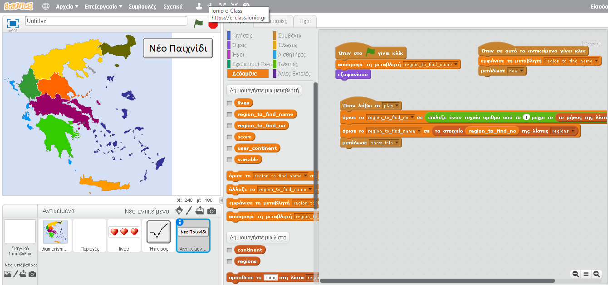
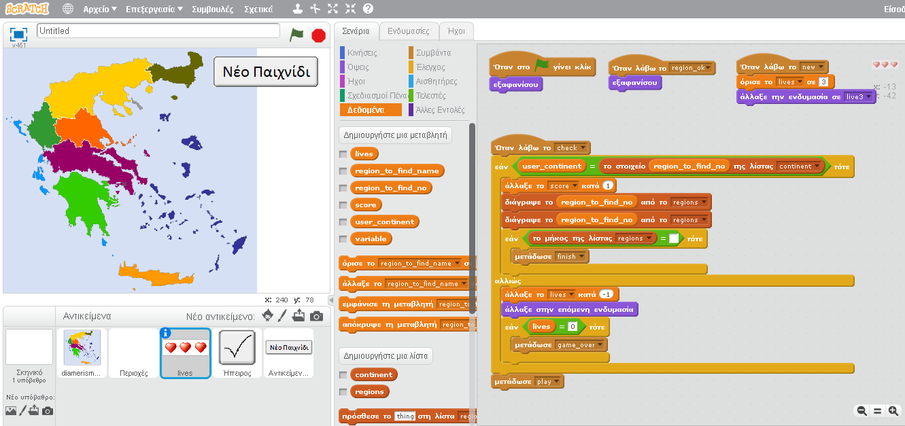

#ΙΟΝΙΟ ΠΑΝΕΠΙΣΤΗΜΙΟ 
#ΠΜΣ ΤΜΗΜΑΤΟΣ ΠΛΗΡΟΦΟΡΙΚΗΣ 
#ΜΑΘΗΜΑ:  Επιοινωνία Ανθρώπου Υπολογιστή
 
Επιβλέπων καθηγητής: Χωριανόπουλος Κωνσταντίνος 

Φοιτητές: Μέμος Σεβαστιανός  - Π2015027 - p15memo@ionio.gr 

##Προδιαγραφές

* Άνθρωπος :Το παιχνίδι απευθύνεται κυρίως σε παιδιά Δημοτικού.
* Γνωσεις : Βασικές γνώσεις χρήσης Η/Υ.
* Σκοπός: Οι χρήστες να αποκτήσουν καλή γνώση της γεωγραφίας της Ελλάδας.
* Φύλο: Η εφαρμογή απευθύνεται και στα δυο φύλα.

## Εγκατάσταση εργαλείων ανάπτυξης και τρέξιμο/αλλαγές σε υπάρχοντα

*	Εργαλείο ανάπτυξης: Scratch

Πρωτότυπο

##Σενάριο 
Το παιχνίδι είναι εκπαιδευτικό και σκοπό έχει τα παιδιά να αποκτήσουν καλύτερες γνώσεις της Γεωγραφίας της Ελλάδας μέσω διασκεδαστικού παιχνιδιού. Θα πρεπει να επιλέγουν σε ποιο γεωγραφικό διαμέρισμα βρισκονται οι πόλεις που θα τους εμφανίζονται.

* 
