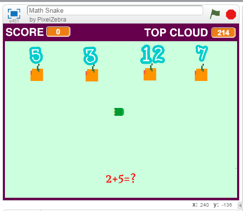

#Scratch Video Game
Μπακογιάννης Βαγγέλης
ΑΜ Π2015034
##Παραδοτέο 0
https://github.com/p15bako/pibookgr/tree/gh-pages/_quotes
...
##Παραδοτέο 1
Εκπαιδευτικο παιχνίδι με το εργαλείο Scratch.
...

##Παραδοτέο 2

Ηλικία: Το παιχνίδι είναι για παιδιά της Α' τάξης του Γυμνασίου και άνω. 

Διδακτική ενότητα: Μαθηματικά, Κεφάλαιο 7(Θετικοί και Αρνητικοί αριθμοί) Α’ Γυμνασιου
http://ebooks.edu.gr/modules/ebook/show.php/DSGYM-A200/426/2866,10943/

Φύλο: Και τα δύο
Στόχος του παιχνιδιού είναι ο μαθητής να μάθει να προσθέτει και αφαιρεί ακέραιους αριθμούς.

Δανεισμός κώδικα: https://scratch.mit.edu/projects/72303326/
Το παιχνίδι είναι βασισμένο πάνω στο παιχνίδι Pixel Snake

…

##Παραδοτέο 3

...

##Παραδοτέο 4

...

##Tελική Αναφορά

...
