#ΙΟΝΙΟ ΠΑΝΕΠΙΣΤΗΜΙΟ

#ΠΜΣ ΤΜΗΜΑΤΟΣ ΠΛΗΡΟΦΟΡΙΚΗΣ

#ΜΑΘΗΜΑ: Επικοινωνια Ανθρωπου Υπολογιστη

Επιβλέπων καθηγητής: Χωριανόπουλος Κωνσταντίνος

Φοιτητές:

Θεοδωροπουλος Σπυριδων - Π2015035 - p15theo2@ionio.gr
Κέρκυρα, 2017

##Σύνοψη

Η παρούσα εφαρμογή φτιάχτηκε στα πλαίσια μιας εργασίας για το μάθημα "επικοινωνία ανθρωπου-υπολογιστη" του τμήματος πληροφορικής του ιονίου πανεπιστημίου .
Πολλοί είναι οι δάσκαλοι σε όλο τον κόσμο που στην ανάγκη τους να αποθηκεύσουν με κάποιο τρόπο μια κατάσταση των μαθητών τους , τις πληροφορίες μιας τάξης η 
τα χαρακτηριστικά ενός σχολείου χρησιμοποιούν ατζέντες και σημειωματάρια και με χειρόγραφο τρόπο προσπαθούν να αποθηκεύσουν τις προαναφερθείσες πληροφορίες
Με βάση αυτή την ιδέα και με την βοήθεια του MIT App Inventor δημιουργήθηκε η παρούσα εφαρμογή 
Αντικείμενο της εφαρμογής είναι να χρησιμεύσει ως ένα εργαλείο που θα βοηθήσει και θα διευκολύνει δασκαλους,καθηγητες,εκπαιδευτικους κ.λπ. κατά την τέλεση του επαγγέλματος τους
Περιλαμβάνει 3 εργαλεία τα οποία ύστερα από ελέγχους και δοκιμές από εκπαιδευτικούς βελτιώθηκαν και τελικά διαμόρφωσαν μια τελική εφαρμογή .
LINK για την εφαρμογή :

##ΕΙΣΑΓΩΓΗ

##Περιγραφή εφαρμογής

Η εφαρμογή περιλαμβάνει τρία χρήσιμα εργαλεία δυο από τα οποία συνδέονται .
Το πρώτο εργαλείο δίνει την δυνατότητα στον εκπαιδευτικό να αποθηκεύσει ένα προφίλ του κάθε μαθητή του το οποίο μπορεί να περιλαμβάνει φωτογραφια,ονομα,τηλεφωνο
διευθυνση,ημερομηνια γέννησης και email . Όλα τα προφίλ που προσθέτει αποθηκεύονται σε μια λίστα στην οποία ο εκπαιδευτικός πατώντας πάνω στο όνομα
του μαθητή που θέλει να επιλέξει μπορεί να δει τις πληροφορίες που έχει αποθηκεύσει και στην συνέχεια  με το πάτημα ενός κουμπιού να δει την διεύθυνση του στον 
χάρτη , να του κάνει κλήση η να του στείλει ένα email
Το δεύτερο εργαλείο δίνει την δυνατότητα στον εκπαιδευτικό να αποθηκεύσει ένα προφίλ της κάθε τάξης του , το οποίο μπορεί να περιλαμβάνει όνομα, όνομα σχολείου,
σχολική χρονιά και διεύθυνση . Επίσης εκτός από προαναφερθέντα ο εκπαιδευτικός μπορεί να εισάγει στο προφίλ της τάξης , τα ονόματα των μαθητών που έχει η τάξη 
μέσω ενός πίνακα  που εμφανίζει τους μαθητές που έχει αποθηκεύσει έως τότε χρησιμοποιώντας το πρώτο εργαλείο .Όλες οι τάξεις αποθηκεύονται σε μια λίστα στην οποία 
ο εκπαιδευτικός επιλέγοντας μια τάξη μπορεί να δει τις πληροφορίες που είχε αποθηκεύσει και στην συνέχεια με το πάτημα ενός κουμπιού να δει την διεύθυνση της 
στον χάρτη .
Το τρίτο εργαλείο είναι ένα απλό σημειωματάριο στο οποίο ο εκπαιδευτικός μπορεί να αποθηκεύσει τίτλο και ένα κείμενο

##Προδιαγραφές "TEACH"

##Επιλογές εργαλείων 

####MIT App Inventor: 
Το κύριο εργαλείο ανάπτυξης της εφαρμογής. Είναι δωρεάν για όλους και παρέχεται από το τεχνολογικό πανεπιστήμιο της Μασσαχουσέττης 

####Paint.net:
Δωρεάν και συνάμα απλή εφαρμογή επεξεργασίας και δημιουργίας φωτογραφιών καi λογοτυπων.Χρησιμοποιθηκε για την δημιουργία των εικονιδίων που
χρησιμοποιήθηκαν στην εφαρμογή

##Διαδικασία ανάπτυξης

Η ιδέα καθώς και η αρχική ανάπτυξη της εφαρμογής ξεκίνησε μετά από την ανάθεση της εργασίας που έγινε στο μάθημα επικοινωνία ανθρωπου-υπολογιστη παίρνοντας 
έμπνευση από τους κανόνες καθώς και τις συμβουλές που μας υπογράμμισαν οι διδάσκοντες . Στην συνέχεια ακολουθώντας αυτούς τους κανόνες και συμβουλές 
οριστικοποιήθηκε η βασική ιδέα και έγινε μια αρχική σχεδίαση της εφαρμογής η οποία στην συνέχεια συνεχώς βελτιωνόταν τόσο με τις παρατηρήσεις τον εκπαιδευτικών 
και των συμφοιτητών που άκουγαν για αυτή η την δοκίμαζαν , όσο και με βιντεο-οδηγους στο ίντερνετ τα οποία εκτός από ιδέες πρόσφεραν 
και χρήσιμες συμβουλές όσο αναφορά την υλοποίηση του κώδικα .Η ιδέα της εφαρμογής δεν είναι πρωτότυπη παρόλα αυτά η εφαρμογή δεν βασίστηκε σε κάποια άλλη 
ήδη υπάρχουσα εφαρμογή

####Παραδειγμα-Πρωτο προτυπο
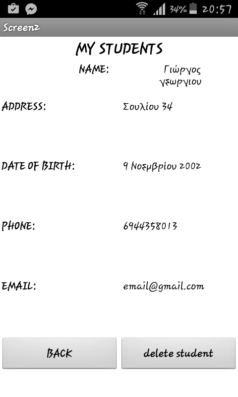
####Παραδειγμα-Τελικο προτυπο
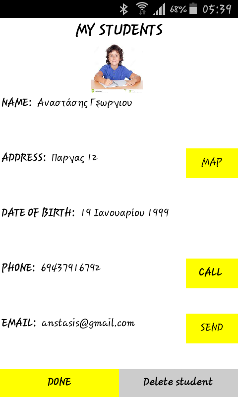

##Δοκιμασία της εφαρμογής "Teach"

Για να βεβαιωθώ πως κινούμαι στην στη σωστή κατεύθυνση για τη δημιουργία μιας επιτυχημένης εφαρμογής αποφάσισα να δοκιμάσω την εφαρμογή στο κοινό που
απευθύνετε δηλαδή σε εκπαιδευτικούς . Η κριτική τους αλλά και η βοηθειά τους ήταν πολύτιμη καθώς όχι μόνο διορθώνονταν λάθη και παραλείψεις 
αλλά και συνεχώς προσθέτονταν νέα πράγματα στην εφαρμογή που την έκαναν όλο και καλύτερη 

##Ενδεικτικές οθόνες :

### Το εικονιδιο της εφαρμογης
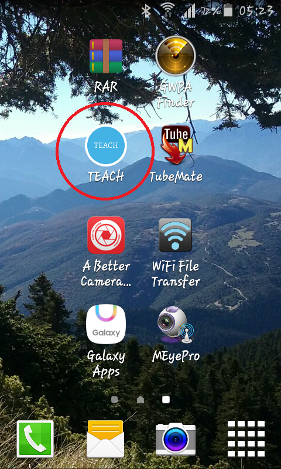

### Αρχικη οθονη
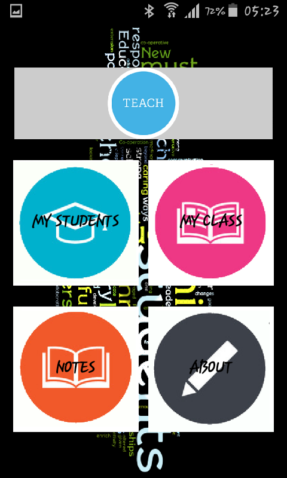

### Η λιστα των μαθητων χωρις στοιχεια (διακρινεται η ειδοποιηση της εφαρμογης που εμφανιζεται οταν δεν υπαρχουν μαθητες)
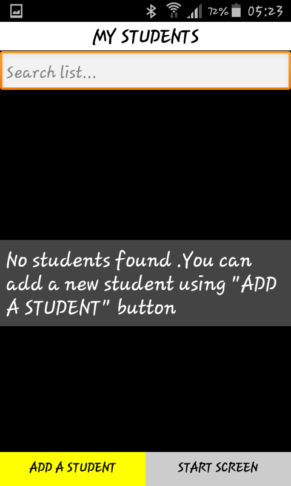

### Η λιστα των μαθητων με στοιχεια
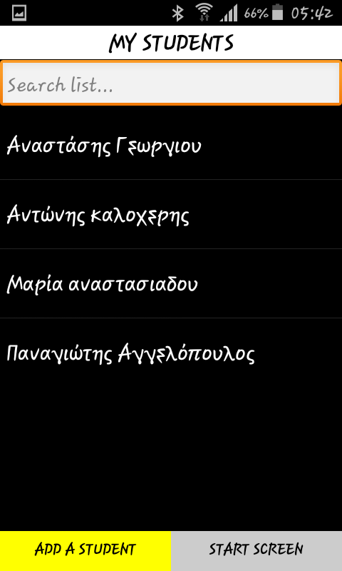

### Η σελιδα οπου ο χρηστης προσθετει εναν μαθητη ( διακρινεται η ειδοποιηση που εμφανιζεται οταν ο χρηστης δεν βαλει ονομα
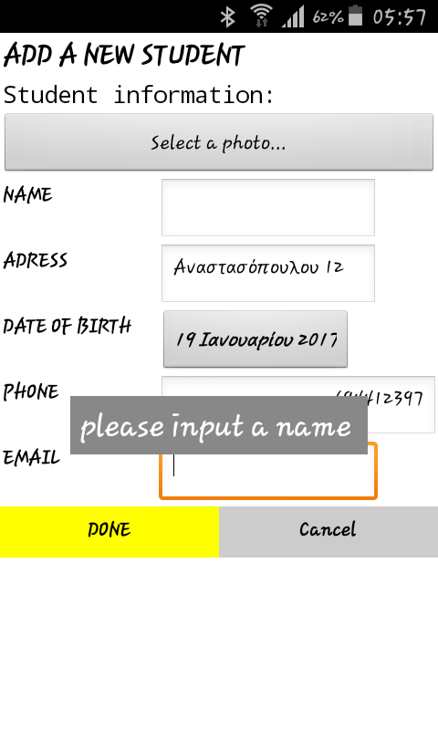

### Προφιλ μαθητη

### Αποτελεσμα χρησης του κουμπιου "MAP"
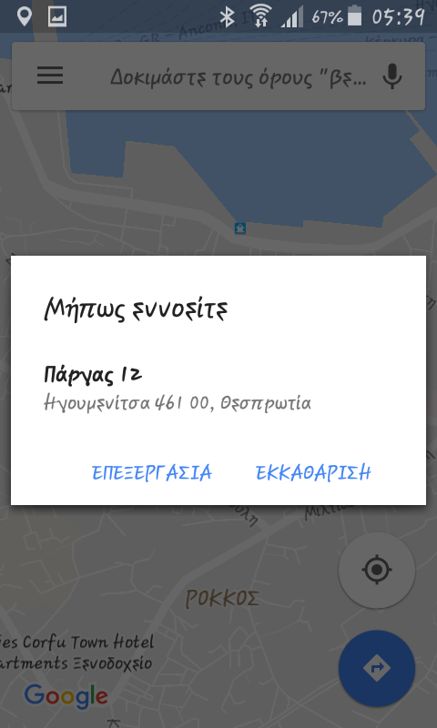

### Η λιστα των ταξεων χωρις στοιχεια (διακρινεται η ειδοποιηση που εμφνιζεται οταν δεν υπαρχουν στοιχεια)
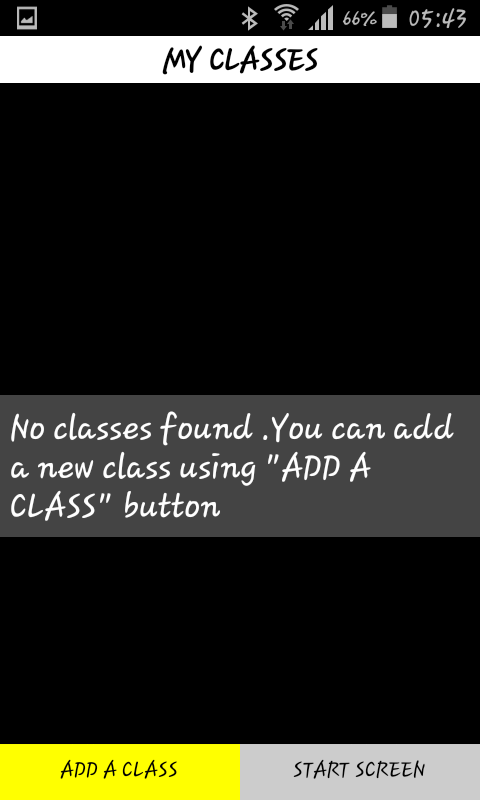

### Εισαγωγη ταξης
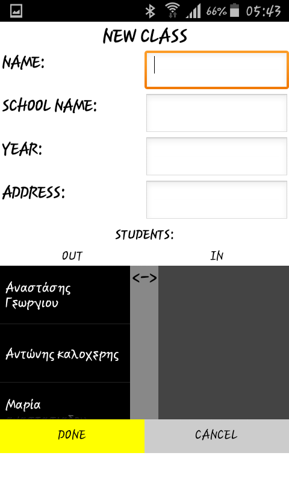

### Προφιλ ταξης 
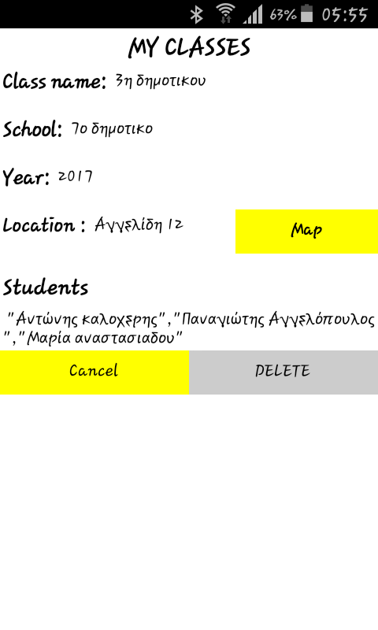

### Λιστα σημειωσεων
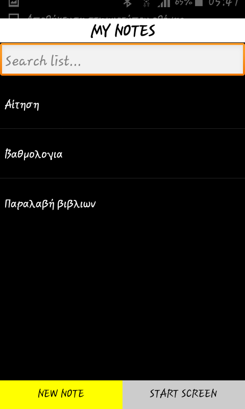

### Εισαγωγη σημειωσης ( διακρινεται η ειδοποιηση που εμφανιζεται οταν ο χρηστης δεν γραψει τιποτα στο κειμενο)
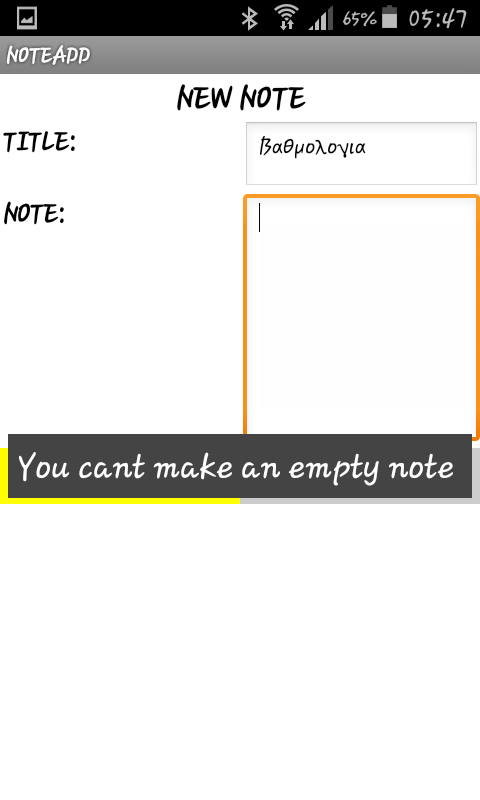

### Μια σημειωση
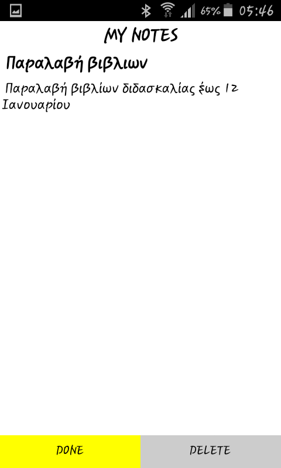

##Συμπεράσματα και προτάσεις για μελλοντικές βελτιώσεις

##Συμπεράσματα
To "Teach" είναι μια απλή εφαρμογή που αποσκοπεί στην διευκόλυνση των εκπαιδευτικών

##Βελτιώσεις
Οι λοιπές βελτιώσεις που θα μπορούσαν να γίνουν στην εφαρμογή αφορούν κυρίως το καλλιτεχνικό κομμάτι της δηλαδή να προσθέτουν περισσότερα εικονίδια
εικονες,φοντα,χρωματα, αλλά και να εμφανίζονται με ποιο φιλικο-προς-στον-χρηστη-τροπο οι πληροφορίες των μαθητών και των τάξεων . Κατά τα άλλα
θα μπορούσαν να προσθέτουν και άλλες λειτουργιές και εργαλεία όπως είναι π.χ. ένα βαθμολόγιο

##Κώδικας ( Δανεισμός κώδικα και αλλαγές )

####Αλλαγές που πραγματοποιήθηκαν:

-Προσθετηκε ο έλεγχος ο οποίος τσεκάρει αν ο χρήστης προσπαθεί να εισάγει όνομα μαθητη,ταξη η σημείωση που υπάρχει ήδη (πλέον δεν μπορεί να το κάνει)

-Προστεθηκε το κουμπί about οπού οι χρήστες μπορούν να δουν πληροφορίες για την εφαρμογή

-Προστεθηκε ο κώδικας ο οποίος ορίζει τι θα κάνει η εφαρμογή όταν ο χρήστης πατάει το κουμπί "πίσω" 
του κινητού ανάλογα με το που βρίσκεται ο χρήστης

-Προστεθηκε το κουμπί "SEND" στο προφίλ των μαθητών το οποίο δίνει την δυνατότητα στον χρήστη να στείλει άμεσα email 

