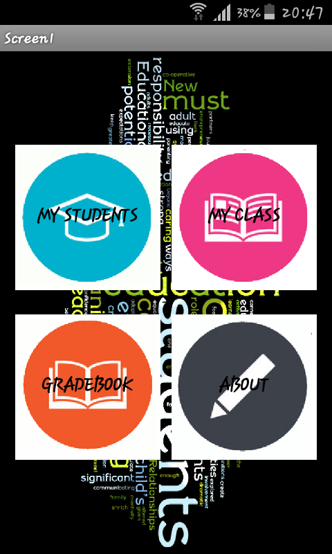
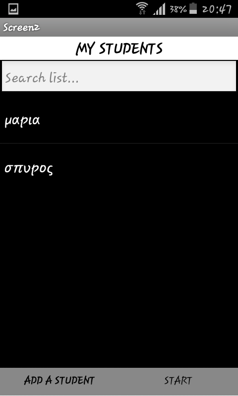
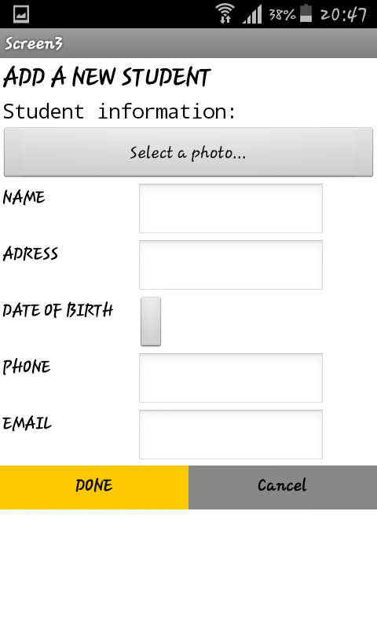
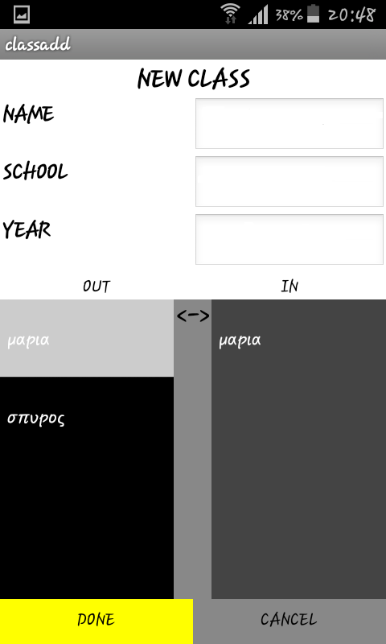

#ΙΟΝΙΟ ΠΑΝΕΠΙΣΤΗΜΙΟ 
#ΠΜΣ ΤΜΗΜΑΤΟΣ ΠΛΗΡΟΦΟΡΙΚΗΣ 
#ΜΑΘΗΜΑ:  Επικοινωνια Ανθρωπου Υπολογιστη
 
Επιβλέπων καθηγητής: Χωριανόπουλος Κωνσταντίνος 

Φοιτητές: 

Θεοδωροπουλος Σπυριδων  - Π2015035 - p15theo2@ionio.gr 

##Προδιαγραφές

* Άνθρωπος : Η εφαρμογη απεθυνεται κυριος σε δασκαλους και καθηγητες
* Σκοπός: Να δωσει την δυνατοτητα σε εκπαιδευτικους να αποθηκευουν σε ηλεκτρονικη μορφη τις πληροφοριες των τμηματων τους , τους μαθητες   του τμηματος καθως και τους βαθμους των μαθητων 
* Προηγουμενες γνωσεις : Απλη γνωση χρησης android κινητου
* Φύλο: Η εφαρμογη απευθυνεται και στα δυο φυλλα

## Εγκατάσταση εργαλείων ανάπτυξης και τρέξιμο/αλλαγές σε υπάρχοντα

*	Εργαλείο ανάπτυξης: MIT app inventor 2

###TEACH

ΛΙΣΤΑ ΜΑΘΗΤΩΝ

ΕΜΦΑΝΙΣΗ ΣΤΟΙΧΕΙΩΝ ΜΑΘΗΤΩΝ

ΕΙΣΑΓΩΓΗ ΜΑΘΗΤΩΝ

ΔΗΜIΟΥΡΓΙΑ ΤΜΗΝΑΤΟΣ ΚΑΙ ΕΙΣΑΓΩΓΗ ΜΑΘΗΤΩΝ ΣΤΟ ΤΜΗΜΑ

##Λειτουργια 
*Η εφαρμογη περεχει τρεις στον χρηστη λειτουργειες. Η πρωτη λειτουργια επιτρεπει στον χρηστη να αποθηκευσει τα στοιχεια ενως μαθητη και στην συνεχεια να τα ξαναδιαβασει οποτε αυτος θελει . Η δευτερη λειτουργεια επιτρεπει στον χρηστη να δημηουργησει τμηματα των μαθητων του χρησιμοποιωντας τους μαθητες που αποθηκευτηκαν χρησιμοποιωντας την πρωτη λειτουργεια . Η τριτη λειτουργια παρεχει την δυνατοτητα στον χρηστη να δημηουργησει ομαδες χρησιμοποιωντας στοιχεια της πρωτης και της δευτερης λειτουργειας και στην συνεχεια να εισαγει βαθμολογιες στον καθε μαθητη   .
