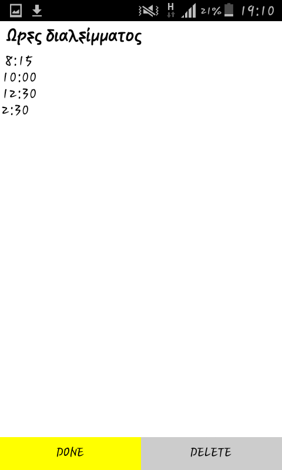
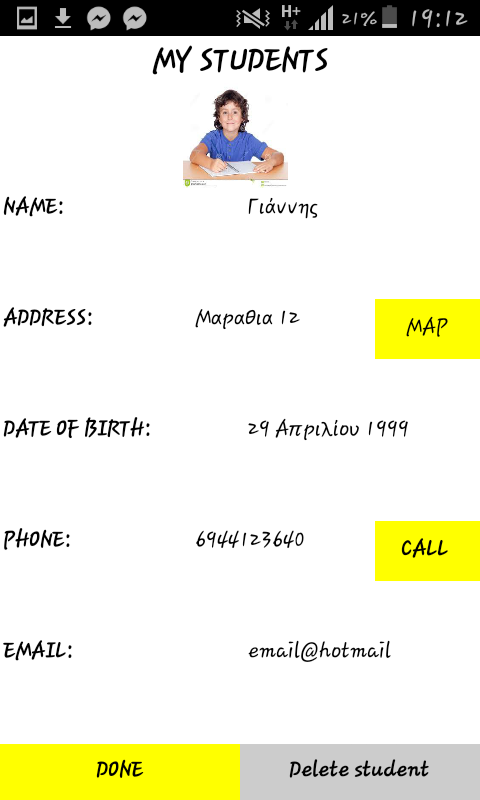
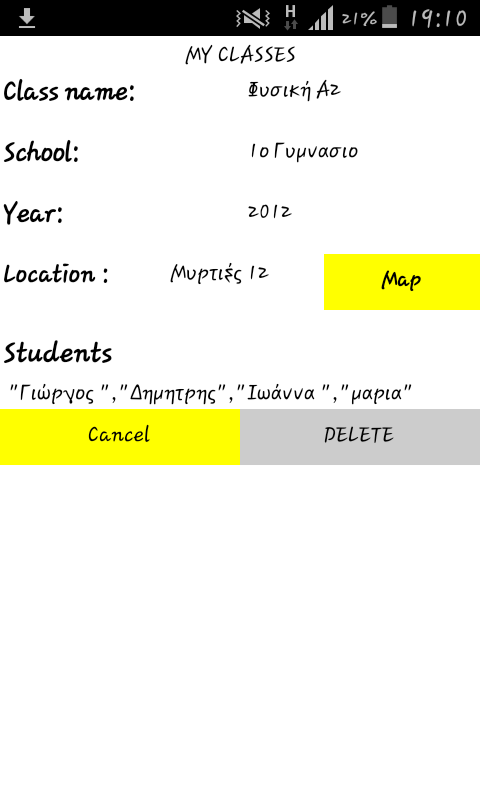
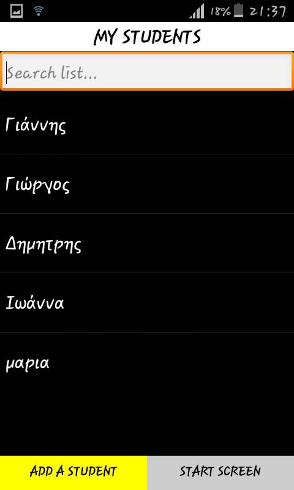

##Παραδοτεο 3

##Περιγραφη
Η εφαρμογή απευθύνεται κυρίως σε δασκάλους και καθηγητές και έχει σκοπό να τους βοηθήσει παρέχοντας τρεις βασικές λειτουργίες .
Η πρώτη λειτουργία επιτρέπει στον δάσκαλο να δημιουργήσει προφίλ τον μαθητών έτσι ώστε να έχει πρόσβαση στις πληροφορίες τους όποτε το
επιθυμήσει , επίσης κάποιες άλλες δυνατότητες της λειτουργιάς είναι η κλήση ενός μαθητή η η εμφάνιση (σε χάρτη) της διεύθυνσης του.
Η δεύτερη λειτουργιά χρησιμοποιωντας δεδομενα της πρωτης λειτουργειας δίνει την δυνατότητα στον καθηγητη να δημιουργήσει προφίλ των
τάξεων του αλλά και των σχολειών στα οποία αυτές βρίσκονται , επίσης του δίνεται η δυνατότητα να δει πάνω σε χάρτη που βρίσκεται το
κάθε σχολείο η τάξη.Η τρίτη λειτουργιά είναι ένα απλό σημειωματάριο

##Εργαλεια 
MIt app inventor : για την δημιουργία της εφαρμογής

Paint.net : Για την δημιουργία των απαραίτητων φωτογραφιών

###Διαδικασια αναπτυξης/Βελτιωσεις
Σε σχέση με την πρωτότυπη εφαρμογή προστέθηκαν πολλές νέες δυνατότητες όπως είναι η εμφάνιση σε χάρτη της διεύθυνσης του σχολείου
και η δυνατότητα άμεσης τηλεφωνικης κλήσης του μαθητή μέσω της εφαρμογής .Μια ακομη δυνατοτητα που προστεθηκε ειναι η δυνατοτητα που
εχει χρηστης να αποθηκευσει μεταξυ αλλων και μια φωτογραφια για καθε μαθητη την οποια μπορει να την επιλεξει ειτε απο την συλλογη 
ειτε να την τραβηξει εκεινη την στιγμη .Επίσης προστέθηκαν αρκετοί έλεγχοι(όπως ο έλεγχος για το αν ο χρήστης έβαλε τίτλο σε μια 
καινούργια τάξη) καθώς και ειδοποιήσεις ( όπως η ειδοποίηση που εμφανίζεται όταν ο χρήστης δεν έχει δημιουργήσει κανένα μαθητή ακόμα) .

##ΦΩΤΟΓΡΑΦΙΕΣ
Οι παρακατω φωτογραφιες δειχνουν μερικα απο τα αποτελεσματα των λειτουργειων της εφαρμογης .

####Αποτελεσμα τριτης λειτουργειας

####Αποτελεσμα πρωτης λειτουργειας

####Αποτελεσμα δευτερης λειτουργεια και πρωτης

###Εισαγωγη μαθητη

###Παραδειγμα λιστας μαθητων

##Προτάσεις για μελλοντικές βελτιώσεις
Περρισοτεροι ελεγχοι και ειδοποιησεις , εισαγωγη περισσοτερων δυνατοτητων.
