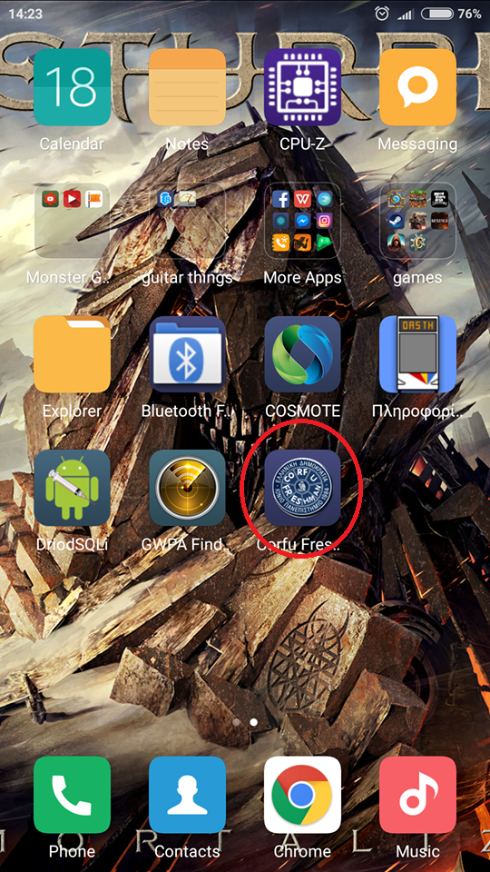
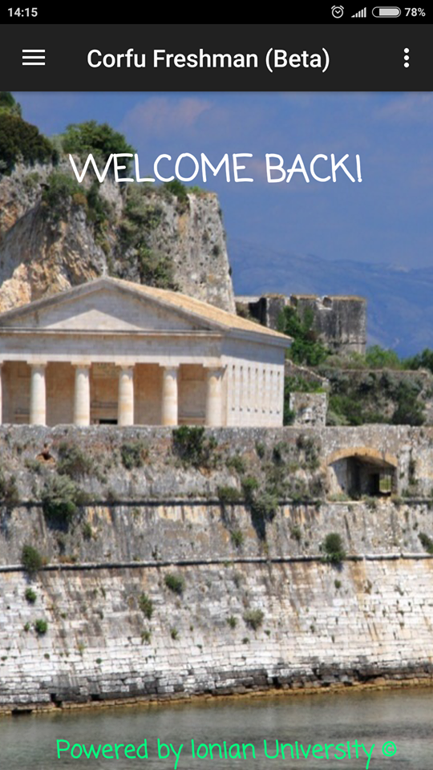
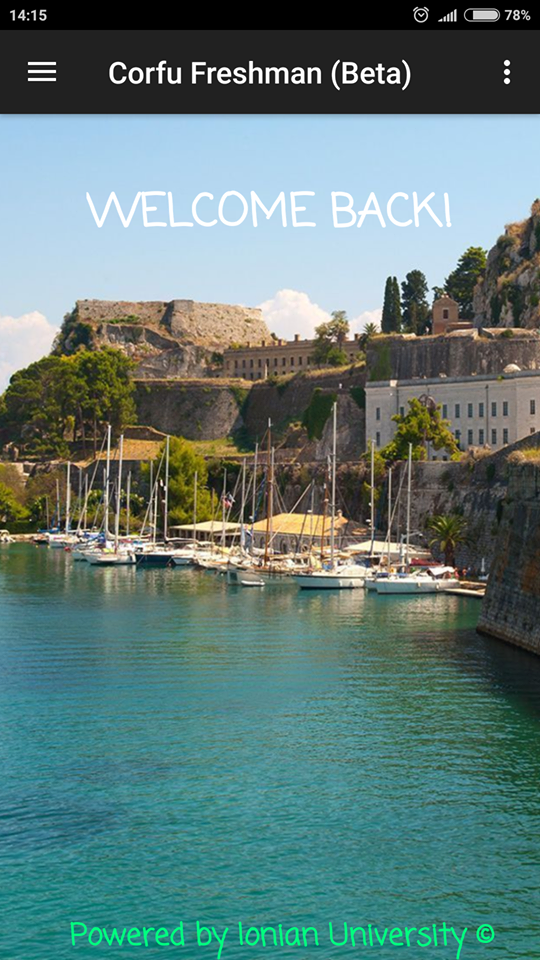
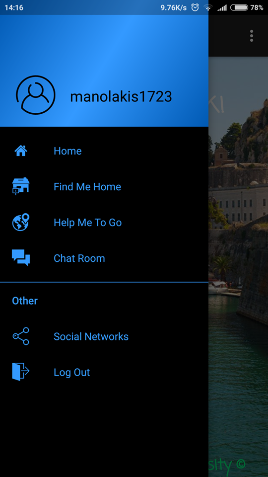
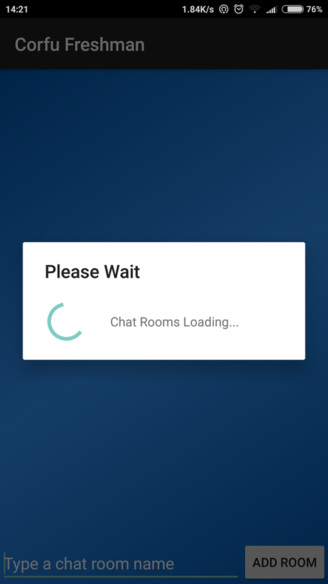
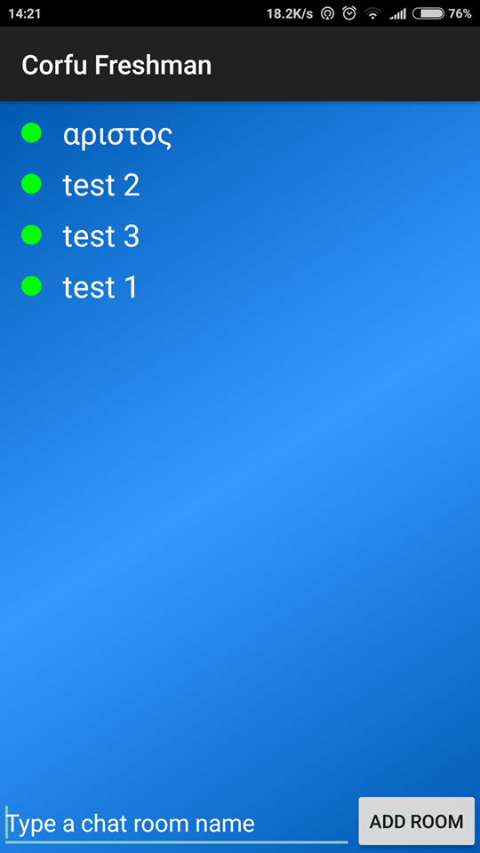
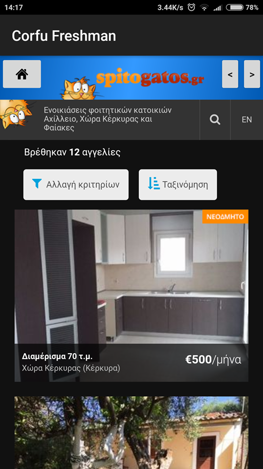
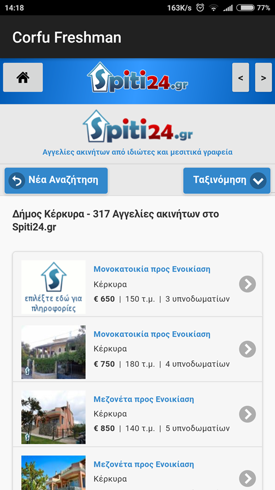
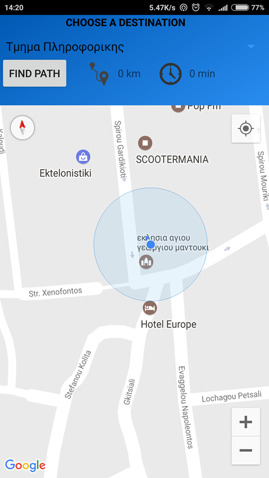

#ΙΟΝΙΟ ΠΑΝΕΠΙΣΤΗΜΙΟ 
#ΠΜΣ ΤΜΗΜΑΤΟΣ ΠΛΗΡΟΦΟΡΙΚΗΣ 
#ΜΑΘΗΜΑ: Επικοινωνία Ανθρώπου-Υπολογιστή

Επιβλέπων καθηγητής: Χωριανόπουλος Κωνσταντίνος

Φοιτητές:

Καράμπινας Αριστείδης – Π2015118 – p15kara2@ionio.gr

Τασιόπουλος Εμμανουήλ – Π2015046 – p15tasi@ionio.gr

Κέρκυρα, 2017

##Σύνοψη

Στα πλαίσια του μαθήματος Επικοινωνία ανθρώπου υπολογιστή κληθήκαμε να δημιουργήσουμε ένα παιχνίδι/εφαρμογή με βάση τη διάδραση του ανθρώπου με τον υπολογιστή .Στηριγμένοι στη συγκεκριμένη παράμετρο δημιουργήσαμε με τη βοήθεια του ANDROID STUDIO μια εφαρμογή η οποία εξυπηρετεί στην εξοικείωση κυρίως των πρωτοετών φοιτητών κατά την εισαγωγή τους στο  πανεπιστήμιο της Κέρκυρας(π.χ Σχολή) και αφού ρωτήσαμε επανειλημμένα διάφορους πρωτοετείς φοιτητές συλλέξαμε τα σχόλια και τις παρατηρήσεις τους βελτιώνοντας την εφαρμογή μέχρι την οριστική της διαμόρφωση.
Link για την εφαρμογή: ( όταν βάλουμε κάποια στιγμή)

##Εισαγωγή 

##Περιγραφή της χρησιμότητας της εφαρμογής

Η εφαρμογή ξεκίνησε από μια ιδέα μεταξύ (Καράμπινα Αριστείδη και Τασιοπουλο Εμμανουήλ ) κύριος σκοπός της εφαρμογής  είναι να βοηθήσει τους πρωτοετείς φοιτητές να προσαρμοστούν. Ποιο συγκεκριμένα:

Η εφαρμογή αποσκοπεί στην ενημέρωση πρωτοετών φοιτητών καθώς και στη διευκόλυνση προσαρμογής αλλά και γνωριμίας μεταξύ τους μέσω ενός "chat". Επιπλέον συμβάλει στη καθοδήγηση των φοιτητών για σημεία και μέρη που θα χρειαστεί να γνωρίζουν κατά τη διαμονή του στη Κέρκυρα. Η εφαρμογή απαιτεί τη δημιουργία ενός προσωπικού λογαριασμού του οποίου τα στοιχεία θα αποθηκεύονται σε ένα “database” ( firebase ). Με την εισαγωγή του χρήστη στην εφαρμογή δίνεται η δυνατότητα εγγραφής στο “chat” με προσωπικό όνομα το οποίο παράγεται από τους χαρακτήρες του e-mail του χρήστη μέχρι τον χαρακτήρα "@".Επιπλέον υπάρχει η δυνατότητα δημιουργίας Chat_room (πχ. Πρωτοετά Πληροφορικής). Στον τομέα της καθοδήγησης η εφαρμογή θα λαμβάνει πληροφορίες από το Google Maps και θα εμφανίζει στο χρήστη την τρέχουσα τοποθεσία του καθώς και μερικές επιλογές για την εμφάνιση της απόστασης και της διαδρομής από την τοποθεσία του έως ένα σημείο ( πχ πανεπιστήμιο,λέσχη,φοιτητική μέριμνα κτλ); Τέλος ως φοιτητές και εμείς γνωρίζοντας τη μεγαλύτερη δυσκολία του να φοιτείς στην Κέρκυρα που είναι η εύρεση σπιτιού θα δίνουμε στον χρήστη μέσω μίας επιλογής (find me home) διάφορα sites ενοικίασης σπιτιών.

##Προδιαγραφές Corfu Freshman


##Επιλογή εργαλείων

Τα εργαλεία που χρησιμοποιήσαμε ήταν τα εξής:

####Android Studio:
Αποτελεί το κύριο εργαλείο ανάπτυξης της εφαρμογής. Το Android Studio είναι ένα δωρεαν περιβάλλον προγραμματισμού στο οποίο οι χρήστες δημιουργούν  κώδικα με τον οποίο θα “τρέξει” η εφαρμογή. Αφορά κυρίως δυο βασικές γλώσσες προγραμματισμού ( java , xml ). Είναι αρκετά δύσκολο στην εκμάθηση και στην χρήση του και αναφέρεται κυρίως σε άτομα που έχουν γνώσεις γλωσσών προγραμματισμού.

####Gimp:
Αποτελεί ένα επισης δωρεαν και ταυτοχρομνα απλό λογισμικό για την επεξεργασία εικόνων. Χρησιμοποιήσαμε το λογισμικό αυτό για να δημιουργήσουμε τα εικονίδια που υπάρχουν στο app_bar της εφαρμογής καθώς και στο σχεδιασμό του εικονιδίου όταν την κατεβάζουμε.

####Fire Base:
Πρόκειται για μια βάση δεδομένων της Google το οποίο σου δίνει τη δυνατότητα αποθήκευσης των στοιχείων των μελων της εφαρμογης καθως και ενα χώρο αποθηκευσης των μηνυματων των χρηστών της εφαρμογής.

Ολα τα παραπΆνω εργαλεία που χρησιμοποιήθηκαν για την υλοποίηση της εφαρμογής ειναι διαθέσιμα στο διαδίκτυο *ΔΩΡΕΑΝ*

##Διαδικασία ανάπτυξης

Η αρχική ιδέα και η ανάπτυξη ξεκίνησαν κατά την διάρκεια των διαλέξεων του μαθήματος “Επικοινωνία Ανθρώπου - Υπολογιστή”. Με βάση την ροή των διαλέξεων,αλλά και τις συσκέψεις της μικρής μας ομάδας,όχι μόνο κατά την διάρκεια των μαθημάτων,οριοθετήσαμε το βασικό προσανατολισμό τον οποίο και διαρκώς βελτιώναμε στηριγμένοι τόσο στις παρατηρήσεις των συμφοιτητών μας αλλά και στους πρωτοετείς που κλήθηκαν να απαντήσουν κατά πόσο θα χρησιμοποιούσαν την εφαρμογή αλλά και πόσο θα τους βοηθούσε για να ξεκινήσουν εδώ στη Κέρκυρα.
Η ιδέα της εφαρμογής ειναι πορωτοτυπη (απο αναζητηση που καναμε δεν βρηκαμε κατι αντιστοιχο να υπαρχει) είναι δικιά μας πρωτοβουλία και σκέψη αλλά όσο άφορα τον προγραμματισμό της και το κώδικα δανειστήκαμε ιδέες και στοιχειά από διάφορα βίντεο που παρακολουθήσαμε στο YouTube (για τους χάρτες και αντίστοιχα για το chat)

```
Login In Screen
```


```
Sign Up Screen
```


Ύστερα προχωρήσαμε στην ανάπτυξη της εφαρμογής του παιχνιδιού χρησιμοποιώντας την πλατφόρμα του Android Studio. Δανειστήκαμε στοιχειά(κώδικα και ιδέες)από τα εξής:

https://www.youtube.com/watch?v=wVCz1a3ogqk (για το chat)

https://www.youtube.com/watch?v=dr0zEmuDuIk&t=2s (για τα maps)

Η λειτουργια του (find me home) ειναι καθαρα δικος μας κωδικας στα πλαισια του προγραμματισμου που καναμε αυτο το εξαμηνο.

##Δοκιμαστική εφαρμογή του «Corfu Freshman» σε πρωτοετείς φοιτητές

Για να βεβαιωθεί η ομάδα εργασίας πως κινείται στη σωστή κατεύθυνση για τη δημιουργία μια επιτυχημένης εφαρμογής αποφάσισε να δοκιμάσει το «Corfu Freshman» στο κοινό που απευθύνεται : σε μαθητές του πρώτου έτους. Θεωρήσαμε πως το feedback που θα δώσουν οι χρήστες θα αποφέρει χρήσιμα συμπεράσματα για παραλήψεις λάθη και μελλοντικές βελτιώσεις. Μέσα από ένα δείγμα περίπου 10 φοιτητών από το τμήμα Πληροφορικής λάβαμε ποίκιλα σχόλια για την εφαρμογή μας.

##Ενδεικτικές Οθόνες
```
App Icon
```


```
Main Screen1
```


```
Main Screen2
```


```
User:Manolakis1723
```


```
Please Wait 
```


```
ChatRoom
```


```
MainFindMeHome
```


```
FindMeHome1
```


```
FindMeHome2
```


```
FindMeHome3
```



```
MyLocation
```



```
Marker1
```


```
Marker2
```


```
Options
```


##Συμπεράσματα και προτάσεις για μελλοντικές βελτιώσεις

##Συμπεράσματα

Το Corfu Freshman είναι μια εφαρμογή που αποσκοπεί στη πλήρη ενημέρωση και καθοδήγηση πρωτοετών φοιτητών στη Κέρκυρα. Το γεγονός αυτό επαληθεύεται και από την ανατροφοδότηση που λάβαμε μέσω των αλλεπάλληλων προβολών του σε πρωτοετείς φοιτητές για τη διεξαγωγή ασφαλέστερων συμπερασμάτων.

##Βελτιώσεις

Οι πιθανές βελτιώσεις αναφορικά στην εργασία προσανατολίζονται ως προς τη σχεδίαση της εφαρμογής σε ότι έχει να κάνει με εικονίδια και γενικά περισσότερο φωτογραφικό υλικό. Μια ακόμη προοπτική είναι η επέκταση της εφαρμογής σε ότι άφορα επικοινωνία μεταξύ καθηγητή και μαθητή κατά τη διάρκεια του μαθήματος με τη μορφή μηνυματων (ερωτήσεων η αποριών) κατά τη διάρκεια των διαλέξεων. Αυτό στοχέυει κυρίως σε ολους τους φοιτητές που "φοβουνται" να διατυπωσουν τις αποριες τους  κατα τη διαρκεια της διαλεξης.Για να γίνει ακόμα πιο προσιτή προς το κοινό σκεφτήκαμε να προσθέσουμε και την επιλογή ο χρήστης να μπορεί να επιλέξει τη δικιά του φωτογραφία  καθώς και δικό του όνομα αφού γίνει μέλος της εφαρμογής.

##Κωδικας ( Δανεισμος κωδικα και αλλαγες )

####Αλλαγές που πραγματοποιήθηκαν:

- Επανασχεδιασαμε ολα τα εικονιδια της εφαρμογης 

- Προσθεσαμε BackGround στο ChatRoom και διορθωσαμε προβληματα με την επικοινωνια της εφαρμογης με το DataBase

- Διορθωσαμε ενα προβλημα που δυσκολευε το χρηστη καθως μπορουσε ο καθενας να στειλει ενα κενο μηνυμα (πλεον δεν γινεται πρεπει να γραψει κατι)

- Προσθεσαμε τους χαρτες (Google Maps) υλοποιοντας ετσι τη χρηση του GPS του κινητου

- Προσθεσαμε το χρονο καθως και τα χιλιομετρα που θα χρειαστει να κανει καθως και την απεικονιση της διαδρομης στο χαρτη με μια μπλε γραμμη

- Προσθεσαμε τους προορισμους που θα χρειαστει ενας φοιτητης οταν ερθει στη κερκυρα

- Αλλαξαμε το interface ολοκληρης της εφαρμογης 

- Οταν μπαινεις στο chat πλεον δεν χρειαζεται να βαλεις ονομα γιατι δημιουργειται αυτοματα με την εγγραφη του χρηστη

- Προσθεσαμε καινουργια δραστηριοτητα το find me home που ειναι για την ευρεση σπιτιου στη κερκυρα 

- Προσθεσαμε σε περιπτωση λαθων μηνυματα καθως και progress dialog για την ενημερωση των χρηστων σε περιπτωση που χρειαστει να περιμενουν

- Προσθεσαμε εναλλασσομενες εικονες στο main activity

- το username του χρηστη πλεον δεν εμφανιζεται στο main activity αλλα στο slide bar


