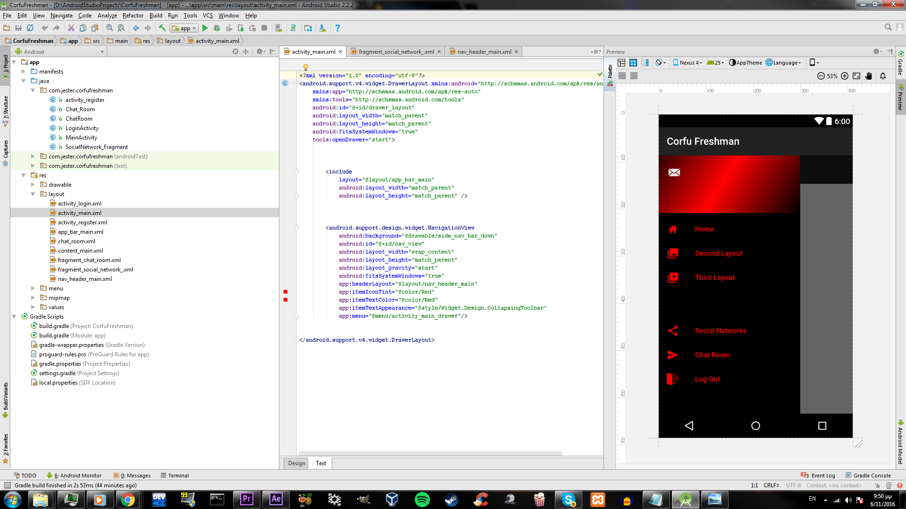
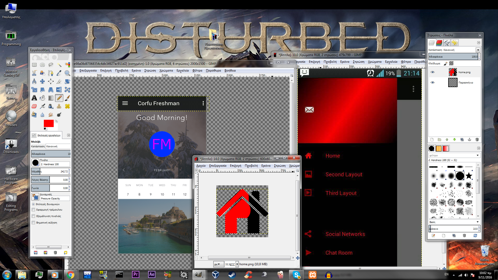

#ΙΟΝΙΟ ΠΑΝΕΠΙΣΤΗΜΙΟ 
#ΤΜΗΜΑ ΠΛΗΡΟΦΟΡΙΚΗΣ 
#ΜΑΘΗΜΑ: Επικοινωνια Ανθρωπου Υπολογιστη
 
Επιβλέπων καθηγητής: Χωριανόπουλος Κωνσταντίνος 

Φοιτητές: 

ΤΑΣΙΟΠΟΥΛΟΣ ΕΜΜΑΝΟΥΗΛ - Π2015046 - p15tasi@ionio.gr 

ΚΑΡΑΜΠΙΝΑΣ ΑΡΙΣΤΕΙΔΗΣ - Π2015118 - p15kara2@ionio.gr


##Προδιαγραφές

- **Ηλικία:** Η εφαρμογη απευθύνεται σε φοιτητές του Ιόνιου Πανεπιστημίου.
- **Προϋποθέσεις:** Γνώση χειρισμού μιας android συσκευής.
- **Στόχος:** Διευκόλυνση των πρωτωετών (και οχι μόνο !) φοιτητών στην προσαρμογή τους στο πανεπιστήμιο. 
- **Φύλο:** Η εφαρμογη ειναι unisex.

## Εγκατάσταση εργαλείων ανάπτυξης και τρέξιμο

*	Εργαλείο ανάπτυξης: Android Studio


```
Πρωτότυπο 1
```

```
Πρωτότυπο 2
```

```
Πρωτότυπο 3
```
##Σύντομη Περιγραφή

Η συγκεκριμένη εφαρμογή αποσκοπεί
στην ενημέρωση πρωτωετών φοιτητών καθώς και στη διευκόληνση 
προσαρμογής αλλά και γνωριμίας μεταξύ τους μέσω ενός "chat".
Επιπλέον συμβάλει στη καθοδήγηση  των φοιτητών για 
σημεία και μέρη που θα χρειαστεί να γνωρίζουν κατα τη διαμονή
του στη Κέρκυρα.Η εφαρμογή απαιτεί τη δημιουργία ενός προσωπικού 
λογαριασμού του οποίου τα στοιχεία θα αποθηκεύονται σε ένα database (firebase).
Με την εισαγωγή του χρήστη στην εφαρμογή  δίνεται η 
δυνατότητα εγραφής στο chat με προσωπικό όνομα το οποίο παράγεται απο τους χαρακτήρες του email 
του χρήστη μέχρι τον χαρακτήρα "@".Επιπλέον υπαρχει η δυνατοτητα δημιουργίας Chat_room (πχ.Πρωτοετά Πληροφορικής).
Στον τομέα της καθοδήγησης η εφαρμογή θα λαμβάνει πληροφορίες απο το Google Maps και θα εμφανίζει στο 
χρήστη την τρέχουσα τοποθεσία του καθώς και μερικές επιλογές για την εμφάνιση της απόστασης και της διαδρομής
απο την τοποθεσία του έως ένα σημείο (πχ.πανεπιστήμιο,λέσχη,φοιτητική μέριμνα κτλ);
Τέλος ως φοιτητές και εμείς γνωρίζοντας τη μεγαλύτερη δυσκολία του να φοιτείς στην Κέρκυρα που είναι
η έυρεση σπιτιού θα δίνουμε στον χρήστη μέσω μίας επιλογής (find me home) διάφορα sites ενοικίασης σπιτιών
καθώς και τηλέφωνα μεσιτών.

##(work in progress):


```
Android studio 
```

```
Gimp
```


