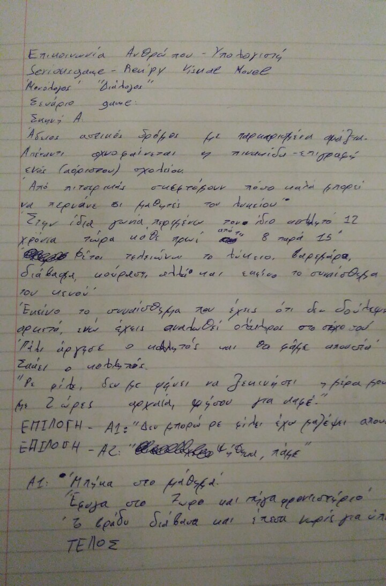
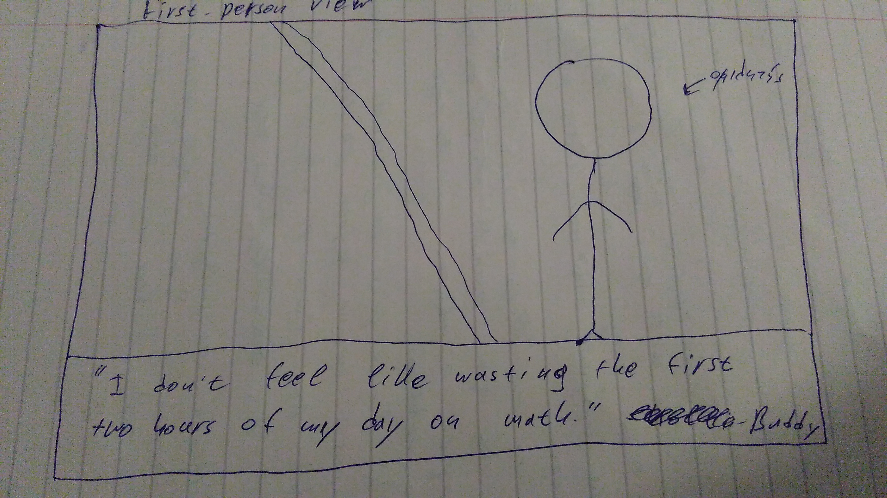

#Τίτλος Εργασίας: Εκπαιδευτικό βιντεοπαιχνίδι

*Μεγαλιός Ιωάννης Αλκιβιάδης

*ΑΜ Π2015050

##Παραδοτέο 1

Εκπαιδευτικό βιντεοπαιχνίδι

##Παραδοτέο 2

### Προδιαγραφές
  
  **Hλικία:** Το παιχνίδι απευθύνεται σε παιδιά της Γ' Λυκείου και άνω.

  **Φύλο Μαθητών:** Απευθύνεται και στα δύο φύλα.

  **Μάθημα:**  [Κοινωνιολογία Γ' Λυκείου](http://ebooks.edu.gr/modules/ebook/show.php/DSGL-C109/67/540,1958/)
  * Κεφάλαιο 9ο - ΑΠΟΚΛΙΝΟΥΣΑ ΣΥΜΠΕΡΙΦΟΡΑ: ΠΑΡΑΒΑΤΙΚΟΤΗΤΑ ΚΑΙ ΕΓΚΛΗΜΑΤΙΚΟΤΗΤΑ

  
 ##
**Εργαλεία ανάπτυξης:** Ren'Py
 
 **Δανεισμός κώδικα από:**   [The Question](https://www.renpy.org/doc/html/thequestion.html)
 
 
 ##

### Σενάριο
 

### Περιγραφή

Ο παίκτης καλείται να αποφασίσει τι θα έκανε στη θέση του πρωταγωνιστή του game, επιλέγοντας από δύο (2) προτάσεις του σεναριογράφου, που εκπροσωπούν  ηθικά διλήμματα της καθημερινότητας ενός μαθητή Γ' Λυκείου στην Ελλάδα:
Από το πιο απλό (κοπάνα) μέχρι το πιο ακραίο (έγκλημα). Κάθε επιλογή επηρεάζει το τέλος της ιστορίας, με αποτέλεσμα το παιχνίδι να ερεθίζει τις σκέψεις του παίκτη, βγάζοντας ένα αναπάντεχο, δυστυχώς όχι αυτονόητο συμπέρασμα.

##

### Preview

Αρχικό Σχέδιο

##Παραδοτέο 3

...

##Παραδοτέο 4

...

##Tελική Αναφορά

...
