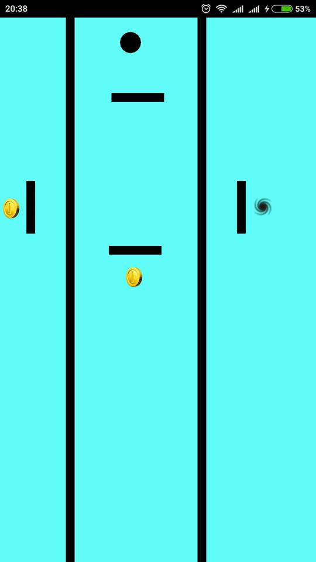
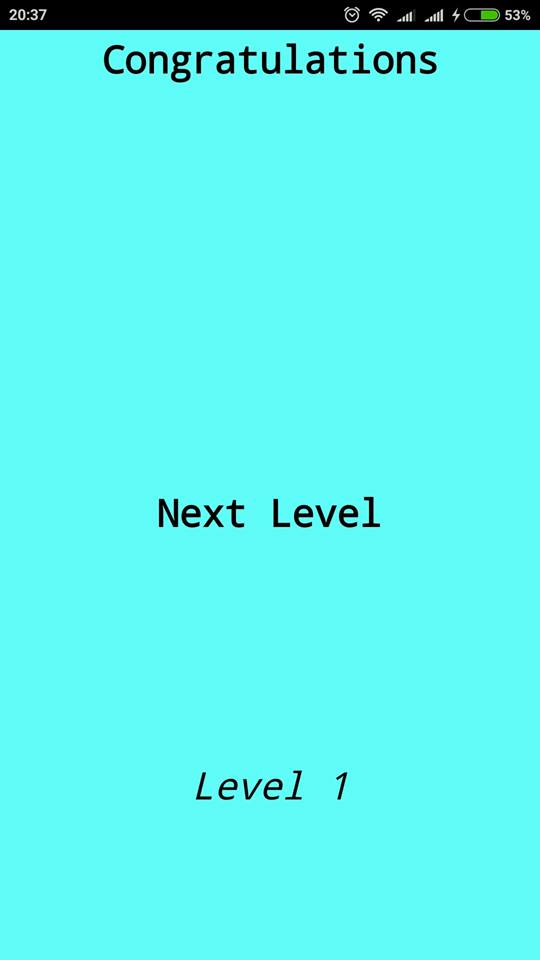
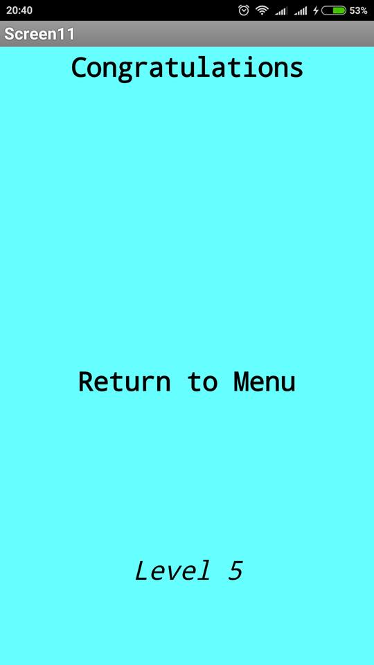

#App Inventor Apps Project
Δημοσθένης Παγκάκης
ΑΜ Π2015053

##Παραδοτέο 0
https://github.com/DimosPagakis/pibookgr/tree/gh-pages/_quotes

https://github.com/DimosPagakis/pibookgr/tree/gh-pages/_remix (Δεν κατάφερα να κάνω καινούριο pull request οπότε,αν κατάλαβα σωστά,
έκανα τα 2 pull request merge.Εδώ φαίνεται ξεκάθαρα πότε πραγματοποίησα τις αλλαγές.Δίνω link για να μην υπ΄άρξει παρεξήγηση αργότερα.
https://github.com/pibook/pibookgr/pull/1/commits)
...

##Παραδοτέο 1
Δημιουργία παιχνιδιού τύπου Ball tilt.Πολλαπλά επίπεδα με αύξων βαθμό δυσκολίας και χρήση του orientation change.
...

##Παραδοτέο 2
##Προδιαγραφές
* Άνθρωπος
* Σκοπός
* Διεργασία Χρήσης
* Λόγοι επιτυχίας ή αποτυχίας

## Εγκατάσταση εργαλείων ανάπτυξης 
* Εργαλείο ανάπτυξης : MIT App Inventor 2

Πρωτότυπο 1

Πρωτότυπο 2

Οθόνη μετά την ολοκλήρωση του επιπέδου

##Σενάριο
* Είσαι μαθητής και μόλις χτύπησε το κουδούνι για διάλειμμα; Μήπως είσαι στη δουλεία και αποφασίζεις να σταματήσεις για λίγο τη σκληρή δουλειά;
* Μήπως απλά θες να παίξεις ένα παιχνίδι να περάσει ευχάριστα η ώρα σου;
* Τότε το Ball in the Hole είναι το κατάλληλο παιχνίδι για σένα. Είναι απλό. Απλά βάλε τη μπάλα στην τρύπα.
* Πρόσεχε όμως,πρέπει να είσαι γρήγορος και προσεκτικός. Τι λες; Μπορείς να τα καταφέρεις;

##Ball in the Hole
Πρόκειται για ένα παιχνίδι το οποίο δουλέυει σύμφωνα με το orientation sensor που έχουν οι κινητοί υπολογιστές τύπου smartphone.
Γέρνεις το κινητό και η μπάλα παίρνει την αντίστοιχη κατεύθυνση.Όσο περισσότερο γέρνει το κινητό τόσο πιο γρήγορα κινήται και η μπάλα.
Σε κάθε level πρέπει να πάρει το χρυσό νόμισμα έτσι ώστε να φύγουν 1 ή περισσότερα μπλοκ που εμποδίζουν την μπάλα απο το να μπει στην τρύπα.Εάν η μπάλα συγκρουστεί με κάποιο από τα μπλοκς τότε αυτή αναπηδάει,ανάλογα με την ταχύτητα που είχε πριν χτυπήσει το μπλοκ.Το παιχνίδι είναι χωρισμένο σε 3 επίπεδα δυσκολιάς:Easy,Medium,Hard.Αρχικά το μόνο που έχεις να κάνεις είναι απλά να ολοκληρώσεις το επίπεδο.Στη συνέχεια σε περιορίζει ο χρόνος και ακόμα πιο μετά,επιπλέον,δεν πρέπει να έρθεις σε επαφή με κανένα απο τα μπλοκς.Έχεις την δυνατότητα να σταματήσεις ή να ξαναξεκινήσεις την μουσική του παιχνιδιού.

##Προβλήματα
* Το MIT app inventor 2 δεν υποστηρίζει responsive design μέσω του element "canvas".Το app μου μπορεί να υλοποιηθεί μόνο με image sprites πάνω σε canvas.Άρα το app θα εμφανίζεται "ομορφα" μόνο στη δικιά μου συσκευή.
* Το Design είναι απλά ένα πρωτότυπο.Χρώματα,πιθανές σκιές κτλ θα αλλάξουν στην συνέχεια ώστε να γίνει το app πιο ελκυστικό στο μάτι.
* Υπάρχει bug όπου αν επιμένεις αρκετά με την μπάλα να χτυπάει τα blocks κάποια στιγμή η μπάλα απλά θα τα διαπεράσει.Δουλεύω στο να βρω την αιτία του προβληματός και τη λύση του.

ΥΓ:Το YouTube video από το οποίο είδα πώς χρησιμοποιείται το orientation sensor για ένα ball tilt game είναι το παρακάτω.
https://www.youtube.com/watch?v=1YD5n-DDrts

…

##Παραδοτέο 3

...

##Παραδοτέο 4

...

##Tελική Αναφορά

...
