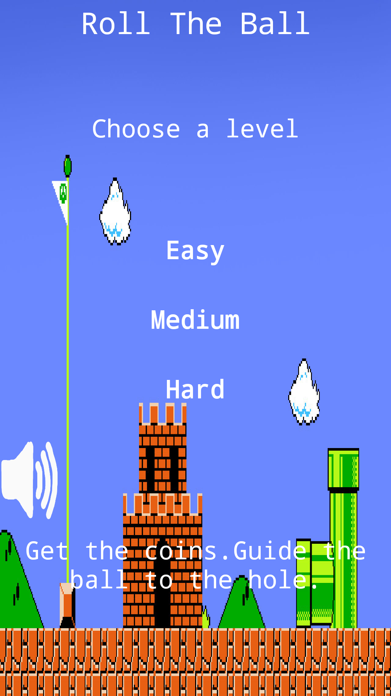
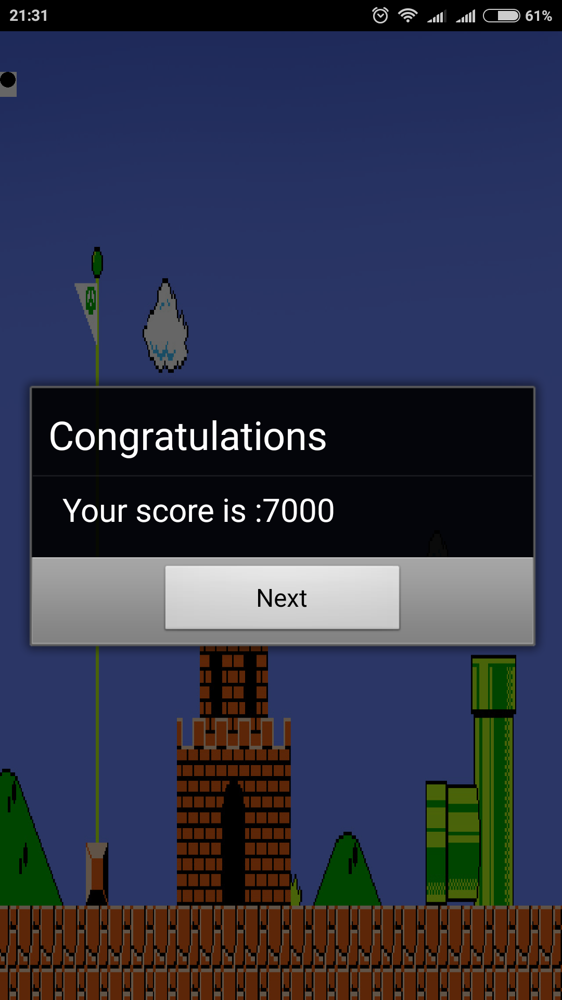
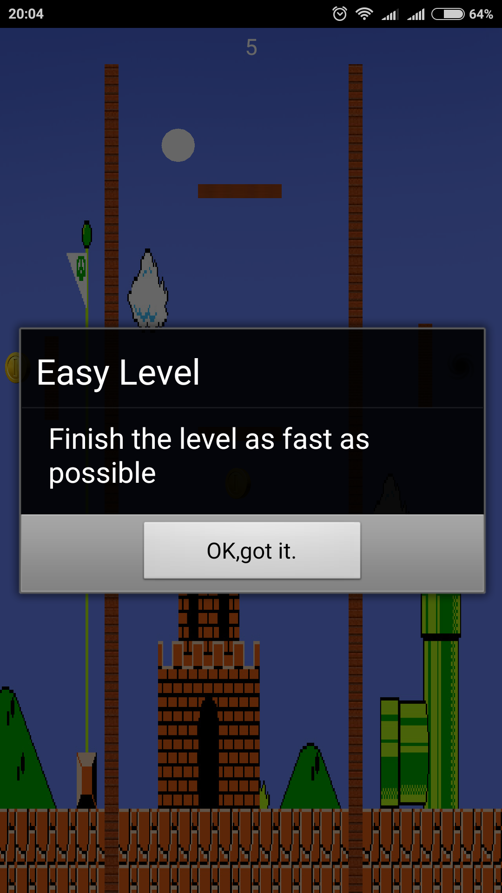
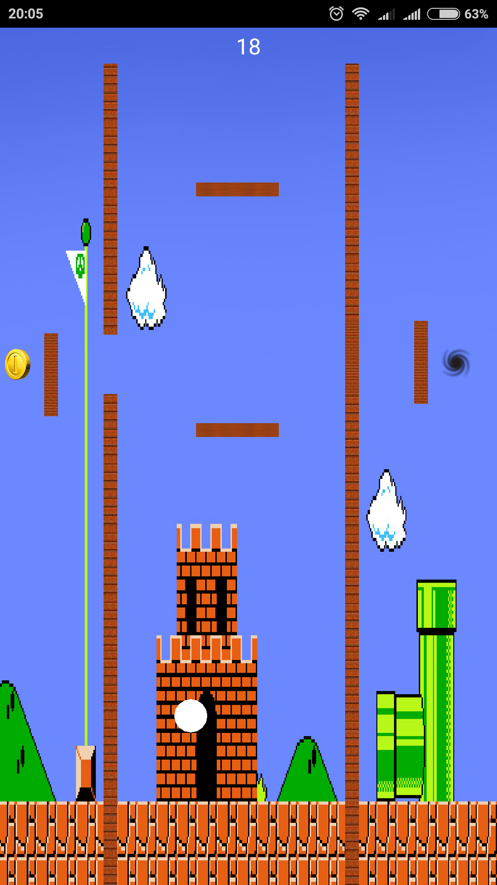
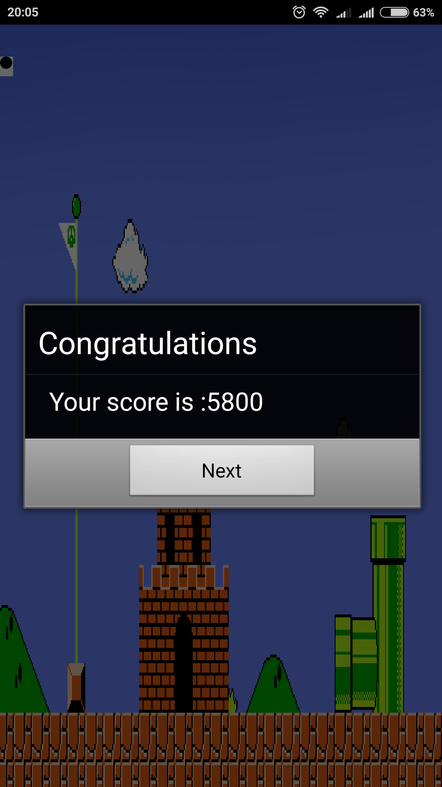
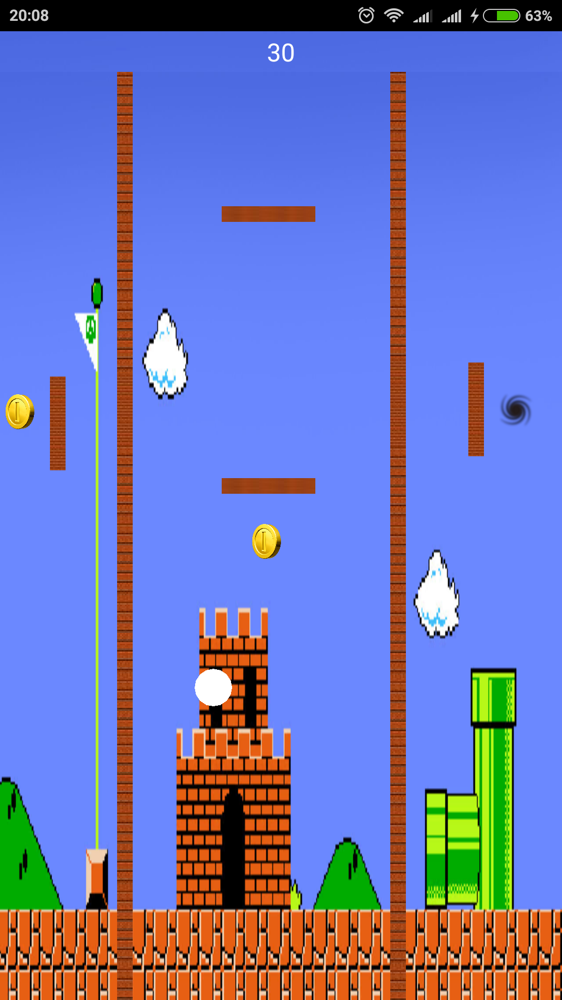
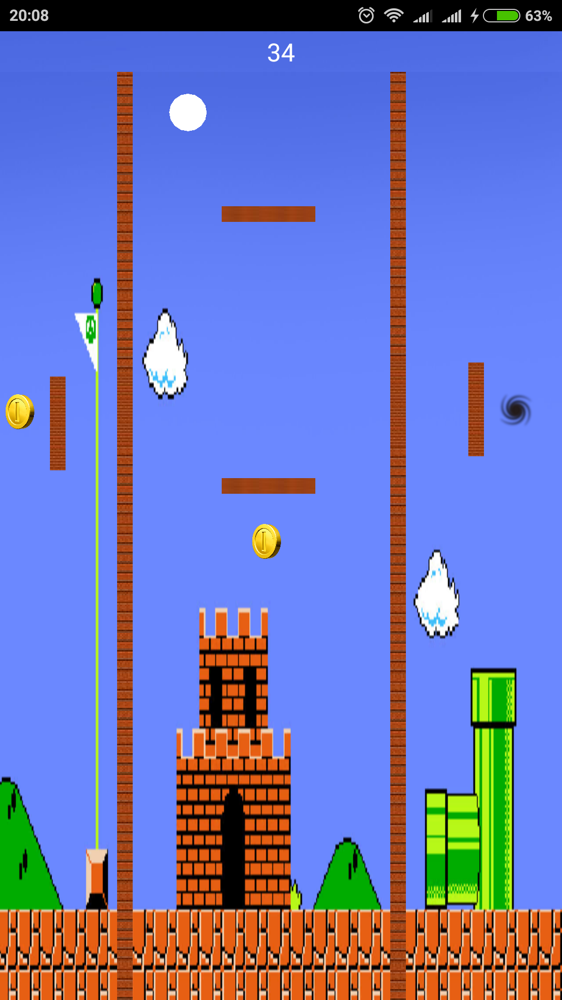

#App Inventor Apps Project
Δημοσθένης Παγκάκης
ΑΜ Π2015053

##Παραδοτέο 0
https://github.com/DimosPagakis/pibookgr/tree/gh-pages/_quotes

https://github.com/DimosPagakis/pibookgr/tree/gh-pages/_remix (Δεν κατάφερα να κάνω καινούριο pull request οπότε,αν κατάλαβα σωστά,
έκανα τα 2 pull request merge.Εδώ φαίνεται ξεκάθαρα πότε πραγματοποίησα τις αλλαγές.Δίνω link για να μην υπ΄άρξει παρεξήγηση αργότερα.
https://github.com/pibook/pibookgr/pull/1/commits)

https://github.com/DimosPagakis/pibookgr/blob/gh-pages/_case-study/Virtual-Assistants.md
Στο παραπάνω link είναι το case study για το 3ο bonus γύρω από τους virtual assistants και πώς αυτοί επηρέσαν την διεπαφή του ανθρώπου
με τους υπολογιστές.

...

##Παραδοτέο 1
Δημιουργία παιχνιδιού τύπου Ball tilt.Πολλαπλά επίπεδα με αύξων βαθμό δυσκολίας και χρήση του orientation change.
...

##Παραδοτέο 2
##Προδιαγραφές
* Άνθρωπος
* Σκοπός
* Διεργασία Χρήσης
* Λόγοι επιτυχίας ή αποτυχίας

## Εγκατάσταση εργαλείων ανάπτυξης 
* Εργαλείο ανάπτυξης : MIT App Inventor 2

Πρωτότυπο 1

Πρωτότυπο 2

Οθόνη μετά την ολοκλήρωση του επιπέδου

##Σενάριο
* Είσαι μαθητής και μόλις χτύπησε το κουδούνι για διάλειμμα; Μήπως είσαι στη δουλεία και αποφασίζεις να σταματήσεις για λίγο τη σκληρή δουλειά;
* Μήπως απλά θες να παίξεις ένα παιχνίδι να περάσει ευχάριστα η ώρα σου;
* Τότε το Ball in the Hole είναι το κατάλληλο παιχνίδι για σένα. Είναι απλό. Απλά βάλε τη μπάλα στην τρύπα.
* Πρόσεχε όμως,πρέπει να είσαι γρήγορος και προσεκτικός. Τι λες; Μπορείς να τα καταφέρεις;

##Ball in the Hole
Πρόκειται για ένα παιχνίδι το οποίο δουλέυει σύμφωνα με το orientation sensor που έχουν οι κινητοί υπολογιστές τύπου smartphone.
Γέρνεις το κινητό και η μπάλα παίρνει την αντίστοιχη κατεύθυνση.Όσο περισσότερο γέρνει το κινητό τόσο πιο γρήγορα κινήται και η μπάλα.
Σε κάθε level πρέπει να πάρει το χρυσό νόμισμα έτσι ώστε να φύγουν 1 ή περισσότερα μπλοκ που εμποδίζουν την μπάλα απο το να μπει στην τρύπα.Εάν η μπάλα συγκρουστεί με κάποιο από τα μπλοκς τότε αυτή αναπηδάει,ανάλογα με την ταχύτητα που είχε πριν χτυπήσει το μπλοκ.Το παιχνίδι είναι χωρισμένο σε 3 επίπεδα δυσκολιάς:Easy,Medium,Hard.Αρχικά το μόνο που έχεις να κάνεις είναι απλά να ολοκληρώσεις το επίπεδο.Στη συνέχεια σε περιορίζει ο χρόνος και ακόμα πιο μετά,επιπλέον,δεν πρέπει να έρθεις σε επαφή με κανένα απο τα μπλοκς.Έχεις την δυνατότητα να σταματήσεις ή να ξαναξεκινήσεις την μουσική του παιχνιδιού.

##Προβλήματα
* Το MIT app inventor 2 δεν υποστηρίζει responsive design μέσω του element "canvas".Το app μου μπορεί να υλοποιηθεί μόνο με image sprites πάνω σε canvas.Άρα το app θα εμφανίζεται "ομορφα" μόνο στη δικιά μου συσκευή.
* Το Design είναι απλά ένα πρωτότυπο.Χρώματα,πιθανές σκιές κτλ θα αλλάξουν στην συνέχεια ώστε να γίνει το app πιο ελκυστικό στο μάτι.
* Υπάρχει bug όπου αν επιμένεις αρκετά με την μπάλα να χτυπάει τα blocks κάποια στιγμή η μπάλα απλά θα τα διαπεράσει.Δουλεύω στο να βρω την αιτία του προβληματός και τη λύση του.

ΥΓ:Το YouTube video από το οποίο είδα πώς χρησιμοποιείται το orientation sensor για ένα ball tilt game είναι το παρακάτω.
https://www.youtube.com/watch?v=1YD5n-DDrts

…

##Παραδοτέο 3
##Περιγραφή gameplay του παιχνιδιού
Το παιχνίδι είναι πολύ απλό.Έχουμε μια λευκή μπάλα,χρυσά κέρματα,εμπόδια τα οποία πρέπει να αποφύγεις για να μη χάνεις πόντους και μία τρύπα στην οποία πρέπει να οδηγήσεις την μπάλα.Η κίνηση της μπάλας γίνεται μέσω του orientation sensor που περιέχουν τα smarthpone.Γέρνεις το κινητό και η μπάλα κινείται.Όσο περισσότερο γέρνει το κινητό τόσο πιο γρήγορη γίνεται και η κίνηση της μπάλας.Αν η μπάλα χτυπίσει πάνω σε κάποιο από τα εμπόδια τότε αυτή αναπηδάει.Πρέπει να συλλέξεις όλα τα κέρματα του επιπέδου ώστε να καταφέρεις να ανοίξεις την πύλη που τελικά οδηγεί στην τρύπα.Με την πάροδο του χρόνου και τη σύγκρουση της μπάλας πάνω στα εμπόδια χάνεις πόντους.Τελικός σκοπός είναι να είσαι γρήγορος και ακριβής ώστε να πάρεις το μεγαλύτερο δυνατό σκορ.

#Επιλογή εργαλείων

Τα εργραλεία που χρησιμοποιήθηκαν ήταν τα εξής:

**MIT APP INVENTOR 2**:Αποτελεί το εργαλείο με το οποίο έγινε η τοποθέτηση των εικόνων πάνω στην οθόνη αλλά και όλος ο προγραμματισμός του παιχνιδιού.

**PHOTOSHOP**:Χρησιμοποιήθηκε για την δημιουργία όλων των εικονιδίων που εμφανίζονται κατά την διάρκεια του παιχνιδιού.Η μόνη εξαίρεση είναι η μπάλα,η οποία είναι διαθέσιμη από το app inventor.

##Διαδικασία ανάπτυξης

Η βασική ιδέα ήρθε στα πλαίσια του μαθήματος "Επικοινωνία ανθρώπου υπολογιστή" και μέσα από τις διαλέξεις και τις παρουσιάσεις σιγά σιγά οδηγιόμουν και σε ένα πιο ολοκληρωμένο αποτέλεσμα.Η αρχική ιδέα ήρθε από τα επιτραπέζια ball tilt παιχνίδια τα οποία λάτρευα να παίζω ως παιδί.Πέρασα λοιπόν αυτή την ιδέα στο smartphone μέσω του orientation sensor.

Το gameplay βασίστηκε σε έναν πού απλό κώδικα τον οποίο βρήκα μετά από αναζήτηση στο youtube.Το link για το video βρίκεται στο προηγούμενο παραδοτέο.

##Προτάσεις για μελλοντικές βελτιώσεις
Αυτή τη στιγμή το παιχνίδι είναι singleplayer και μετά τον τερματισμό του επιπέδου εμφανίζεται το score του χρήστη.Το score όμως δεν αποθηκεύεται πουθενά ούτε ζητείται το username του παίχτη.Συνεπώ επόμενη βελτίωση είναι η αποθήκευση ονόματος και score σε ένα database.Επίσης θα προσπαθήσω να κάνω το παιχνίδι multiplayer.Να παίζει δηλαδή ένας παίχτης τη φορά.Να τερματίζει όλα τα επίπεδα και να κρατιέται στο τέλος το όνομά του και το συνολικό score και στη συνέχεια να γίνεται το ίδιο για τον 2ο παίχτη.Στη συνέχεια να γίνεται σύγκριση των 2 score και να εμφανίζεται σε μύνημα η ανακοίνωση του ονόματος του νικητή.

##MIT app inventor
Μετά από συνενόηση με την κυρία Γαρνέλη έκανα publish το app μου στη Gallery που υποστηρίζει το MIT.Το link είναι το παρακάτω.

ai2.appinventor.mit.edu/?galleryId=4814170839842816

Πιθανότατα δεν θα λειτουργεί το apk.Στο κινητό μου δεν λειτουργεί και αυτό γιατί έκανα πολλές φορές πολλές αλλαγές στο project στο app inventor.Για αυτό το λόγο θα κάνω εξ αρχής το ίδιο app σε καινούριο project και θα ανεβάσω στην τελική αναφορά το link για το καινούριο project.Το παραδίδω και τώρα για να δείτε ότι δεν αλλάζω κάτι στον κώδικα μου.Μόνο τις παραπάνω μελλοντικές βελτιώσεις.

...

##Tελική Αναφορά

##ΙΟΝΙΟ ΠΑΝΕΠΙΣΤΗΜΙΟ

##ΠΜΣ ΤΜΗΜΑΤΟΣ ΠΛΗΡΟΦΟΡΙΚΗΣ

##ΜΑΘΗΜΑ: Σχεδίαση της Διάδρασης Ανθρώπου-Υπολογιστή

Φοιτητής:Παγκάκης Δημοσθένης Π2015053

##ΣΥΝΟΨΗ

Τα επιτραπέζια παιχνίδια ball tilt υπήρχαν πάντα επίκαιρα και διασκεδαστικά.Τώρα που περνάμε στην ψηφιακή εποχή θα ήταν κρίμα να χάσουμε μία τέτοια παραδοσιακή ασχολία διασκέδασης.Για αυτό το λόγο,με τη βοήθεια του ειδικού λογισμικού MIT App Inventor,σχεδίασα και κατασκεύασα ένα app στο οποίο ο χρήστης μπορεί να παίξει με τον ίδιο τρόπο που θα έπαιζε αν υπήρχε μια μεταλλική μικρή μπάλα ανάμεσα σε εμπόδια στα χέρια του.Το link για το παιχνίδι: ai2.appinventor.mit.edu/?galleryId=5564946665177088

##ΕΙΣΑΓΩΓΗ

##ΠΕΡΙΓΡΑΦΗ GAMEPLAY

Το όλο gameplay του παιχνιδιού βασίζεται στο orientation sensor που έχουν πλέον όλες οι έξυπνες κινητές συσκευές.Η πίστα ξεκινάει με την μπάλα να βρίσκεται στο κέντρο της κορυφής.Γέρνοντας το κινητό ο χρήστης μπορεί να μετακινήσει την  μπάλα,αποφεύγοντας τα εμπόδια,ώστε να την οδηγήσει στα χρυσά νομίσματα.Κάθε φορά που συλλέγεται ένα χρυσό νόμισμα υπάρχει και μια ανταμοιβή.Σκοπός είναι να μαζευτούν όλα τα χρυσά νομίσματα και να οδηγηθεί η μπάλα στην τρύπα.Ανάλογα με την αποτελεσματικότητα του παίχτη κάθε φορά υπολογίζεται και το σκορ.
Το σκορ υπολογίζεται διαφορετικά για καθένα από τα 3 επίπεδα δυσκολίας.Στο πρώτο επίπεδο δυσκολίας το μόνο που έχει να κάνει ο χρήστης είναι να βάλει την μπάλα στην τρύπα όσο πιο γρήγορα μπορεί,καθώς κάθε δευτερόλεπτο που περνάει χάνει και από μερικούς πόντους.Η εκκινητήρια τιμή των πόντων είναι 10.000.Στο δεύτερο επίπεδο δυσκολίας υπάρχει επιπλέον αφαίρεση πόντων για κάθε φορά που ο χρήστης οδηγεί την μπάλα σε κάποιο από τα εμπόδια.Έτσι ο χρήστης πρέπει να είναι πιο προσεκτικός από ότι πριν.Τέλος,στο τελευταίο επίπεδο,ο χρήστης πρέπει να είναι πιο προσεκτικός από οποιαδήποτε άλλη φορά,αφού αν ακουμπήσει οποιοδήποτε εμπόδιο η μπάλα ξαναγυρνάει στην αρχική της θέση.

##ΑΦΗΓΗΣΗ

Με την έναρξη της εφαρμογής ξεκινάει να παίζει μουσική,την οποία ο χρήστης μπορεί και να κλείσει μέσω του ειδικού κουμπιού που παρέχεται.Στη συνέχεια μπορεί να ξεκινήσει με το εύκολο επίπεδο και με την ολοκλήρωση του να συνεχίζει(Στην πραγματικότητα δεν γίνεται γιατί το app crushαρει!) ή μπορεί να ξεκινήσει από οποιδήποτε άλλο επίπεδο θέλει.Μετά τον τερματισμό του τελευταίου επιπέδου ο χρήστης θα μπορούσε να εισάγει το όνομα του ώστε να αποθηκευτεί μαζί το σκορ που σημείωσε.(Δεν γίνεται στην πραγματικότητα γιατί το app crushάρει).

##ΣΕΝΑΡΙΟ ΧΡΗΣΗΣ

Μικροί και μεγάλοι,είτε βρίσκονται στο σχολείο ή στη δουλειά και έχουν διάλειμμα μπορούν να ανοίξουν την εφαρμογή και να περάσουν διασκεδαστικά το χρόνο τους ενώ ταυτόχρονα ξεφεύγει το μυαλό από την ρουτίνα που περνούσαν μέχρι εκείνη τη στιγμή.

##ΕΠΙΛΟΓΗ ΕΡΓΑΛΕΙΩΝ

MIT App Inventor:Αποτελεί το κύριο εργαλείο ανάπτυξης.Πρόκειται για code blocking το οποίο παρέχεται δωρεάν από το ομόνυμο πανεπιστήμιο.
Photoshop:Για το σχεδιασμό κάποιον εικόνων ή για την μετατροπή τους έτσι ώστε να είναι πιο γλυκές στο μάτι χρησιμοποιήθηκε το λογισμικό της Adobe,Photoshop.

##ΔΙΑΔΙΚΑΣΙΑ ΑΝΑΠΤΥΞΗΣ

Η αρχική ιδέα και η ανάπτυξη ξεκίνησαν κατά τη διάρκει του εξαμήνου.Μετά από την παρουσία μου στις διαλέξεις αλλά και κάποιες ερωτήσεις στην ομάδα των καθηγητών έφτασα στο τέλος της ανάπτθξης της εφαρμογής.Η ανάπτυξη ήταν σχετικά εύκολη,λόγω της απλότητας της εφαρμογής.Το κύριο πρόβλημα ήρθε στο τέλος της ανάπτυξης και κατά την εξέταση του app.Για λόγους που δεν έχουν γίνει ακόμα κατανοητοί το app crushάρει μετά την ολοκλήρωση κάθε επιπέδου.Έχω δοκιμάσει να κάνω πάρα πολλές αλλαγές αλλά χωρίς καμία τύχη.Μετά από έναν διάλογο με την κυρία Γαρνέλη,καταλήξαμε ότι κατά πάσα πιθανότητα το πρόβλημα έχει να κάνει με την μετατροπή του project σε apk και όχι από την δικιά μου πλευρά.Καταλήξαμε εδώ γιατί στην αρχή της ανάπτυξης το app λειτουργούσε κανονικά.Αλλά μετά από κάποιες αλλαγές έπαψε.

##ΕΝΔΕΙΚΤΙΚΕΣ ΟΘΟΝΕΣ

...
