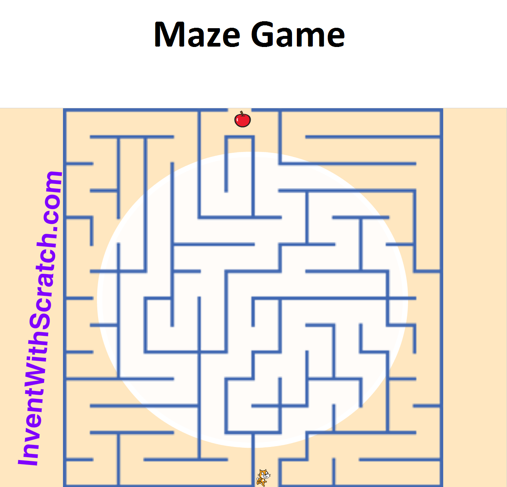
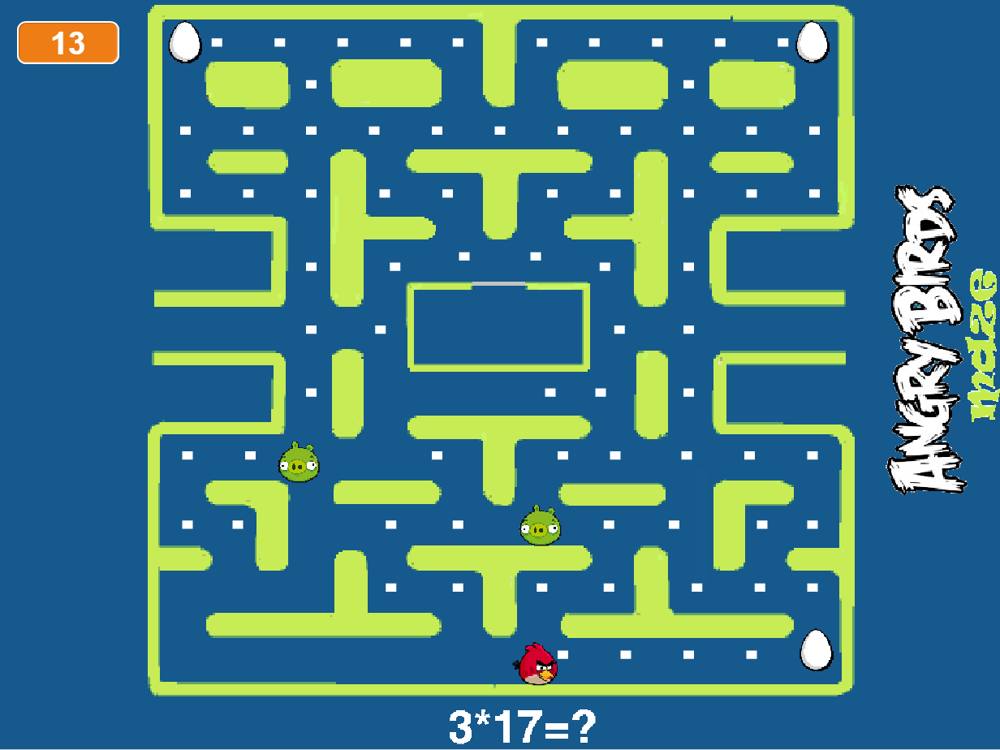
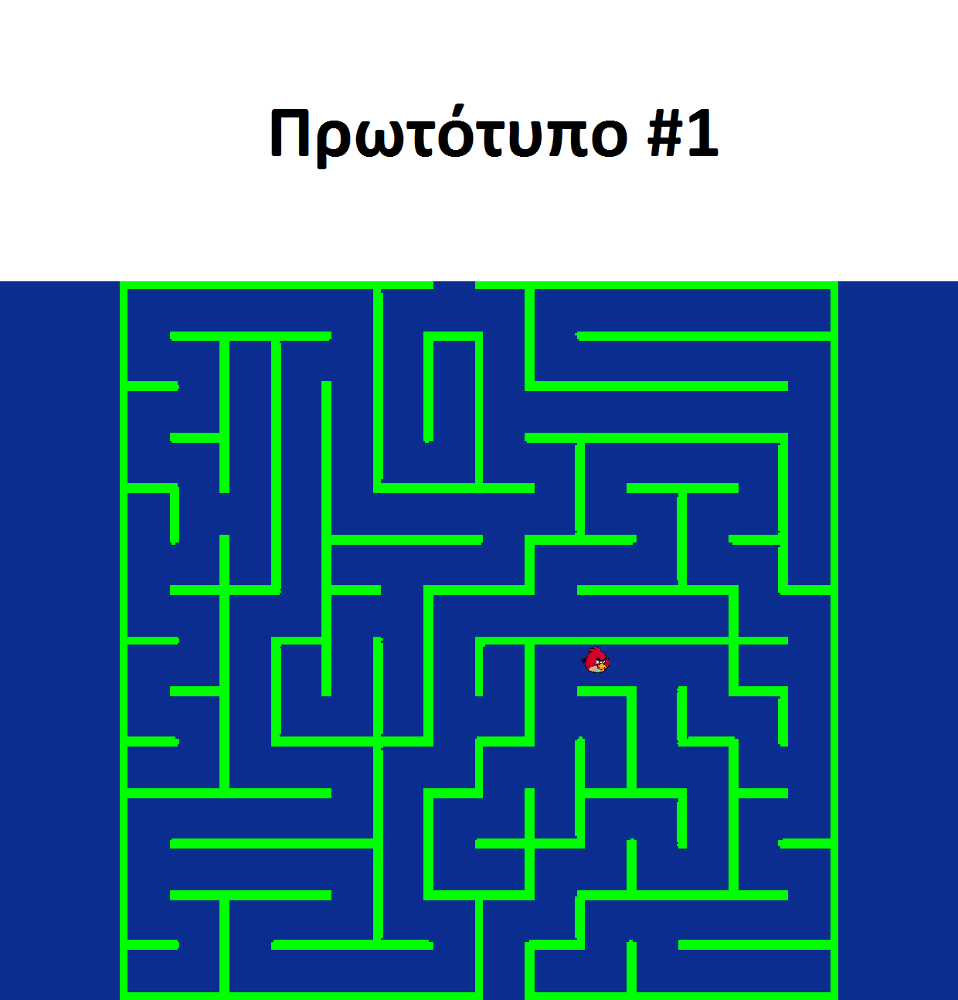
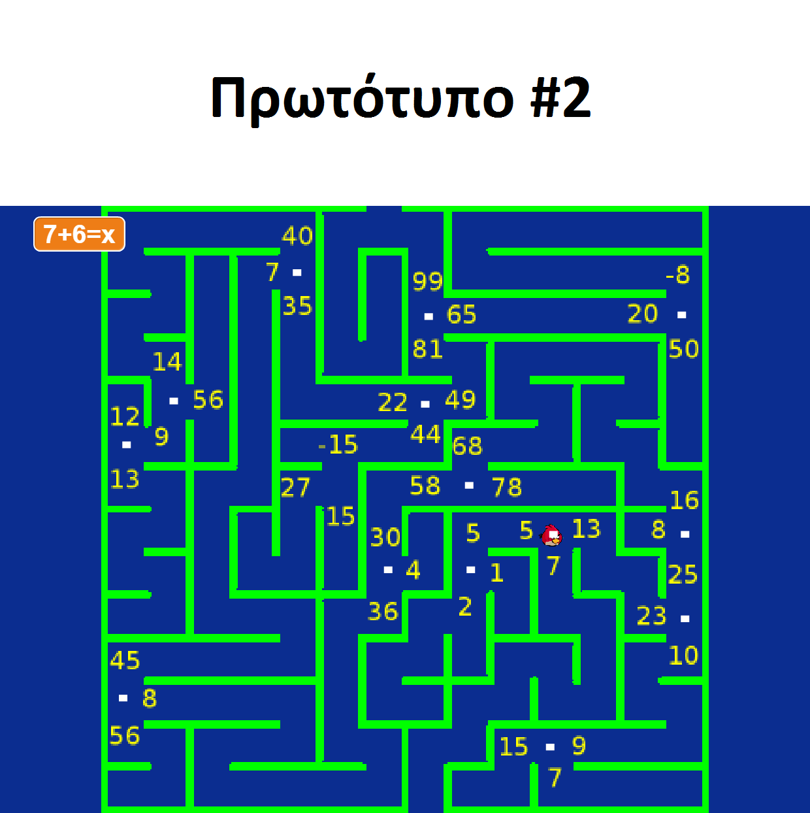
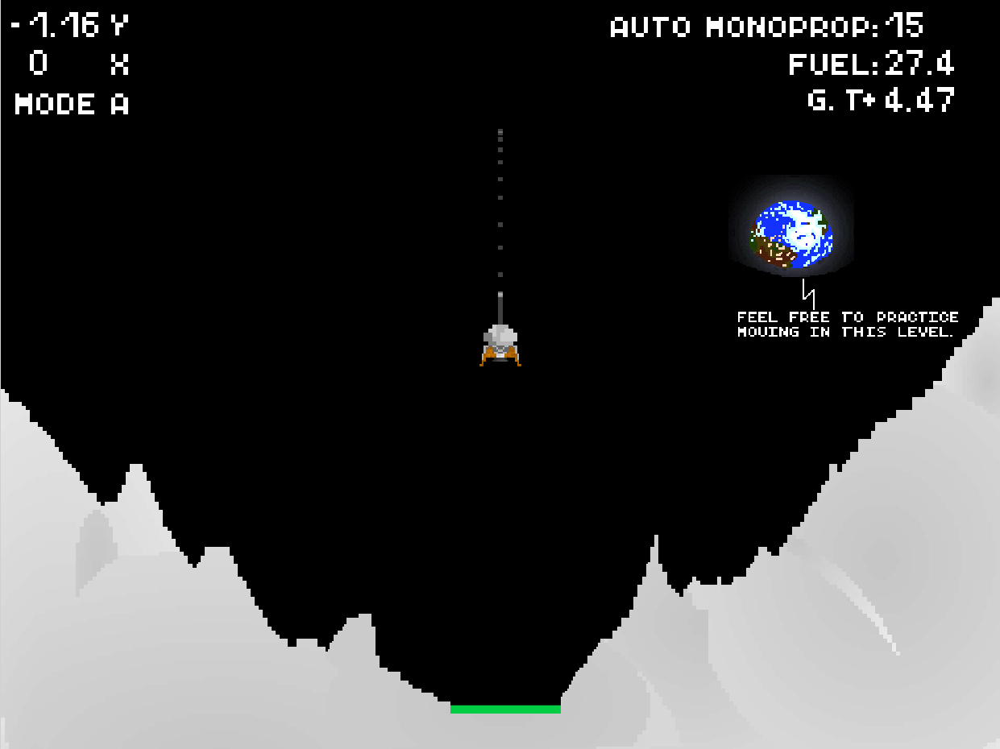
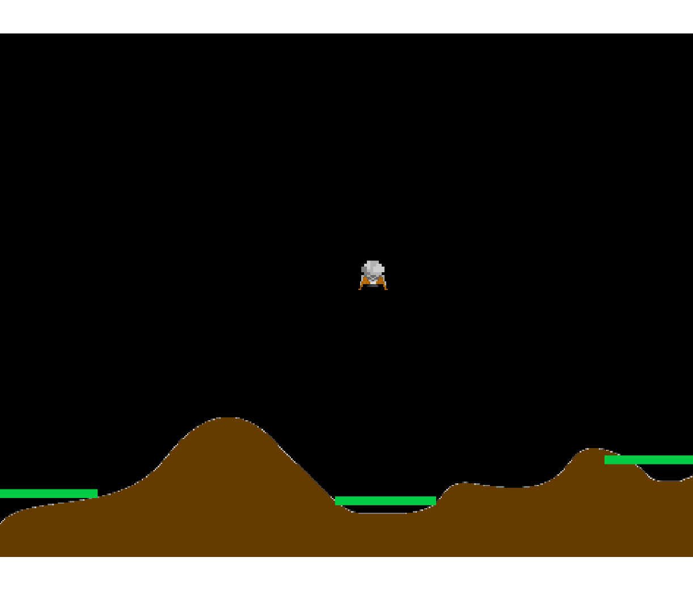
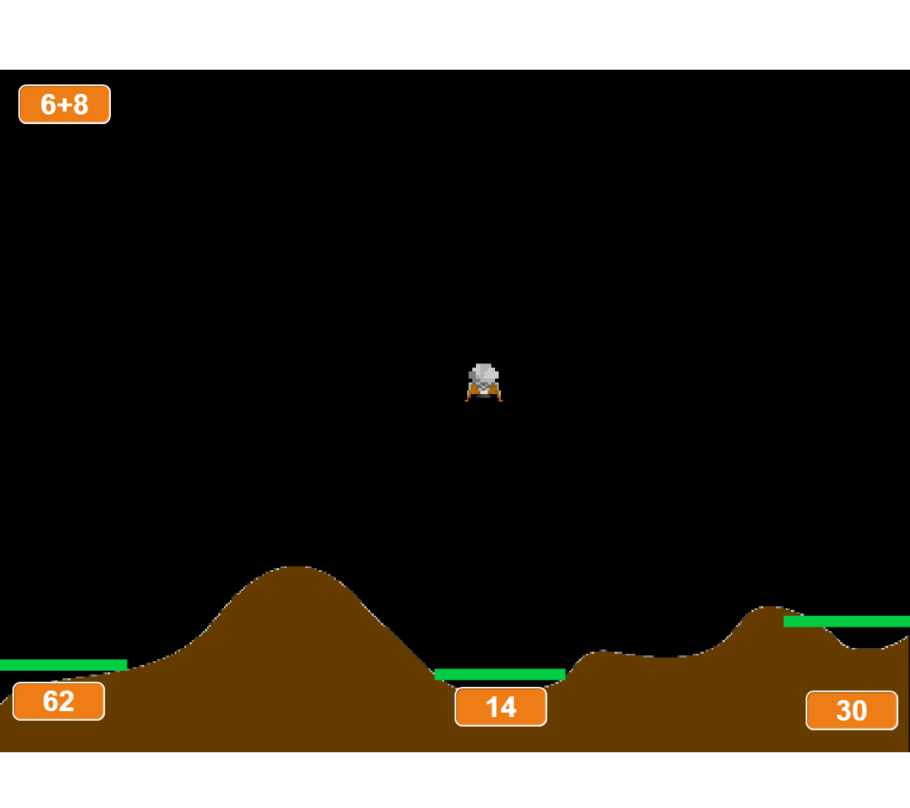
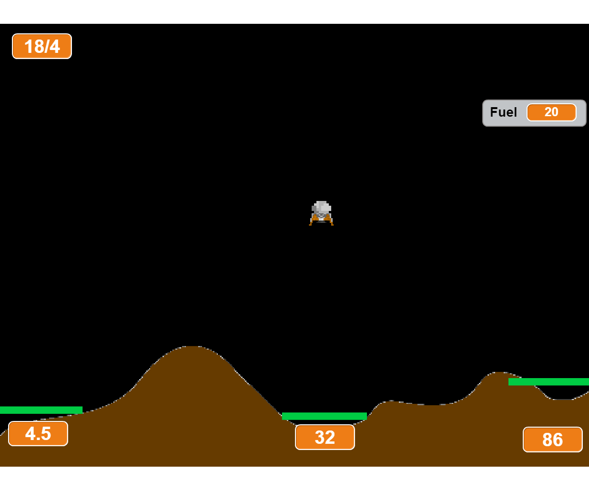

#Τίτλος Εργασίας : ΕΚΠΑΙΔΕΥΤΙΚΟ ΒΙΝΤΕΟΠΑΙΧΝΙΔΙ

Ονοματεπώνυμο: Αστέριος Παπαμιχαήλ
Α.Μ.: Π2015059

##Παραδοτέο 0
Β:1)https://github.com/AsteriosP/pibookgr/tree/gh-pages/images
μετά από ανανέωση 
Β)
https://github.com/AsteriosP/pibookgr/tree/add-photos-railway/images
https://github.com/AsteriosP/pibookgr/tree/add-photos-minecraft/images
https://github.com/AsteriosP/pibookgr/tree/add-photos-interface/images
https://github.com/AsteriosP/pibookgr/tree/add-photos-computer/images
https://github.com/AsteriosP/pibookgr/tree/add-photos-blueprint/images
https://github.com/AsteriosP/pibookgr/tree/add-interactive/images

##Παραδοτέο 1

Εκπαιδευτικό βιντεοπαιχνίδι με το εργαλείο Scratch.

##Παραδοτέο 2

###Προδιαγραφές
* Ηλικία:    Παιδιά Ά Γυμνασίου
* Ικανότητα: Χειρισμός με τα βελάκια
* Γνώσεις:   Τις βασικές πράξεις του δημοτικού, δυνάμεις, δεκαδικοί αριθμοί και επίλησή εξισόσεων 1ου βαθμού
* Φύλο:      Και τα δύο

###Εγκατάσταση εργαλείων ανάπτυξης και τρέξιμο/αλλαγές σε υπάρχοντα παραδείγματα
* Εργαλείο ανάπτυξης Scratch
* Δανεισμός στοιχείων (ιδέες και κώδικα) από:

https://scratch.mit.edu/projects/11710850/ 

και: 

https://scratch.mit.edu/projects/38155132/

###Αρχικός σχεδιασμός εφαρμογής

###Σενάριο
* Το πουλί έχει 5 αυγά. Μία μέρα, ένα γουρούνι του κλέβει τα αυγά. 
* Το πουλί αρχίζει να ψάχνει παντού και βρίσκει ένα σημείωμα: “Έχω κρύψει τα αυγά σου. Θα βρεις 1 αυγό στο τέλος κάθε λαβύρινθου του νησιού.”
* Το πουλί, πηγαίνοντας προς τους λαβύρινθους, συναντά ένα χωρικό, ο οποίος του δίνει ένα φακό, για να βρίσκει το δρόμο του στα σκοτεινά μονοπάτια των λαβυρίνθων.
* Ακόμα, του λέει πως έχει αφήσει εξισώσεις σε ταμπέλες και θα πρέπει να επιλέξει τη διαδρομή που έχει τη σωστή απάντηση στις εξισώσεις αυτές.
* Το πουλί, βιαστικά, κατευθύνεται προς τον πρώτο λαβύρινθο...

Και το Demo για την ώρα του παιχνιδιού εδώ:https://scratch.mit.edu/projects/127900790/
##Παραδοτέο 3

Με σχόλια που δέχτηκα και με συνεννόηση με τον  κ. Χωριανόπουλο αποφάσισα να αλλάξω παιχνίδι.
###Προδιαγραφές
*Ηλικία: Παιδιά Ά Γυμνασίου
*Ικανότητα: Χειρισμός με τα βελάκια
*Γνώσεις: Τις βασικές πράξεις του δημοτικού, δυνάμεις και δεκαδικοί αριθμοί
*Φύλο: Και τα δύο

###Εγκατάσταση εργαλείων ανάπτυξης και τρέξιμο/αλλαγές σε υπάρχοντα παραδείγματα
* Εργαλείο ανάπτυξης Scratch
* Δανεισμός στοιχείων (ιδέες και κώδικα) από:

https://scratch.mit.edu/projects/72798680/

###Αρχικός σχεδιασμός εφαρμογής

###Σενάριο:
Να βοηθήσει τον καθηγητή να κάνει επανάληψη τους μαθητές στις πράξεις του δημοτικού και να τους εισάγει στις δυνάμεις και  στους δεκαδικούς αριθμούς.

###Ιδέες:
Το παινίδι να γίνει side-scrolling  

Και το Demo για την ώρα του παιχνιδιού εδώ:https://scratch.mit.edu/projects/134652057/
##Παραδοτέο 4
jetmath builder(demo): https://scratch.mit.edu/projects/140303796/

##Τελική αναφορά

