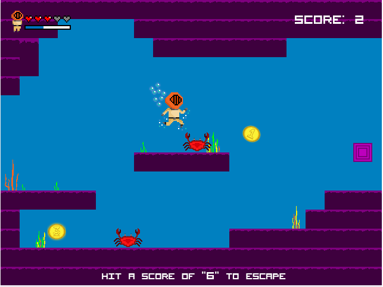
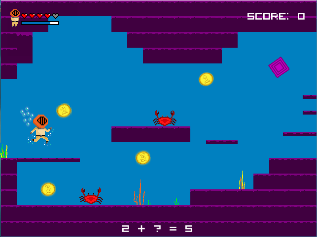
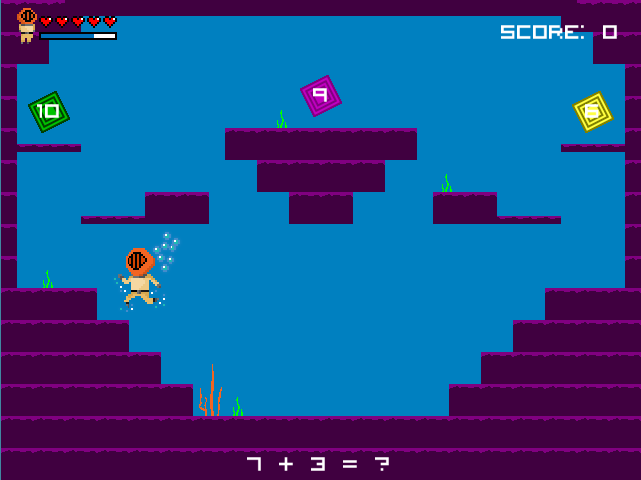
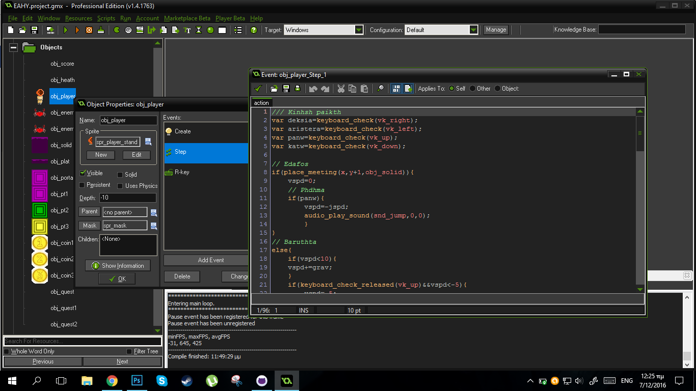

#Τίτλος Εργασίας: Εκπαιδευτικό βιντεο-παιχνίδι

Γιώργος Καλαντζής ΑΜ: Π2015061

##Παραδοτέο 1

Εκπαιδευτικό βιντεο-παιχνίδι με GameMaker Studio

##Παραδοτέο 2

###Προδιαγραφές
- **Ηλικία:** Μαθητές Δημοτικού
- **Θεματική Ενότητα:** Μαθηματικά και Χημεία
- **Γνώσεις:**
- **Φύλο:** Κατάλληλο και για τα δύο

Επιρροή από κλασικά side-scroller platformer games

Για την συγγραφή του κώδικα συμβουλεύτηκα το [GameMaker Tutorial](http://www.yoyogames.com/learn)

###Εγκατάσταση εργαλείων ανάπτυξης
- **Εργαλείο ανάπτυξης:** GameMaker Studio 1.4
- **Εικαστικός τομέας:** Adobe Photoshop CC, Adobe Illustrator CC
- **Animation:** Aseprite, GraphicsGale
- **Ηχητικός τομέας:** Bfxr, Macrotune, Adobe Audition CC

### Αρχικός Σχεδιασμός

###Holy Diver

 Σκοπός του παιχνιδιού είναι να βοηθήσουμε τον δύτη μας, που είναι παγιδευμένος σε μια υποθαλάσσια σπηλιά, να
 φτάσει στο portal στο τέλος κάθε πίστας.
 Για να λειτουργήσει το portal πρέπει να μαζέψουμε τα διάφορα νομίσματα, που βρίσκονται διάσπαρτα σε κάθε πίστα 
 σύμφωνα με το score που αναγράφετε στην οθόνη με τη βοήθεια μαθηματικών πράξεων.
 Το portal θα μας μεταφέρει μόνο αν απαντήσουμε σωστά στα διαδοχικά score που εμφανίστηκαν στην πίστα.
 Κάθε νόμισμα αναγράφει το score που μας δίνει (πράξεις με μονοψήφιους αριθμούς).
 Σε κάθε πίστα παραμονεύουν επικύνδυνα θαλάσσια πλάσματα εμποδίζοντας τον δύτη στο ταξίδι μας.
 Παράλληλα ο δύτης μας χρειάζεται τακτική παροχή οξυγόνου μέσω oxygen packs (χημεία), που βρίσκονται στην πίστα,
 για να καταφέρει την αποστολή του.

##Παραδοτέο 3

###Holy Diver

### Σενάριο
 Το παιχνίδι είναι φανερά επιρρεασμένο από τα κλασικά side-scroller platformer games της χρυσής εποχής NES, SNES, Genesis, Dreamcast και Megadrive.
 Σκοπός του παιχνιδιού Holy Diver είναι να βοηθήσουμε τον δύτη μας, που είναι παγιδευμένος σε μια υποθαλάσσια σπηλιά, να
 φτάσει στο portal στο τέλος κάθε πίστας όπου θα τον οδηγήσει στην επόμενη.
 
### Gameplay
 Στην αρχή κάθε επιπέδου αναγράφετε μια μαθηματική πράξη όπου η λύση της είναι το κλειδί για την ενεργοποίηση του
 portal.
 Για τη λύση των πράξεων καλούμαστε να απαντήσουμε σωστά μέσω της επιλογής νομισμάτων, οπου αναγράφουν την αξία τους.
 Στα πλαίσια βελτίωσης του παιχνιδιού και της εκπαιδευτικής εμπειρίας προστέθηκαν νέα επίπεδα.
 

 Τα αποτελέσματα των μαθηματικών πράξεων εμφανίζονται σε διαφορέτικα portals.
 Ένα από αυτά οδηγεί στο επόμενο δωμάτιο ενώ τα υπόλοιπα είναι ανενεργά.
 Η λύση της πράξης που αναγράφετε στην αρχή του επιπέδου μας αποκαλύπτει το σωστό portal.
 
### Χειρισμός
 Ο χειρισμός του παιχνιδιού είναι απλός, λιτός και άμμεσος ώστε η ενασχόληση του από μαθητές, της ηλικίας που αναγράφετε στις προδιαγραφές,
 να είναι εύκολη και ευχάριστη. Η κίνηση του δύτη μέσα στο χώρο πραγματοποιείται με τα βελάκια του πληκτρολογίου.
 
### Demo
 Το demo του παιχνιδιού καθώς και ο πηγαίος κώδικας είναι διαθέσιμα όλα στη σελίδα μου στο [itch.io](https://itch.io/)
 μέσω του συγκεκριμένου ιδιωτικού link [εδώ](https://gfk-2010.itch.io/holy-diver?secret=5KG0lEEm3xWK6BTthpMXdIcStiI)
 

 Το παρόν screenshot αποτελεί δείγμα δουλειάς κώδικα στο προγραμματιστικό περιβάλλον του GameMaker.
 

##Tελική Αναφορά

#ΙΟΝΙΟ ΠΑΝΕΠΙΣΤΗΜΙΟ

#ΠΜΣ ΤΜΗΜΑΤΟΣ ΠΛΗΡΟΦΟΡΙΚΗΣ

#ΜΑΘΗΜΑ: Σχεδίαση της Διάδρασης Ανθρώπου-Υπολογιστή

####Επιβλέπων Καθηγητής:
  Κωνσταντίνος Χωριανόπουλος.
  
###Στοιχεία Φοιτητή:

####Ονοματεπώνυμο: Γιώργος Καλαντζής

####ΑΜ: Π2015061

Κέρκυρα, 2016

####Τίτλος Παιχνιδιού:
 ###[Holy Diver](https://gfk-2010.itch.io/holy-diver?secret=5KG0lEEm3xWK6BTthpMXdIcStiI)
