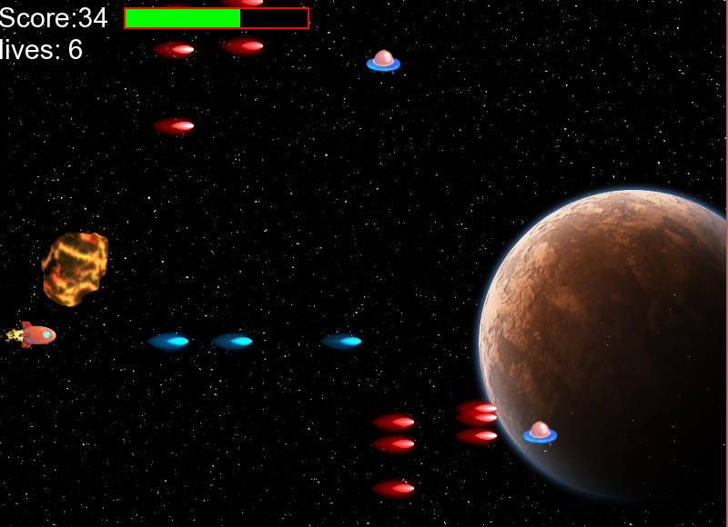

#Τίτλος Εργασίας: Εκπαιδευτικό βιντεο-παιχνίδι
Αλέξανδρος Τουλάκης ΑΜ Π2015067 - p15toul1@ionio.gr

##Παραδοτέο 0 
Bonus B
https://github.com/P15GitHubStudent/pibookgr/

##Παραδοτέο 1

Εκπαιδευτικό βιντεο-παιχνίδι με c++ και χρήση sfml 
##Παραδοτέο 2

##Προδιαγραφές

* Ηλικία: Μαθητές Τρίτης Δημοτικού
* Γνώσεις: Πρόσθεση, αφαίρεση, πολλαπλασιασμός, διαίρεση
* Θεματική ενότητητα: http://ebooks.edu.gr/modules/ebook/show.php/DSDIM-C102/703/4641,20989/
* Αφαίρεση στοιχείων:  από racing παιχνίδια
* Φύλο: Ανεξάρτητο

## Εγκατάσταση εργαλείων ανάπτυξης

* Προγραμματιστικό Περιβάλλον: Microsoft Visual Studio 2013
* Δανεισμός στοιχείων  (ιδέες):

##Space Race Multiplication

http://www.mathplayground.com/ASB_SpaceRaceMultiplication.html

##Πρωτότυπο

###Εικόνα1

###Εικόνα2

##Σενάριο

* Έτος 5018 οι εξωγηίνοι βρίσκονται σε  πόλεμο με τους ανθρώπους.
* Μετά από 2 χρόνια συνεχών μαχών και οι  2 πλευρές βρίσκουν τον  πόλεμο ανώφελο και συμφωνούν για υπογραφή συνθήκης ειρήνης.

* H συνθήκη υπογράφηκε στις  8 Νοεμβρίου 5020, προς τιμήν της μέρας αυτής αποφασίστηκε να διεξάγονται αγώνες ταχύτητας στο διάστημα κάθε χρόνο.

* Στο εκπαιδευτικό παιχνίδι  SR (spaceracing) ο παίκτης εκπροσωπεί τους ανθρώπους. Συμμαχός σου στον αγώνα για την νίκη αποτελούν:
  οι μαθηματικές πράξεις της πρόσθεσης, αφαίρεσης, διαίρεσης και πολλαπλασιασμού, οι οποίες άμα απαντηθούν σωστά θα οδηγήσουν στην αύξηση της  επιτάχυνσης του Παίκτη για ένα μικρό χρονικό διάστημα. Σε περίπτωση λαθούς ο Παίκτης δεν θα επιταχύνει. Μετά από έναν αριθμό λαθών 
 θα εμφανίζονται αντικείμενα τα οποία ο παίκτης μπορεί να καταστρέψει άμα απαντήσει σωστά σε ένα από τα προηγούμενά του λάθη.
  
* Σκοπός του εκπαιδευτικού παιχνιδιού είναι η εξοικείωση του εκπαιδευόμενου  σε μια από τις διαθέσιμες πράξεις της πρόσθεσης, αφαίρεσης, πολλαπλασιασμού και της διαίρεσης. Ο χρήστης θα επιλέγει με ποια πράξη θέλει να ασχοληθεί.

##Gameplay Video
https://www.youtube.com/watch?v=WScZkhUcHH4

##Παραδοτέο 3

#Τίτλος Εργασίας: βιντεο-παιχνίδι
Αλέξανδρος Τουλάκης ΑΜ Π2015067 - p15toul1@ionio.gr

βιντεο-παιχνίδι με c++ και χρήση sfml(http://www.sfml-dev.org/) 

##Προδιαγραφές

* Ηλικία:Για ολες τις ηλικίες 
* Αφαίρεση στοιχείων:  από space shooting παιχνίδια
* Φύλο: Ανεξάρτητο

## Εγκατάσταση εργαλείων ανάπτυξης

* Προγραμματιστικό Περιβάλλον: Microsoft Visual Studio 2013
* Δανεισμός στοιχείων  (ιδέες):Δανεισμός ιδεων απο παιχνιδια spaceshooting

Οθόνη 1-Μενού επιλογών ο χρήστης αποφασίζει αμα θα παίξει το παιχνίδι η θα βγει.

Οθόνη 2-Βασικές πληροφορίες : κίνηση παίκτη  με τα βελάκια(πάνω,κάτω,δεξιά,αριστερά), ο Παίκτης πυροβολά με το πλήκτο "SPACE"
Τέλος παγώνει τις σφαίρες με το πλήκτο "A".

Οθόνη 3-Τύποι εχθρών: UFO(σε διάφορα χρώματα) κινούνται περιοδικά σε τυχαίες κατευθυνσεις(άξονας y) προκειμένου να είναι ποιο δύσκολο να τα καταστρέψεις, επίσης μπορούν να πυροβολήσουν. Ακόμα υπάρχουν Asteroids τα οποία απλά κινούνται οριζόντια.

Οθόνη 4- κάθε φορά που ο παίκτης πυροβολά και καταστρέφει ufo, Asteroid παίρνει πόντους οι πόντοι που παίρνει εξαρτούναι απο την δυσκολία του "entity" . Σε περίπτωση που ο παίκτης μας αλληλεπίδραση με εχθρικές μονάδες τότε θα χάσει ζωη και δεν θα μπορεί να χάσει ζωή για μια μικρή χρονινή περίοδο(1.5sec) παράλληλα ο παίκτης θα αναβοσβηνει υποδηλώνοντας το "effect"  αυτό.Πατώντας το Α 
οι σφαίρες των αντιπάλων θα παγώσουν και τότε η πράσινη μπάρα μειώνεται οταν η πράσινη μπάρα εξαφανιστεί τότε δεν θα παγώνουν οι σφαίρες των αντιπάλων.

Οθόνη 5 : GameOver θα προκύψει σε περίπτωση που ο παίκτης μας χάσει όλες τις ζωές του(ζωή -1).
          Διαθέσιμες επιλογές είναι κύριο μενού και επανεκκίνηση. Σε περίπωση που ο παίκτης αποφασίσει να παγώσει το παιχνιδι το μενού             θα είναι ακριβώς το ιδιο για να παγώσουμε το παιχνίδι πατάμε το πλήκτρο Escape.
         

##Σενάριο

* Έτος 5018 οι εξωγηίνοι βρίσκονται σε  πόλεμο με τους ανθρώπους.
* Στο παιχνίδι  SS (spaceShooting) ο παίκτης εκπροσωπεί τους ανθρώπους. Ο παίκτης προσπαθεί να καταστρέψει αρκετούς εχθρούς ωστε να φτάσει στο τελικό αρχηγο και νικώντας τον  να σώσει τον κόσμο απο τους εξωγηινους.

   
##Gameplay Video
https://www.youtube.com/watch?v=XIQ-aE3JPCo
...

##Ιδεές για προσθήκη
* Προσθηκη αρχηγού
* Εξατομηκευμένο Menu-Pause-GameOver
* PowerUps
* Επιλογή ανάμεσα σε δύο πίστες

##Παραδοτέο 4

...

##Tελική Αναφορά

...
