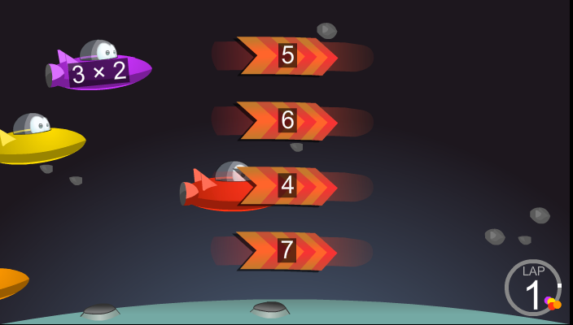
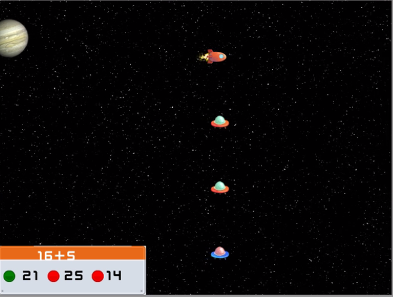
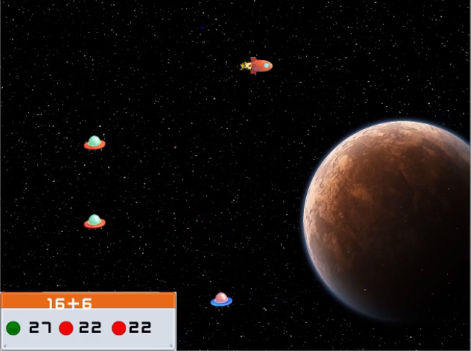
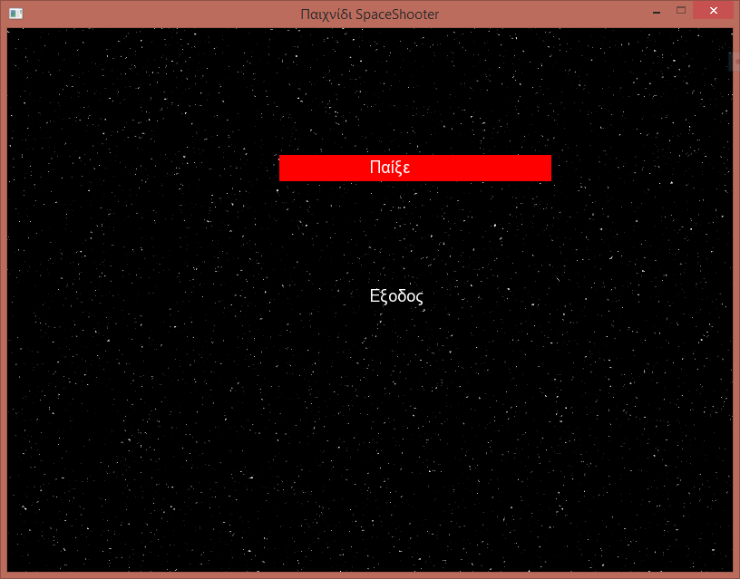
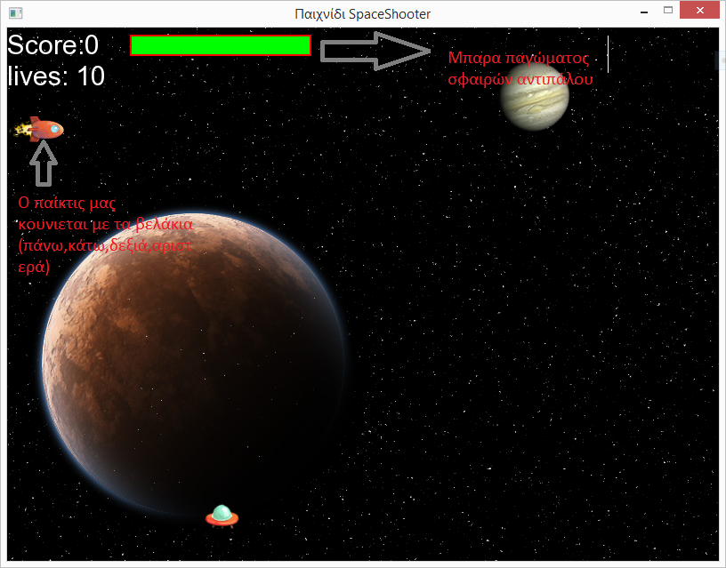
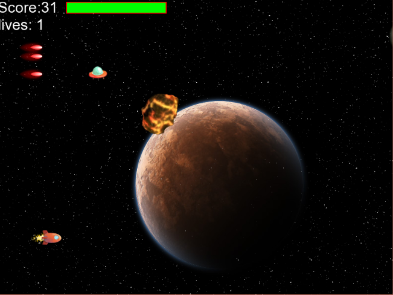
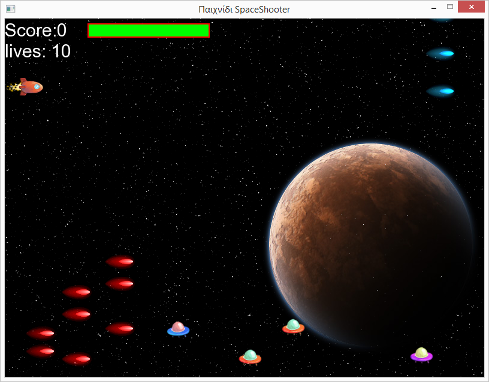

#Τίτλος Εργασίας: Εκπαιδευτικό βιντεο-παιχνίδι
Αλέξανδρος Τουλάκης ΑΜ Π2015067 - p15toul1@ionio.gr

##Παραδοτέο 1

Εκπαιδευτικό βιντεο-παιχνίδι με c++ και χρήση sfml 
##Παραδοτέο 2

##Προδιαγραφές

* Ηλικία: Μαθητές Τρίτης Δημοτικού
* Γνώσεις: Πρόσθεση, αφαίρεση, πολλαπλασιασμός, διαίρεση
* Θεματική ενότητητα: http://ebooks.edu.gr/modules/ebook/show.php/DSDIM-C102/703/4641,20989/
* Αφαίρεση στοιχείων:  από racing παιχνίδια
* Φύλο: Ανεξάρτητο

## Εγκατάσταση εργαλείων ανάπτυξης

* Προγραμματιστικό Περιβάλλον: Microsoft Visual Studio 2013
* Δανεισμός στοιχείων  (ιδέες):

##Space Race Multiplication

http://www.mathplayground.com/ASB_SpaceRaceMultiplication.html

##Πρωτότυπο

###Εικόνα1

###Εικόνα2

##Σενάριο

* Έτος 5018 οι εξωγηίνοι βρίσκονται σε  πόλεμο με τους ανθρώπους.
* Μετά από 2 χρόνια συνεχών μαχών και οι  2 πλευρές βρίσκουν τον  πόλεμο ανώφελο και συμφωνούν για υπογραφή συνθήκης ειρήνης.

* H συνθήκη υπογράφηκε στις  8 Νοεμβρίου 5020, προς τιμήν της μέρας αυτής αποφασίστηκε να διεξάγονται αγώνες ταχύτητας στο διάστημα κάθε χρόνο.

* Στο εκπαιδευτικό παιχνίδι  SR (spaceracing) ο παίκτης εκπροσωπεί τους ανθρώπους. Συμμαχός σου στον αγώνα για την νίκη αποτελούν:
  οι μαθηματικές πράξεις της πρόσθεσης, αφαίρεσης, διαίρεσης και πολλαπλασιασμού, οι οποίες άμα απαντηθούν σωστά θα οδηγήσουν στην αύξηση της  επιτάχυνσης του Παίκτη για ένα μικρό χρονικό διάστημα. Σε περίπτωση λαθούς ο Παίκτης δεν θα επιταχύνει. Μετά από έναν αριθμό λαθών 
 θα εμφανίζονται αντικείμενα τα οποία ο παίκτης μπορεί να καταστρέψει άμα απαντήσει σωστά σε ένα από τα προηγούμενά του λάθη.
  
* Σκοπός του εκπαιδευτικού παιχνιδιού είναι η εξοικείωση του εκπαιδευόμενου  σε μια από τις διαθέσιμες πράξεις της πρόσθεσης, αφαίρεσης, πολλαπλασιασμού και της διαίρεσης. Ο χρήστης θα επιλέγει με ποια πράξη θέλει να ασχοληθεί.

   
##Gameplay Video
https://www.youtube.com/watch?v=WScZkhUcHH4

##Παραδοτέο 3
βιντεο-παιχνίδι με c++ και χρήση sfml 

##Προδιαγραφές

* Ηλικία:EVERYONE
* Αφαίρεση στοιχείων:  από space shooting παιχνίδια
* Φύλο: Ανεξάρτητο

## Εγκατάσταση εργαλείων ανάπτυξης

* Προγραμματιστικό Περιβάλλον: Microsoft Visual Studio 2013
* Δανεισμός στοιχείων  (ιδέες):

Οθόνη 1-Αρχική οθόνη

Οθόνη 2-Βασικές πληροφορίες

Οθόνη 3-Τύποι εχθρών:UFO(σε διάφορα χρώματα) κινούνται περιοδικά σε τυχαίες κατευθυνσει(άξονας y) προκειμένου να είναι ποιο δύσκολο να τα καταστρέψεις,επίσης μπορούν να πυροβολήσουν.Ακόμα υπάρχουν Asteroids τα οποία απλά κινούνται σε μια οριζόνται πορεία

Οθόνη 4-κάθε φορά που ο παίκτις πυροβολά και καταστρέφει ufo, Asteroid παίρνει πόντους οι πόντοι που παίρνει εξαρτουναι απο την δυσκολία 
του "entity" που καταστρέφει.
καθώς η καταστορφή τους είναι δυσκολότερη απο οτι αυτή των Asteroids.Σε περίπτωση 

Οθόνη 4.2-Λάθος

Οθόνη 5-Οδηγίες

Οθόνη 6- Game Over

Αρχική αφήγηση

Αφήγηση - Σενάριο ολοκλήρωσης παιχνιδιού

##Σενάριο

* Έτος 5018 οι εξωγηίνοι βρίσκονται σε  πόλεμο με τους ανθρώπους.
* Μετά από 2 χρόνια συνεχών μαχών και οι  2 πλευρές βρίσκουν τον  πόλεμο ανώφελο και συμφωνούν για υπογραφή συνθήκης ειρήνης.

* H συνθήκη υπογράφηκε στις  8 Νοεμβρίου 5020, προς τιμήν της μέρας αυτής αποφασίστηκε να διεξάγονται αγώνες ταχύτητας στο διάστημα κάθε χρόνο.

* Στο εκπαιδευτικό παιχνίδι  SR (spaceracing) ο παίκτης εκπροσωπεί τους ανθρώπους. Συμμαχός σου στον αγώνα για την νίκη αποτελούν:
  οι μαθηματικές πράξεις της πρόσθεσης, αφαίρεσης, διαίρεσης και πολλαπλασιασμού, οι οποίες άμα απαντηθούν σωστά θα οδηγήσουν στην αύξηση της  επιτάχυνσης του Παίκτη για ένα μικρό χρονικό διάστημα. Σε περίπτωση λαθούς ο Παίκτης δεν θα επιταχύνει. Μετά από έναν αριθμό λαθών 
 θα εμφανίζονται αντικείμενα τα οποία ο παίκτης μπορεί να καταστρέψει άμα απαντήσει σωστά σε ένα από τα προηγούμενά του λάθη.
  
* Σκοπός του εκπαιδευτικού παιχνιδιού είναι η εξοικείωση του εκπαιδευόμενου  σε μια από τις διαθέσιμες πράξεις της πρόσθεσης, αφαίρεσης, πολλαπλασιασμού και της διαίρεσης. Ο χρήστης θα επιλέγει με ποια πράξη θέλει να ασχοληθεί.

   
##Gameplay Video
https://www.youtube.com/watch?v=WScZkhUcHH4
...

##Παραδοτέο 4

...

##Tελική Αναφορά

...
