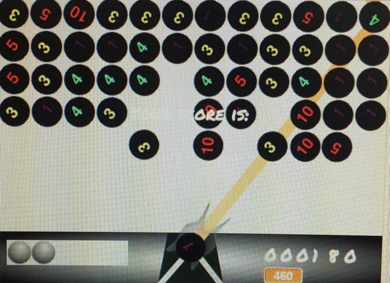

#ΙΟΝΙΟ ΠΑΝΕΠΙΣΤΗΜΙΟ 
#ΤΜΗΜΑ ΠΛΗΡΟΦΟΡΙΚΗΣ 
#ΜΑΘΗΜΑ: Επικοινωνια Ανθρωπου Υπολογιστη
 
Επιβλέπων καθηγητής: Χωριανόπουλος Κωνσταντίνος 

ΜΑΡΙΑ ΔΑΡΑΒΙΓΚΑ - Π2015076 - p15dara@ionio.gr

- **Ηλικία:** Το παιχνίδι απευθύνεται σε μικρές ηλικίες
- **Στόχος:** Ο παίκτης πρέπει να στοχέψει την μπάλα σε μπάλες με το ίδιο νούμερο

## Εγκατάσταση εργαλείων ανάπτυξης

*	Εργαλείο ανάπτυξης: [Scratch](https://scratch.mit.edu) 

**Scratch** 

##Σύντομη Περιγραφή

To παιχνίδι ειναι μια αντιγραφή του κλασσικού παιχνιδιού Bubble Shooter και ειναι για 
μικρότερες ηλικίες.

**Σύνδεσμος για το παιχνίδι:** 
[NumberBubble_Shooter](https://scratch.mit.edu/projects/129966044)

##ΕΙΚΟΝΕΣ ΑΠΟ ΤΟ ΠΑΙΧΝΙΔΙ:

