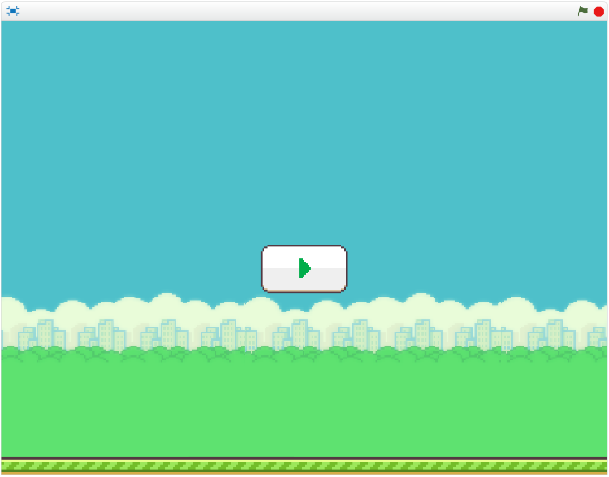
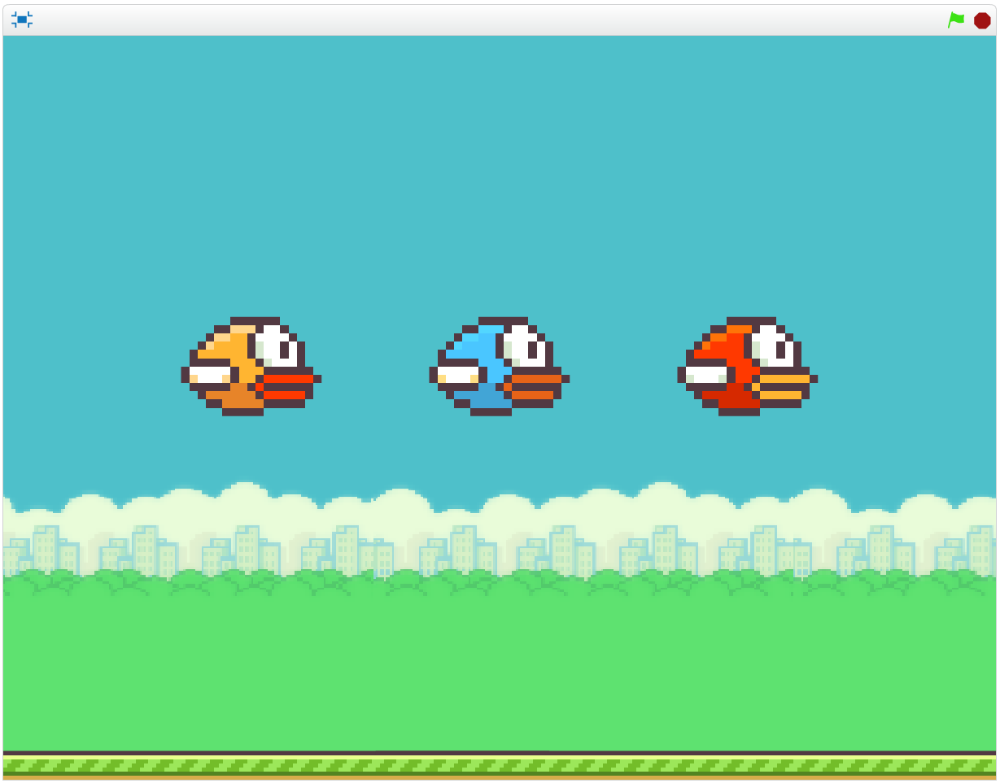
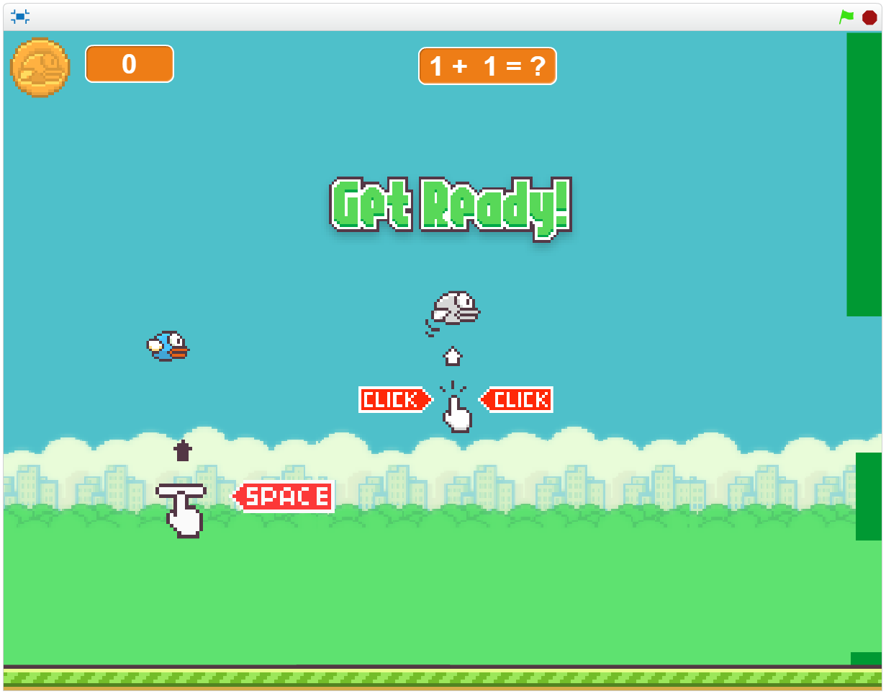
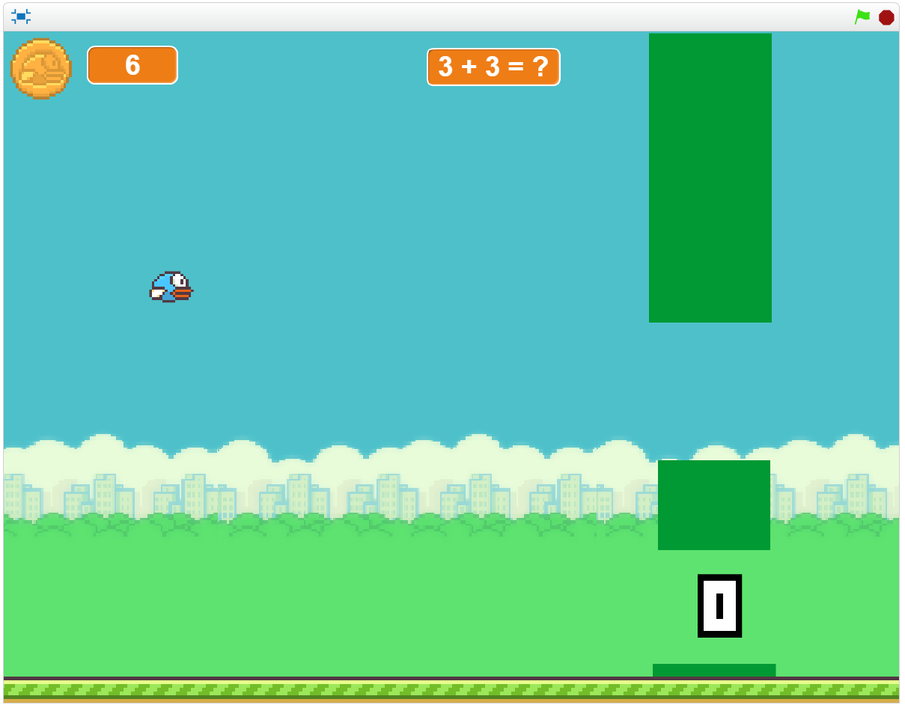

#Τίτλος Εργασίας : ΕΚΠΑΙΔΕΥΤΙΚΟ ΒΙΝΤΕΟΠΑΙΧΝΙΔΙ

Ονοματεπώνυμο: Δημήτριος Τριανταφύλλου
Α.Μ.: Π2015077
Ιόνιο Webmail: p15tria@ionio.gr

##Παραδοτέο 0

###Bonus B
Προσθήκη 10 νέων εικόνων που επιτρέπεται η εμπορική χρήση τους.
###Images
* https://github.com/DimitrisTria/pibookgr/tree/gh-pages/images/ch01
* https://github.com/DimitrisTria/pibookgr/tree/gh-pages/images/ch03
* https://github.com/DimitrisTria/pibookgr/tree/gh-pages/images/ch05

###Credits
* https://github.com/DimitrisTria/pibookgr/blob/gh-pages/images/credits/credits-ch01.md
* https://github.com/DimitrisTria/pibookgr/blob/gh-pages/images/credits/credits-ch03.md
* https://github.com/DimitrisTria/pibookgr/blob/gh-pages/images/credits/credits-ch05.md

###Link:https://github.com/DimitrisTria/pibookgr

##Bonus B (μετά από ανανέωση των οδηγιών)
Προσθήκη 5 νέων εικόνων που επιτρέπεται η εμπορική χρήση τους και δύο διαδραστικών παραδειγμάτων.

###Images
* https://github.com/DimitrisTria/pibookgr/tree/%CE%A0%CF%81%CE%BF%CF%83%CE%B8%CE%AE%CE%BA%CE%B7-%CF%86%CF%89%CF%84%CE%BF%CE%B3%CF%81%CE%B1%CF%86%CE%AF%CE%B1%CF%82-Smartphone-Camera/images
* https://github.com/DimitrisTria/pibookgr/tree/%CE%A0%CF%81%CE%BF%CF%83%CE%B8%CE%AE%CE%BA%CE%B7-%CF%86%CF%89%CF%84%CE%BF%CE%B3%CF%81%CE%B1%CF%86%CE%AF%CE%B1%CF%82-Minecraft/images
* https://github.com/DimitrisTria/pibookgr/tree/%CE%A0%CF%81%CE%BF%CF%83%CE%B8%CE%AE%CE%BA%CE%B7-%CF%86%CF%89%CF%84%CE%BF%CE%B3%CF%81%CE%B1%CF%86%CE%AF%CE%B1%CF%82-Maqutte-Prototype/images
* https://github.com/DimitrisTria/pibookgr/tree/%CE%A0%CF%81%CE%BF%CF%83%CE%B8%CE%AE%CE%BA%CE%B7-%CF%86%CF%89%CF%84%CE%BF%CE%B3%CF%81%CE%B1%CF%86%CE%AF%CE%B1%CF%82-Facebook/images
* https://github.com/DimitrisTria/pibookgr/tree/%CE%A0%CF%81%CE%BF%CF%83%CE%B8%CE%AE%CE%BA%CE%B7-%CF%86%CF%89%CF%84%CE%BF%CE%B3%CF%81%CE%B1%CF%86%CE%AF%CE%B1%CF%82-App-Prototype/images

###Interactive Examples
* https://github.com/DimitrisTria/pibookgr/tree/%CE%A0%CF%81%CE%BF%CF%83%CE%B8%CE%AE%CE%BA%CE%B7-%CE%B4%CE%B9%CE%B1%CE%B4%CF%81%CE%B1%CF%83%CF%84%CE%B9%CE%BA%CE%BF%CF%8D-%CF%80%CE%B1%CF%81%CE%B1%CE%B4%CE%B5%CE%AF%CE%B3%CE%BC%CE%B1%CF%84%CE%BF%CF%82-Interactive-Map-with-Jquery/_remix
* https://github.com/DimitrisTria/pibookgr/tree/%CE%A0%CF%81%CE%BF%CF%83%CE%B8%CE%AE%CE%BA%CE%B7-%CE%B4%CE%B9%CE%B1%CE%B4%CF%81%CE%B1%CF%83%CF%84%CE%B9%CE%BA%CE%BF%CF%8D-%CF%80%CE%B1%CF%81%CE%B1%CE%B4%CE%B5%CE%AF%CE%B3%CE%BC%CE%B1%CF%84%CE%BF%CF%82-Interacitve-Apple-iPhone-5S-%26-iOS-7/_remix

###Link: https://github.com/DimitrisTria/pibookgr

##Παραδοτέο 1

Εκπαιδευτικό βιντεοπαιχνίδι με το εργαλείο Scratch.

##Παραδοτέο 2

###Προδιαγραφές

* Ηλικία: Για μαθητές Γ΄ δημοτικού.
* Γνώση: Βασικές γνώσεις στη πρόσθεση, αφαίρεση, πολλαπλασιασός, διαίρεση με ακέραιους αριθμούς.
* Θεματική Ενότητα: Μαθηματικά Γ΄ Δημοτικού.
 * (Πρόσθεση - Αφαίρεση: http://ebooks.edu.gr/modules/ebook/show.php/DSDIM-C102/284/2024,6921/).
 * (Πολλαπλασιασμός - Διαίρεση: http://ebooks.edu.gr/modules/ebook/show.php/DSDIM-C102/284/2024,6925/).
* Φύλο: Ανεξάρτητο

###Εγκατάσταση εργαλείων ανάπτυξης και τρέξιμο/αλλαγές σε υπάρχοντα

*	Εργαλείο ανάπτυξης: Scratch
* Ιδέες και κομμάτια από κώδικα στα ακόλουθα link: https://scratch.mit.edu/projects/97665849/ και                https://scratch.mit.edu/projects/43793852/.

#FlappyBird Online

#Πρωτότυπο Εφαρμογής
.PNG)

###Σενάριο

* Στο FlappyBird (Math Edition) ο παίκτης, πέρα από το αποφύγει ο παίκτης τα εμπόδια - σωλήνες, σύμφωνα με την ερώτηση 
  που θα του δωθεί θα πρέπει να επιλέξει το τρόπο που θα περάσει τα εμπόδιά του. Στη περίπτωση αυτή η ερώτηση θα είναι 
  μια μαθηματική πράξη.
* Ο σκοπός του παιχνιδιού είναι να λύσει τις μαθηματικές πράξεις και να μαζέψει όλα τα FlappyBird coins, όπως gold, silver coins κλπ,     για να τελειώσει το παιχνίδι.

###Online Demo (work-in-progress): https://scratch.mit.edu/projects/141171006/

##Παραδοτέο 3

###Προδιαγραφές

* Ηλικία: Για μαθητές Γ΄ δημοτικού.
* Γνώση: Βασικές γνώσεις στη πρόσθεση, αφαίρεση, πολλαπλασιασός, διαίρεση με ακέραιους αριθμούς.
* Θεματική Ενότητα: Μαθηματικά Γ΄ Δημοτικού.
 * (Πρόσθεση - Αφαίρεση: http://ebooks.edu.gr/modules/ebook/show.php/DSDIM-C102/284/2024,6921/).
 * (Πολλαπλασιασμός - Διαίρεση: http://ebooks.edu.gr/modules/ebook/show.php/DSDIM-C102/284/2024,6925/).
* Φύλο: Ανεξάρτητο

###Εγκατάσταση εργαλείων ανάπτυξης και τρέξιμο/αλλαγές σε υπάρχοντα

*	Εργαλείο ανάπτυξης: Scratch
* Ιδέες και κομμάτια από κώδικα στα ακόλουθα link: https://scratch.mit.edu/projects/97665849/ και 
  https://scratch.mit.edu/projects/43793852/.

#FlappyBird Online

#Πρωτότυπο Εφαρμογής

* Το FlappyBird (Math Edition) είναι ένα παιχνίδι παιχνίδι που συνδυάζει τις γνώσεις και τα
   αντανακλαστικά του χρήστη. Ο σκοπός του εκπαιδευτικού παιχνιδιού είναι να λύσει τις πράξεις,
   να μαζέψει πόντους, για τη βαθμολογία του, να τελειώσει τις πίστες και εν τέλη το παιχνίδι.

##Εικόνα 1

Στην εικόνα 1 ο παίκτης πριν ξεκινήσει να παίζει έχει τη δυνατότητα να επιλέξει χρώμα για το παίχτη του.

##Εικόνα 2

Στην εικόνα 2 λίγο πριν ξεκινήσει το παιχνίδι δίνονται στο χρήστη οι επιλογές για το χειρισμό του παίκτη του.

##Εικόνα 3

Στην εικόνα 3 έχουμε το περιβάλλον της διάδρασης για το χρήστη.

* Επάνω αριστερά έχουμε τη βαθμολογία και τη κατηγορία του και δεξιά από αυτή την μαθηματική πράξη που καλείται να λύση.
* Από δεξιά "έρχεται" ένας σωλήνας, για κάθε πράξη, με εισόδους όπου η μια θα είναι με αριθμό και η μια κενή όπου ο παίκτης 
  θα πρέπει να αποφασίσει σε ποια είσοδο θα πάει ανάλογα με την ερώτηση.
* Ο αριθμός εμφανίζεται σχεδόν τυχαία, σωστός ή λάθος, ώστε ο χρήστης να μην μπορεί να τον προβλέπει όταν ξαναπαίζει το παιχνίδι.
  Επίσης το ίδιο συμβαίνει και για τη θέση του αριθμού στις εισόδους του σωλήνα αλλά και για το είδος του σωλήνα που θα εμφανιστεί.
* Σε περίπτωση που ο παίκτης "πεθάνει" τοποθετείται στην αρχική θέση που είχε στο παιχνίδι και συνεχίζεται η ροή του παιχνιδιού
  με την ίδια ερώτηση. Εάν επανειλημμένα συνεχιστεί αυτή η διαδικασία μετά από κάποιο όριο θα δίνεται μια βοήθεια, και συγκεκριμένα
  μια άλλη πράξη, η οποία επιλέγεται τυχαία και αυτή και έχει το ίδιο αποτέλεσμα με τη προηγούμενη, ώστε να επωφεληθεί ο χρήστης
  από το λάθος του και πιθανόν να μάθει και μια νέα πράξη.

##Αλλαγές και προσθήκες

* Ιδιαίτερες αλλαγές δεν σημειώθηκαν στη δομή του παιχνιδιού αλλά έγινε βελτιστοποίηση στο κώδικα.
* Προσθήκη λίστας που περιέχει hints.
* Προσθήκη νέου επιπέδου με τη πράξη της αφαίρεσης.

##Πιθανές ιδέες για προσθήκη στο μέλλον:

* Δημιουργία δύσκολου επιπέδου που θα περιλαμβάνει όλες της μαθηματικές πράξεις που προβάλλονται στο παιχνίδι.
  Θα προσθεθεί σωλήνας με τρεις εισόδους και ο ρυθμός του παιχνιδιού να έχει αυξηθεί.
* Προσθήκη νέου γραφικού περιεχομένου.

###Online Demo (work-in-progress): https://scratch.mit.edu/projects/141171006/

##Τελική αναφορά

###Online: https://scratch.mit.edu/projects/141171006/
