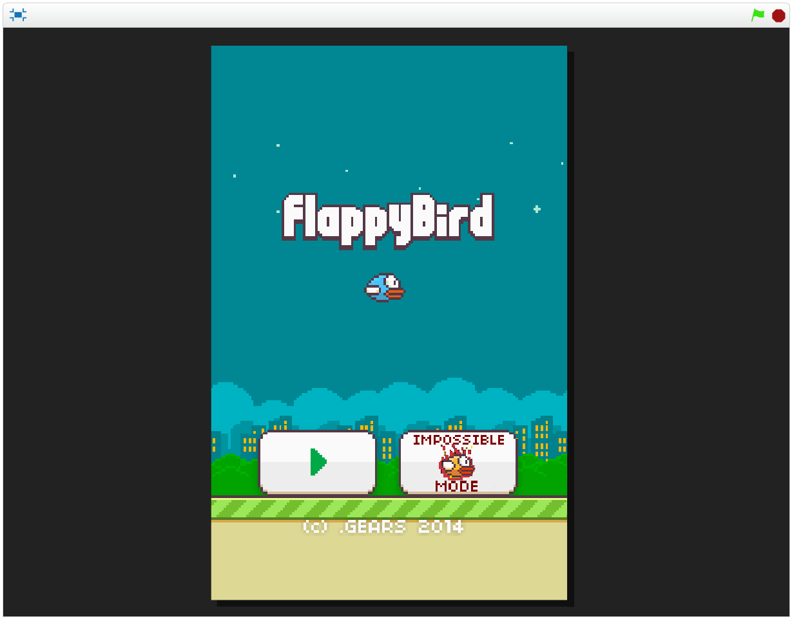

#Τίτλος Εργασίας : ΕΚΠΑΙΔΕΥΤΙΚΟ ΒΙΝΤΕΟΠΑΙΧΝΙΔΙ

Ονοματεπώνυμο: Δημήτριος Τριανταφύλλου
Α.Μ.: Π2015077
Ιόνιο Webmail: p15tria@ionio.gr

##Παραδοτέο 1

Εκπαιδευτικό βιντεοπαιχνίδι με το εργαλείο Scratch.

##Παραδοτέο 2

###Προδιαγραφές

* Ηλικία: Για μαθητές Γ΄ δημοτικού.
* Γνώση: Βασικές γνώσεις στη πρόσθεση, αφαίρεση, πολλαπλασιασός, διαίρεση ακέραιους αριθμούς.
* Θεματική Ενότητα: Μαθηματικά Γ΄ Δημοτικού.
 * (Πρόσθεση - Αφαίρεση: http://ebooks.edu.gr/modules/ebook/show.php/DSDIM-C102/284/2024,6921/).
 * (Πολλαπλασιασμός - Διαίρεση: http://ebooks.edu.gr/modules/ebook/show.php/DSDIM-C102/284/2024,6925/).
* Φύλο: Ανεξάρτητο

###Εγκατάσταση εργαλείων ανάπτυξης και τρέξιμο/αλλαγές σε υπάρχοντα

*	Εργαλείο ανάπτυξης: Scratch
* Ιδέες και κομμάτια από το κώδικα στα ακόλουθα link: https://scratch.mit.edu/projects/97665849/ και                https://scratch.mit.edu/projects/43793852/.

#FlappyBird Online

#Πρωτότυπο Εφαρμογής
.PNG)

###Σενάριο

* Στο FlappyBird (Math Edition) ο παίκτης, πέρα από το αποφύγει ο παίκτης τα εμπόδια - σωλήνες, σύμφωνα με την ερώτηση 
  που θα του δωθεί θα πρέπει να επιλέξει το τρόπο που θα περάσει τα εμπόδιά του. Στη περίπτωση αυτή η ερώτηση θα είναι μια μαθηματική    πράξη.
* Ο σκοπός του παιχνιδιού είναι να μαζέψει όλα τα FlappyBird coins, όπως gold, silver coins κλπ, λύνοντας ταυτόχρονα τις μαθηματικές    πράξεις για να τελειώσει το παιχνίδι.

###Online Demo (work-in-progress): https://scratch.mit.edu/projects/129459913/

##Παραδοτέο 3

##Παραδοτέο 4

##Τελική αναφορά

