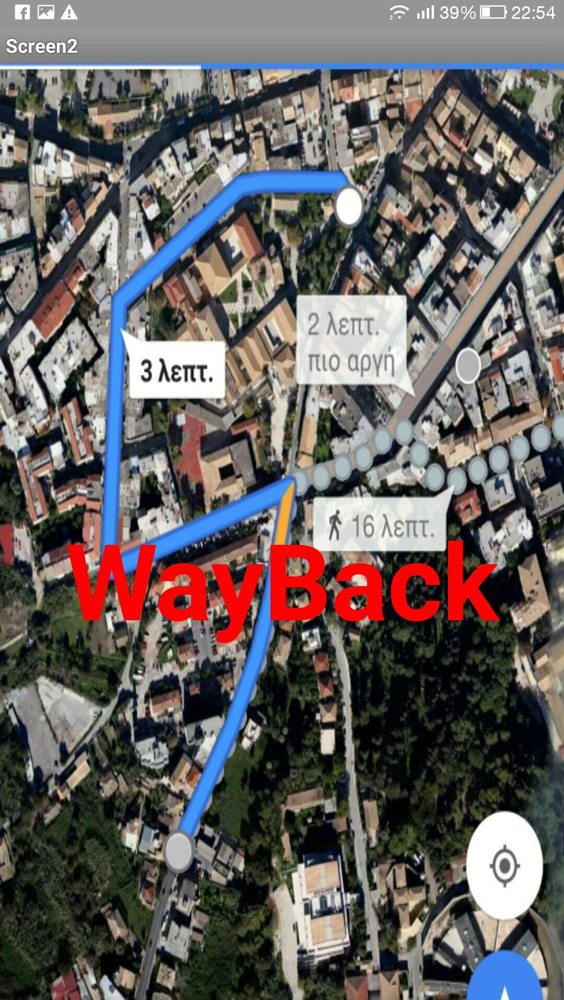
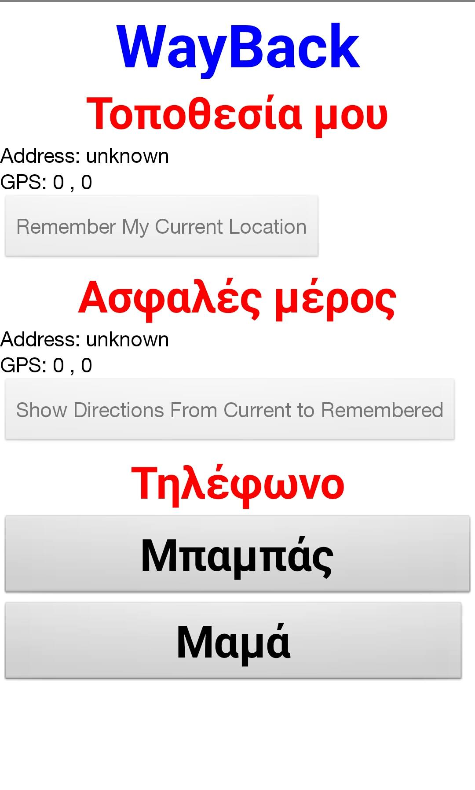
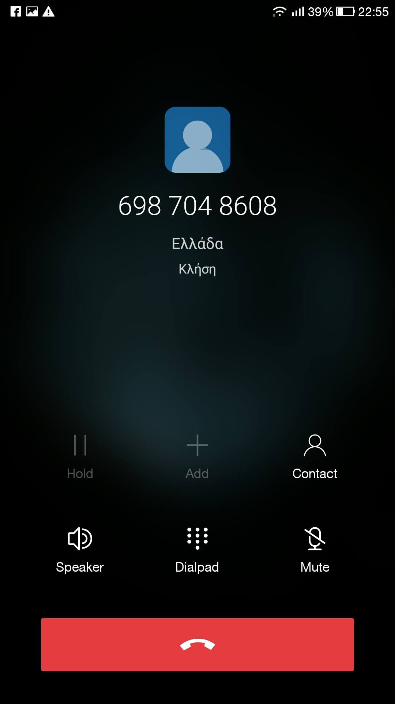

#App Inventor Apps Project
Ιωάννης Κιβρακίδης
ΑΜ Π2015087

##Παραδοτέο 1

App using app inventor

##Παραδοτέο 2
Όνομα εφαρμογής:WayBack

Προυποθέσεις: κινητό τηλέφωνο με σύνδεση στο internet

Ηλικία: για όλες τις ηλικιακές ομάδες

Περιγραφη:
Το κινητό τηλέφωνο είναι ένα από τα πιο προσβάσιμα υλικά αγαθά
στη σημερινή εποχή διαθέσιμο σε (σχεδόν) όλες τις ηλιακές ομάδες. Αυτό σημαίνει ότι το κινητό με τη κατάλληλη εφαρμογή
μπορεί εκτός από μέσω επικοινωνίας να αποτελέσει και μέσω ασφαλείας. Εδώ έρχεται το WayBack. Το WayBack με τη λειτουργία gps
και χαρτών δίνει τη δυνατότητα να τοποθετηθεί ένα σημείο αναφοράς στο χάρτη ώστε αν κάποιο άτομο χαθεί να έχει τη δυνατότητα να γυρίσει
στο γνωστό σημείο. Επιπλέον, υπάρχει δυνατότητα γρήγορης κλήσης σε τηλέφωνο κάποιου γνωστού αν πρόκειται για ανήλικα παιδιά που
χαθήκαν απο τους γονείς  τους.

*Η εφαρμογή βασίζεται στη παραδοσιακή εφαρμογή του app inventor "Find my Car"

##Παραδοτέο 3
Σε αυτή τη φάση η εφαρμογή μου προσθέτει την ιδιότητα καλέσματος οποιουδήποτε τηλεφώνου αποθηκευμένου στις επαφές.

##Παραδοτέο 4
#ΙΟΝΙΟ ΠΑΝΕΠΙΣΤΗΜΙΟ 
#ΠΜΣ ΤΜΗΜΑΤΟΣ ΠΛΗΡΟΦΟΡΙΚΗΣ 
#ΜΑΘΗΜΑ: Σχεδίαση της Διάδρασης Ανθρώπου-Υπολογιστή 
#ΟΝΟΜΑ: Ιωάννης Κιβρακιδής
#ΑΜ: Π2015087
 
Επιβλέπων καθηγητής: Χωριανόπουλος Κωνσταντίνος 

##Περιγραφή της εφαρμογής
Αρχικά όπως όλες οι εφαρμογές έτσι και αυτή έχει ένα τετράγωνο εικονίδιο με την χαρακτηριστική εικόνα της εφαρμογής στην 
οθόνη του τηλεφώνου .Αν πατηθεί (εικονίδιο )τότε "Ξεκινάει" η εφαρμογή και εμφανίζεται η αρχική οθόνη η οποία περιέχει 
τον τίτλο και το όνομά της εφαρμογής (way back)με background την γεωγραφική εικόνα της Ελλαδας προετοιμάζοντας έτσι το 
χρήστη για το ότι πρόκειται για κάτι με χάρτες . Στήν συνέχεια εμφανίζεται ενα μενού που χωρίζεται σε τρία κομμάτια .1ο 
ενα label με επικεφαλίδα "Ή τοποθεσία μου "που υποδεικνύει ότι ακριβώς λέει την διεύθυνση και τις γεωγραφικές 
συντεταγμένες του χρήστη ακριβώς από κάτω έχει ένα κουμπί με τίτλο "Να θυμάσαι το σημείο συνάντησης"το οποίο αποθηκεύει 
τα παραπάνω στοιχεία.2ο ένα label με τίτλο "Σημείο συνάντησης "το σημείο συνάντησης δείχνει τα αποθηκευμένα στοιχεία
του "Να θυμάσαι το σημείο συνάντησης".Στην συνέχεια υπάρχει ένα κουμπί με τίτλο "Δείξε διαδρομή προς σημείο συνάντησης" 
αν πατηθεί "πετάγεται" ένας χάρτης google maps και σου λέει πως θα πας εκεί από την τρέχουσα τοποθεσία σου .3ο ένα label 
με τίτλο "τηλέφωνα" και από κάτω ένα κουμπί με τίτλο "Βρες τον αριθμό στις επαφές" που αν πατηθεί έχει μία λίστα με 
αποθηκευμένες επαφές δίνοντας την δυνατότητα κλήσης τους.

##Σενάριο χρήσης
Η εφαρμογή απευθύνεται σε άτομα τα οποία δυσκολεύονται να προσανατολιστούν από μόνα τους σε περίπτωση που δεν γνωρίζουν 
τους δρόμους(παιδιά , έφηβοι,ακομα και άνθρωποι μεγάλης ηλικίας).Τι κάνει ; Δίνει την δυνατότητα να τοποθετηθεί ένα 
σημείο στον χάρτη.Αυτό το σημείο μπορεί να είναι το σπίτι  μία πλατεία ή γενικά ένα γνωστό σημείο αναφοράς (το σημείο συνάντησης ).Αφού αποθηκεύει στην μνήμη του τηλεφώνου το άτομο που έχει στην διάθεσή του το τηλέφωνο μπορεί ανά πάσα 
στιγμή να επιστρέψει στο σημείο αυτό πατώντας το κουμπί"Δείξε διαδρομή προς σημείο συνάντησης"ο οποίο ενεργοποιεί τους 
χάρτες με την συντομότερη διαδρομή .Αν το άτομο στην εξαιρετική περίπτωση  δεν μπορεί να βγάλει νόημα από τους χάρτες 
υπάρχει η δυνατότητα κλήσης οποιουδήποτε ατόμου αποθηκευμένο στο τηλέφωνο .Η απλή και κατανοητή γλώσσα που είναι γραμμένες οι επικεφαλίδες εξασφαλίζουν την αποδοτική χρήση της εφαρμογής ακόμα και σε άτομα που την χρησιμοποιούν για πρώτη φορά !

##Επιλογή εργαλείων 
Τα εργαλεία που επέλεξαν για την υλοποίηση της εφαρμογής ήταν ή πλατφόρμα ανάπτυξης εφαρμογών MIT app inventor (http://appinventor.mit.edu/explore/#) και το κινητό τηλέφωνο μου για την προσομοίωση της εφαρμογής σε όλα της τα στάδια

##Διαδικασία ανάπτυξης 
Η λογική που ακολουθησα είναι :"βρίσκω μία ανάγκη και την καλύπτω". Όλα ξεκίνησαν από μία ανακοίνωση στην τηλεόραση για την εξαφάνιση ενός παιδιού σε μία πόλη,έτσι δημιουργήθηκε η εξής.Ανάγκη του να μειωθεί ο αριθμός εξαφανισεων!
Μετά από αυτό όλα ήταν τυποποιημένα.Έπρεπε με κάποιον τρόπο να αναπτύξω μία εφαρμογή που θα κάλυπτε την ανάγκη αυτή.

##Βελτιώσεις
Η εφαρμογή way back ήταν μία πρώτη προσπάθεια ανάπτυξης εφαρμογής .Σαν  πρώτο αποτέλεσμα για εμένα είναι υπερβολικά ικανοποιητική αλλά αυτό δεν σημαίνει πως δεν υπάρχουν περιθώρια για βελτιώσεις.Αυτο που αποσκοπεί πέρα από την χρήση της είναι
και η "διαφήμιση της ιδέας" στον κόσμο ώστε ο καθένας άμα έχει τον χρόνο και γνώσεις να την αναπτύξει ακόμα περισσότερο
