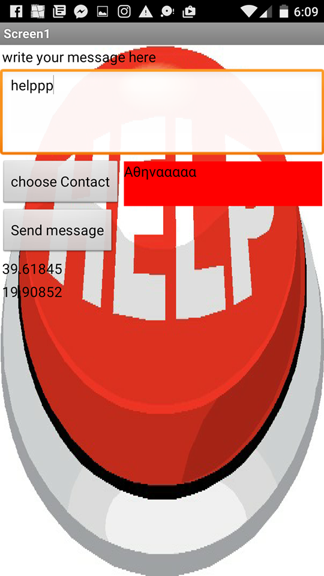
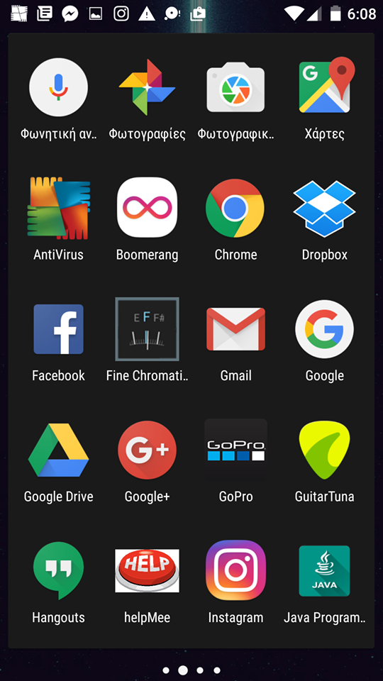
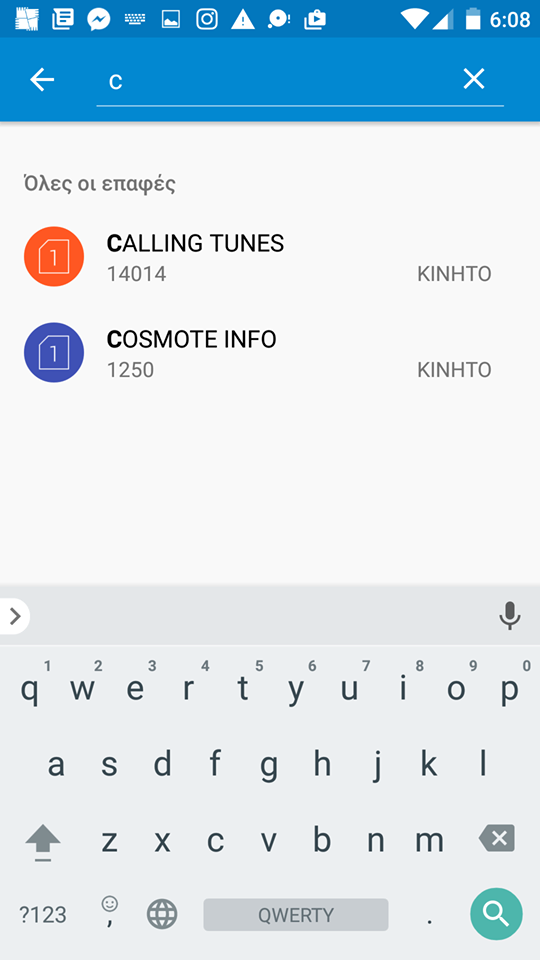

#ΙΟΝΙΟ ΠΑΝΕΠΙΣΤΗΜΙΟ

#ΠΜΣ ΤΜΗΜΑΤΟΣ ΠΛΗΡΟΦΟΡΙΚΗΣ

#ΜΑΘΗΜΑ: Επικοινωνια Ανθρωπου Υπολογιστη

Επιβλέπων καθηγητής: Χωριανόπουλος Κωνσταντίνος

Φοιτητής:Διακουμάκος Βασίλειος-π2015088-email:p15diak@ionio.gr

Κέρκυρα, 2017

##Σύνοψη
Πολλές φορές έχουμε βρεθεί σε καταστάσεις που χρειαζόμαστε βοηθεια,κουβαλώντας πάντα πάνω μας το κινητό μας.Η ιδέα της εφαρμογής η οποια δημιουργήθηκε με MIt app inventor εχει σκοπό να βγάλει τον χρήστη απο δύσκολες καταστάσεις.Η απλή δομή της  βοηθάει στην αμεσότητα και την κάνη πιο εύχρηστη.Link για την εφαρμογή: ai2.appinventor.mit.edu/?galleryId=5993698310225920

##Περιγραφή εφαρμογής
Ανοίγοντας την αρχική οθόνη αυτόματα ενεργοποιεί το gps της εφαρμογής και στην συνέχεια εμφανίζονται οι γεωγραφικές συντεταγμένες του χρήστη.Ο χρήστης στην συνέχεια πληκτρολογεί ενα μηνυμα το οποιο θελει να σταλθει μαζι με τις συντεταγμενες.Στην συνεχεια διαλεγει που ακριβως θελει να το στειλει πατόντας το κουμπι "choose a contact".Η ολοκληρωση της διαδικασιας γινεται αφου πατήσει το κουμπι send message και το μηνυμα στελνεται εφοσον υπαρχει υπολοιπο στο κινητο.
##Διαχείρηση λάθους:
Στην φαση αυτή ο χρηστης πρεπει να πληκτρολογησει ενα μηνυμα εαν δεν επιλεξει επαφη θα εμφανιστει στην οθόνη του το μηνυμα "phone number must have 10 digits". 
Επισης θα πρεπει υποχρεωτικα να στείλει ενα μηνυμα,εστω και ενα γραμα.Αν δεν γινει αυτο εμφανιζεται το μηνυμα "text message cannot be blank"

##Προδιαγραφές 

###Άνθρωπος:Απευθύνεται σε ολες της ηλικίες,ακομα και σε ανθρώπους που δεν είναι τοσο εξοικιωμένοι με την τεχνολογία.

###Πλαίσιο χρήσης:Η εμαρμογή μπορει να χρησιμοποιηθει σε καταστάσεις που χρήζουν βοηθεια,αλλα ακομα και σε πιο απλες.

###Σκοπός:H αμεση επικοινωνια του χρηστη με τους κοντινούς του ανθρωπους σε περίπτωση κινδύνου.

###Διεργασία:Μεσω της χρησης smartphone και των δυνατοτήτων του.

###Λόγοι επιτυχίας:Η εμαρμογη ειναι απλη και φιλικη προς τον χρήστη,αφου διαθέτει ενα screen μονο.

##Σενάριο

Ο Παύλος μαθητής της 2ας λυκειου περπατάει ξενιαστος προς το σπιτι του οταν ξαφνηκα αρχίζει να βρεχει.Τοτε αρχιζει να τρεχει για να προλαβει να φτασει οσο δυνατον λιγοτερο βρεγμενος σπιτι.Πανω στον πανικο του γληστραει και πεφτει και αντιλαμβανεται οτι δεν μπορει να σηκωθει, δεν ξερει που ακριβως βρισκεται και ετσι χρησιμοποιει την εφαρμογη για να μπορεσει να επικοινωνησει με τους γονεις του στελνοντας βοηθεια.Ετσι οι γονεις του δεχονται το μηνυμα και βαζουν τις συντεταγμενες για να βρουν τον γιο τους στο gps 

##Επιλογές εργαλείων 

####MIT App Inventor:
Αποτελεί το κύριο εργαλείο ανάπτυξης της εφαρμογης,με το οποιο μπορει ο καθένας παρακολουθοντας διαφορα tutorial στο internet να δημιουργησει την δικη του εφαρμογη.

##Διαδικασία ανάπτυξης

Η αρχική ιδέα και η ανάπτυξη της συγκεκριμενης εφαρμογης ξεκίνησε κατά την διάρκεια του τριτου εξαμήνου οπου ζητήθηκε η δημιουργεία της πρώτης δικιας μας εφαρμογής ακολουθόντας τους βασικους κανονες και συμβουλες απο τον υπευθυνο διδασκων.Οι συνεχεις παρουσιασεις και γενικοτερα τα παραδοτεα βοηθησαν στην σταδιακη υλοποιηση της εφαρμογης.Είσης έγιναν αρκετές δοκιμές απο συμφοιτητές η οποιο προτειναν και διαφορες ιδέες.

####Παραδειγμα-Πρωτο προτυπο

####Παραδειγμα-Τελικο προτυπο

##Δοκιμασία της εφαρμογής 

##Ενδεικτικές οθόνες :

### Το εικονιδιο της εφαρμογης

### Αρχικη οθονη

### Επιλογή επαφής

##Συμπεράσματα και προτάσεις για μελλοντικές βελτιώσεις

##Συμπεράσματα
Η απλότητα της δίνει το πλεονέκτημα να την χρησιμοποιήσουν άτομα ολων των ηλικιών,και σιγουρα την κανει ενα εύχρηστο εργαλείο κινδύνου.

##Βελτιώσεις
Οι βελτειώσεις που θα μπορουσαν να γίνουν ειναι κυρίως στα γραφίκά της εφαρμογής,διοτι το ομορφο περιβάλον προδιαθέτει τον χρήστη να την χρησιμοποιήσει και να την κατεβάσει στο κινητο του τηλέφωνο.

##Κώδικας ( Δανεισμός κώδικα και αλλαγές )

####Αλλαγές που πραγματοποιήθηκαν:
~Πλέον φαίνεται και το όνομα της επαφής που επιλεγει ο χρήστης να επικοινωνήσει.
~Διόρθωση διάφορων προβλημάτων που εμφανίζονταν στην χρήση της εφαρμογής

