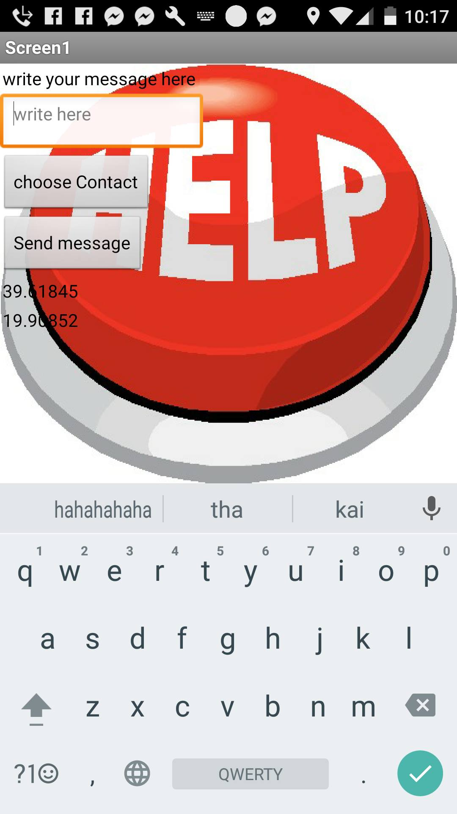

##Παραδοτεο 3

##Περιγραφη
Σκοπός της εφαρμογής είναι καθε φορα που κάποιος βρίσκεται σε δύσκολη θεση να μπορεί εύκολα και άμεσσα να στείλει ενα γρήγορο 
μήνυμα σε όποια επαφή επιλεξη.
Με σκοπό να έρθει σε επικοινωνία με οποια επαφη επιλέξη αφου στο μήνυμα στέλνονται αυτόματα και οι γεωγραφικές του συντεταγμένες χ καί y
##Εργαλεια 
MIΤ app inventor : για την δημιουργία της εφαρμογής
###Διαδικασια αναπτυξης/Βελτιωσεις
Πλέον φαίνονται οι συντεταγμένες που εχει ο χρήστης την συγκεκριμένη χρονική στιγμή στο πρώτο screen.
##ΦΩΤΟΓΡΑΦΙΕΣ
Οι παρακάτω φωτογραφίες δείχνουν την λειτουργεία της εφαρμογής .

####φώτο 1

τα χ και y δείχνουν τις συντεταγμένες απο την στιγμή που θα ανοίξει το gps
####φώτο 2

τα χ και y παίρνουν τιμές

##Προτάσεις για μελλοντικές βελτιώσεις
