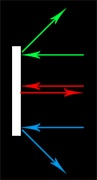
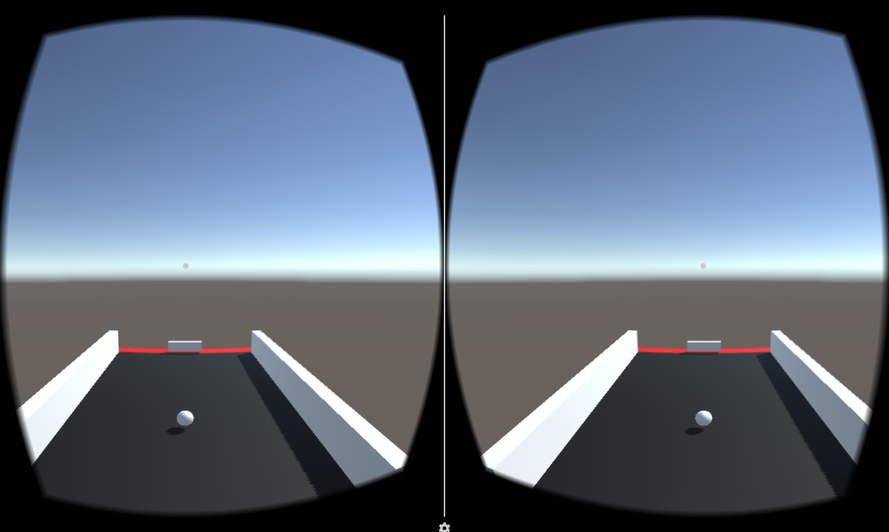
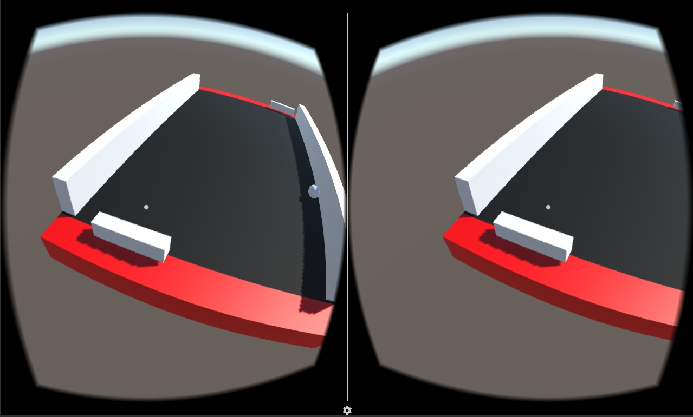

#ΙΟΝΙΟ ΠΑΝΕΠΙΣΤΗΜΙΟ 
#ΤΜΗΜΑ ΠΛΗΡΟΦΟΡΙΚΗΣ
#ΜΑΘΗΜΑ: Επικοινωνία Ανθρώπου-Υπολογιστή
**Διδάσκων καθηγητής:** Χωριανόπουλος Κωνσταντίνος

**Φοιτητής:**  
ΓΙΟΡΝΤΑΝΩΒ ΝΤΑΝΙΕΛ - Π2015105 - p15gior@ionio.gr

#Τελική παρουσίαση έργου για σχολιασμό και βελτιώσεις - Παραδοτέο 3
##Προδιαγραφές

* **Χαρακτήρας:** Η παρόν εφαρμογή είναι μια ανακατασκευή του γνωστού arcade παιχνιδιού του 1972, "Pong", σε 3D περιβάλλον. Το παιχνίδι σκοπεύεται να είναι για Android, με την επιλογή ο χρήστης/παίχτης να μπορεί να παίζει σε 3D ή 3D Virtual Reality.
* **Πλαίσιο χρήσης:** Είναι ψυχαγωγικό παιχνιδι, απευθήνεται σε οποιονδήποτε κάτοχο smartphone με Android, ανεξαρτήτως ηλικίας ή φύλου. Η χρήση ενος VR headgear ή Cardboard Unit είναι προαιρετική.
* **Διεργασία χρήσης:** Το παιχνίδι θα ξεκινάει με το μενού, στο οποίο ο παίχτης θα διαλέξει με την οθόνη αφής αν θέλει να παίξει σε VR mode ή 3D mode. Μόλις ξεκινήσει το παιχνίδι, ο παίχτης θα ελέγχει την ρακέτα του μόνο με το γυροσκόπιο του κινητού. Θα κουνάει δηλαδή το κινητό, αν παίζει σε 3D, ή το κεφάλι του, αν παίζει σε VR.

##Εργαλεία ανάπτυξης

* Εργαλεία που χρησιμοποιήθηκαν μέχρι στιγμής:
  * "Unity" game development platform + "Google VR SDK (Software Development Kit) for Unity".
  * "Microsoft Visual Studio 2015 IDE" για τα scripts σε C#.

##Στιγμιότυπα

--- Οθόνη 1: Συμπεριφορά της ρακέτας ---  

--- Οθόνη 2: Οθόνη εκκίνησης ---  

--- Οθόνη 3: Στιγμιότυπο ---  

##Πηγές, δανεισμός και τροποποίηση κώδικα

AI (enemy) movement: Δημιουργήθηκε από guides  
* http://stackoverflow.com/questions/23960654/unity-pong-ai-movement-speed
* https://forum.unity3d.com/threads/pong-ai.238241/

Player movement: Δημιουργήθκε από guides (και από πολλές προσπάθειες και αποτυχίες)  
* https://forum.unity3d.com/threads/how-to-use-cardboard-reticle-vr-gaze-pointer-cursor-cardboard-button-gaze-input.388492/
* https://forum.unity3d.com/threads/solved-gvr-reticle-not-expanding-when-an-object-is-gaze.414530/
* https://docs.unity3d.com/ScriptReference/Camera.html
* http://answers.unity3d.com/questions/61354/set-eulerangles-to-c.html
* http://stackoverflow.com/questions/3034604/is-there-an-exponent-operator-in-c

Ball behaviour: Χρησιμοποιήθηκε σχεδόν έτοιμος, έπρεπε να μετασχηματιστεί για να δουλεύει από 2D σε 3D. Προστέθηκαν extras.  
* https://noobtuts.com/unity/2d-pong-game

##Μελλοντικές βελτιώσεις για την ολοκλήρωση της εργασίας:
* UI:
 * Κουμπί "Τoggle VR"
 * Επιλογή δυσκολίας
 * "Click ball to start"
 * Score board -> Win/Lose -> Restart game

* Design:
 * Background
 * Ball trail
 * Better object colours
 
##Κώδικας και παιχνίδι
* Ο τελικός κώδικας είναι διαθέσιμος εδώ: https://github.com/danielyor/PongVR-07.12.2016/tree/master/Code

* Το παιχνίδι (.apk) είναι διαθέσιμο εδώ, χρειάζεται εγκατάσταση σε κινητό: https://github.com/danielyor/PongVR-07.12.2016/tree/master/Android-APK
