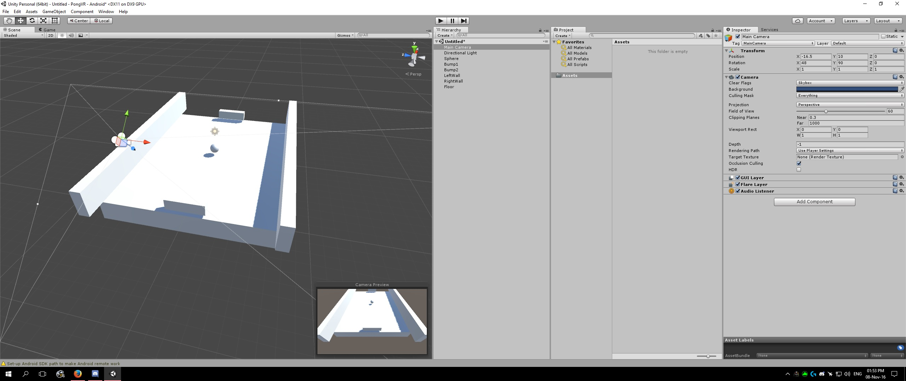
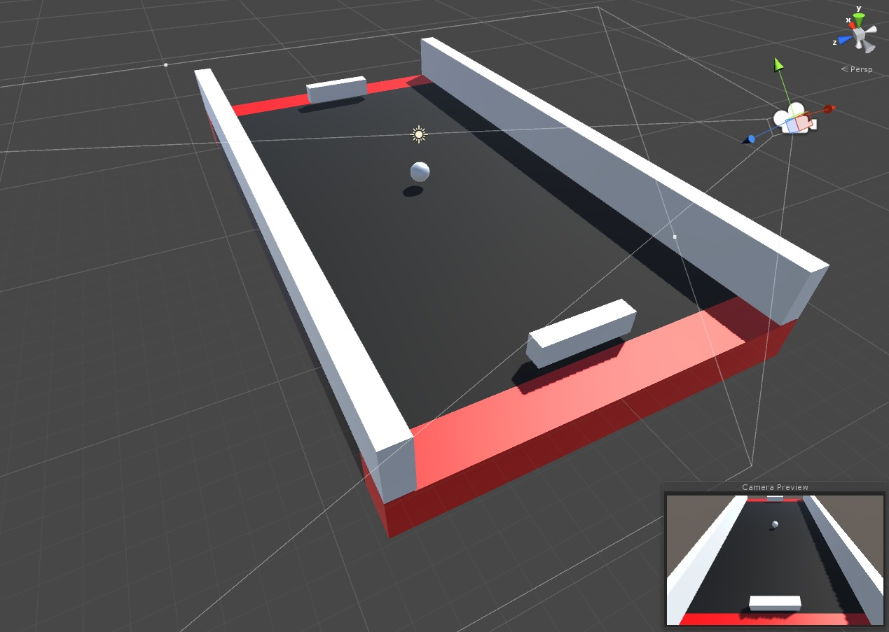
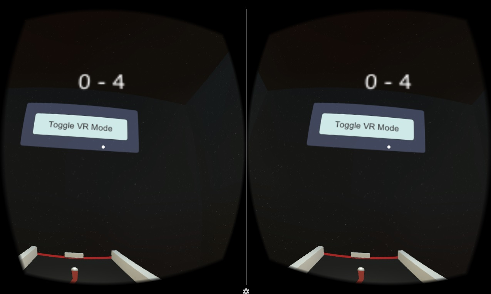

#ΙΟΝΙΟ ΠΑΝΕΠΙΣΤΗΜΙΟ 
#ΤΜΗΜΑ ΠΛΗΡΟΦΟΡΙΚΗΣ
#ΜΑΘΗΜΑ: Επικοινωνία Ανθρώπου-Υπολογιστή
**Διδάσκων καθηγητής:** Χωριανόπουλος Κωνσταντίνος

**Φοιτητής:**  
ΓΙΟΡΝΤΑΝΩΒ ΝΤΑΝΙΕΛ - Π2015105 - p15gior@ionio.gr

#Τελική γραπτή αναφορά - Παραδοτέο 4  

##Σύνοψη  
Η τεχνολογία της [Εικονικής Πραγματικότητας (Virtual Reality)](https://el.wikipedia.org/wiki/%CE%95%CE%B9%CE%BA%CE%BF%CE%BD%CE%B9%CE%BA%CE%AE_%CF%80%CF%81%CE%B1%CE%B3%CE%BC%CE%B1%CF%84%CE%B9%CE%BA%CF%8C%CF%84%CE%B7%CF%84%CE%B1), από την εφεύρεση και προώθηση των ηλεκτρονικών υπολογιστών μέχρι σήμερα, έχει επεκταθεί σπουδαία. 
Μάλιστα, για να βιώσει κάποιος παιχνίδια ή βίντεο σε 360 μοίρες δεν χρειάζεται πια ακριβό υπολογιστή και VR headset. 
Η εμπειρία είναι πλεών διαθέσιμη στο ευρύ κοινό και στον απλό πολίτη σε χαμηλές τιμές στα smartphone που διαθέτει η πλειοψηφία του πληθυσμού. 
Αρκεί η συσκευή να διαθέτει γυροσκόπιο, ένας αισθητήρας που αντιλαμβάνεται πότε και προς τα πού περιστρέφεται το κινητό, και μία μάσκα εικονικής πραγματικότητας, ο χρήστης μπορεί να περιηγηθεί στον εικονικό κόσμο της κάθε εφαρμογής.  
Με την χρήση του λογισμικού Unity και tutorials από το διαδίκτυο, δημιούργησα μία ανακατασκευή του γνωστού arcade παιχνιδιού του 1972, [Pong](https://en.wikipedia.org/wiki/Pong), σε 3D και VR περιβάλλον.  

##Εισαγωγή
###Περιγραφή gameplay και χειρισμού του παιχνιδιού
Το Pong ήταν ένα από τα πρώτα ψηφιακά παιχνίδια. Έγινε γρήφορα δημοφιλές καθώς ήταν επίσης το πρώτο ηλεκτρονικό παιχνίδι με αθλητικό περιεχόμενο.  
To κλασσικό παιχνίδι είναι μια δισδιάστατη έκδοση του ping pong. Υπάρχουν δύο παίχτες που χειρίζονται τις ρακέτες τους στον κατακόρυφο άξονα, ο καθένας στην πλαϊνές άκρες τις οθόνης, και ένα μπαλάκι που πρέπει να περάσει από την γραμμή του αντιπάλου για να κερδηθεί πόντος. Στην κορυφή και στο βάθος της οθόνης υπάρχουν γραμμές στις οποίες το μπαλάκι αναπηδάει. Η κάμερα βρίσκεται στη μέση του "γηπέδου" και το βλέπει κατακόρυφα προς τα κάτω (bird view).  
  
Στην ανακατασκευή μου η κάμερα έχει μεταφερθεί πίσω από την ρακέτα του παίχτη για πιο εύκολο χειρισμό και ευχάριστη διεργασία. Ο παίχτης παίζει ενάντια σε υπολογιστή. Επίσης, υπάρχει κουμπί "Toggle VR" σε περίπτωση που ο χρήστης δεν θέλει να παίξει σε VR.

##Επιλογή εργαλείων
* **"Unity" game development platform + "Google VR SDK (Software Development Kit) for Unity"**: Αποτελεί το κύριο εργαλείο ανάπτυξης του παιχνιδιού. Το Unity είναι ένα "cross-platform game engine", το οποίο χρησιμοποιείται για την δημιουργεία και ανάπτυξη βίντεο παιχνιδιών για υπολογιστές, κονσόλες, κινητά ή ταμπλετ, και ιστοσελίδες. Η Google πρόσφερε έτοιμα εργαλεία και demo για την ανάπτυξη παιχνιδιών σε VR.  
Προτιμήθηκε λόγω της εύκολης-μέτριας δυσκολίας του στην εκμάθηση, και το πλήθος από tutorials που υπάρχουν για αυτό λόγω της φήμης του.
* **"Microsoft Visual Studio 2015 IDE"**: Αν και το Unity προμηθεύεται λογισμικό περιβάλλον ανάπτυξης για C# ή JavaScript, προτίμησα το λογισμικό της Microsoft επειδή το θεώρησα ως ευκαιρία εξοικίωσης με αυτό. Επίσης είναι συμβατό και προσφέρει υποστήριξη για το Unity.  
Χρησιμποιήθηκε για την δημιουργία και επεξεργασία κώδικα σε C#.
* **"Adobe Photoshop"**: Χρησιμοποιήθηκε για την επεξεργασία και τη σχεδίαση γραφικών και εικόνων, που εισάγονται στο Unity πάνω σε materials.

##Διαδικασία ανάπτυξης
Η ιδέα για την δημιουργία παιχνιδιού σε εικονική πραγματικότητας προέκυψε από τα ενδεικτικά θέματα που προσφέρθηκαν από τον διδάσκοντα στις οδηγίες του μαθήματος, σε συνδυασμό με την ελκυστικότητα της τεχνολογίας αυτής.  
Πριν να επιλέξω το θέμα, δοκίμασα πολλά διαθέσιμα παιχνίδια σε VR και τελίκα αποφάσισα να κάνω μια ανακατασκευή ενός κλασσικού παιχνιδιού στην σύγχρονη τεχνολογία.

Δεν είχα προηγούμενες γνώσεις για το Unity ή την γλώσσα C# οπότε έπρεπε να ακολουθήσω αρκετά tutorials και guides διαθέσιμα στο διαδίκτυο.

Πρώτα προστέθηκαν η κάμερα και τα GameObject στον χώρο του παιχνιδιού, και τροποποιήθηκαν οι διαστάσεις τους:

  

Σε δεύτερο στάδιο προστέθηκαν materials για καλύτερη εμφάνιση των αντικειμένων, και C# scripts για την σωστή συμπεριφορά τους:

  

Τέλος, προστέθηκαν τα χαρακτηριστικά VR (κάμερα και κουμπί "Τοggle VR") και σκορ:

  
