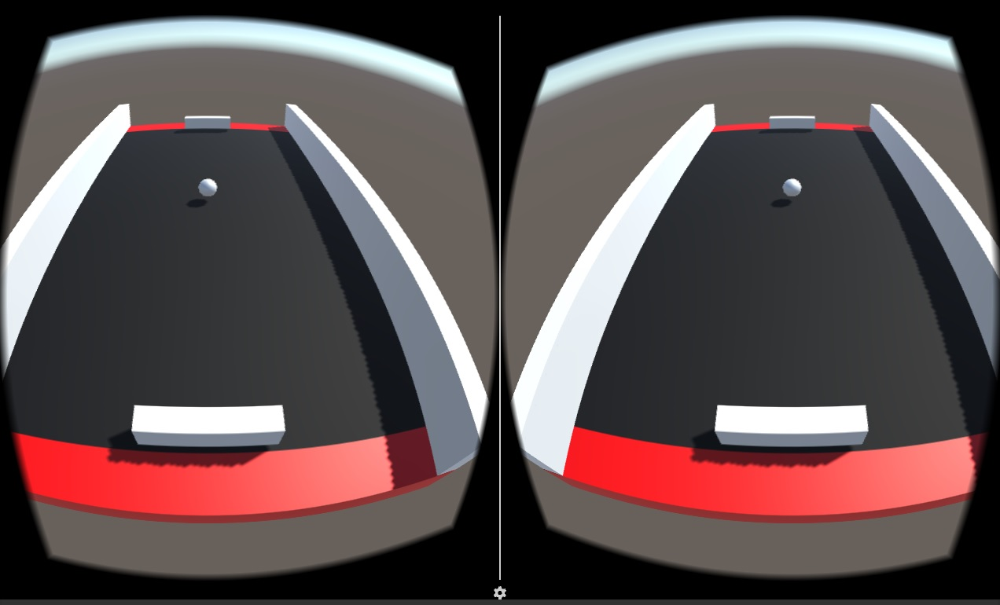

#ΙΟΝΙΟ ΠΑΝΕΠΙΣΤΗΜΙΟ 
#ΤΜΗΜΑ ΠΛΗΡΟΦΟΡΙΚΗΣ
#ΜΑΘΗΜΑ: Επικοινωνία Ανθρώπου-Υπολογιστή
**Διδάσκων καθηγητής:** Χωριανόπουλος Κωνσταντίνος

**Φοιτητής:**

ΓΙΟΡΝΤΑΝΩΒ ΝΤΑΝΙΕΛ - Π2015105 - p15gior@ionio.gr

#Παρουσίαση πρωτοτύπου της εφαρμογής - Παραδοτέο 2
##Προδιαγραφές

* **Χαρακτήρας:** Η παρόν εφαρμογή είναι μια ανακατασκευή του γνωστού arcade παιχνιδιού του 1972, "Pong", σε 3D περιβάλλον. Το παιχνίδι σκοπεύεται να είναι για Android, με την επιλογή ο χρήστης/παίχτης να μπορεί να παίζει και σε Virtual Reality.
* **Πλαίσιο χρήσης:** Είναι ψυχαγωγικό παιχνιδι, απευθήνεται σε οποιονδήποτε κάτοχο smartphone με Android, ανεξαρτήτως ηλικίας ή φύλου. Η χρήση ενος VR headgear είναι προαιρετική.
* **Διεργασία χρήσης:** Η διεργασία θα γίνεται μόνο με το γυροσκόπιο του κινητου (πλην του μενού), για να κουνήσει ο παίχτης την "ρακέτα" του.

##Εγκατάσταση εργαλείων ανάπτυξης και προτότυπο παιχνίδι

* Εργαλείο ανάπτυξης: Unity game development platform + Google VR SDK (Software Development Kit) for Unity.

https://unity3d.com/

https://developers.google.com/vr/unity/

* Προτότυπο arcade παιχνίδι Pong:

http://www.ponggame.org/

##Στιγμιότυπα πρωτοτύπου

#Στιγμιότυπο 1

Αρχικά στάδια του παιχνιδιού στο περιβάλλον του λογισμικού Unity.

#Στιγμιότυπο 2

Μεταγενέστερο στάδιο και όψη της κάμερας του παίχτη.

#Στιγμιότυπο 3

Η κάμερα του παίχτη σε VR mode.

