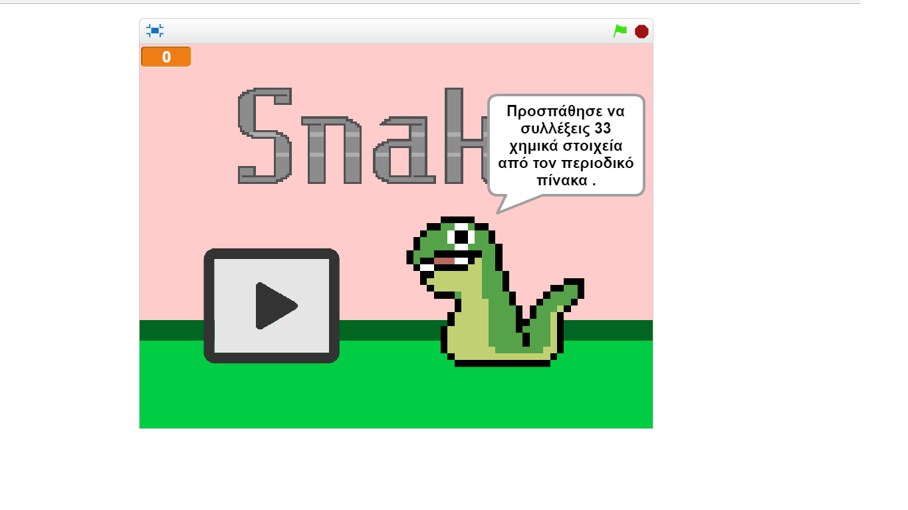
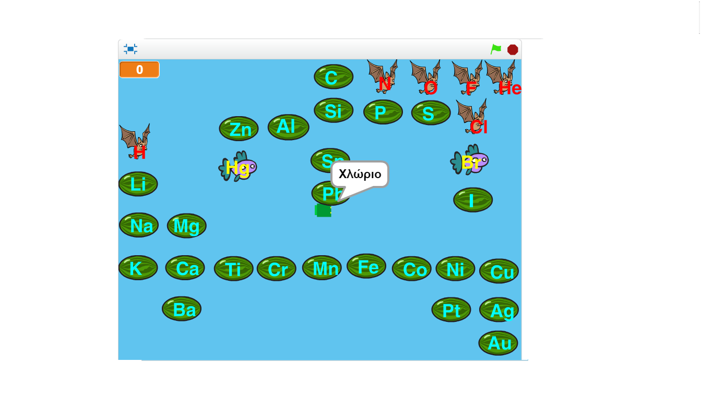

### Παραδοτέο 4

***Τίτλος Εργασίας : ΕΚΠΑΙΔΕΥΤΙΚΟ ΒΙΝΤΕΟΠΑΙΧΝΙΔΙ ΜΕ ΤΟ ΕΡΓΑΛΕΙΟ "Scratch"***

Μάθημα : Επικοινωνία ανθρώπου-υπολογιστή 

Επιβλέπων καθηγητής: Χωριανόπουλος Κωνσταντίνος 

Βοηθοί μαθήματος : Διογένης Αλεξανδράκης, Βαρβάρα Γαρνέλη, Αλεξανδρος Μερκούρης

Ονοματεπώνυμο : Ευάγγελος Γεραμάνης 

Αριθμός Μητρώου : Π2015107

Κέρκυρα, 2017

##Σύνοψη

Η δημιουργία του συγκεκριμένου εκπαιδευτικού  βιντεοπαιχνιδιού  πραγματοποιήθηκε με σκοπό την εξοικείωση των μαθητών της Γ' Γυμνασίου με τα  σημαντικότερα χημικά στοιχεία που απαρτίζουν τον περιοδικό πίνακα για το μάθημα της Χημείας. Έπειτα από την ανατροφοδότηση που λήφθηκε σοβαρά υπόψην, από τον κ.Χωριανόπουλο και τους βοηθούς του, διαμορφώθηκε το παρακάτω εκπαιδευτικό βιντεοπαιχνίδι , το οποίο βέβαια έχει ακόμα πολλά περιθώρια για περαιτέρω βελτιστοποίηση. Ένα αρκετό σημαντικό πρόβλημα είναι η διαχείρηση σφάλματος, η οποία δεν υφίσταται καθόλου.
URL  παιχνιδιού : https://scratch.mit.edu/projects/134540149/

##Εισαγωγή 

Το εκπαιδευτικό βιντεοπαιχνίδι με όνομα : Chemistry snake, είναι πολύ απλό. Όπως υποδεικνύει και το όνομά του είναι ένα κλασσικό φιδάκι που πατώντας τα 4 βελάκια απο το πληκτρολόγιο ο χρήστης το κατευθύνει. Σκόπος του παιχνιδιού είναι να μαζευτούν 33 χημικά στοιχεία που βρίσκονται στον περιοδικό πίνακα. Τα στοιχεία έχουν τοποθετηθεί με τέτοιο τρόπο, ώστε να αποτελούν μία μικρογραφία του περιοδικού πίνακα, για να διευκολυνθεί και ο χρήστης να τα εντοπίσει πιο εύκολα. Το επιθυμητό αποτέλεσμα θα ήταν να υπήρχε μία διαχείρηση σφάλματος για να καταλαβαίνει και ο παίχτης με κάποιο εμφατικό τρόπο τα λάθη  του. Ιδανική περίπτωση πιστεύω θα ήταν κάθε φορά που περνάει το φιδάκι απο λάθος στοιχείο να μειώνεται και το μέγεθός του, όπως προτάθηκε και από έναν βοηθό στην τελική παρουσίαση. 

##Επιλογή εργαλείων 

**MIT Scratch**: Αποτελεί ένα εργαλείο που απευθύνεται κυρίως σε μικρές ηλικίες (περίπου 8-15 ετών) και βοηθάει στην εκμάθηση προγραμματισμού επειδή είναι παραστατικό και υπάρχει διάδραση με τον χρήστη, αφού κάθε εντολή που χρησιμοποιείται μπορεί να φανεί άμεσα και  το αποτελεσμά της.

##Διαδικασία ανάπτυξης 

Η αρχική ιδέα μου ήταν ένα παιχνίδι βασισμένο στο Gem Game(https://scratch.mit.edu/projects/10181336/), καθώς ήταν το παιχνίδι που όταν στο πρώτο μάθημα των διαλέξεων μας το παρουσιάσατε μου άρεσε πολύ σαν ιδέα και όπως μας είπατε υλοποιούσε και σχεδον άριστα το βασικό ζητούμενο της διάδρασης  με τον άνθρωπο.
Έτσι είχα αποφασίσει να δημιουργήσω ένα παιχνίδι για Χημεία που θα είχε μεγάλη ομοιότητα με το Gem Game. Έπειτα απο την πρώτη παρουσίαση όμως και αφού έλαβα το σχόλιο ότι  δεν βασίζεται  σε κλασσικό βιντεοπαιχνίδι, το οποίο αποτελούσε και ζητούμενο της εργασίας κατάλαβα ότι θα έπρεπε να αλλάξω το παιχνίδι μου. Έτσι αφού κοίταξα όλα τα κλασσικά βιντεοπαιχνίδια αποφάσισα να  βασιστώ στο φιδάκι(https://scratch.mit.edu/projects/72303326/). Το θέμα μου φυσικά δεν άλλαξε, παρέμεινε η Χημεία. Οι αλλαγές που έγιναν στο κλασσικό φιδάκι ήταν οι εξής : α) αφαιρέθηκαν 2 βασικές ιδιότητες, το "game over" έπειτα απο ακούμπημα του κεφαλιού στο σώμα από το φίδι 
και το "game over" όταν ακουμπάει τα "τοιχώματα", β) προστέθηκαν sprites για τα 33 χημικά στοιχεία και το φιδάκι κάθε φορά "τρώει" μόνο το ζητούμενο χημικό στοιχείο. Έτσι όπως ανέφερα και παραπάνω δεν υπάρχει διαχείρηση σφάλματος και τα χημικά στοιχεία είναι διατεταγμένα με την σειρά που βρίσκονται και στον περιοδικό πίνακα. Η περίπτωση του "game over" επομένως δεν υφίσταται καθόλου, κάτι που πιθανότητα θα έπρεπε να διορθωθεί. Σκέφτηκα να προσθέσω ενα ορισμένο χρονικό διάστημα για την ολοκλήρωση του παιχνιδού και με κάθε λάθος "πέρασμα"
του φιδιού από ένα χημικό στοιχείο να αυξάνεται ο τρέχον χρόνος κατα 3' δευτερόλεπτα. Αλλά αυτό ίσως λειτουργούσε με αρνητικό αντίκτυπο προς τον μαθητή και αντί να μάθει τα χημικά στοιχεία να τον αγχώσει, όπως με τα διαγωνίσματα στο σχολείο, και να μη φέρει το επιθυμητό  απότελεσμα, χωρίς όμως αυτό να αναιρεί την σημαντικότητα ύπαρξης διαχείρησης σφάλματος.

##Ενδεικτικές Οθόνες  

Οθόνη έναρξης

Οθόνη παιχνιδιού 

 
##Συμπεράσματα 

Το Chemistry Snake είναι ενα εκπαιδευτικό βιντεοπαιχνίδι σχεδιασμένο με σκοπό να βοηθήσει στην εμπέδωση των σημαντικότερων χημικών στοιχείων του περιοδικού πίνακα για το μάθημα της Χημείας. Το συγκεκριμένο παιχνίδι είναι αρκετά απλοϊκό και σίγουρα έχει ακόμα μεγάλο περιθώριο για επιπλέον προσθήκες και βελτιώσεις. Αν είχε αφιερωθεί περισσότερος χρόνος  και είχε δοκιμαστεί και από παιδιά Γυμνασίου σαφώς και το αποτέλεσμα θα ήταν αντιπροσωπευτικότερο. 

##Αναφορές σε σχετικές-παρόμοιες εργασίες

Η εργασία μου βασίστηκες, όπως προανέφερα στο κλασσικο φιδάκι(https://scratch.mit.edu/projects/72303326/) και έγιναν κάποιες αλλαγές για να αποκτήσει τον εκπαιδευτικό του χαρακτήρα του(βλέπε Διαδικασία ανάπτυξης).

Βιβλιογραφία : Ο Προγραμματισμός της Διάδρασης: Από τον επιτραπέζιο στον κινητό και διάχυτο υπολογισμό, Κωνσταντίνος Χωριανόπουλος .

Δικτυογραφία : http://ebooks.edu.gr/modules/ebook/show.php/DSGYM-C102/362/2433,9308/, http://journal.seriousgamessociety.org/index.php?journal=IJSG&page=article&op=view&path%5B%5D=12&path%5B%5D=0 .
