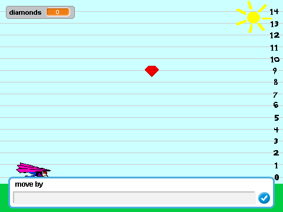
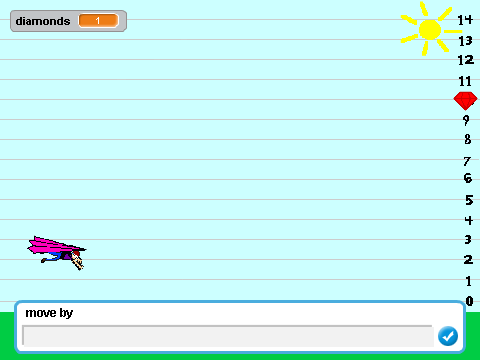
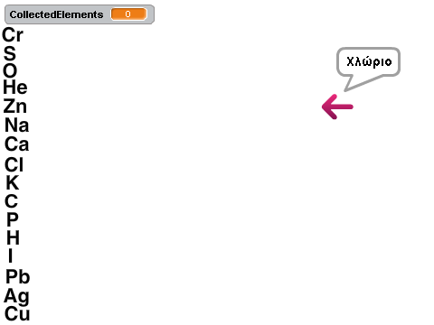
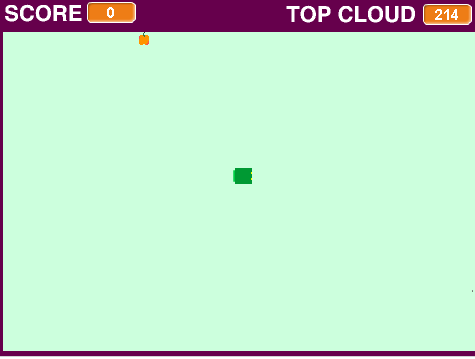
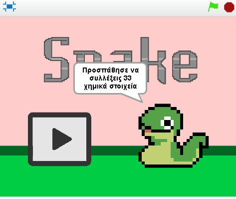
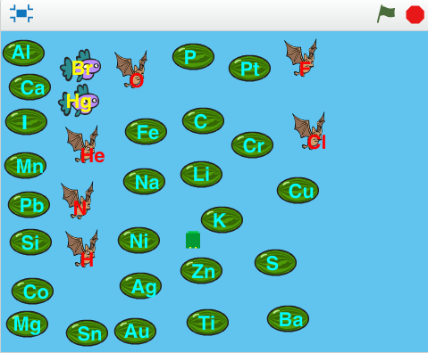

***Τίτλος Εργασίας : ΕΚΠΑΙΔΕΥΤΙΚΟ ΒΙΝΤΕΟΠΑΙΧΝΙΔΙ***

Ονοματεπώνυμο : Ευάγγελος Γεραμάνης 

Αριθμός Μητρώου : Π2015107

***Παραδοτέο 0***

10 παραθέσεις : https://github.com/pibook/pibookgr/pull/11
 

***Παραδοτέο 1***

Εκπαιδευτικό βιντεοπαιχνίδι με το εργαλείο Scratch.

***Παραδοτέο 2***

#ΙΟΝΙΟ ΠΑΝΕΠΙΣΤΗΜΙΟ 
# ΤΜΗΜΑ  ΠΛΗΡΟΦΟΡΙΚΗΣ 
#ΜΑΘΗΜΑ: Επικοινωνία  Ανθρώπου-Υπολογιστή 
 
Επιβλέπων καθηγητής: Χωριανόπουλος Κωνσταντίνος 

##Προδιαγραφές

* Ηλικία : για παιδιά Γ΄ Γυμνασίου  (14 ετών περίπου).
* Γνώσεις-Ικανότητες : προαπαιτείται μερική (αν όχι πλήρης) κατανόηση του μαθήματος της χημείας και ειδικότερα του περιοδικού πίνακα
και των ανόργανων χημικών ενώσεων.Στόχος είναι η εξοικείωση των παιδιών με αυτά.
* Φύλο : Κατάλληλο για αγόρια και κορίτσια.
* Θεματική ενότητα : Χημεία Γ' Γυμνασίου με εστίαση στα χημικά στοιχεία και τις ανόργανες χημικές ενώσεις.(http://ebooks.edu.gr/modules/ebook/show.php/DSGYM-C102/362/2433,9308/ , Κεφάλαιο 2).

## Εγκατάσταση εργαλείων ανάπτυξης και τρέξιμο/αλλαγές σε υπάρχοντα παραδείγματα

*	Εργαλείο ανάπτυξης: Scratch
* Δανεισμός στοιχείων (ιδέες και κώδικα) από:  https://scratch.mit.edu/projects/10181336/ 

         

##Πρωτότυπο

##Σενάριο 

* Ο Γιάννης και η Ελένη πρέπει να συλλέξουν κάποια χημικά στοιχεία για να δημιουργήσουν  ανόργανες χημικές ενώσεις.Έπειτα θα τις παραδώσουν στον κ.Μπακούρα για να κατασκευάσει 1 μυστηριώδες αντικείμενο.

* Το παιχνίδι θα εξελίσσεται σε 2 επίπεδα-φάσεις.Στο πρώτο θα συλλέγονται  ορισμένα χημικά στοιχεία , του περιοδικού πίνακα, από ένα μεγαλύτερο σύνολο . Στο δεύτερο θα πρέπει να φτιάξουν κάποιες χημικές ενώσεις χρησιμοποιώντας τα στοιχεία του 1ου επιπέδου.Τα σκηνικά υπόβαθρα θα αντιπροσωπεύουν το είδος των στοιχείων (αέρια,υγρά,στερεά) .

* Το σενάριο δύναται να υποστεί κάποιες τροποποιήσεις ,όμως ο κύριος στόχος δε θα αλλάξει .

***Παραδοτέο 3***

## Εγκατάσταση εργαλείων ανάπτυξης και τρέξιμο/αλλαγές σε υπάρχοντα παραδείγματα

*	Εργαλείο ανάπτυξης: Scratch
* Δανεισμός στοιχείων (ιδέες και κώδικα) από: https://scratch.mit.edu/projects/72303326/

* Η θεματική ενότητα έχει τροποποιηθεί ελαφρώς και αναφέρεται αποκλειστικά στα χημικά στοιχεία του περιοδικού πίνακα.
* Το αρχικό πρωτότυπο άλλαξε και αυτό ,έπειτα από την παρουσίαση του δεύτερου παραδοτέου και λαμβάνοντας υπόψη τα σχόλια του κ.Χωριανόπουλου.

* Το παρών παιχνίδι αποτελείται απο μία βασική οθόνη  και δεν περιλαμβάνει κάποιο σενάριο.

##Original project

##Screens

##Σχόλια

Σκοπός του παιχνιδιού είναι να συγκεντρωθούν όλα τα χημικά στοιχεία που αναπαριστώνται στην οθόνη.Δεν υπάρχει πιθανότητα σφάλματος,καθώς 
το φιδάκι "τρώει" μόνο το κατάλληλο στοιχείο  κάθε φορά. Επίσης έχει αφαιρεθεί η  "κλασσική ιδιότητα" ,ότι δηλαδή το φίδι μπορεί να φαγωθεί απο τον ευατό του.

Online Demo :https://scratch.mit.edu/projects/134540149/

***Παραδοτέο 4***

....

***Τελική αναφορά***

....

