#Τίτλος Εργασίας: Εκπαιδευτικό βιντεο-παιχνίδι
Αλέξανδρος Δημήτριος Ζερβόπουλος - ΑΜ Π2015111 - p15zerv@ionio.gr

##Παραδοτέο 1

Εκπαιδευτικό βιντεο-παιχνίδι με το εργαλείο Scratch

##Παραδοτέο 2

###Προδιαγραφές

* Ηλικία: Μαθητές ΣΤ' Δημοτικού
* Γνώσεις: Γωνίες
* Θεματική ενότητα: [ΣΤ' Δημοτικού, Θεματική ενότητα 6 - Γωνίες, Σχεδιάζω γωνίες](http://ebooks.edu.gr/modules/ebook/show.php/DSDIM101/301/2094,7470/)
* Φύλο: Ανεξάρτητο
* Αφαίρεση στοιχείων από κλασικά top down racing/driving παιχνίδια

Σημείωση: Αν προστεθούν δυσκολίες όπως περιγράφονται παρακάτω, το παιχνίδι θα απευθύνεται σε μαθητές Β' Γυμνασίου, όπου εισάγονται οι έννοιες των τριγωνομετρικών συναρτήσεων. Συγκεκριμένα: [Β' Γυμνασίου, Μέρος Β', Κεφάλαιο 2ο](http://ebooks.edu.gr/modules/ebook/show.php/DSGYM-B105/372/2488,9572/)

###Εγκατάσταση εργαλείων ανάπτυξης

* Εργαλείο ανάπτυξης: Scratch
* Δανεισμός στοιχείων (ιδέες και κώδικα) από: Gem Game - https://scratch.mit.edu/projects/10181336/

###Πρωτότυπο

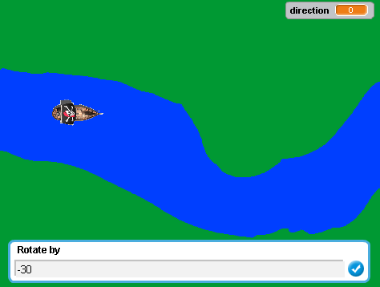

Screenshot 1

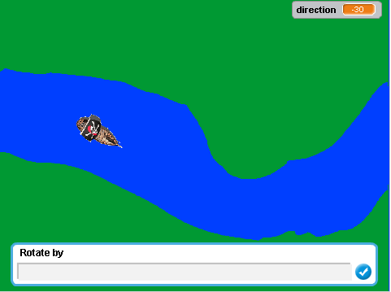

Screenshot 2

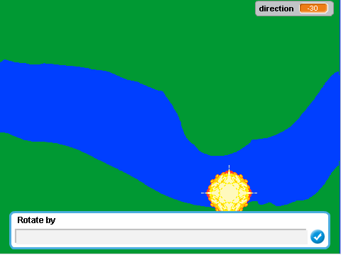

Screenshot 3

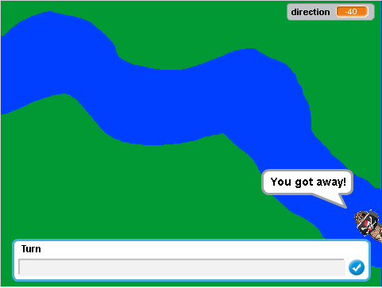

Screenshot 4

###Σενάριο
* Μία ακόμη μέρα και το πλήρωμα του πειρατικού καραβιού μας επιστρέφει από άλλη μία επιτυχημένη επιδρομή γεμάτο χρυσό.
* Ενώ οι πειρατές κατευθύνονται προς το κρησφύγετό τους, παρατηρούν πως τους έχουν πάρει από πίσω πλοία του στρατού.
* Συνηδειτοποιούν πως ο μόνος τρόπος να τους χάσουν είναι να περάσουν μέσα από τα ποτάμια, αφού θα ήταν πολύ ριψοκίνδυνο για τα μεγαλύτερου μεγέθους στρατιωτικά πλοία να τους ακολουθήσουν.
* Είναι ώρα ο καπετάνιος, χρησιμοποιώντας την εμπειρία του και τις γνώσεις του στην Τριγωνομετρία, να οδηγήσει με ασφάλεια το πλοίο μέσα από το ποτάμι και να φτάσει στο κρυσφήγετο.

###Ιδέες-μελλοντικές προσθήκες
* Αναβάθμιση γραφικών
* Δυσκολίες
  * Easy - χαμηλότερη ταχύτητα, προσθήκη [εικόνας με μοίρες](http://dide.ker.sch.gr/ekfe/epiloges/3_prot_peiramata/Image49.jpg) που ακολουθεί τον παίκτη για διευκόλυνση πλοήγησης
  * Medium - κανονική ταχύτητα
  * Hard - αύξηση ταχύτητας, προσθήκη score/resource system (π.χ. καύσιμα) το οποίο αυξάνεται/αναπληρώνεται αν ο παίκτης απαντήσει σωστά σε τριγωνομετρικές πράξεις (π.χ. εμφανίζεται στην οθόνη: ημ45° και αν επιλεγεί σωστή τιμή θα αυξάνεται το score ή θα αναπληρώνονται τα καύσιμα).
  
###Demo
Μπορείτε να βρείτε ότι έχει υλοποιηθεί μέχρι στιγμής εδώ: https://scratch.mit.edu/projects/128971433/

##Παραδοτέο 3

###Παιχνίδι 1

####Προδιαγραφές

* Ηλικία: Μαθητές ΣΤ' Δημοτικού
* Γνώσεις: Γωνίες
* Θεματική ενότητα: [ΣΤ' Δημοτικού, Θεματική ενότητα 6 - Γωνίες, Σχεδιάζω γωνίες](http://ebooks.edu.gr/modules/ebook/show.php/DSDIM101/301/2094,7470/)
* Φύλο: Ανεξάρτητο
* Αφαίρεση στοιχείων από το κλασικό παιχνίδι: [Scramble (Konami)]( https://en.wikipedia.org/wiki/Scramble_(video_game) )

####Εγκατάσταση εργαλείων ανάπτυξης

* Εργαλείο ανάπτυξης: Scratch
* Δανεισμός στοιχείων (ιδέες και κώδικα) από:
 * Gem Game - https://scratch.mit.edu/projects/10181336/
 * -Race car Simulator- - https://scratch.mit.edu/projects/38041040/

####Πρωτότυπο

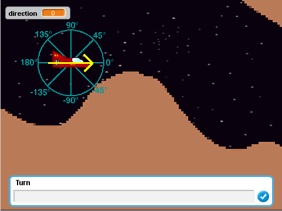

Screenshot 1

Σκοπός του παιχνιδιού είναι να πλοηγηθεί το διαστημόπλοιο στο τέλος της πίστας, χωρίς να χτυπήσει κάποιο εμπόδιο. Για να το κάνει αυτό, ο παίκτης πρέπει να εισάγει στο παράθυρο που εμφανίζεται πόσες μοίρες να στρίψει. Αν δωθεί θετικός αρνητικός, το διαστημόπλοιο στρίβει προς τα πάνω, αλλιώς, αν δωθεί αρνητικός, στρίβει προς τα κάτω.

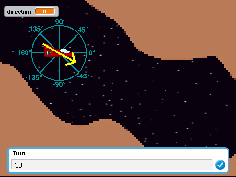

Screenshot 2

Καθώς ο παίκτης πληκτρολογεί, το βελάκι του δείχνει την κατεύθυνση στην οποία θα κινηθεί. Ακόμα, δίνεται στον παίκτη η δυνατότητα να αλλάζει την ταχύτητά του χρησιμοποιώντας το slider που εμφανίζεται πάνω δεξιά στην οθόνη.

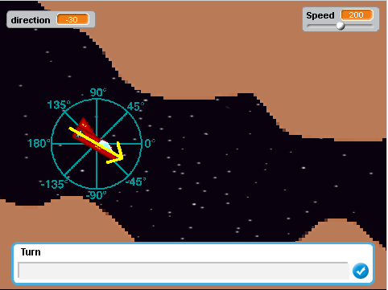

Screenshot 3

Πατώντας το Enter, το διαστημόπλοιο κατευθύνεται προς την κατεύθυνση που εισήγαγε ο χρήστης και στη συνέχεια ξαναζητά νέα τιμή.

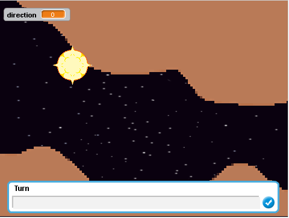

Screenshot 4

Αν ο παίκτης χτυπήσει κάποιο εμπόδιο, το αεροπλάνο εκρήγνυται και ο παίκτης στέλνεται στην αρχή του επιπέδου.

####Σενάριο

* Ο δάσκαλος, στο προήγουμενο μάθημα, τελείωσε την 5η Θεματική Ενότητα των Μαθηματικών της ΣΤ' Δημοτικού. Σήμερα, λοιπόν, είναι ώρα να μπει στην 6η ενότητα.
* Κάποιοι μαθητές δυσκολεύονται να κατανοήσουν την έννοια της γωνίας. Αποφασίζει, έτσι, να προσπαθήσει να βρει κάποιο τρόπο να τους βοηθήσει να καταλάβουν καλύτερα το μάθημα.
* Πιστεύει πως το Space Explorer θα βοθήσει, όχι μόνο αυτούς που δυσκολεύονται με τις παραπάνω έννοιες, αλλά και τους υπόλοιπους μαθητές, δίνοντας τους την ευκαιρία να εξασκηθούν και να εξοικειωθούν με τις γωνίες και τις μοίρες.
* Το Space Explorers στοχεύει να το πετύχει αυτό προσελκύοντας τους μαθητές με gameplay βασισμένο στο κλασικό παιχνίδι Scramble, τροποποιημένο έτσι, ώστε να ενσωματόνονται σε αυτό οι έννοιες των γωνίων και των μοιρών. 

####Ιδέες - Mελλοντικές προσθήκες

* Δυσκολίες
 * Easy - χαμηλότερη ταχύτητα, τριγωνομετρικός κύκλος, βέλος 
 * Medium - μέτρια ταχύτητα, βέλος
 * Hard - υψηλότερη ταχύτητα
* Ο παίκτης να έχει σκοπό να συλλέξει αντικείμενα, διάσπαρτα στην πίστα, τα οποία αυξάνουν το score του σε κάθε επίπεδο.
  
####Demo

Μπορείτε να βρείτε ότι έχει υλοποιηθεί μέχρι στιγμής εδώ: https://scratch.mit.edu/projects/134561925/

###Παιχνίδι 2

####Προδιαγραφές

* Ηλικία: Β' Γυμνασίου
* Γνώσεις: Γωνίες, Τριγωνομετρία
* Θεματική ενότητα: [Β' Γυμνασίου, Μέρος Β', Κεφάλαιο 2ο](http://ebooks.edu.gr/modules/ebook/show.php/DSGYM-B105/372/2488,9572/)
* Φύλο: Ανεξάρτητο
* Αφαίρεση στοιχείων από κλασικά παιχνίδια racing (ενδεικτικά [Rally Speedway](https://en.wikipedia.org/wiki/Rally_Speedway))

####Εγκατάσταση εργαλείων ανάπτυξης

* Εργαλείο ανάπτυξης: Scratch
* Δανεισμός στοιχείων (ιδέες και κώδικα) από:
 * Gem Game - https://scratch.mit.edu/projects/10181336/
 * -Race car Simulator- - https://scratch.mit.edu/projects/38041040/

####Πρωτότυπο

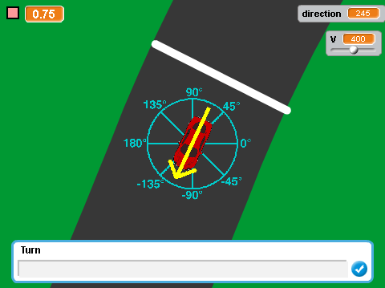

Screenshot 1

Ο παίκτης οδηγεί το αμάξι με σκοπό να ολοκληρώσει ένα γύρο όσο πιο γρήγορα μπορεί. Για να το κάνει αυτό, πρέπει να εισάγει στο παράθυρο που εμφανίζεται πόσες μοίρες να στρίψει. Αν δωθεί θετικός αρνητικός, το αμάξι στρίβει προς τα πάνω, αλλιώς, αν δωθεί αρνητικός, στρίβει προς τα κάτω.

Screenshot 2

Καθώς ο παίκτης πληκτρολογεί, το βελάκι του δείχνει την κατεύθυνση στην οποία θα κινηθεί.

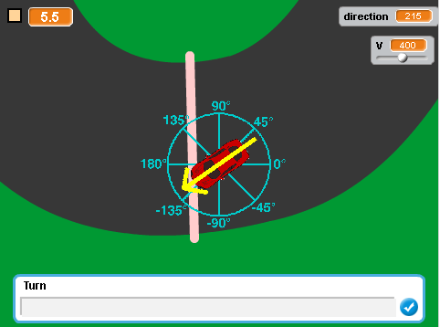

Screenshot 3

Πατώντας το Enter, το αμάξι κατευθύνεται προς την κατεύθυνση που εισήγαγε ο χρήστης και στη συνέχεια ξαναζητά νέα τιμή. Αν ο παίκτης ακουμπήσει το χορτάρι, η ταχύτητα του μειώνεται.

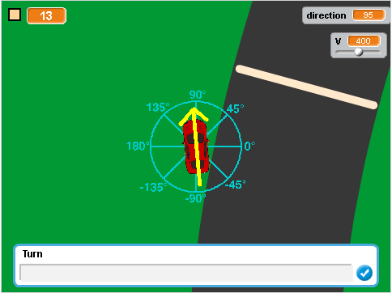

Screenshot 4

Στο πάνω αριστερά σημείο της οθόνης φαίνεται το χρώμα της επόμενης λωρίδας προς την οποία πρέπει να κατευθυνθεί ο παίκτης καθώς και το χρονόμετρο. Πάνω δεξιά στην οθόνη αναγράφεται η τωρινή κατεύθυνση του αμαξιού και η ταχύτητα του αμαξιού, την οποία μπορεί να αλλάξει ο χρήστης με το slider.

####Σενάριο

* Οι μαθητές της Β' Γυμνασίου έχουν πλέον κάνει μια εισαγωγή στην Τριγωνομετρία και θα μάθουν σήμερα για τους τριγωνομετρικούς αριθμούς των πιο συνηθισμένων γωνιών.
* Όντας ένα σημαντικό κεφάλαιο των Μαθηματικών, ο καθηγητής τους θέλει να βεβαιωθεί ότι θα μάθουν καλά αυτούς τους τριγωνομετρικούς αριθμούς. Αποφασίζει λοιπόν να βρει ένα παιχνίδι που θα τους βοηθήσει σε αυτό. 
* Το παιχνίδι αυτό είναι το Racing Game. Το Racing Game στοχεύει να το πετύχει τα παραπάνω προσελκύοντας το ενδιαφέρον του παίκτη με το γρήγορο gameplay του, το οποίο βασίζεται σε κλασικά racing παιχνίδια. Για να είναι όσο το δυνατό ταχύτερος, ο παίκτης θα πρέπει να είναι καλά εξοικειωμένος με τις γωνίες και τους τριγωνομετρικούς αριθμούς.

####Ιδέες-μελλοντικές προσθήκες

* Όταν ο παίκτης φτάσει σε κάποια λωρίδα, θα πρέπει να απαντήσει σε μία τριγωνομετρική πράξη.
* Δυσκολίες
 * Easy - χαμηλότερη ταχύτητα, τριγωνομετρικός κύκλος, βέλος
 * Medium - μέτρια ταχύτητα, βέλος
 * Hard - υψηλότερη ταχύτητα
 
Racing:
 1. Αντίπαλοι AI
  * Δύσκολο στην υλοποίηση
  * Πιο πιστό στο κλασικό παιχνίδι 
 2. Χρονομέτρηση και ανέβασμα χρόνων σε leaderboards
   * Ευκολότερη υλοποίηση
  
####Demo

Μπορείτε να βρείτε ότι έχει υλοποιηθεί μέχρι στιγμής εδώ: https://scratch.mit.edu/projects/134283038/

##Παραδοτέο 4

...

##Tελική Αναφορά

...
