#Τίτλος Εργασίας: Εκπαιδευτικό Παιχνίδι

Αυγούστης Ανδρέας
ΑΜ Π2015115
Ιόνιο Webmail:p15avgo@ionio.gr

##Παραδοτέο 0
https://github.com/p15avgo/pibookgr/tree/gh-pages/_quotes

##Παραδοτέο 1

Εκπαιδευτικό βιντεοπαιχνίδι με το εργαλείο Scratch

##Παραδοτέο 2

#ΙΟΝΙΟ ΠΑΝΕΠΙΣΤΗΜΙΟ 
#ΤΜΗΜΑ  ΠΛΗΡΟΦΟΡΙΚΗΣ 
#ΜΑΘΗΜΑ: Επικοινωνία  Ανθρώπου-Υπολογιστή 
 
Επιβλέπων καθηγητής: Χωριανόπουλος Κωνσταντίνος

##Προδιαγραφές

* Ηλικία: Μαθητές Δ΄ δημοτικού
* Θεματικές ενότητες: 
* α)Πρόσθεση και Αφαίρεση (http://ebooks.edu.gr/modules/ebook/show.php/DSDIM-D102/397/2639,10340/)
* β)Πολλαπλασιασμός και Διαίρεση (http://ebooks.edu.gr/modules/ebook/show.php/DSDIM-D102/397/2639,10324/)
* Φύλο: Και τα δύο

###Εγκατάσταση εργαλείων ανάπτυξης και τρέξιμο/αλλαγές σε υπάρχοντα παραδείγματα

* Εργαλείο ανάπτυξης: Scratch
* Αλλαγές σε υπάρχων παράδειγμα link :https://scratch.mit.edu/projects/72470156/

###Nightmare Math Shark
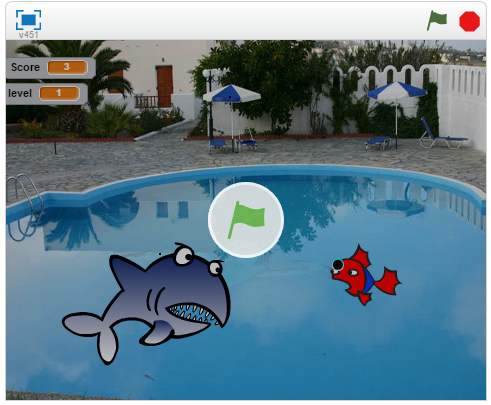

Σκοπός του παιχνιδίου είναι ο καρχαρίας(Nightmare Shark) να φάει το ψάρι.
Το κάθε επίπεδο αποτελείται από διαφορετικές πράξεις π.χ στο επίπεδο 1 ο καρχαρίας κάνει πράξεις πρόσθεσης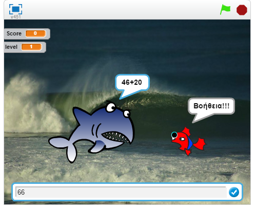
στο επίπεδο 2 κάνει πράξεις αφαίρεσης
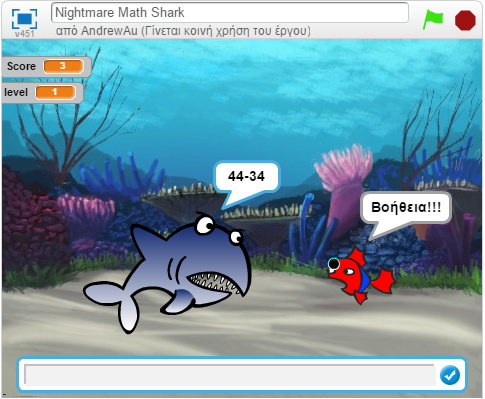 
στο επίπεδο 3 κάνει πράξεις πολλαπλασιασμού
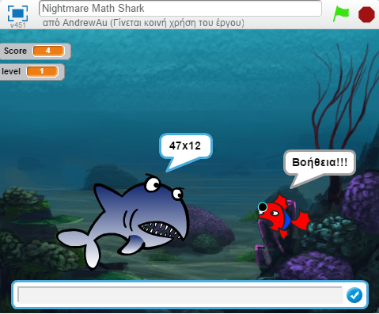 
και στο επίπεδο 4 κάνει πράξεις διαίρεσης
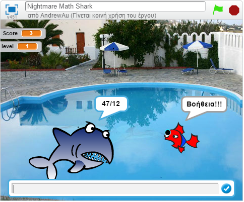.

Online Demo : https://scratch.mit.edu/projects/129727666/

##Παραδοτέο 3

##Προδιαγραφές

* Ηλικία: Μαθητές Δ΄ δημοτικού
* Θεματικές ενότητες: 
* α)Πρόσθεση και Αφαίρεση (http://ebooks.edu.gr/modules/ebook/show.php/DSDIM-D102/397/2639,10340/)
* β)Πολλαπλασιασμός και Διαίρεση (http://ebooks.edu.gr/modules/ebook/show.php/DSDIM-D102/397/2639,10324/)
* Φύλο: Και τα δύο

###Εγκατάσταση εργαλείων ανάπτυξης και τρέξιμο/αλλαγές σε υπάρχοντα παραδείγματα

* Εργαλείο ανάπτυξης: Scratch
* Αλλαγές σε υπάρχων παράδειγμα link :https://scratch.mit.edu/projects/72470156/

###Αλλαγές Παιχνιδιού

* Αλλαγές επιπέδων με περισσότερες πράξεις
* Αλλαγή εμφάνισης του Fish σε κάθε επίπεδο
* Αλλαγή εμφάνισης του Nightmare Shark 
* Αλλαγή σκηνικών υποβάθρων στο επίπεδο 1 και 4
* Διόρθωση κώδικα στα επίπεδα 2,3,4 έτσι ώστε να μην εμφανίζει συνέχεια του ίδιους αριθμούς στην πράξη

###Σενάριο
Ο καρχαρίας επονομαζόμενος και ως Nightmare Shark για να επιβιώσει θα πρέπει να φάει ψάρια.
Μόνο που επειδή είναι αργός δεν μπορεί να φάει και χρείαζεται βοήθεια.
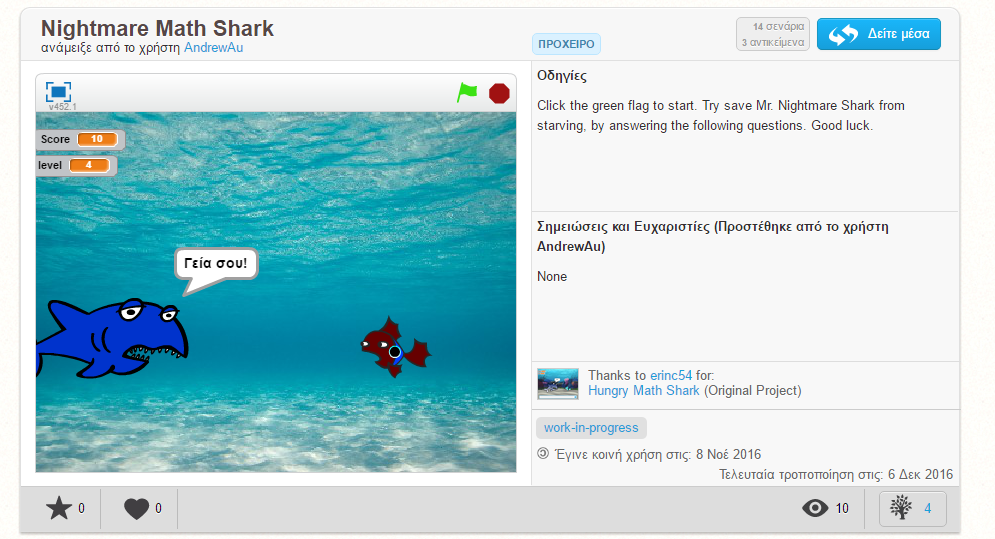

###Playthrough

Το παιχνίδι για να ξεκινήσει θα πρέπει ο παίχτης να πατήσει το πλήκτρο space
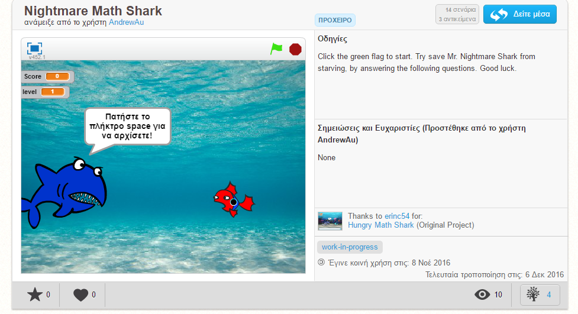

Το κάθε επίπεδο αποτελείται από διαφορετικές πράξεις π.χ στο επίπεδο 1 ο καρχαρίας κάνει πράξεις πρόσθεσης
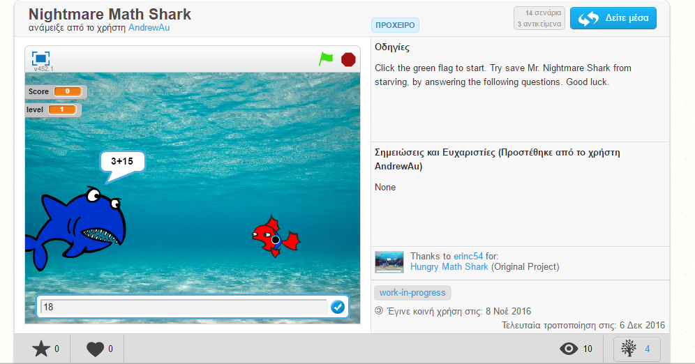
στο επίπεδο 2 κάνει πράξεις αφαίρεσης
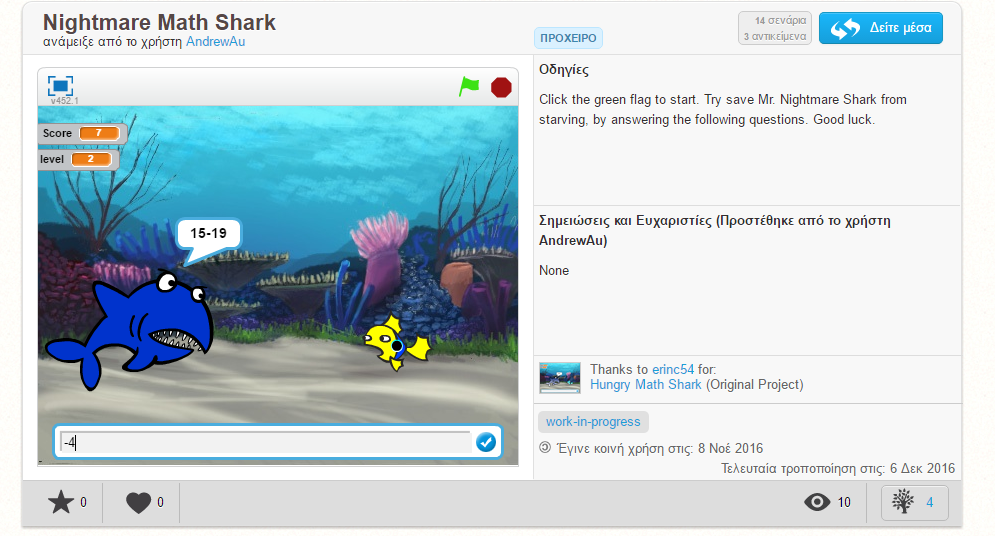 
στο επίπεδο 3 κάνει πράξεις πολλαπλασιασμού
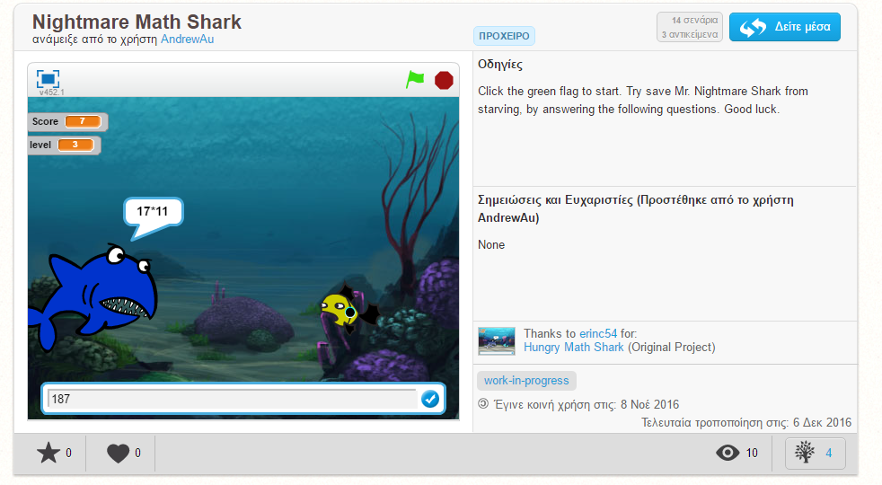 
και στο επίπεδο 4 κάνει πράξεις διαίρεσης
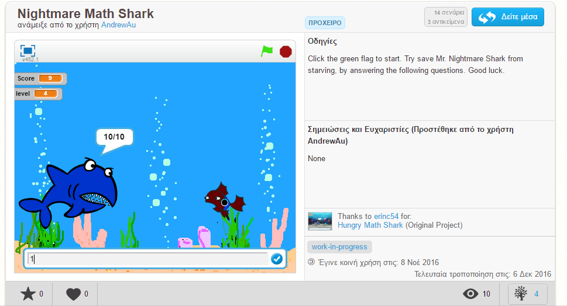.

Ο παίχτης εφόσων δώσει την σωστή απάντηση ο Nightmare Shark θα προχωρήσει
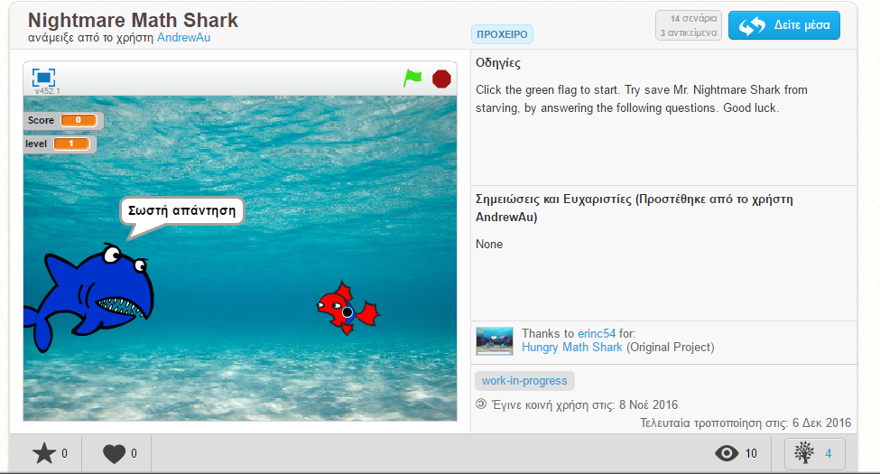

Στην περίπτωση που ο παίχτης δώσει λάθος απάντηση ο Nightmare Shark Θα παραμείνει στην ίδια θέση και τα του εμφανιστεί μια διαφορετική
πράξει
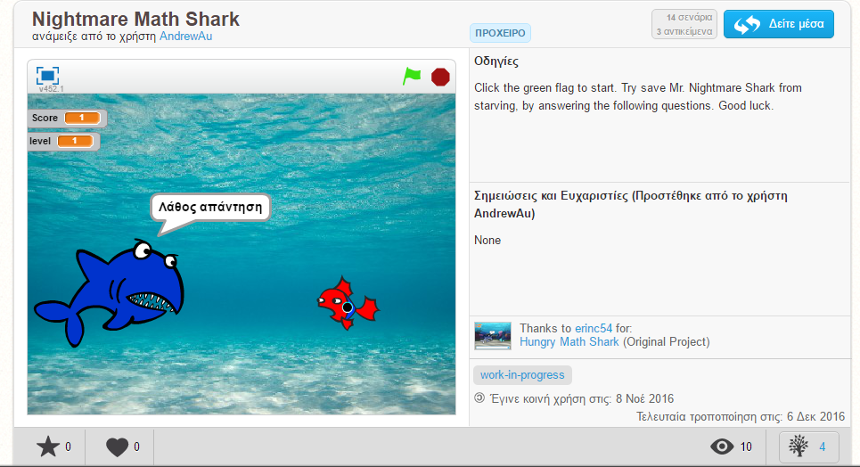

####Ιδέες - Mελλοντικές προσθήκες

* Προσθήκη 2 επιπέδων όπου ο παίχτης θα κάνει παραπάνω από μία πράξη
* Να επιλέγη ο παίχτης σε πιο επίπεδο να παίξει

####Online Demo

* Το παιχνίδι μπορείτε να το βρείτε στο παρακάτω link:
  https://scratch.mit.edu/projects/129727666
  

##Tελική Αναφορά

#ΙΟΝΙΟ ΠΑΝΕΠΙΣΤΗΜΙΟ

#ΜΑΘΗΜΑ: Επικοινωνία Ανθρώπου Υπολογιστή

####Επιβλέπων καθηγητής: Χωριανόπουλος Κωνσταντίνος
####Φοιτητής: Αυγούστης Ανδρεας
####Α.Μ.: Π2015115
####Webmail Ιονίου: p15avgo@ionio.gr

##Τίτλος: Nightmare Math Shark

##Σύνοψη

  Στα πλαίσια του μαθήματος Επικοινωνία Ανθρώπου-Υπολογιστή επέλεξα τη δημιουργία ενός εκπαιδευτικού παιχνιδιού με το εργαλείο Scratch, το οποίο είναι το Nightmare Math Shark. Αυτό το παιχνίδι το οποίο βασίζεται στο Hungry Math Shark, παρουσιάζονται βασικές έννοιες των μαθηματικών (πρόσθεση, αφαίρεση, πολλαπλασιασμός, διαίρεση) όπου ο παίκτης μαθαίνει και εξασκεί τις παραπάνω έννοιες με ευχάριστο και διασκεδαστικό τρόπο.
  
Link παιχνιδιού : https://scratch.mit.edu/projects/129727666/

##Εισαγωγή

Το παιχνίδι ακολουθεί τις παρακάτω Προδιαγραφές:

* Ηλικία: Μαθητές Δ΄ δημοτικού
* Θεματικές ενότητες: Μαθηματικά Δ΄ Δημοτικού 
 * α)Πρόσθεση και Αφαίρεση (http://ebooks.edu.gr/modules/ebook/show.php/DSDIM-D102/397/2639,10340/)
 * β)Πολλαπλασιασμός και Διαίρεση (http://ebooks.edu.gr/modules/ebook/show.php/DSDIM-D102/397/2639,10324/)
* Φύλο: Και τα δύο

Σκοπός του εκπαιδευτικού παιχνιδιού είναι να λύσει τις πράξεις.Με αυτόν τον τρόπο βοηθά τον κεντρικό χαρακτήρα(Nightmare Shark) να φάει τα ψάρια και να επιβιώση.Οι πίστες είναι τέσσερις και η κάθε μια έχει και από ένα είδος πράξεις (πρόσθεση, αφαίρεση, διαίρεση και πολλαπλασιασμός).

##Επιλογή Εργαλείων

 Το εργαλείο που χρησιμοποιήθηκε για την δημιουργία του παιχνιδίου είναι το MIT Scratch. Το MIT Scratch είναι ένα περιβάλλον προγραμματισμού στο οποίο οι χρήστες δημιουργούν προγράμματα με σύρσιμο δομικών στοιχείων με ενέργειες, οι οποίες ανήκουν σε ένα αντικείμενο. Είναι δωρεάν, σχετικά εύκολο στην εκμάθηση και την χρήση.

##Διαδικασία Ανάπτυξης

 Μετά από σειρά διαλέξεων στο μάθημα Επικοινωνία Ανθρώπου-Υπολογιστή απέκτησα βοήθεια για τη δημιουργία του εκπαιδευτικού παιχνιδιού Nightmare Math Shark. Αρχικά, ξεκίνησα με το να αλλάξω την δομή του παιχνίδιου Hungry Math Shark το οποίο είναι βασισμένο στο να κάνει μόνο μια πράξη(πολλαπλασιασμου) και να το κάνω έτσι ώστε να έχει και τις τέσσερις πράξεις(πρόσθεση, αφαίρεση, διαίρεση και πολλαπλασιασμός).Όταν το είχα κάνει στην αρχή μου έβγαζε λανθασμένες πράξεις με αποτέλεσμα να μην εκτελείται σωστά. Στην συνέχεια, εφόσον παρατήρησα καλύτερα το παιχνίδι, κατάλλαβα που ήταν το λάθος και το διόρθωσα.

##Διάγραμμα Λειτουργίας Συστήματος

 Το παιχνίδι Nightmare Math Shark έχει ως σκοπό την υλοποίηση των μαθηματικών πράξεων. Κάθε πράξη που ζητάει να κάνεις ο Nightmare Shark εμφανίζετε ένα κενό στο οποίο ο παίχτης θα πρέπει να δώσει τον σωστό αριθμό. Κάθε πράξη που εμφανίζεται κάθε φορά αλλάζουν οι αριθμοί. Σε περίπτωση που ο αριθμός που θα δώσει ο παίχτης είναι σωστός ο Nightmare Shark θα προχωρήσει κατά 1 έτσι ώστε να φάει το ψάρι. Στην περίπτωση που ο παίχτης δώσει λανθασμένη απάντηση τότε απλός ο Nightmare Shark θα παραμήνει στην θέση που ήταν χωρίς να μηδενιστεί το score και θα αλλάξουν οι αριθμοί. Σε κάθε επίπεδο υπάρχει μόνο μια αριθμητική πράξη έτσι ώστε να μην δυσκολευτεί ο παίχτης. Στο πρώτο επίπεδο υπάρχει η πράξη της πρόσθεσης, στο δεύτερο επίπεδο υπάρχει η πράξη της αφαίρεσης, στο τρίτο επίπεδο υπάρχει η πράξη του πολλαπλασιασμού και στο τέταρτο και τελευταίο επίπεδο υπάρχει η πράξη της διαίρεσης.
 
##Ενδεικτικές Οθόνες

###Πρωτότυπο Εφαρμογής
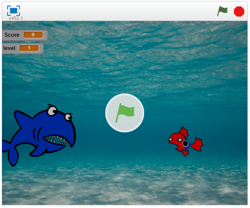

###Πρώτη εικόνα για το gameplay
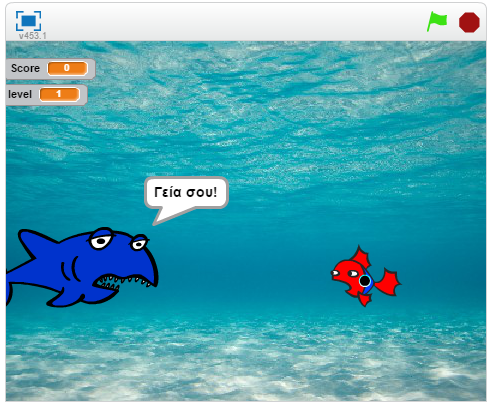

###Για την έναρξη του παιχνιδίου ο παίχτης πρέπει να πατήσει το space
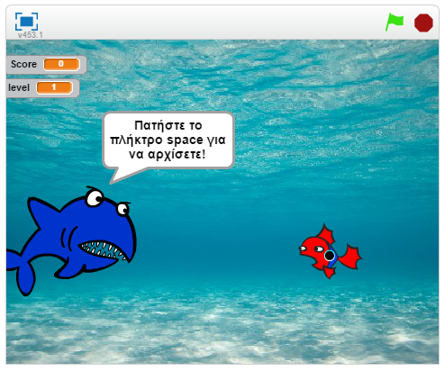

###Το αποτέλεσμα της πράξης που θα δώσει ο παίχτης
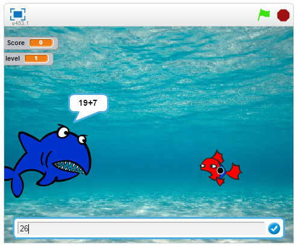

###Όταν ο παίχτης θα δώσει την σωστή απάντηση
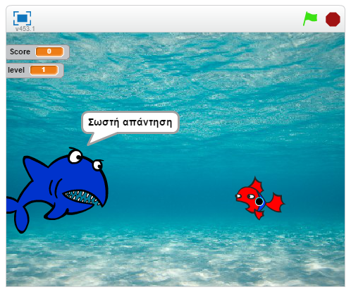

###Όταν ο παίχτης θα δώσει την λανθασμένη απάντηση
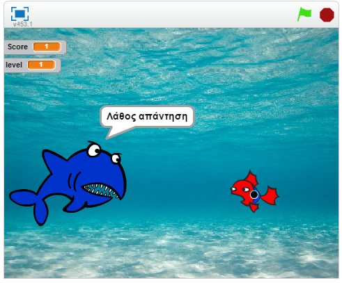

##Συμπεράσματα

  Ολοκληρώνοντας τη τελική αναφορά απέκτησα μια γενική εικόνα για τη δημιουργία ενός παιχνιδιού. Ιδιαίτερα για τα εκπαιδευτικά παιχνίδια και τη διαδικασία ανάπτυξης τους, κατέληξα στο συμπέρασμα οτι ο βαθμός δυσκολίας τους, από άποψη υλοποίησης και περιεχομένου, είναι δύσκολος.

##Αναφορές Σε Σχετικές- Παρόμοιες Εργασίες

 Ιδέες και κομμάτια από κώδικα στα ακόλουθα από τα παιχνίδι Hungry Math Shark : https://scratch.mit.edu/projects/72470156/ .
