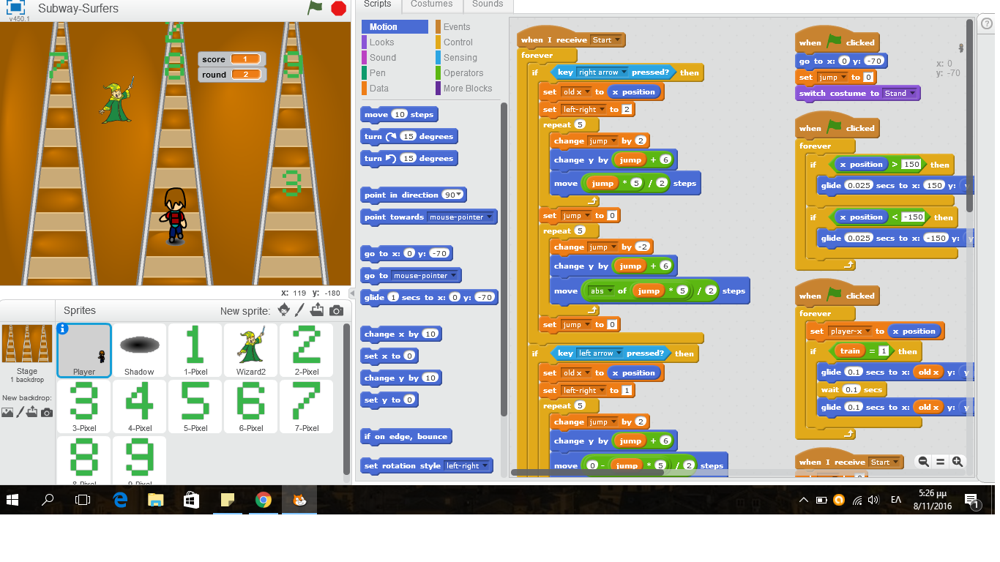
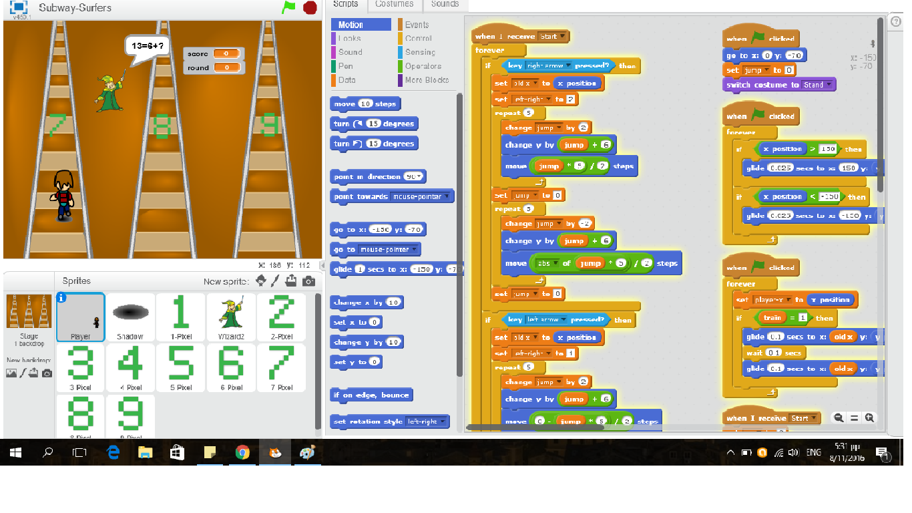
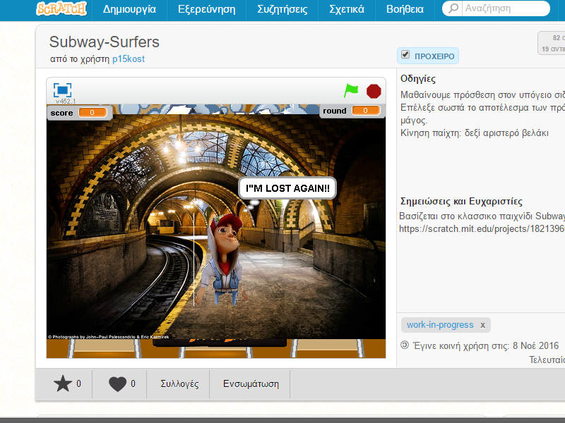
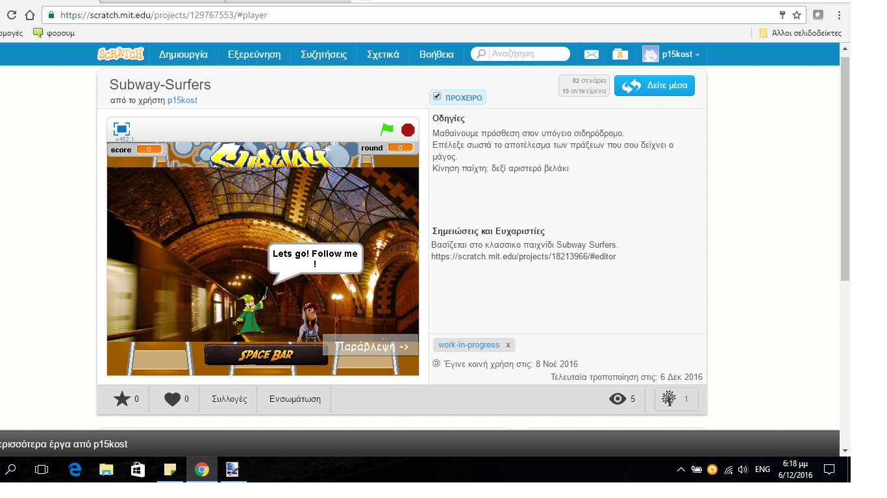
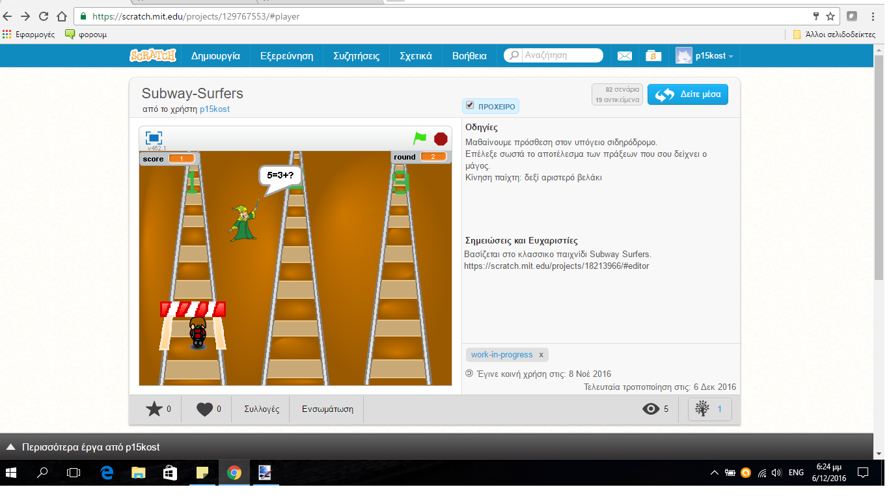
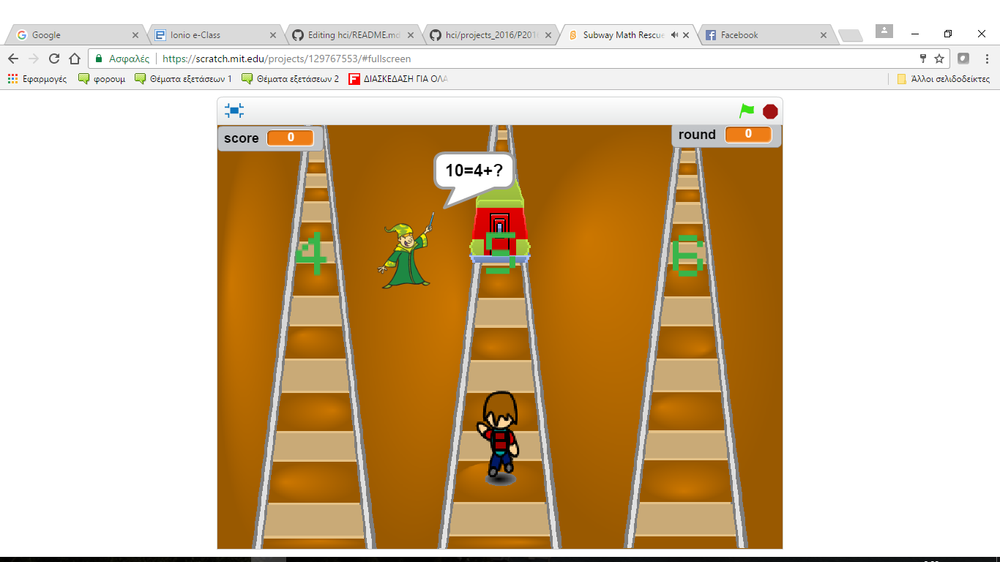

#ΙΟΝΙΟ ΠΑΝΕΠΙΣΤΗΜΙΟ-ΤΜΗΜΑΤΟΣ ΠΛΗΡΟΦΟΡΙΚΗΣ

##ΜΑΘΗΜΑ: Επικοινωνία Ανθρώπου Υπολογιστή

##Φοιτητής: Χαράλαμπος Κωστάντης-p15kost@ionio.gr
##ΑΜ: Π2015127
##Τίτλος Εργασίας: ΕΚΠΑΙΔΕΥΤΙΚΟ ΒΙΝΤΕΟΠΑΙΧΝΙΔΙ
```
Παραδοτέο 1
```
Εκπαιδευτικό βιντεοπαιχνίδι με το εργαλείο Scratch.

```
Παραδοτέο 2
```
####Προδιαγραφές

* Ηλικία: Παιδιά δημοτικού.
* Πλαίσιο χρήσης: Ηλεκτρονικός υπολογιστής.
* Σκοπός: Εκμάθηση των βασικών πράξεων της πρόσθεσης και της αφαίρεσης με διασκεδαστικό τρόπο
* Θεματική διδακτική ενότητα : Μαθηματικά Α Δημοτικού, Ενότητα 3
  http://ebooks.edu.gr/modules/ebook/show.php/DSDIM-A102/150/1075,3941/
* Γνώσεις χρήσης: Ικανότητα χειρισμού με τα βελάκια του υπολογιστή.
* Φύλο: και τα δύο.

Εγκατάσταση εργαλείων ανάπτυξης και τρέξιμο/αλλαγές στα υπάρχοντα

* Εργαλείο ανάπτυξης: Scratch
* Δανεισμός στοιχείων (ιδέες και κώδικα) από: https://scratch.mit.edu/projects/18213966/

Σχετικά στιγμιότηπα-screenshots:
(1)

(2)


###Σενάριο
Ένας νεαρός έχει χαθεί σε έναν υπόγειο σιδηρόδρομο. Τότε εμφανίζεται ένας μάγος ο οποίος του λέει ότι θα τον βοηθήσει να βγει έξω με την προυπόθεση όμως ότι αύτος θα απαντήσει σωστά σε δέκα ερωτήσεις μαθηματικών. Απαντώντας σωστά στις ερωτήσεις βοηθάμε τον ήρωα να τα καταφέρει.

####Link παιχνιδιού στο scratch:

https://scratch.mit.edu/projects/129767553/

```
Παραδοτέο 3
```
####Προδιαγραφές

* Ηλικία: Παιδιά δημοτικού.
* Πλαίσιο χρήσης: Ηλεκτρονικός υπολογιστής.
* Σκοπός: Εκμάθηση των βασικών πράξεων της πρόσθεσης και της αφαίρεσης με διασκεδαστικό τρόπο
* Θεματική διδακτική ενότητα : Μαθηματικά Α Δημοτικού, Ενότητα 3
  http://ebooks.edu.gr/modules/ebook/show.php/DSDIM-A102/150/1075,3941/
* Γνώσεις χρήσης: Ικανότητα χειρισμού με τα βελάκια του υπολογιστή.
* Φύλο: και τα δύο.

Εγκατάσταση εργαλείων ανάπτυξης και τρέξιμο/αλλαγές στα υπάρχοντα

* Εργαλείο ανάπτυξης: Scratch
* Δανεισμός στοιχείων (ιδέες και κώδικα) από: https://scratch.mit.edu/projects/18213966/

###Σενάριο
Ένας νεαρός έχει χαθεί σε έναν υπόγειο σιδηρόδρομο. Τότε εμφανίζεται ένας μάγος ο οποίος του λέει ότι θα τον βοηθήσει να βγει έξω με την προυπόθεση όμως ότι αύτος θα απαντήσει σωστά σε δέκα ερωτήσεις μαθηματικών. Απαντώντας σωστά στις ερωτήσεις βοηθάμε τον ήρωα να τα καταφέρει.

###Σχόλια
Ο χρήστης καλείται να χειριστεί τον χαρακτήρα και να απαντήσει σωστά σε ερωτήσεις πάνω στην πρόσθεση αριθμών έως το είκοσι που του κάνει ο μάγος. Αντίπαλος του ο χρόνος, καθώς οι αριθμοί έρχονται συνεχώς προς τον παίχτη, αναγκάζοντας τον να επιλέξει έναν εκ των τριών αριθμών ακόμα και αν δεν εχει προλάβει να βρει το αποτέλεσμα.Κάθε σωστή απάντηση αυξάνει το σκορ του παίχτη κατα ένα , με το δέκα στα δέκα να αποτελεί το ιδανικό αποτέλεσμα. Ωστόσο λάθος απάντηση δεν σημαίνει οτι ο παίχτης χάνει, αντίθετα το σκορ παραμένει στάσιμο. Στην προσπάθεια του αυτή ο παίχτης έχει να αντιμετωπίσει άλλον ένα αντίπαλο, τα τρένα του σιδηρόδρομου, τα οποία κατευθύνονται με ταχύτητα προς αυτόν απειλώντας να μειώσουν κατά ένα το σκορ του κάθε φορά που πέφτουν πάνω του (κατά την γνώμη μου πιο σωστό απο το να έχανε απλά καθώς αποτελεί εκπαιδευτικό και όχι απλά ψυχαγωγικό παιχνίδι).

####Βελτιώσεις

 * Σημαντική μείωση στον αριθμό των λαθών που υπήρχαν σε επίπεδο κώδικα (κυρίως όσων αφορά τους αριθμούς-αποτελέσματα και τον υπολογισμο   του σκορ).
 * Προσθήκη αντιπάλου (κινούμενων τρένων) που απειλούν τον παίχτη και κανουν το παιχνίδι περισσότερο διασκεδαστικό και ανταγωνιστικό
 * Προσθήκη βίντεο-ιστορίας μικρής διάρκειας πριν την έναρξη του παιχνιδιού καθώς και ορισμένων έξτρα γραφικών

Περισσότερα στιγμιότηπα-screenshots:
(1)

(2)

(3)


####Link παιχνιδιού στο scratch:

https://scratch.mit.edu/projects/129767553/

```
Παραδοτέο 4-Tελική Αναφορά
```

####Προδιαγραφές

* Ηλικία: Παιδιά δημοτικού.
* Πλαίσιο χρήσης: Ηλεκτρονικός υπολογιστής.
* Σκοπός: Εκμάθηση των βασικών πράξεων της πρόσθεσης και της αφαίρεσης με διασκεδαστικό τρόπο
* Θεματική διδακτική ενότητα : Μαθηματικά Α Δημοτικού, Ενότητα 3
  http://ebooks.edu.gr/modules/ebook/show.php/DSDIM-A102/150/1075,3941/
* Γνώσεις χρήσης: Ικανότητα χειρισμού με τα βελάκια του υπολογιστή.
* Φύλο: και τα δύο.

Εγκατάσταση εργαλείων ανάπτυξης και τρέξιμο/αλλαγές στα υπάρχοντα

* Εργαλείο ανάπτυξης: Scratch
* Δανεισμός στοιχείων (ιδέες και κώδικα) από: https://scratch.mit.edu/projects/18213966/

###Σενάριο
Ένας νεαρός έχει χαθεί σε έναν υπόγειο σιδηρόδρομο. Τότε εμφανίζεται ένας μάγος ο οποίος του λέει ότι θα τον βοηθήσει να βγει έξω με την προυπόθεση όμως ότι αύτος θα απαντήσει σωστά σε δέκα ερωτήσεις μαθηματικών. Απαντώντας σωστά στις ερωτήσεις βοηθάμε τον ήρωα να καταφέρει να βγει έξω από τον υπόγειο σιδηρόδρομο σώος και αβλαβής. Στην προσπάθεια μας αυτή αντίπαλος μας ,φυσικά, είναι τα τρένα που κινούνται γρήγορα πάνω στις ράγες απειλώντας να χτυπήσουν τον παίχτη!

###Σχόλια σχετικά με την ιδέα του παιχνιδιού
Ο χρήστης καλείται να χειριστεί τον χαρακτήρα και να απαντήσει σωστά σε ερωτήσεις πάνω στην πρόσθεση αριθμών έως το είκοσι που του κάνει ο μάγος. Αντίπαλος του ο χρόνος, καθώς οι αριθμοί έρχονται συνεχώς προς τον παίχτη, αναγκάζοντας τον να επιλέξει έναν εκ των τριών αριθμών ακόμα και αν δεν εχει προλάβει να βρει το αποτέλεσμα.Κάθε σωστή απάντηση αυξάνει το σκορ του παίχτη κατα ένα , με το δέκα στα δέκα να αποτελεί το ιδανικό αποτέλεσμα. Ωστόσο λάθος απάντηση δεν σημαίνει οτι ο παίχτης χάνει, αντίθετα το σκορ παραμένει στάσιμο. Στην προσπάθεια του αυτή ο παίχτης έχει να αντιμετωπίσει άλλον ένα αντίπαλο, τα τρένα του σιδηρόδρομου, τα οποία κατευθύνονται με ταχύτητα προς αυτόν απειλώντας να τον πατήσουν και να μας οδηγήσουν στην ήττα.

###Σχόλια σχετικά με την αποτελεσματικότητα-κώδικα 
-Έγινε σημαντική προσπάθεια για μείωση των λαθών σε επίπεδο κώδικα με θετικά αποτελέσματα. Ο κώδικας ωστόσο , κυρίως λόγω του φόρτου εργασίας των τελευταίων ημερών, δεν τελειοποιήθηκε με αποτέλεσμα να μην επιτευχθούν όλα όσα στόχευα.
-Να μην γίνεται χρήση του κουμπιού "παράβλεψη-skip" κατά την προβολή του εισαγωγικού βίντεο, καθώς δεν λειτουργεί ακριβώς όπως θα έπρεπε. 

####Link παιχνιδιού στο scratch:

https://scratch.mit.edu/projects/129767553/

Περισσότερα στιγμιότηπα-screenshots:
(1-εισαγωγικό βίντεο)

(2-εισαγωγικό βίντεο)

(3-εμπόδιο )

(4-εμπόδιο τρένο)


