# Τίτλος Εργασίας: Εκπαιδευτικό βιντεοπαιχνίδι

Γιώργος Μαργαρίτης ΑΜ Π2015139

## Παραδοτέο 0 (Bonus A)

https://github.com/gmargaritis/pibookgr/tree/gh-pages/_quotes

## Παραδοτέο 1

Εκπαιδευτικό βιντεοπαιχνίδι με scratch

## Παραδοτέο 2

 
### Προδιαγραφές
  
  **Hλικία:** Το παιχνίδι απευθύνεται σε παιδιά της A'Δημοτικού και άνω.

  **Φύλο Μαθητών:** Απευθύνεται και στα δύο φύλα.

  **Μάθημα:** Μαθηματικά Α'Δημοτικού [[1](http://ebooks.edu.gr/modules/document/file.php/DSDIM-A102/%CE%94%CE%B9%CE%B4%CE%B1%CE%BA%CF%84%CE%B9%CE%BA%CF%8C%20%CE%A0%CE%B1%CE%BA%CE%AD%CF%84%CE%BF/%CE%92%CE%B9%CE%B2%CE%BB%CE%AF%CE%BF%20%CE%9C%CE%B1%CE%B8%CE%B7%CF%84%CE%AE/10-0007%20-%20MATHIMATIKA%20TEYXOS%201%20(A%20DHMOTIKOY)%20BM.pdf) , [2](http://ebooks.edu.gr/modules/document/file.php/DSDIM-A102/%CE%94%CE%B9%CE%B4%CE%B1%CE%BA%CF%84%CE%B9%CE%BA%CF%8C%20%CE%A0%CE%B1%CE%BA%CE%AD%CF%84%CE%BF/%CE%92%CE%B9%CE%B2%CE%BB%CE%AF%CE%BF%20%CE%9C%CE%B1%CE%B8%CE%B7%CF%84%CE%AE/10-0009%20-%20MATHIMATIKA%20TEYXOS%202%20(A%20DHMOTIKOY)%20BM.pdf)]
  
  * Θεματική Ενότητα 3 - Κεφάλαιο 18ο Αθροίσματα μέχρι το 10 σελ.50-51
  * Θεματική Ενότητα 5 - Κεφάλαιο 34ο Μονάδες-Δεκάδες(Ι) σελ.14-15 / 35ο Αθροίσματα με πολλούς όρους σελ.16-17
  * Θεματική Ενότητα 6 - Κεφάλαιο 39ο Μονάδες και Δεκάδες(ΙΙ) σελ.26-27
  * Θεματική Ενότητα 7 - Κεφάλαιο 46ο Προσθέσεις και αφαιρέσεις διψήφιων και μονοψήφιων αριθμών σελ.40-41
  * Θεματική Ενότητα 9 - Κεφάλαιο 58ο Oι αριθμοί μέχρι το 100 – Χρήμα σελ.68-69
 
 ##
**Εργαλεία ανάπτυξης:** Scratch
 
 **Δανεισμός κώδικα από:**   [Super Mario Bros (Version 10)](https://scratch.mit.edu/projects/49905542/)
 
 
 ##

### Σενάριο
 
Ο κακός δράκος Bowser έχει απαγάγει την πριγκίπισσα Peach και τη κρατάει αιχμάλωτη στο κάστρο του. Ο χρήστης ως Super Mario πρέπει να μαζέψει τον κατάλληλο αριθμό νομισμάτων ώστε ο Garry  ο τυφλοπόντικας να του δείξει το δρομο προς το κάστρο.

### Περιγραφή

Το παιχνίδι βασίζεται στο κλασικό platformer Super Mario και αποτελείται από 4 επίπεδα (στο τεταρτο επίπεδο αντιμετωπίζει τον αρχηγό Bowser).Υπάρχουν 3 κατηγορίες νομισμάτων χρυσά,κόκκινα και μπλέ , όπου 1 κόκκινο ισοδυναμεί με 5 χρυσά αλλά και 1 μπλέ ισοδυναμεί με 10 χρυσά. Ο σκοπός του παιχνιδιού είναι ο χρήστης με τη κατάλληλη πρόσθεση νομισμάτων να φτάσει τον απαιτούμενο στόχο.Έτσι εξασκεί τις γνώσεις του στη πρόσθεση αλλα και στις δεκάδες.

##

### Screenchots

Intro Screen 1

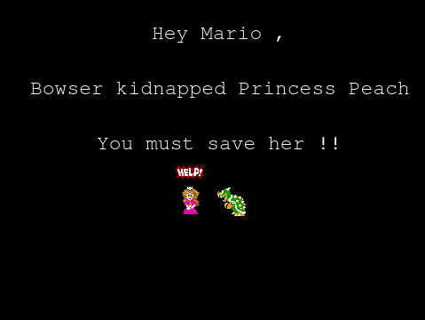

Intro Screen 2

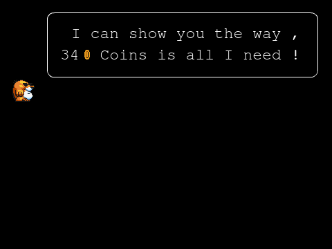

Intro Screen 3

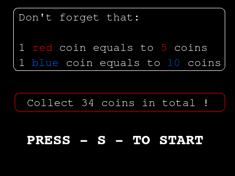

In-Game Screen 1

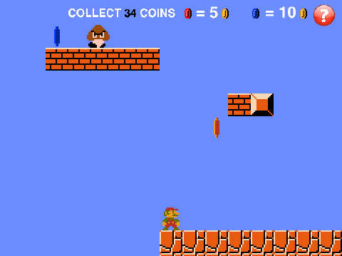

In-Game Screen 2

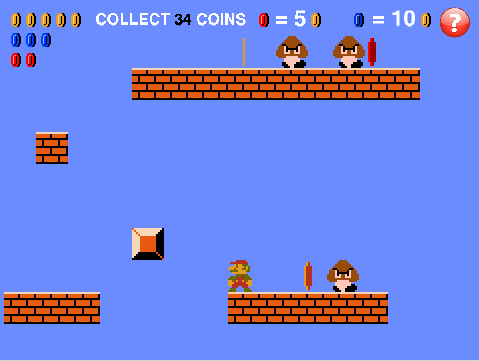

Help Display (In-Progress)

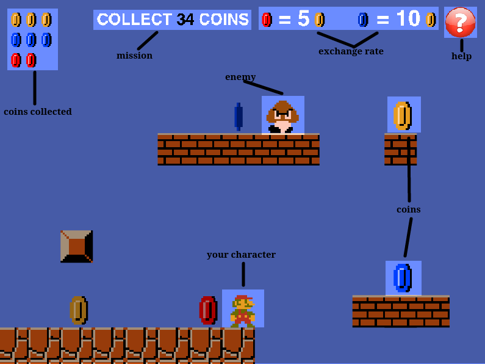

Wrong Answer (In-Progress)

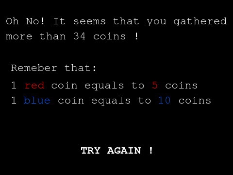

##
### Small Demo - 1st Level - (In-Progress)

https://scratch.mit.edu/projects/129264391/

## Παραδοτέο 3

 
### Προδιαγραφές
  
  **Hλικία:** Το παιχνίδι απευθύνεται σε παιδιά της A'Δημοτικού και άνω.

  **Φύλο Μαθητών:** Απευθύνεται και στα δύο φύλα.

  **Μάθημα:** Μαθηματικά Α'Δημοτικού [[1](http://ebooks.edu.gr/modules/document/file.php/DSDIM-A102/%CE%94%CE%B9%CE%B4%CE%B1%CE%BA%CF%84%CE%B9%CE%BA%CF%8C%20%CE%A0%CE%B1%CE%BA%CE%AD%CF%84%CE%BF/%CE%92%CE%B9%CE%B2%CE%BB%CE%AF%CE%BF%20%CE%9C%CE%B1%CE%B8%CE%B7%CF%84%CE%AE/10-0007%20-%20MATHIMATIKA%20TEYXOS%201%20(A%20DHMOTIKOY)%20BM.pdf) , [2](http://ebooks.edu.gr/modules/document/file.php/DSDIM-A102/%CE%94%CE%B9%CE%B4%CE%B1%CE%BA%CF%84%CE%B9%CE%BA%CF%8C%20%CE%A0%CE%B1%CE%BA%CE%AD%CF%84%CE%BF/%CE%92%CE%B9%CE%B2%CE%BB%CE%AF%CE%BF%20%CE%9C%CE%B1%CE%B8%CE%B7%CF%84%CE%AE/10-0009%20-%20MATHIMATIKA%20TEYXOS%202%20(A%20DHMOTIKOY)%20BM.pdf)]
  
  * Θεματική Ενότητα 3 - Κεφάλαιο 18ο Αθροίσματα μέχρι το 10 σελ.50-51
  * Θεματική Ενότητα 5 - Κεφάλαιο 34ο Μονάδες-Δεκάδες(Ι) σελ.14-15 / 35ο Αθροίσματα με πολλούς όρους σελ.16-17
  * Θεματική Ενότητα 6 - Κεφάλαιο 39ο Μονάδες και Δεκάδες(ΙΙ) σελ.26-27
  * Θεματική Ενότητα 7 - Κεφάλαιο 46ο Προσθέσεις και αφαιρέσεις διψήφιων και μονοψήφιων αριθμών σελ.40-41
  * Θεματική Ενότητα 9 - Κεφάλαιο 58ο Oι αριθμοί μέχρι το 100 – Χρήμα σελ.68-69
 
 ##
**Εργαλεία ανάπτυξης:** Scratch
 
 **Δανεισμός κώδικα από:**   [Super Mario Bros (Version 10)](https://scratch.mit.edu/projects/49905542/)
 
 
 ##

### Σενάριο
 
Ο κακός δράκος Bowser έχει απαγάγει την πριγκίπισσα Peach και τη κρατάει αιχμάλωτη στο κάστρο του. Ο χρήστης ως Super Mario πρέπει να μαζέψει τον κατάλληλο αριθμό νομισμάτων ώστε ο Garry  ο τυφλοπόντικας να του δείξει το δρομο προς το κάστρο.

### Περιγραφή

Το παιχνίδι βασίζεται στο κλασικό platformer Super Mario και αποτελείται από 4 επίπεδα (στο τεταρτο επίπεδο αντιμετωπίζει τον αρχηγό Bowser).Υπάρχουν 3 κατηγορίες νομισμάτων χρυσά,κόκκινα και μπλέ , όπου 1 κόκκινο ισοδυναμεί με 5 χρυσά αλλά και 1 μπλέ ισοδυναμεί με 10 χρυσά. Ο σκοπός του παιχνιδιού είναι ο χρήστης με τη κατάλληλη πρόσθεση νομισμάτων να φτάσει τον απαιτούμενο στόχο.Έτσι εξασκεί τις γνώσεις του στη πρόσθεση αλλα και στις δεκάδες.

##

### Screenchots

**Intro Screen 1**

**Intro Screen 2**

**Intro Screen 3**

**Protoype In-Game Screen 1**

**Prototype In-Game Screen 2**

**Help Display (In-Progress)**

**1st Level**

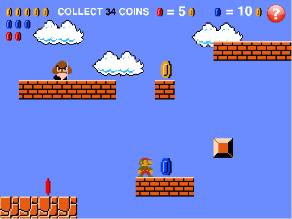

**2nd Level Intro Screen**

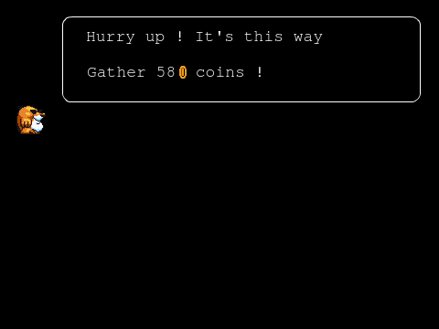

**2nd Level**

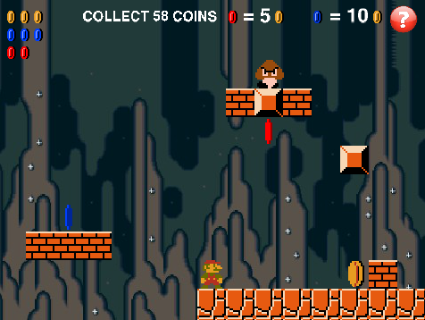

**3rd Level Intro Screen**

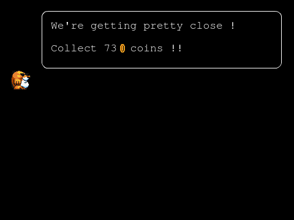

**3rd Level**

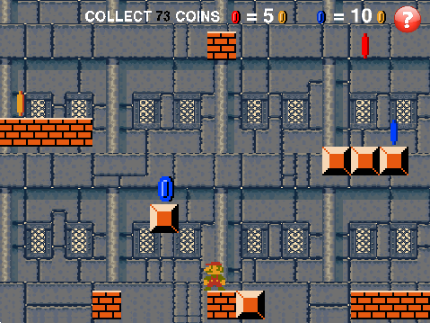

### Διαχείριση λάθους

Λόγω του εκπαιδευτικού χαρακτήρα του παιχνιδιού η διαχείριση λάθους είναι ένα πολύ σημαντικό κομμάτι , αφού πρέπει να δίνεται η δυνατότητα στο χρήστη να μαθαίνει μέσα από τα λάθη του. Για το λόγο αυτο ο χαρακτήρας του παιχνιδιού έχει άπειρες ζωες  και δεν μπορεί να πεθάνει. Παράλληλα εάν ο χρήστης μαζέψει μεγαλύτερο αριθμό νομισμάτων από αυτόν που του έχει ζητηθεί τότε αριθμός των νομισμάτων του μηδενίζεται αλλά το επίπεδο παραμένει το ίδιο. Έτσι του δίνεται η ευκαιρία να ξαπαίξει το συγκεκριμένο επίπεδο και να βρεί το σωστό αριθμό. 

##
### Game (In-Progress)

https://scratch.mit.edu/projects/129753187/

## Παραδοτέο 4

# Ιόνιο Πανεπιστήμιο

# Τμήμα Πληροφορικής

# Επικοινωνία Ανθρώπου - Υπολογιστή

## Τίτλος: Εκπαιδευτικό Βιντεοπαιχνίδι

**Γιώργος Μαργαρίτης ΑΜ Π2015139**

## Σύνοψη

Είναι ευρέως γνωστό πως τα μαθηματικά είναι ένα από τα δυσκολότερα μαθήματα του σχολικού προγράμματος ως προς την κατανόηση αλλά και την εκμάθηση τους. Για το λόγο αυτό θέλησα να δημιουργήσω ένα νέο διαδραστικό και πιο διασκεδαστικό τρόπο εκμάθησης. Έτσι λοιπόν αναπτύχθηκε,  με τη βοήθεια του λογισμικού MIT Scratch, ένα εκπαιδευτικό βιντεοπαιχνίδι για την ταχύτερη εξοικείωση των μαθητών με τη πράξη της πρόσθεσης αλλά και με τις αναλογίες. Το όνομα του είναι "Save Princess Peach" και βασίζεται στο κλασικό side-scroller Super Mario.

## Εισαγωγή

## Σενάριο

Το παιχνίδι παίρνει μέρος στο φανταστικό κόσμο του Super Mario. Ο κακός δράκος Bowser έχει απαγάγει την πριγκίπισσα Peach και τη κρατάει αιχμάλωτη στο κάστρο του. Ο χρήστης πλέον ως Super Mario πρέπει να μαζέψει τον κατάλληλο αριθμό νομισμάτων ώστε ο Garry ο τυφλοπόντικας να του δείξει το δρόμο προς το κάστρο.

## Περιγραφή gameplay του παιχνιδιού

Το παιχνίδι βασίζεται στο κλασικό platformer Super Mario όπου ο χρήστης ως ο Super Mario προσπαθεί με τη κατάλληλη πρόσθεση νομισμάτων να φτάσει τον απαιτούμενο στόχο ώστε να προχωρήσει στο επόμενο επίπεδο. Συνολικά υπάρχουν 4 επίπεδα, ενώ η δυσκολία του παιχνιδιού αυξάνεται βαθμιαία. Διάσπαρτα στις πίστες βρίσκονται κάποια νομίσματα τα οποία χωρίζονται σε τρεις κατηγορίες χρυσά,κόκκινα και μπλε. Οι αντιστοιχίες των νομισμάτων είναι οι εξής: 1 κόκκινο ισοδυναμεί με 5 χρυσά, 1 μπλε ισοδυναμεί με 10 χρυσά. Χρησιμοποιώντας τα πλήκτρα των κατευθύνσεων (δεξιά-αριστερά-πάνω) ο παίκτης μετακινεί το χαρακτήρα του προσπαθώντας να αποφύγει τους κακούς και τελικά να συλλέξει τον απαιτούμενο αριθμό νομισμάτων. Οι ζωές που διαθέτει ο παίκτης είναι άπειρες αφού στη περίπτωση που κάνει λάθος κατά τη συλλογή νομισμάτων του δίνεται η δυνατότητα ξαναπαίξει το συγκεκριμένο επίπεδο ώσπου να βρει τη σωστή απάντηση. Στην αριστερή γωνία της οθόνης προστέθηκε ένα πλαίσιο το οποίο απεικονίζει τα νομίσματα που έχει συλλέξει ο παίκτης. Στο πάνω μέρος της οθόνης βρίσκονται οι αναλογίες των νομισμάτων οι οποίες αποσκοπούν στην καλύτερη κατανόηση του παιχνιδιού από τον παίκτη. Στην δεξιά γωνία της οθόνης βρίσκεται το κουμπί βοήθειας το οποίο κατά το πάτημα του εμφανίζει την οθόνη βοήθειας.

## Διαχείριση λάθους

Λόγω του εκπαιδευτικού χαρακτήρα του παιχνιδιού η διαχείριση λάθους είναι ένα πολύ σημαντικό κομμάτι , αφού πρέπει να δίνεται η δυνατότητα στο χρήστη να μαθαίνει μέσα από τα λάθη του. Για το λόγο αυτό ο χαρακτήρας του παιχνιδιού έχει άπειρες ζωές  και δεν μπορεί να πεθάνει. Παράλληλα εάν ο χρήστης μαζέψει μεγαλύτερο αριθμό νομισμάτων από αυτόν που του έχει ζητηθεί τότε ο αριθμός των νομισμάτων του μηδενίζεται αλλά το επίπεδο παραμένει το ίδιο. Έτσι του δίνεται η ευκαιρία να ξαναπαίξει το συγκεκριμένο επίπεδο και να βρει το σωστό αριθμό.

## Επιλογή Εργαλείων

**MIT Scratch**: Το εκπαιδευτικό εργαλείο του MIT, Scratch ήταν το κύριο εργαλείο με το οποίο δημιουργήθηκε το βιντεοπαιχνίδι. Το Scratch είναι ένα προγραμματιστικό περιβάλλον που απευθύνεται κυρίως σε παιδιά μικρών ηλικιών, αφού σκοπός του είναι η εξοικείωση τους με το προγραμματισμό. Λειτουργεί με το σύρσιμο δομικών στοιχείων που απεικονίζουν προγραμματιστικές εντολές.

**GIMP Photo Editor**: Το open-source λογισμικό GIMP επικεντρώνεται κυρίως στη διαμόρφωση και την επεξεργασία εικόνας και χρησιμοποιήθηκε για την ανάπτυξη των εισαγωγικών διαφανειών.

## Προδιαγραφές

  **Hλικία:** Το παιχνίδι απευθύνεται σε παιδιά της A'Δημοτικού και άνω.

  **Φύλο Μαθητών:** Απευθύνεται και στα δύο φύλα.

  **Μάθημα:** Μαθηματικά Α'Δημοτικού [[1](http://ebooks.edu.gr/modules/document/file.php/DSDIM-A102/%CE%94%CE%B9%CE%B4%CE%B1%CE%BA%CF%84%CE%B9%CE%BA%CF%8C%20%CE%A0%CE%B1%CE%BA%CE%AD%CF%84%CE%BF/%CE%92%CE%B9%CE%B2%CE%BB%CE%AF%CE%BF%20%CE%9C%CE%B1%CE%B8%CE%B7%CF%84%CE%AE/10-0007-02_Mathimatika_A-Dim_BM-1.pdf) , [2](http://ebooks.edu.gr/modules/document/file.php/DSDIM-A102/%CE%94%CE%B9%CE%B4%CE%B1%CE%BA%CF%84%CE%B9%CE%BA%CF%8C%20%CE%A0%CE%B1%CE%BA%CE%AD%CF%84%CE%BF/%CE%92%CE%B9%CE%B2%CE%BB%CE%AF%CE%BF%20%CE%9C%CE%B1%CE%B8%CE%B7%CF%84%CE%AE/10-0009-02_Mathimatika_A-Dim_BM-2.pdf)]

  * Θεματική Ενότητα 3 - Κεφάλαιο 18ο Αθροίσματα μέχρι το 10 σελ.50-51
  * Θεματική Ενότητα 5 - Κεφάλαιο 34ο Μονάδες-Δεκάδες(Ι) σελ.14-15 / 35ο Αθροίσματα με πολλούς όρους σελ.16-17
  * Θεματική Ενότητα 6 - Κεφάλαιο 39ο Μονάδες και Δεκάδες(ΙΙ) σελ.26-27
  * Θεματική Ενότητα 7 - Κεφάλαιο 46ο Προσθέσεις και αφαιρέσεις διψήφιων και μονοψήφιων αριθμών σελ.40-41
  * Θεματική Ενότητα 9 - Κεφάλαιο 58ο Oι αριθμοί μέχρι το 100 – Χρήμα σελ.68-69

## Διαδικασία Ανάπτυξης

H ιδέα προήλθε έπειτα από την εξέταση των προϋποθέσεων που τέθηκαν από το καθηγητή για την συγκεκριμένη εργασία. Έτσι λοιπόν, η ανάπτυξη του βιντεοπαιχνιδιού βασίστηκε στο κλασικό και παγκοσμίως πετυχημένο side-scroller Super Mario.

Αρχικά έγινε σχεδίαση του user interface σε χαρτί και μετά από αρκετές αλλαγές δημιουργήθηκε μια αρχική έκδοση με τη χρήση του εργαλείου Scratch , η οποία φαίνεται εδώ:

Στη συνέχεια με τη βοήθεια των παρατηρήσεων του καθηγητή βελτιώθηκε η διαχείριση λάθους. Παράλληλα προστέθηκε ένα κουμπί βοήθειας αλλά και βελτιώθηκε το πλαίσιο εικονικής αναπαράστασης των νομισμάτων. Έγινε δανεισμός κώδικα από το παιχνίδι [Super Mario Bros (Version 10)](https://scratch.mit.edu/projects/49905542/) στο οποίο βασίστηκε και η εργασία.

### **Link για το παιχνίδι:** [Save Princess Peach](https://scratch.mit.edu/projects/140554172/)

## Ενδεικτικές οθόνες

**Intro Screen 1**

**Intro Screen 2**

**Intro Screen 3**

**Prototype In-Game Screen 1**

**Prototype In-Game Screen 2**

**Help Display**

**1st Level**

**2nd Level Intro Screen**

**2nd Level**

**3rd Level Intro Screen**

**3rd Level**

**4th Level Intro Screen**

**4th Level**

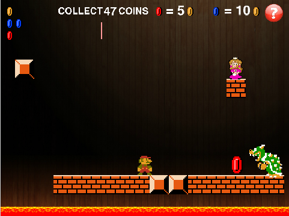

**Ending Screen**

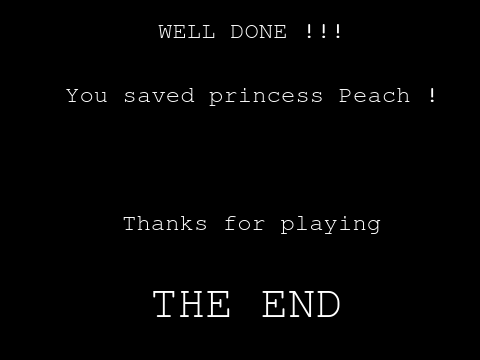

## Συμπεράσματα

Το Save Princess Peach είναι ένα ολοκληρωμένο και διασκεδαστικό εκπαιδευτικό βίντεο-παιχνίδι που είναι απόλυτα εναρμονισμένο με το πρόγραμμα σπουδών του Υπουργείου και μπορεί να χρησιμοποιηθεί από τους μαθητές για πρόσθετη εξάσκηση στον ελεύθερό τους χρόνο. Αυτό επαληθεύεται από τις συσκέψεις που υπήρξαν με το καθηγητή αλλά και τους βοηθούς που είχαν την επίβλεψη της εργασίας.

## Βιβλιογραφία

*	Chorianopoulos, Konstantinos, and Michail N. Giannakos. "Design Principles for Serious Video Games in Mathematics Education: From Theory to Practice." The International Journal of Serious Games 1.3 (2014).

