  

#ΙΟΝΙΟ ΠΑΝΕΠΙΣΤΗΜΙΟ

Τμήμα Πληροφορικής

Μάθημα: Επικοινωνία Ανθρώπου - Υπολογιστή 

Διδάσκων: Κωνσταντίνος Χωριανόπουλος

#Τίτλος Εργασίας:Εκπαιδευτικό βιντεο-παιχνίδι
ΜΑΓΟΥΝΑΚΗ ΟΥΡΑΝΙΑ - p15mago@ionio.gr

ΑΜ Π2015140

##Παραδοτέο 0
http://github.com/p15mago/pibookgr/tree/p15mago-patch-1/_quotes

##Παραδοτέο 1
Εκπαιδευτικό βιντεο-παιχνίδι με το εργαλείο  Scratch

##Παραδοτέο 2
 Προδιαγραφές:
  
  Hλικία:Το παιχνίδι απευθύνεται σε παιδιά της Στ'Δημοτικού.
  
  Μάθημα: Μαθηματικά Στ'Δημοτικού
  
  Θεματική Ενότητα 1 -Κεφάλαιο 8ο Πράξεις με μεικτές αριθμητικές παραστάσεις,Κεφάλαιο 5ο Πρόσθεση και αφαίρεση φυσικών και δεκαδικών αριθμών.
  
  Θεματική Ενότητα 2 -Κεφάλαιο 26ο Εξισώσεις στις οποίες ο άγνωστος είναι προσθετέος,Κεφάλαιο 28ο Εξισώσεις στις οποίες ο άγνωστος είναι παράγοντας γινομένου,Κεφάλαιο 29ο Εξισώσεις στις οποίες ο άγνωστος είναι διαιρετέος ή διαιρέτης.
  http://ebooks.edu.gr/modules/ebook/show.php/DSDIM101/467/3095,12495/
  
  Φύλο Μαθητών:Απευθύνεται και στα δύο φύλα.

 
 Εργαλεία ανάπτυξης: Scratch
 
 Δανεισμός κώδικα από:  BUBBLE SHOOTER https://scratch.mit.edu/projects/869411/
 
 
 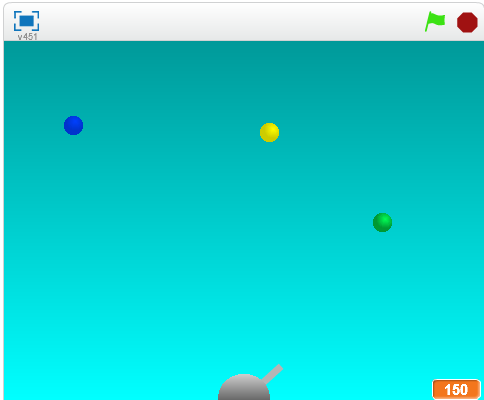
 
 **Σενάριο Παιχνιδιού:** 
 
 Το παιχνίδι αποτελείται από τρείς διαφορετικές πίστες.
 Σκοπός της πρώτης πίστας είναι ο χρήστης επιστρατεύοντας τις γνώσεις του σχετικά με τις αριθμητικές παραστάσεις να πετυχεί την σωστή φυσαλλίδα που περιέχει την απάντηση στην πράξη που εμφανίζεται, έτσι ώστε να βοηθήσει την Alice να κερδίσει ένα σουβενίρ από το Παρίσι.
 
 
 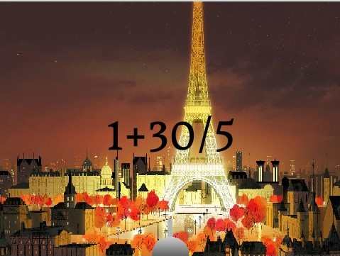
 
 

Στην επόμενη πίστα: 

 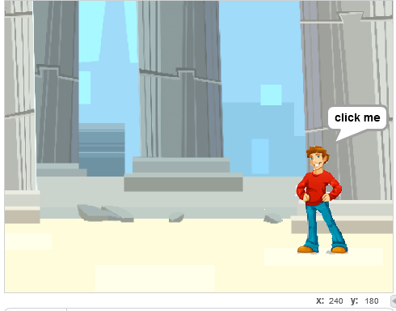

Ο Bob ταξιδεύει στην Ελλάδα με σκοπό να συμμετάσχει σ'ένα παιχνίδι που αφορά την μυθολογία. Τρείς από τους δώδεκα θεούς του Ολύμπου θα θέσουν ορισμένες ερωτήσεις στον Bob ο οποίος με την βοήθεια του χρήστη πρέπει να απαντήσει σωστά προκειμένου να πάρει τα δύο κλειδιά που χρειάζεται για να κερδίσει το δώρο των Θεών.(Οι ερωτήσεις βασίζονται στις εξισώσεις)

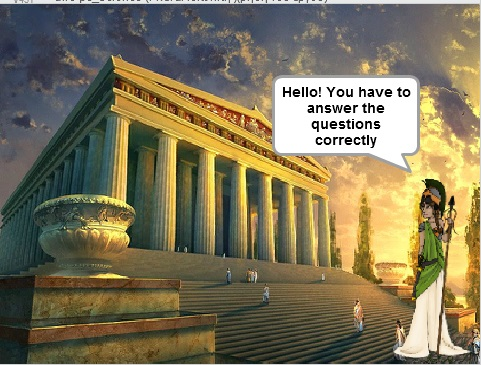
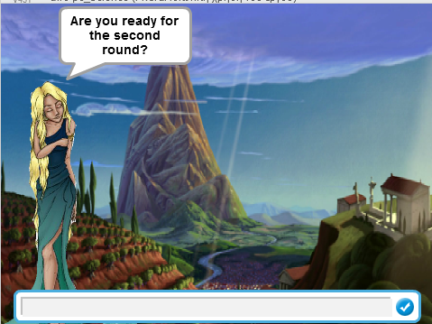
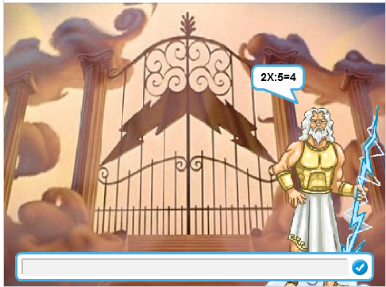 

Στην τελευταία πίστα ο χρήστης καλείται να βοηθήσει τον Tom να μαζέψει χρήματα για να θαυμάσει τις ομορφιές της Βενετίας κάνοντας μια βόλτα με την γόνδολα.

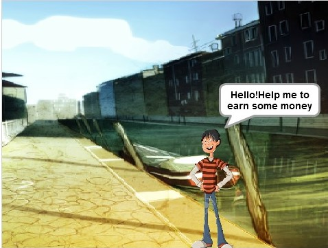

Demo: https://scratch.mit.edu/projects/128168472/
##Παραδοτέο 3
##Έναρξη νέου βίντεο-παιχνιδιού
 
 ***Προδιαγραφές:***
 
 **Hλικία:**Το παιχνίδι απευθύνεται σε παιδιά της Στ'Δημοτικού.

 **Μάθημα:** Μαθηματικά Στ' Δημοτικού, Μαθηματικά Ά Γυμνασίου
 
 **Θεματική Ενότητα 1**

**Κεφάλαιο 1.23 :** Προβλήματα με πρόσθεση και αφαίρεση κλασμάτων. (http://ebooks.edu.gr/modules/ebook/show.php/DSDIM101/467/3096,12432/)

**Κεφάλαιο 1.8 :** Πράξεις με μεικτές αριθμητικές παραστάσεις. (http://ebooks.edu.gr/modules/ebook/show.php/DSDIM101/467/3096,12439/)

**Μέρος Ά - Κεφάλαιο 7ο : Θετικοί και Αρνητικοί αριθμοί (Ά Γυμνασίου)**

**Α.7.3 :** Πρόσθεση ρητών αριθμών. (http://ebooks.edu.gr/modules/ebook/show.php/DSGYM-A200/293/2066,7226/)

**Α.7.4 :** Αφαίρεση ρητών αριθμών. (http://ebooks.edu.gr/modules/ebook/show.php/DSGYM-A200/293/2066,7227/)

**Α.7.5 :** Πολλαπλασιασμός ρητών αριθμών. (http://ebooks.edu.gr/modules/ebook/show.php/DSGYM-A200/293/2066,7228/)

**Φύλο Μαθητών:** Απευθύνεται και στα δύο φύλα.
 
**Εργαλεία ανάπτυξης:** Scratch

**Αιτιολόγηση αλλαγής παιχνιδιού:**

**Ο σχεδιασμός του προηγούμενου παιχνιδιού δεν τηρούσε τους κανόνες καλής πρακτικής και διάδρασης που βασίζεται στην αφαίρεση στοιχείων από ένα δημοφιλές κλασικό βίντεο-παιχνίδι. Συνεπώς, έχοντας ως γνώμονα τις παραπάνω προϋποθέσεις πραγματοποιήθηκε σχεδιασμός νέου παιχνιδιού.**

**Δανεισμός κώδικα από: Bubble Bobble remix** https://scratch.mit.edu/projects/16454525/

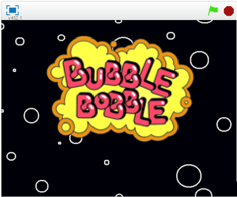

***Σενάριο Παιχνιδιού:***

Το παιχνίδι αποτελείται από τρείς πίστες. Στην πρώτη πίστα ο χρήστης επιστρατεύοντας τις γνώσεις του σχετικά με την πρόσθεση και αφαίρεση κλασμάτων πρέπει να εξολοθρεύσει τους εχθρούς οι οποίοι φέρουν το σωστό αποτέλεσμα της αντίστοιχης πράξης.Σκοπός είναι της πίστας είναι ο χρήστης να μάθει πιο γρήγορα και αποτελεσματκά τις πράξεις των κλασμάτων.

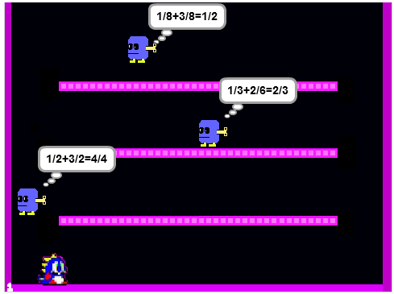

Στην περίπτωση που ο χρήστης επιλέξει εχθρό με λανθασμένο αποτέλεσμα,δύο επιπλέον εχθροί εμφανίζονται στην πίστα. Πιο συγκεκριμένα ο ένας από τους δύο εχθρούς παρουσιάζει πράξη με σωστό αποτέλεσμα και αντίστοιχα ο άλλος με λανθασμένο.

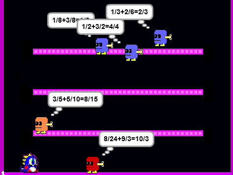

Στην δεύτερη πίστα μέσω της προσέγγισης πιο σύνθετων μαθηματικών γνώσεων ο χρήστης οφείλει να επιλέξει την αριθμητική παράσταση που δείχνει το σωστό αποτέλεσμα.Σκοπός είναι ο χρήστης να μάθει την προτεραιότητα των πράξεων.

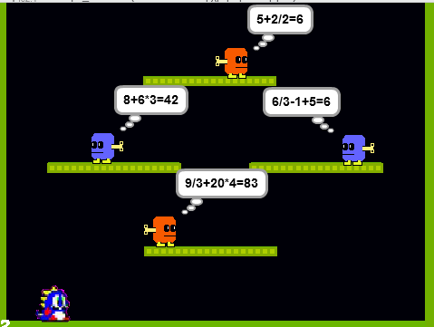

Στην περίπτωση που ο χρήστης "καταστρέψει" εχθρό που περιέχει αριθμητική παράσταση με λανθασμένο αποτέλεσμα ,ο εχθρός εξαφανίζεται.Στην θέση του, δύο ακόμη εχθροί εμφανίζονται, ένας από τους οποίους περιέχει αριθμητική παράσταση με σωστό αποτέλεσμα και ο άλλος με λανθασμένο.

Σκοπός της τρίτης πίστας είναι να δωθούν στον χρήστη τα απαραίτητα εφόδια για την μετάβαση του από την Στ΄ Δημοτικού στην Α΄ Γυμνασίου, αυτό επιτυγχάνεται μέσω της προσέγγισης ανώτερων μαθηματικών γνώσεων.Πιο συγκεκριμένα ο χρήστης μαθαίνει πράξεις με ρητούς αριθμούς. Συνεπώς οφείλει να εξαλείψει τους εχθρούς οι οποίοι κατέχουν πράξεις με λανθασμένο αποτέλεσμα.

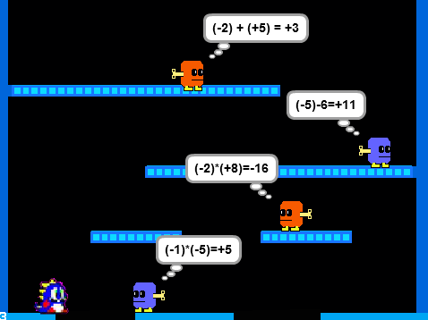

Σε περίπτωση λάθους η διαδικασία είναι παρόμοια με αυτήν της πρώτης και δεύτερης πίστας.

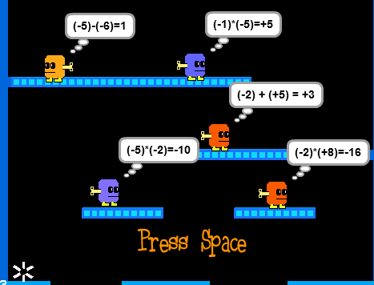

**Το παιχνίδι: Bubble Bobble Math**  https://scratch.mit.edu/projects/131258361/

##Παραδοτέο 4: Tελική Αναφορά

###Τίτλος Εκπαιδευτικού βίντεο-παιχνιδιού: Bubble Bobble Math

**Σύνοψη**

Είναι κοινά αποδεκτό ότι η εξέλιξη των τεχνολογιών της πληροφορικής έχει συμβάλλει στη διαμόρφωση νέων εκπαιδευτικών μεθόδων και πρακτικών  οι οποίες επιτρέπουν τη χρήση νέων μέσων αναπαράστασης της γνώσης. Αντικείμενο της παρούσας εργασίας είναι η δημιουργία ενός εκπαιδευτικού βιντεο-παιχνιδιού με την χρήση του λογισμικού Scratch. Το παιχνιδι έχει ως βασικό σκοπό την καλύτερη κατανόηση των μαθηματικών που αφορούν τις αριθμητικές παραστάσεις,τις πράξεις μεταξύ κλασμάτων και ρητών αριθμών 

**Εισαγωγή**

***Περιγραφή gameplay του παιχνιδιού***

Ο πρωταγωνιστής Bubble Dragon ταξιδεύει σε τρείς διαφορετικές πίστες,εκτοξεύοντας φούσκες προς τους αντιπάλους του προκειμένου να συλλέξει διάφορα φαγώσιμα αντικείμενα και να σώσει τον κόσμο. Σε κάθε πίστα οι εχθροί φέρουν μια πράξη, το αποτέλεσμα της οποίας μπορεί να είναι είτε σωστό είτε λανθασμένο. Ο χρήστης χρησιμοποιώντας τα  βέλη κατευθύνσεων και το space προσπαθεί να εξολοθρεύσει τους εχθρούς
του. Σε περίπτωση που καταστρέψει εχθρό με σωστό αποτέλεσμα τότε στην θέση του εμφανίζεται ένα φρουτάκι με ορισμένους πόντους, ενώ στην περίπτωση που ο χρήστης επιλέξει εχθρό με λανθασμένο αποτέλεσμα,δύο επιπλέον εχθροί εμφανίζονται στην πίστα. Πιο συγκεκριμένα ο ένας από τους δύο εχθρούς παρουσιάζει πράξη με σωστό αποτέλεσμα και αντίστοιχα ο άλλος με λανθασμένο. Όσον αφορά τις πίστες του παιχνιδιού ,στην πρώτη παρουσιάζεται η πρόσθεση μεταξύ κλασμάτων,στην δεύτερη οι αριθμητικές παραστάσεις και τέλος στην τρίτη οι πράξεις μεταξύ ρητών αριθμών.

***Διαχείριση λάθους***

Η διαχείριση του λαθούς στο βίντεο-παιχνίδι αποτελέσε μια αρκετά πολύπλοκη διαδικασία. Αρχικά, στην δημιουργία του πρώτου βιντεοπαιχνιδιού το οποίο δεν τηρούσε τους κανόνες καλής πρακτικής και διάδρασης που βασίζεται στην αφαίρεση στοιχείων από ένα δημοφιλές κλασικό βίντεο- παιχνίδι η διαχείριση λάθους ήταν σχεδόν ανύπαρκτη,πιο συγκεκριμένα σε περίπτωση λανθασμένης απάντησης εμφανίζονταν ένα μήνυμα "Try again!" μέχρι να απαντήσει σωστά ο χρήστης. Η κυρίαρχη υπόθεση όσον αφορά τη διαχείριση του σφάλματος βασίστηκε στην εξής αντίληψη. Ο συνεχής ανατροφοδοτισμός του χρήστη μέσω της επανάληψης συμβάλει στην απόκτηση μαθηματικής σκέψης καθώς και στην δυνατότητα καλλιέργειας του μαθηματικού εγγραμματισμού, της ικανότητας δηλαδή του χρήστη να εφαρμόζει μαθηματικές γνώσεις. Ειδικότερα, στην περίπτωση που ο χρήστης "καταστρέψει" εχθρό που περιέχει λανθασμένο αποτέλεσμα ,ο εχθρός εξαφανίζεται. Στην θέση του, δύο ακόμη εχθροί εμφανίζονται, ένας από τους οποίους περιέχει πράξη με σωστό αποτέλεσμα και ο άλλος με λανθασμένο.

**Επιλογή εργαλείων**

Το παιχνίδι υλοποιήθηκε με το **Scratch** το οποίο είναι ένα εκπαιδευτικό περιβάλλον προγραμματισμού μέσω του οποίου οι χρήστες δημιουργούν προγράμματα με βάση την θεατρική σκηνή. Διαθέτει γραφική γλώσσα προγραμματισμού η οποία συμβάλλει στη μέγιστη κατανόηση του προγραμματισμού με αποτέλεσμα να είναι πιο προσιτός σε παιδιά και εφήβους.

**Προδιαγραφές:**

 **Hλικία:**Το παιχνίδι απευθύνεται σε παιδιά της Στ'Δημοτικού.

 **Μάθημα:** Μαθηματικά Στ' Δημοτικού, Μαθηματικά Ά Γυμνασίου

 **Θεματική Ενότητα 1**

 **Κεφάλαιο 1.23 :** Προβλήματα με πρόσθεση και αφαίρεση κλασμάτων. (http://ebooks.edu.gr/modules/ebook/show.php/DSDIM101/467/3096,12432/)

 **Κεφάλαιο 1.8 :** Πράξεις με μεικτές αριθμητικές παραστάσεις. (http://ebooks.edu.gr/modules/ebook/show.php/DSDIM101/467/3096,12439/)

 **Μέρος Ά - Κεφάλαιο 7ο : Θετικοί και Αρνητικοί αριθμοί (Ά Γυμνασίου)**

 **Α.7.3 :** Πρόσθεση ρητών αριθμών. (http://ebooks.edu.gr/modules/ebook/show.php/DSGYM-A200/293/2066,7226/)

 **Α.7.4 :** Αφαίρεση ρητών αριθμών. (http://ebooks.edu.gr/modules/ebook/show.php/DSGYM-A200/293/2066,7227/)

 **Α.7.5 :** Πολλαπλασιασμός ρητών αριθμών. (http://ebooks.edu.gr/modules/ebook/show.php/DSGYM-A200/293/2066,7228/)

 **Φύλο Μαθητών:** Απευθύνεται και στα δύο φύλα.

**Διαδικασία ανάπτυξης**
Το αρχικό παιχνίδι που δημιουργήθηκε ήταν το **Bubble Shooter Remix** ο σχεδιασμός του οποίου όμως δεν τηρούσε τους κανόνες καλής πρακτικής και διάδρασης που βασίζεται στην αφαίρεση στοιχείων από ένα δημοφιλές κλασικό βίντεο-παιχνίδι.

 **Link:** https://scratch.mit.edu/projects/128168472/

Αποτέλεσμα του οποίου αποτέλεσε η δημιουργία ενός παιχνιδιού εκ νέου. Το gameplay του νέου βίντεο-παιχνιδιού βασίστηκε στο αντίστοιχο του κλασικού **Bubble Bobble remix**.

**Link Βubble Booble remix :** https://scratch.mit.edu/projects/16454525/
Η επιλογή του συγκεκριμένου έγινε διότι αποτελεί ένα ευρέως γνωστό και αρκετά διασκεδαστικό παιχνίδι. Έπειτα από τις συμβουλές του υπεύθυνου καθηγητή,των βοηθών και των συμφοιτητών έγιναν οι απαραίτητες αλλαγες οι οποίες συνέβαλαν στην βελτίωση του.

***Ενδεικτικές εικόνες***

Το παιχνίδι αποτελείται από τρείς πίστες. Στην πρώτη πίστα ο χρήστης επιστρατεύοντας τις γνώσεις του σχετικά με την πρόσθεση και αφαίρεση κλασμάτων πρέπει να εξολοθρεύσει τους εχθρούς οι οποίοι φέρουν το σωστό αποτέλεσμα της αντίστοιχης πράξης.

Στην περίπτωση που ο χρήστης επιλέξει εχθρό με λανθασμένο αποτέλεσμα,δύο επιπλέον εχθροί εμφανίζονται στην πίστα. Πιο συγκεκριμένα ο ένας από τους δύο εχθρούς παρουσιάζει πράξη με σωστό αποτέλεσμα και αντίστοιχα ο άλλος με λανθασμένο.

Στην δεύτερη πίστα μέσω της προσέγγισης πιο σύνθετων μαθηματικών γνώσεων ο χρήστης οφείλει να επιλέξει την αριθμητική παράσταση που δείχνει το σωστό αποτέλεσμα.

Στην περίπτωση που ο χρήστης "καταστρέψει" εχθρό που περιέχει αριθμητική παράσταση με λανθασμένο αποτέλεσμα ,ο εχθρός εξαφανίζεται.Στην θέση του, δύο ακόμη εχθροί εμφανίζονται, ένας από τους οποίους περιέχει αριθμητική παράσταση με σωστό αποτέλεσμα και ο άλλος με λανθασμένο.

Στην τρίτη πίστα ο χρήστης μαθαίνει πράξεις με ρητούς αριθμούς. Συνεπώς οφείλει να εξαλείψει τους εχθρούς οι οποίοι κατέχουν πράξεις με σωστο αποτέλεσμα.

Σε περίπτωση λάθους η διαδικασία είναι παρόμοια με αυτήν της πρώτης και δεύτερης πίστας.

**Το παιχνίδι: Bubble Bobble Math**  https://scratch.mit.edu/projects/131258361/

**Συμπεράσματα** 

Ολοκληρώνοντας την παρούσα εργασία μπορούμε να εξάγουμε τα εξής συμπεράσματα.
Το Bubble Bobble Math αποτελεί ένα παιχνιδι το οποίο πληρεί τις προϋποθέσεις ως εργαλείο υποβοήθησης στην κατανόηση ορισμένων ενοτήτων των μαθηματικών της Στ΄ Δημοτικού και την Ά Γυμνασίου. Επιπλέον, εκτός απο το γεγονός ότι ο χρήστης επιστρατεύει τις γνώσεις του σχετικά με τις μαθηματικές πράξεις, του δίνονται και τα απαραίτητα εφόδια για την μετάβαση του απο την Στ΄ Δημοτικού στην Ά Γυμνασίου μέσω της προσέγγισης ανωτέρων μαθηματικών γνώσεων.

**Μελλοντικές Βελτιώσεις**

Ορισμένες βελτιώσεις σχετικά με την εργασία :

 Αύξηση του αριθμού των πιστών με σκοπό την ένταξη επιπλέον ενοτήτων των μαθηματικών.

