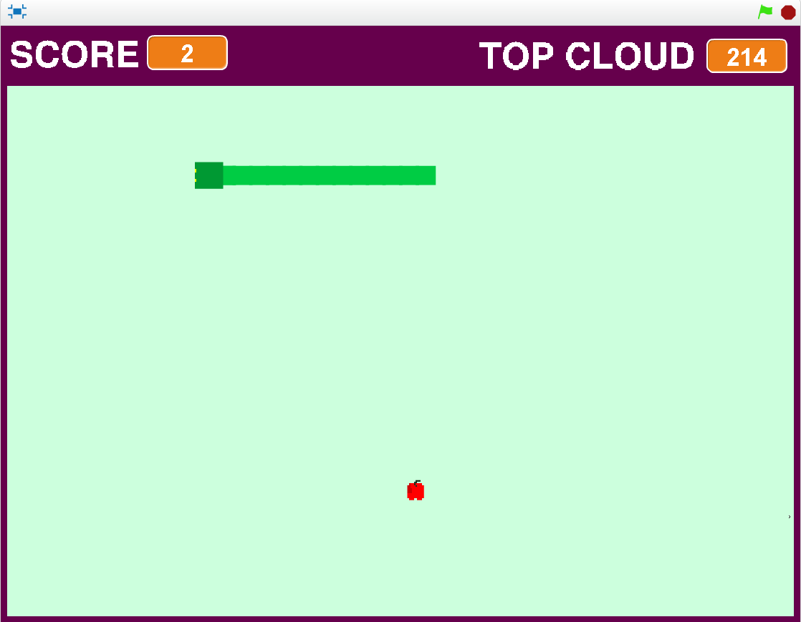
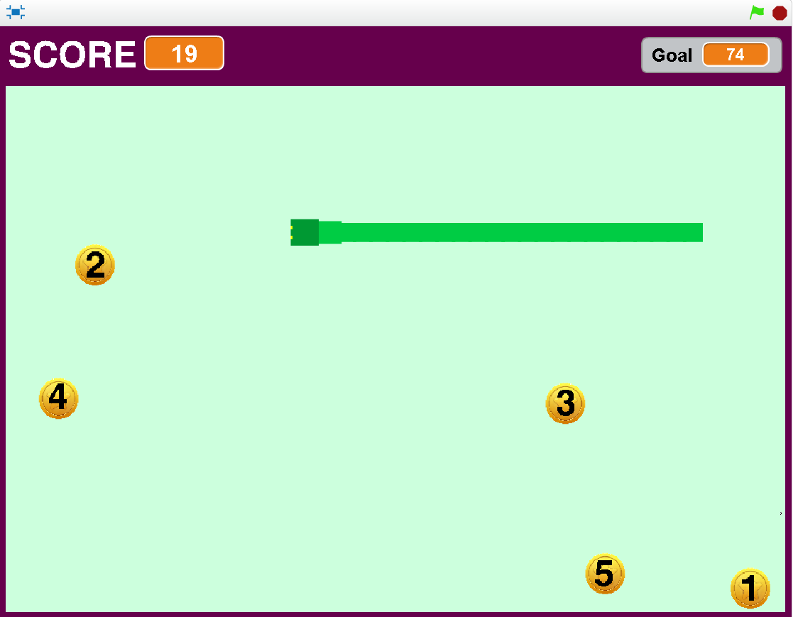

**Τίτλος Εργασίας: ΕΚΠΑΙΔΕΥΤΙΚΟ ΒΙΝΤΕΟΠΑΙΧΝΙΔΙ**

**Δανιήλ Μπαλαμπανίδης
ΑΜ: Π2015147**

**Παραδοτέο 1**

Εκπαιδευτικό βιντεοπαιχνίδι με το εργαλείο Scratch.

**Παραδοτέο 2**

# Προδιαγραφές

* Ηλικία : για παιδιά A' Δημοτικού.
* Γνώσεις:Απλές γνώσεις πρόσθεσης.
* Φύλο : Κατάλληλο για αγόρια και κορίτσια.
* Θεματική ενότητα:Μαθηματικά Α' Δημοτικού με εστίαση στην πρόσθεση αριθμών. http://ebooks.edu.gr/modules/ebook/show.php/DSDIM-A102/150/1072,3987/ 

# Εγκατάσταση εργαλείων ανάπτυξης και τρέξιμο/αλλαγές σε υπάρχοντα παραδείγματα

- Εργαλείο ανάπτυξης: Scratch
- Δανεισμός στοιχείων (ιδέες και κώδικα) από:
    
    -Need for Speed Coins
     https://scratch.mit.edu/projects/43360534/
     
     
     Pixel Snake
     -https://scratch.mit.edu/projects/72303326/
     

# Πρωτότυπο
  
  
  Demo: https://scratch.mit.edu/projects/129292893/

**Παραδοτέο 3**

**Παραδοτέο 4**

**Tελική Αναφορά**
