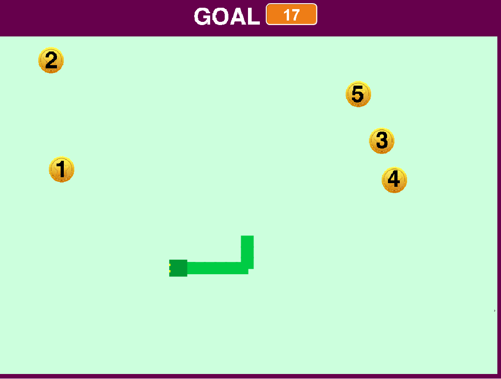
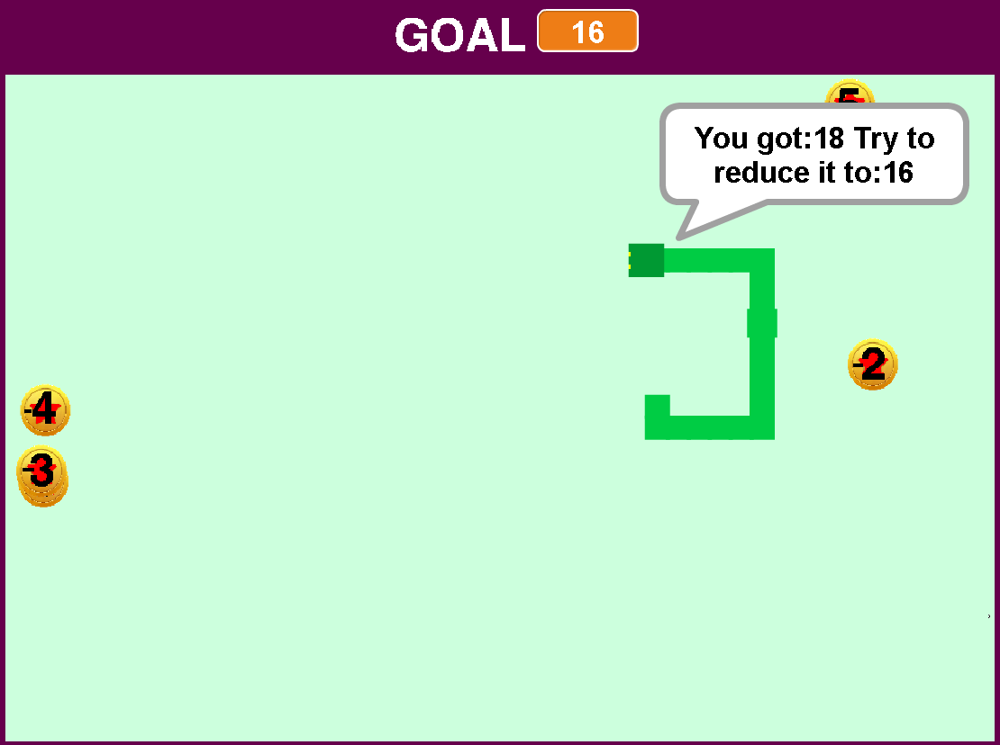

**Τίτλος Εργασίας: ΕΚΠΑΙΔΕΥΤΙΚΟ ΒΙΝΤΕΟΠΑΙΧΝΙΔΙ**

**Δανιήλ Μπαλαμπανίδης
ΑΜ: Π2015147**

**Παραδοτέο 1**

Εκπαιδευτικό βιντεοπαιχνίδι με το εργαλείο Scratch.

**Παραδοτέο 2**

# Προδιαγραφές

* Ηλικία : για παιδιά A' Δημοτικού.
* Γνώσεις:Απλές γνώσεις πρόσθεσης.
* Φύλο : Κατάλληλο για αγόρια και κορίτσια.
* Θεματική ενότητα:Μαθηματικά Α' Δημοτικού με εστίαση στην πρόσθεση αριθμών. http://ebooks.edu.gr/modules/ebook/show.php/DSDIM-A102/150/1072,3987/ 

# Εγκατάσταση εργαλείων ανάπτυξης και τρέξιμο/αλλαγές σε υπάρχοντα παραδείγματα

- Εργαλείο ανάπτυξης: Scratch
- Δανεισμός στοιχείων (ιδέες και κώδικα) από:
    
     Need for Speed Coins
     https://scratch.mit.edu/projects/43360534/
     
     
     Pixel Snake
     https://scratch.mit.edu/projects/72303326/
     

# Πρωτότυπο
  
  
  Σκοπός του παιχνιδιού είναι να μαζέψεις όσα νομίσματα σου ζητάει το παιχνίδι(Goal).Πάνω σε κάθε νόμισμα αναγράφεται ένας αριθμός
  απο το 1-5,έτσι όταν μαζεύεις ένα νόμισμα προστίθενται και οι ανάλογοι πόντοι στο score σου π.χ εάν μαζέψεις το νόμισμα με τον αριθμό
  4,θα πάρεις 4 πόντους.Βέβαια αν ξεπεράσεις το Goal,χάνεις.
  
  Demo: https://scratch.mit.edu/projects/129292893/

**Παραδοτέο 3**

# Προδιαγραφές

* Ηλικία : για παιδιά A' Δημοτικού.
* Γνώσεις:Απλές γνώσεις πρόσθεσης και αφαίρεσης.
* Φύλο : Κατάλληλο για αγόρια και κορίτσια.
* Θεματική ενότητα:Μαθηματικά Α' Δημοτικού με εστίαση στην πρόσθεση και αφαίρεση αριθμών. http://ebooks.edu.gr/modules/ebook/show.php/DSDIM-A102/150/1072,3987/ 

# Εγκατάσταση εργαλείων ανάπτυξης και τρέξιμο/αλλαγές σε υπάρχοντα παραδείγματα

- Εργαλείο ανάπτυξης: Scratch
- Δανεισμός στοιχείων (ιδέες και κώδικα) από:
    
     Need for Speed Coins
     https://scratch.mit.edu/projects/43360534/
     
     Pixel Snake
     https://scratch.mit.edu/projects/72303326/
     

Σκοπός του παιχνιδιού είναι να μαζέψεις όσα νομίσματα σου ζητάει το παιχνίδι(Goal).Πάνω σε κάθε νόμισμα αναγράφεται ένας αριθμός
απο το 1-5,έτσι όταν μαζεύεις ένα νόμισμα προστίθενται και οι ανάλογοι πόντοι στο score σου π.χ εάν μαζέψεις το νόμισμα με τον αριθμό
4,θα πάρεις 4 πόντους.Εαν ξεπεράσεις το Goal,το παιχνίδι δε τελειώνει αλλα σου δίνει μια ευκαιρία να αφαιρέσεις πόντους απο το score σου ετσι ώστε να φτάσεις το Goal.

# Βελτιώσεις/Αλλαγές

- Αφαιρέθηκε η οθόνη που δείχνει το τρέχον Score.Έτσι ο χρήστης θα πρέπει να θυμάται πόσα νομίσματα έχει μαζέψει.
- Πλέον,οταν ο χρήστης ξεπερνάει το score,το παιχνίδι δεν τελειώνει.Aντιθέτως,εμφανίζονται νομίσματα με αρνητικούς αριθμούς τα οποία αφαιρούν πόντους απο το Score του έτσι ώστε να φτάσει το ζητούμενο Goal.

Demo: https://scratch.mit.edu/projects/129292893/

**Παραδοτέο 4**

**Tελική Αναφορά**
