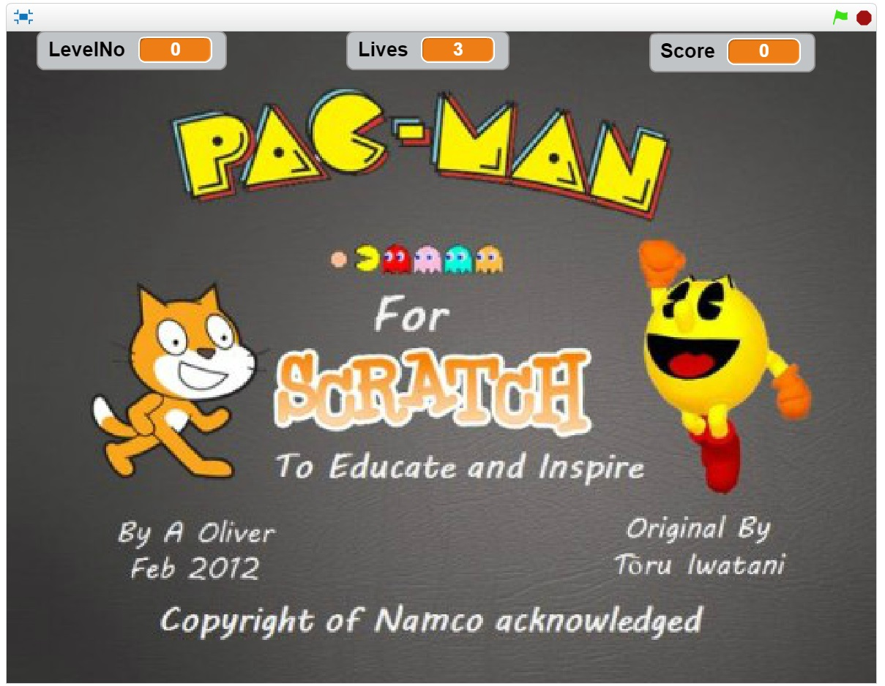

# 1. Δήλωση Θέματος
* Παπαφιλίππου Γιώργος Α.Μ.:Π2015153
* Scratch
* Απευθύνεται σε μαθητές δευτερας δημοτικού
* Πραγματεύεται ασκήσεις πολλαπλασιασμού
* Παιχνίδι με πράξεις που προσδιορίζεται για μαθητες και των δυο φύλλων

# 2. Το παιχνίδι

Το παιχνίδι αρχίζει με την οθόνη αφετηρίας
ο παίκτης πατάει το _**Space**_ και αρχίζει το παιχνίδι.
Το παιχνίδι βασίζεται στο γνωστό παιχνίδι pac-man και ο σκοπός μου ηταν να προσομοιώσω πράξεις μέσα στο gameplay
του παιχνιδιού.
Το παιχνίδι εχει 2 επίπεδα και μόλις ολοκληρώθει εμφανίζει το αντίστοιχο μήνυμα ανάλογα με το αν έχασες ή κέρδισες
Ο παίκτης εχει μόνο 3 ζωές

# 3. Το link του παιχνιδιου
* link: [Pac-man HCI](https://scratch.mit.edu/projects/141521455/#fullscreen)

# 4. Τελευταιο Παραδοτέο
### Ο πακμαν στους πολλαπλασιασμούς:
  Το παιχνίδι δημηουργήθηκε με σκοπό την εξάσκηση μαθητών δευτέρας δημοτικου στον πολλαπλασιασμό. Χρησιμοποιείτε το γνωστό
παιχνίδι πακμαν και ο σκοπός του ειναι η γνώση μέσα απο την ψυχαγωγία.
  Η ανάπτυξη του παιχνιδιού έγινε μέσα απο την μηχανή δημιουργίας παιχνιδιών Scratch και η επιλογή του θέματος έγινε απο
τις επιλογές που μας δωσατε στα αρχεία που ηταν αναρτημένα στο github.
  Τα περισσότερα κομμάτια του κώδικα ειναι αυτούσια απο το αρχικό παιχνίδι αλλα καποια επιπλέων κομματια κωδικα επρεπε
να προστεθούν για την ολοκλήρωση του προγράμματος και την προσθήκη του εκπαιδευτικού μερους του παιχνιδιού.
  Στο τελος του αρχείου ReadMe υπάρχουν κάποια Screenshots απο την αρχική οθόνη του παιχνιδιου, απο την πρώτη πίστα καθώς
και ενα κομμάτι κώδικα το οποίο εμπεριέχει τις πράξεις του παιχνιδιού.
  Προβλήματα-Συμπεράσματα: Το πρόβλημα το οποίο ειχα αντιμετοπήσει είναι το πως ο πάκμαν δεν αναγνώριζε τα μεγαλύτερα κίτρινα χάπια
οπου εκει προορίζονταν να βρίσκονται οι πραξεις οπότε το κομμάτι κώδικα με τις πράξεις δεν μπορεί να ενεργοποιηθεί κατα την εκτέλεση.
Το ανέφερα στο προηγούμενο παραδοτέο και ξανα εκανα την εργασια 2 φορες απο την αρχή αλλα δεν κατάφερα να το επιδιορθώσω.
Σημαντικό: Εχω δυσλεξία οποτε αν μπορείτε παραβλέψτε τυχόν ορθογραφικά που έκανα στο κείμενο. Ευχαριστώ.
  
  
  

# Screenshots:

ScreenShot1

ScreenShot2
![Pac-Man ScreenShot 2] (Pacman2.jpg)
ο κωδικας με τις πραξεις
![Pac-Man ScreenShot 3] (PMextraCode.jpg)
