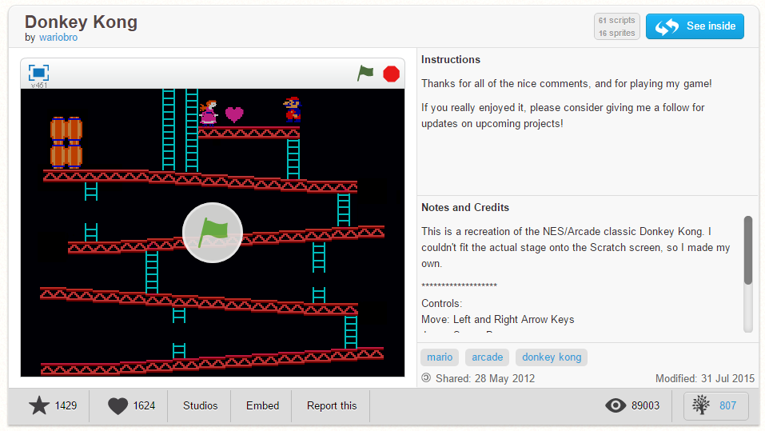
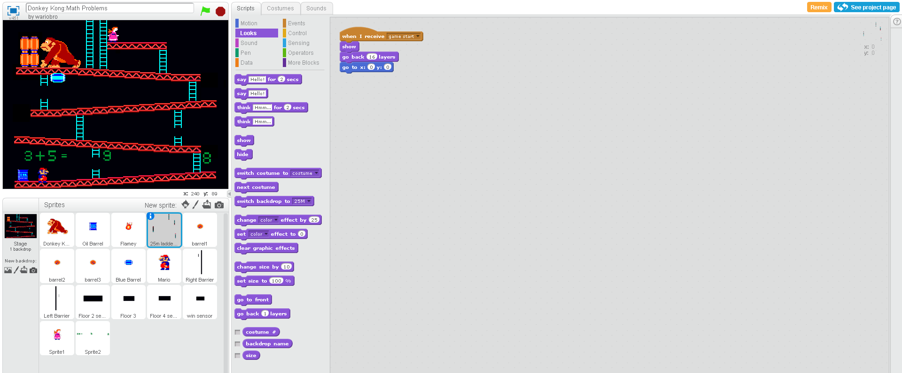

#ΙΟΝΙΟ ΠΑΝΕΠΙΣΤΗΜΙΟ 
#ΤΜΗΜΑ ΠΛΗΡΟΦΟΡΙΚΗΣ 
#ΜΑΘΗΜΑ: Επικοινωνια Ανθρωπου Υπολογιστη
 
Επιβλέπων καθηγητής: Χωριανόπουλος Κωνσταντίνος 

ΑΔΑΜΗΣ ΜΑΡΙΟΣ-ΓΕΩΡΓΙΟΣ - Π2015163 - p15adam@ionio.gr 

##Περιγραφή

- **Ηλικία:** Το παιχνίδι απευθύνεται για παιδιά δημοτικού για να μάθουν πρόσθεση και αφαίρεση.
- **Στόχος:** Ο παίκτης πρέπει να βρεί την σωστή απάντηση,για να μπορέσει να ανέβει στο επόμενο επίπεδο
- **ΙΔΕΑ:** Η ιδέα είναι απο το αρχικό Donkey Kong,απλά προσαρμοσμένο στην διδασκαλία των παιδιών.

## Εγκατάσταση εργαλείων ανάπτυξης

*	Εργαλείο ανάπτυξης: Scratch

*       Ιδέα από: [donkey kong](https://scratch.mit.edu/projects/2571216)

**_ΣΥΝΤΟΜΕΣ ΟΔΗΓΙΕΣ ΠΑΙΧΝΙΔΙΟΥ:_**

**ΧΑΝΕΙΣ ΟΤΑΝ:** Ο χρήστης δεν βρίσκει την σωστή απάντηση ή τον χτυσήσει ενα βαρέλι ή κάποιο άλλο αντικείμενο
**ΝΙΚΑΣ ΟΤΑΝ:** 'Οταν ο χρήστης βρεί όλες τις απαντήσεις σωστά
 
##ΕΙΚΟΝΕΣ ΑΠΟ ΤΟ ΠΑΙΧΝΙΔΙ:

**Εικόνα 1** 

**Εικόνα 2** 
