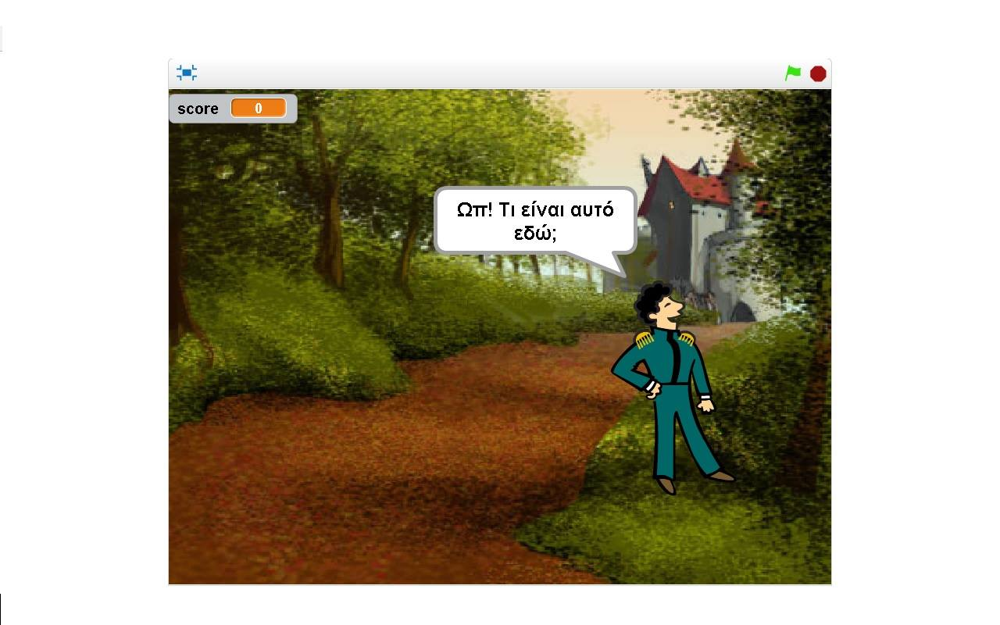
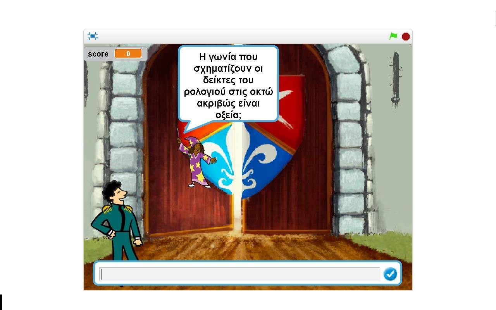
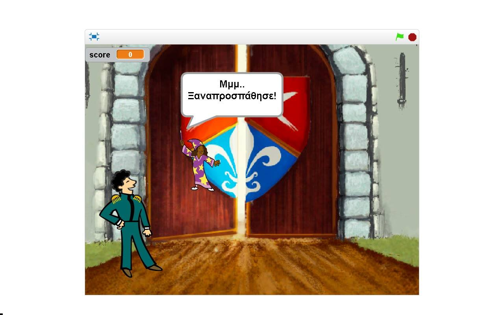
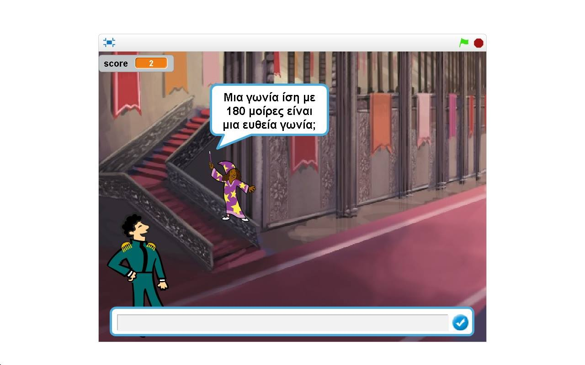
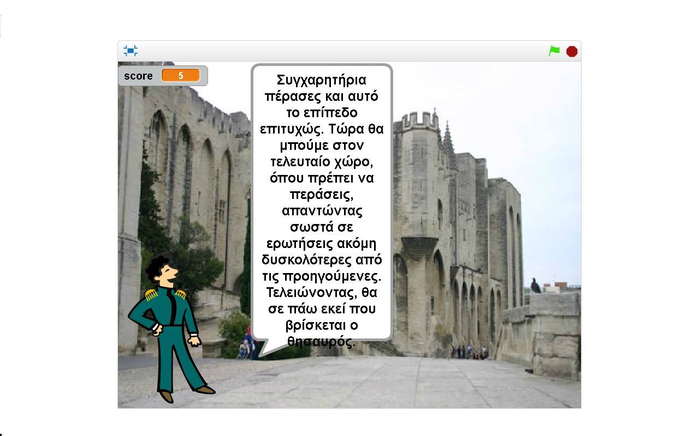
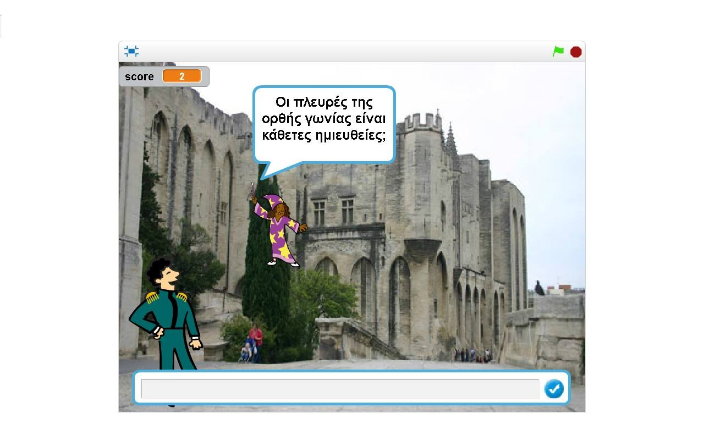
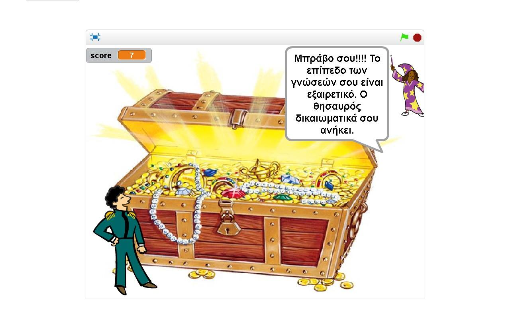

#ΙΟΝΙΟ ΠΑΝΕΠΙΣΤΗΜΙΟ
#ΤΜΗΜΑ ΠΛΗΡΟΦΟΡΙΚΗΣ
#ΜΑΘΗΜΑ: Επικοινωνία Ανθρώπου-Υπολογιστή

Επιβλέπων καθηγητής: Χωριανόπουλος Κωνσταντίνος

Φοιτήτρια: Αλβάνου Αικατερίνη-Γεωργία, p15alva@ionio.gr
Α.Μ. Π2015168

## Σύνοψη

Έναν σημαντικό κλάδο των μαθηματικών αποτελεί η Γεωμετρία, που για την πλειονότητα των μαθητών είναι δύσκολη ως προς την εφαρμογή της, καθώς προϋποθέτει μεγάλο ποσοστό αποστήθισης, επιφορτίζοντας έτσι το του διδάσκοντα. Επιπλέον, το μάθημα αυτό φαντάζει ακόμη δυσκολότερο στους μαθητές της Α’ γυμνασίου, οι οποίοι, ανεξάρτητα από το φύλο τους περνούν από το στάδιο προσαρμογής τους στην δευτεροβάθμια εκπαίδευση και δεν γνωρίζουν πως να διαχειριστούν το άγχος τους. Λαμβάνοντας αυτά υπόψιν, δημιούργησα με το λογισμικό Scratch ένα εκπαιδευτικό βιντεο-παιχνίδι, με όνομα «Treasure Hunting», κατάλληλο για άτομα αυτής της ηλικίας, με σκοπό την καλύτερη κατανόηση και ευκολότερη αποστήθιση των κανόνων του μαθήματος και την πιθανή επανάληψη σε μεγαλύτερες τάξεις, μέσα σε ένα ευχάριστο περιβάλλον, όπως αυτό ενός παιχνιδιού. 
Link παιχνιδιού: https://scratch.mit.edu/projects/124738417/

##Εισαγωγή

Περιγραφή gameplay του παιχνιδιού
Ο πρίγκηπας Καστιέλ έχει σκοπό να βρει τον κρυμμένο θησαυρό μέσα στο κάστρο, απαντώντας στις ερωτήσεις της μάγισσας Μάρτζι. Οι ερωτήσεις είναι διαβαθμισμένες σε 3 επίπεδα, από το πιο εύκολο στο δυσκολότερο και έχουν τη μορφή διαφορετικού χώρου του κάστρου. Όταν η μάγισσα διατυπώσει την ερώτηση, ο παίκτης που ταυτίζεται με το Καστιέλ πρέπει να απαντήσει σωστά, πληκτρολογώντας T/F αντίστοιχα. Για κάθε σωστή απάντηση προστίθεται ένας πόντος στο συνολικό σκορ του παιχνιδιού που φαίνεται στα αριστερά της οθόνης. Σε περίπτωση λανθασμένης απάντησης του παίκτη, το σκορ μειώνεται κατά ένα πόντο, αλλά υπάρχει  η δυνατότητα να απαντήσει ξανά στην ερώτηση και αυτή τη φορά σωστά, εφόσον οι πιθανές απαντήσεις είναι δύο. Ωστόσο, η νίκη του παίκτη είναι ανεξάρτητη της τελικής βαθμολογίας, η οποία υπάρχει μόνο για την παρακίνηση του παιδιού και την επιβράβευσή του στην εξέλιξη του παιχνιδιού. Το παιχνίδι τερματίζεται με την σωστή απάντηση σε όλες τις ερωτήσεις και την μεταφορά του πρίγκηπα στον θησαυρό. Τα επίπεδα του παιχνιδιού έχουν διαφορετικό γραφικό περιβάλλον και το καθένα αποτελείται από 3 ερωτήσεις, εκτός του τελευταίου που έχει 4. Το παιχνίδι ξεκινά με τον περίπατο του πρίγκηπα Καστιέλ στην αυλή του κάστρου, στην διάρκεια του οποίου εντοπίζει ένα πεσμένο κλειδί. Ο παίκτης που έχει τον ρόλο του Καστιέλ κατευθύνεται προς αυτό το κλειδί, χρησιμοποιώντας τα αντίστοιχα βέλη του πληκτρολογίου (πάνω-κάτω-δεξιά). Τότε εμφανίζεται η μάγισσα Μάρζτι, η οποία του εξηγεί τι πρέπει να κάνει, προκειμένου να βρει τον θησαυρό και του θέτει τις ερωτήσεις, καθοδηγώντας τον από επίπεδο σε επίπεδο.

##Αφήγηση

Το παιχνίδι στηρίζεται σε 2 πρωταγωνιστές, τον πρίγκηπα Καστιέλ και την μάγισσα Μάρτζι. Ο παίκτης παίρνει τον ρόλο του Καστιέλ και μέσω αυτής της ταύτισης παίρνει στα σοβαρά την αποστολή του για την ανακάλυψη του θησαυρού, μπαίνοντας στο κλίμα του παιχνιδιού. Ουσιαστικά όλα ξεκινούν, όταν ο Καστιέλ ξεκινά τον καθημερινό του περίπατο στην αυλή του κάστρου του και προχωρώντας βρίσκει ένα κλειδί, το οποίο του εξάπτει την περιέργεια για το τι μπορεί να ανοίγει. Αυτή του την απορία έρχεται να λύσει η Μάρτζι, η οποία τον ενημερώνει για την ύπαρξη ενός θησαυρού κάπου στο κάστρο. Αυτή η πληροφορία κεντρίζει το ενδιαφέρον του πρίγκηπα, που θέλει να μάθει που ακριβώς βρίσκεται ο θησαυρός. Έτσι, η μάγισσα του εξηγεί πως για να του αποκαλύψει την τοποθεσία και να τον μεταφέρει εκεί, θα πρέπει αυτός να απαντήσει σε ορισμένες ερωτήσεις. Οι ερωτήσεις, οι απαντήσεις και οι οδηγίες για την πορεία του παιχνιδιού έχουν την μορφή διαλόγου, δίνοντας στο παιχνίδι έναν πιο ρεαλιστικό τόνο. Το παιχνίδι τελειώνει, απαντώντας σωστά σε όλες τις ερωτήσεις, ανεξαρτήτως του συνολικού σκορ.

##Διαχείριση λάθους

Σε περίπτωση λανθασμένης απάντησης, το σκορ του παιχνιδιού μειώνεται κατά ένα βαθμό. Παρόλα αυτά, ο παίκτης έχει την ευκαιρία να απαντήσει ξανά στην ερώτηση, έχοντας τη δυνατότητα να διορθώσει το λάθος του και να πάρει πίσω τον πόντο που έχασε. Ωστόσο, εφόσον το παιχνίδι είναι εκπαιδευτικό έχει ως κύριο στόχο την μάθηση. Έτσι, η νίκη είναι ανεξάρτητη της βαθμολογίας, καθώς δεν είναι απλά μια επιβράβευση που στηρίζεται σε ένα τελικό σκορ, αλλά μια ανταμοιβή στην προσπάθεια του παίκτη να απαντήσει σωστά σε όλες τις ερωτήσεις.

##Σενάριο χρήσης

Ο Κώστας είναι μαθητής της Α’ Γυμνασίου. Το επίπεδό του στα υπόλοιπα μαθήματα είναι υψηλό, οι επιδόσεις του στη Γεωμετρία όμως, όπως και των περισσότερων συμμαθητών του είναι μέτριες, κάτι που τον έχει απογοητεύσει. Ο καθηγητής του, κ. Κούβαρης, προσπαθώντας να τον βοηθήσει και να μετριάσει την απογοήτευσή του, του συστήνει το βιντεο-παιχνίδι Treasure Hunting, για να κάνει εξάσκηση στην θεωρία του μαθήματος και να μάθει με μεγαλύτερη ευκολία και πιο διασκεδαστικό τρόπο τους κανόνες θεωρίας που αυτό απαιτεί.

##Επιλογή εργαλείων

**MIT Scratch**: Αποτελεί το κύριο εργαλείο ανάπτυξης του βιντεο-παιχνιδιού μου. Πρόκειται για ένα περιβάλλον προγραμματισμού στο οποίο οι χρήστες δημιουργούν προγράμματα με το σύρσιμο δομικών στοιχείων με ενέργειες, που ανήκουν σε ένα αντικείμενο. Δίνει την δυνατότητα της αλλαγής του γραφικού περιβάλλοντος και της ένταξης ήχου, προσφέροντας μεγαλύτερο ενδιαφέρον. Είναι σχετικά εύκολο στην εκμάθηση και την χρήση, καθώς είναι κατάλληλο για άτομα ηλικίας άνω των 8 ετών.

##Διαδικασία ανάπτυξης

Η ιδέα για την δημιουργία ενός παιχνιδιού που να αφορά κυνήγι θησαυρού προήλθε από τα παιχνίδια Treasure Hunt και Treasure Island (https://scratch.mit.edu/projects/11025565/ και https://scratch.mit.edu/projects/122681298/ αντίστοιχα). Αυτά τα χρησιμοποίησα σαν πρότυπα για να καταλάβω την λειτουργία του Scratch και να εισάγω διαφορετικά αντικείμενα με την δυνατότητα μετακίνησής τους, μέσω των βελών. Αν και το παιχνίδι μου δεν αποτελεί κλασσικό βιντεο-παιχνίδι, η θεματολογία του ως προς τους πρωταγωνιστές και το εκπαιδευτικό περιεχόμενο κέρδισε το ενδιαφέρον κάποιων μαθητών (10 συνολικά σε αριθμό, μεταξύ αυτών συγγενών μου και μαθητών του 1ου Γυμνασίου Περάματος, της πόλης καταγωγής και διαμονής μου), στους οποίους το παρουσίασα αρχικά σαν ιδέα και στην συνέχεια τους ζήτησα να το δοκιμάσουν και να προτείνουν αλλαγές. Έτσι σταδιακά από τα σχόλια των καθηγητών και των παιδιών αυτών, πρόσθεσα ήχο σε κάποια σημεία, το σκορ στα αριστερά της οθόνης και την αντιμετώπιση σε περίπτωση λανθασμένης απάντησης.

#Ενδεικτικές Οθόνες

##Οθόνη 1

##Οθόνη 2

##Οθόνη 3

Με τη σειρά που δίνονται οι οθόνες, βλέπουμε  τον πρίγκηπα να ξεκινάει την βόλτα, να βρίσκει το κλειδί και να αναρωτιέται τι μπορεί αυτό να ανοίγει.

##Οθόνη 4
 

##Οθόνη 5

##Οθόνη 6

Στις οθόνες 4, 5 και 6, βλέπουμε τη μάγισσα Μάρτζι να εξηγεί τη διαδικασία διεξαγωγής του παιχνιδιού.

##Οθόνη 7

Μια από τις ερωτήσεις του 1ου επιπέδου

##Οθόνη 8

	

Τι συμβαίνει σε περίπτωση σωστής απάντησης.

##Οθόνη 9

##Οθόνη 10

Στις οθόνες 9 και 10 βλέπουμε την αντιμετώπιση λανθασμένης απάντησης.

##Οθόνη 11

Εισαγωγή στο 2ο επίπεδο.

##Οθόνη 12

Ερώτηση 2ου επιπέδου.

##Οθόνη 13

Εισαγωγή στο 3ο επίπεδο
##Οθόνη 14

Ερώτηση 3ου επιπέδου.

##Οθόνη 15

Ολοκλήρωση του παιχνιδιού.

##Συμπεράσματα-Βελτιώσεις

Το «Treasure Hunting» αποτελεί ένα βιντεο-παιχνίδι πλήρως εναρμονισμένο με το πρόγραμμα σπουδών του Υπουργείου Παιδείας για την Α’ Γυμνασίου και είναι ικανό να βοηθήσει τους μαθητές να κατανοήσουν κάποια από τα θεωρήματα της Γεωμετρίας και να τα απομνημονεύσουν. Ωστόσο, το παιχνίδι μπορεί να επεκταθεί, είτε προσθέτοντας ερωτήσεις υψηλότερου επιπέδου, είτε μαθήματα, όπως τα Μαθηματικά.

	
	

