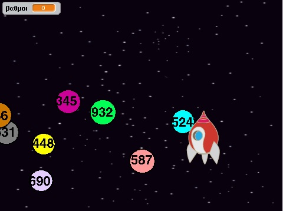
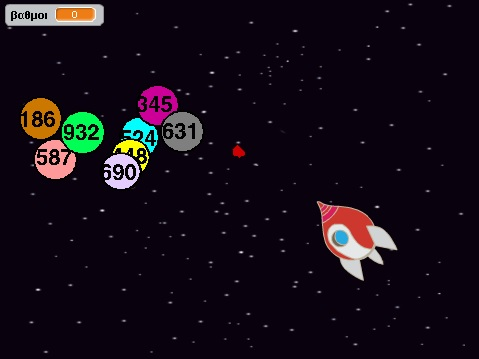

#Δημιουργία βιντεοπαιχνιδιού με εργαλείο
Αναστασία Τζώρα
ΑΜ Π2015196

##Παραδοτέο 1

Εκπαιδευτικό παιχνίδι (Scratch)

##Παραδοτέο 2

Παιχνίδι βασισμένο στο Κεφάλαιο 1. Βιβλίο μαθηματικών Α' γυμνασίου.
 Α.1.1. Φυσικοί αριθμοί - Διάταξη Φυσικών - Στρογγυλοποίηση
http://ebooks.edu.gr/modules/ebook/show.php/DSGYM-A200/293/2066,7179/
 Α.1.4. Ευκλείδεια διαίρεση - Διαιρετότητα. Πιο συγκεκριμένα ποιοι αριθμοί διαιρούνται με το 2
http%3A%2F%2Febooks.edu.gr%2Fmodules%2Febook%2Fshow.php%2FDSGYM-A200%2F293%2F2066%2C7182%2F&h=NAQG_Jh3o

Απευθύνεται σε μαθητές ανεξαρτήτως φύλου και δεν προϋποθέτει προϋπάρχουσες γνώσεις μαθηματικών. 

Ιδέα:

Ένα παιχνίδι που ο στόχος είναι ο παίχτης να μάθει να ξεχωρίζει τους άρτιους από τους περιττούς αριθμούς. Υπάρχει ένα διαστημόπλοιο,
 το οποίο εκτοξεύει κόκκινες μπάλες με σκοπό να πετύχει τους άρτιους αριθμούς και να αποφύγει τους περιττούς. Για κάθε αριθμό που 
 πετυχαίνει παίρνει 5 πόντους. Αν οποιοσδήποτε αριθμός ακουμπήσει το διαστημόπλοιο τότε το παιχνίδι σταματάει. Υπάρχει ένα πινακάκι 
 το οποίο μας λέει το σκορ του παίχτη. Ο χειρισμός γίνεται με το πληκτρολόγιο και συγκεκριμένα με τα βελάκια (πάνω,κάτω,δεξιά,αριστερά),
 με το space και άλλα δυο πλήκτρα για την περιστροφή του διαστημοπλοίου.
 
 
 
 
 
 Κώδικας: https://scratch.mit.edu/projects/134622271/
 
##Παραδοτέο 3

...

##Παραδοτέο 4

...

##Tελική Αναφορά

...
