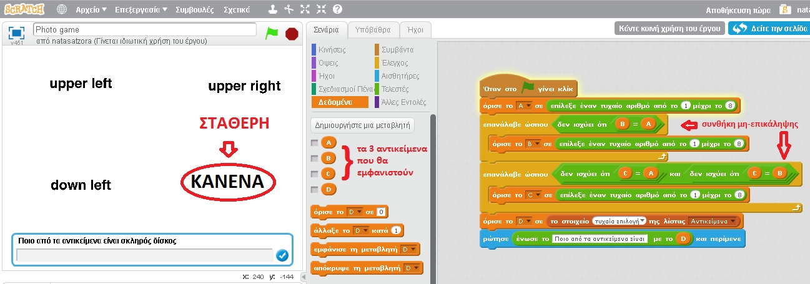
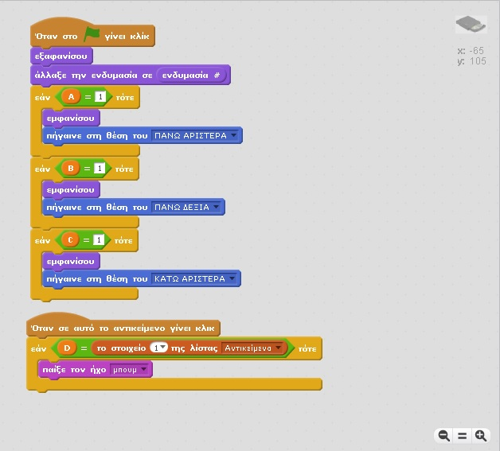
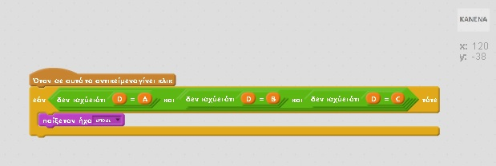

#Δημιουργία βιντεοπαιχνιδιού με εργαλείο
Αναστασία Τζώρα
ΑΜ Π2015196

##Παραδοτέο 1

Εκπαιδευτικό παιχνίδι (Scratch)

##Παραδοτέο 2

Παιχνίδι βασισμένο στο Κεφάλαιο 2: Το εσωτερικό του υπολογιστή από το βιβλίο πληροφορικής Β' Γυμνασίου

http://ebooks.edu.gr/modules/ebook/show.php/DSB101/4/28,71/

Προαπαιτούμενα: Ποντίκι, κάρτα ήχου

Στόχος: Κατανόηση της διδακτικής ενότητας:

Ιδέα:

Ένα παιχνίδι όπου θα εμφανίζονται φωτογραφίες από εσωτερικά μέρη του υπολογιστή και θα ζητήται από τον παίχτη να εντωπίσει το σωστό αντικείμενο.

Προεργασία:

Κατασκευάζω μια λίστα 8 αντικειμένων από την οποία θα αντλώ τις πληροφορίες.

Στο σκηνικό φτιάχνω ένα πλέγμα στο οποίο ορίζω 4 θέσεις σταθερές, στις 3 από αυτές θα εμφανίζονται αντικείμενα με τυχαίο τρόπο και η μια θα είναι σταθερή και θα περιέχει την επιλογή ΚΑΝΕΝΑ.

Για κάθε αντικείμενο θα ορίσω διαφορετικές ενδυμασίες, οι οποίες θα εμφανίζονται με τυχαίο τρόπο ώστε να πετύχω μεγαλύτερη ποικηλία στο παιχνίδι.

Πώς φτιάχνονται τα δεδομένα; : Επιλέγω σενάρια, επιλέγω δεδομένα και δημιουργώ τη λίστα μου.

Πώς φτιάχνω την ερώτηση; : Η ερώτηση αποτελείται από 2 κομμάτια. Ένα σταθερό κι ένα μεταβλητό.

Κατασκευή αντικειμένων

Επόμενο και τελευταίο βήμα είναι να ορίσω ιδιότητες στα αντικείμενα

Το εμφανίζω μόνο όταν έχει επιλεχθεί από τν τυχαία μεταβλητή και επιπλέον ορίζω όταν ο χρήστης δώσει τη σωστή αππάντηση να βγαίνει ένας ήχος.

Για το αντικείμενο ΚΑΝΕΝΑ το ορίζω ως σωστή απάντηση όταν κανένα από τα άλλα 3 αντικείμενα δεν είναι σωστό.

Κώδικας: https://scratch.mit.edu/projects/129893186/

##Παραδοτέο 3

...

##Παραδοτέο 4

...

##Tελική Αναφορά

...
