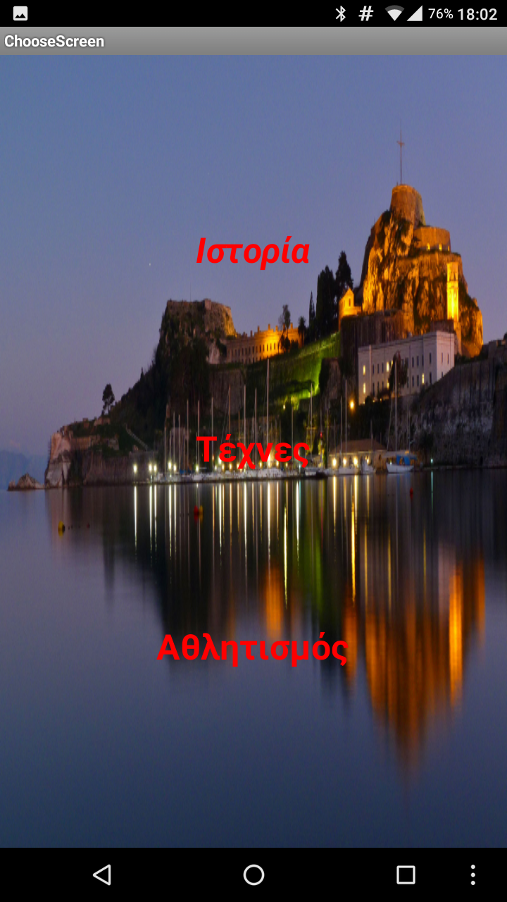
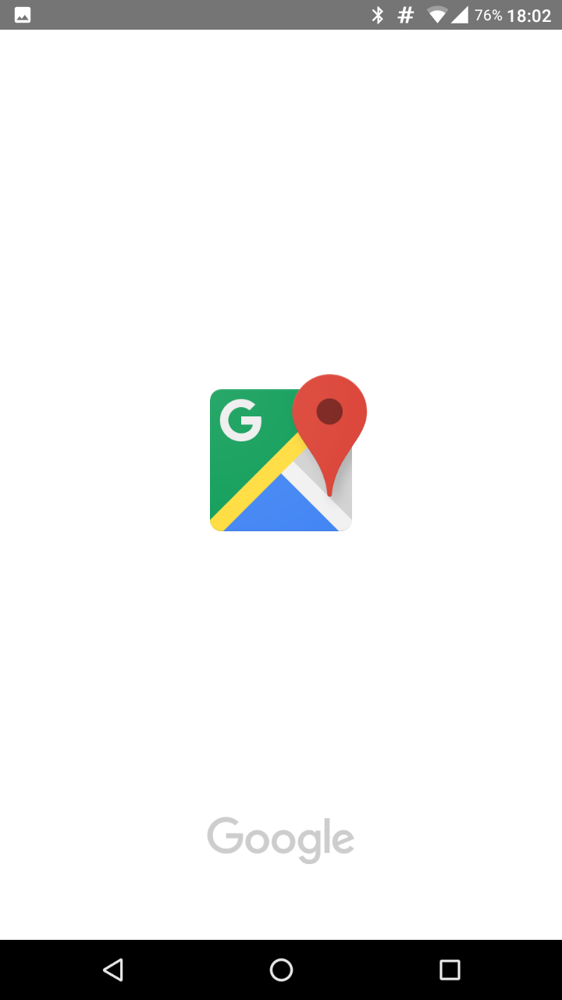
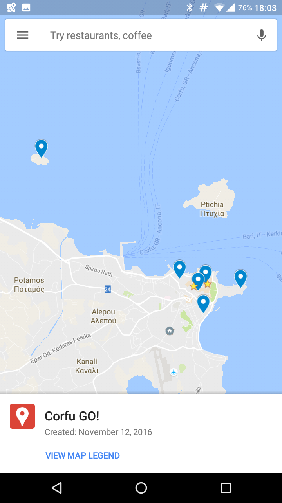
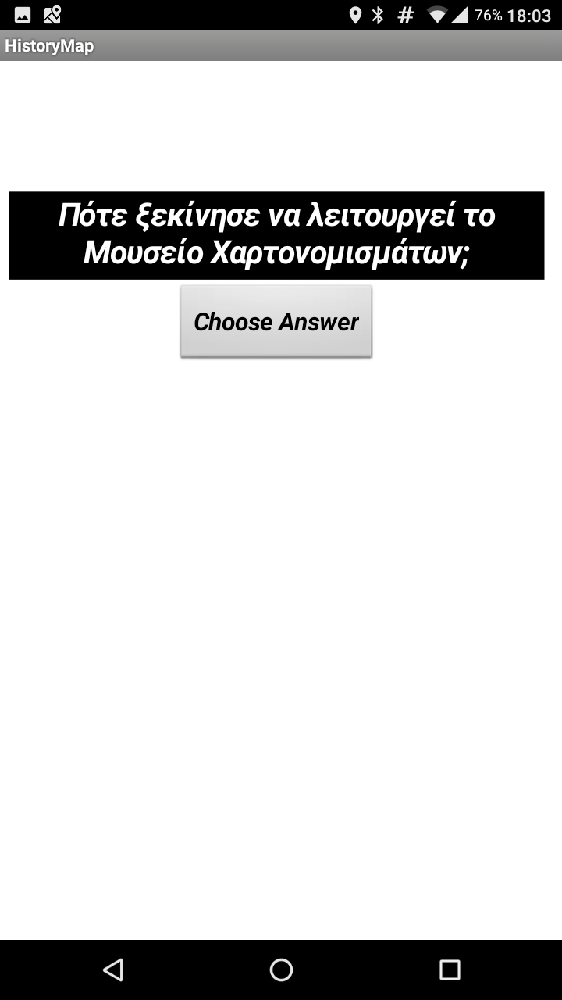
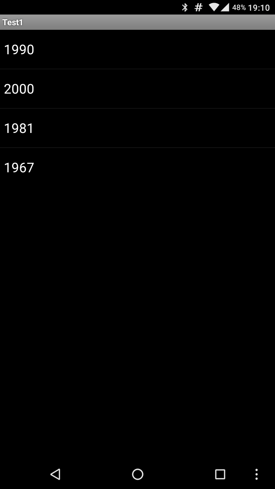
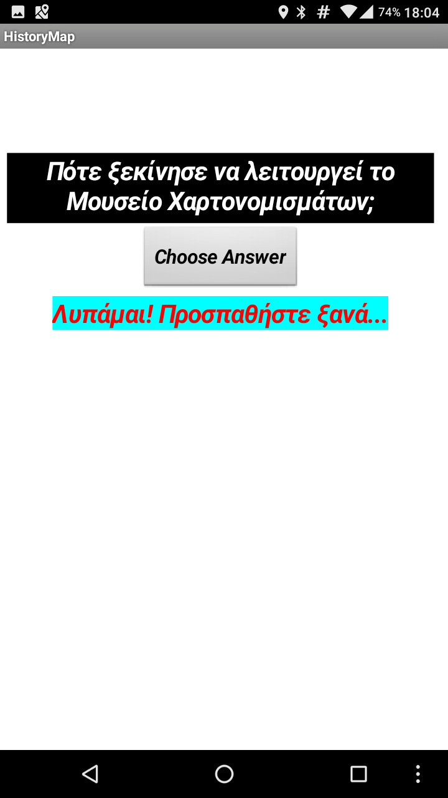

#ΙΟΝΙΟ ΠΑΝΕΠΙΣΤΗΜΙΟ 
#ΤΜΗΜΑ ΠΛΗΡΟΦΟΡΙΚΗΣ 
#ΜΑΘΗΜΑ: Επικοινωνία Ανθρώπου-Υπολογιστή 
 
Επιβλέπων καθηγητής: Χωριανόπουλος Κωνσταντίνος 

Καπετάνιος Αχιλλέας  ΑΜ: Π2015201     p15kape1@ionio.gr

##Προδιαγραφές

* Μαθητές Γυμνασίου - Λυκείου, Ενήλικες
* Παιχνίδι Γνώσεων
* Γνωριμία με την Ιστορία της πόλης της Κέρκυρας, τον πολιτισμό, τους ανθρώπους
* Εφαρμογή κινητής συσκευής, κουίζ γνώσεων με ερωτήσεις που εμφανίζονται μόλις ο χρήστης βρεθεί σε προκαθορισμένες συντεταγμένες στο χάρτη.
* Λόγοι επιτυχίας ή αποτυχίας εφαρμογών

## Εγκατάσταση εργαλείων ανάπτυξης

* Εργαλείο ανάπτυξης: MIT App Inventor

## Δανεισμός στοιχείων (ιδέες και κώδικα) από:
* http://www.appinventor.org/content/ai2apps/intermediateApps/presidentsQuiz
* http://explore.appinventor.mit.edu/ai2/android-wheres-my-car
* http://appinventor.mit.edu/explore/displaying-maps.html
* Where is my bus

##Περιγραφή Εφαρμογής Corfu GO!

* Παιχνίδι γνώσεων που απευθύνεται κυρίως σε μαθητές γυμνασίου - λυκείου κι έχει σκοπό να να βοηθήσει τους μαθητές να μαθουν - μέσα από ένα παιχνίδι ερωτήσεων- περισσότερα για 
την πόλη τους, την Κέρκυρα, την ιστορία της, τον πολιτισμό της, τους ανθρώπους της, την κοινωνική ζωή της.
* Απευθύνεται και σε ενήλικες, ντόπιους και τουρίστες (προς το παρόν Έλληνες τουρίστες), βοηθώντας τους να μάθουν τα τοπικά σημεία ενδιαφέροντος, για κάθε θέμα, απαντώντας σε απλές 
ερωτήσεις και μαθαίνοντας πληροφορίες για κάθε μέρος που επισκέπτονται.
* Η εφαρμογή είναι κουίζ ερωτήσεων που βασίζεται στην περιήγηση του χρήστη στην πόλη της Κέρκυρας. Αφου ανοίξει την εφαρμογή κι επιλέξει κατηγορία ερωτήσεων, μέσω του χάρτη που εμφανίζεται 
στην οθόνη της κινητής συσκευής, κατευθύνεται προς διάφορα προεπιλεγμένα σημεία που έχουν σχέση με την κατηγορία ερωτήσεων που διάλεξε. Μόλις φτάσει στο σημείο, εμφανίζεται ενα pop-up στην 
κινητή συσκευή με μία ερώτηση για το σημείο που βρίσκεται και 4 απαντήσεις από τις οποίες πρέπει να επιλέξει τη σωστή. Αφού επιλέξει, εμφανίζεται ένα μήνυμα επιβεβαίωσης ή λάθους και με shake
στην κινητή συσκευή φεύγει το pop-up και συνεχίζεται η περιήγηση στην πόλη.

##Βήμα - Βήμα Περιγραφή

* Μόλις ανοίξει η εφαρμογή εμφανίζεται η αρχική οθόνη, όπου επιλέγεις αν θα παίξεις ή αν θα δεις τους συντελεστές της εφαρμογής

* Η οθόνη με τους συντελεστές της εφαρμογής.

* Αν πατήσουμε play μας βγάζει την οθόνη επιλογής της κατηγορίας ερωτήσεων που θα παίξουμε. Προς το παρόν είναι Ιστορία, Τέχνες, Αθλητισμός.

* Πατώντας Ιστορία ξεκινάει η εφαρμογή Google Maps με φορτωμένο πάνω το χάρτη για το Corfu GO!. Με τα επιλεγμένα σημεία ήδη τοποθετημένα πάνω στο χάρτη.

* Μόλις ο χρήστης βρεθεί σε ένα από τα επιλεγμένα σημεία (συγκρίνοντας τις αποθηκευμένες συντεταγμένες του σημείου με τις συντεταγμένες του χρήστη) τότε εμφανίζεται μια ερώτηση σε σχέση με το σημείο αυτό.

* Πατώντας το κουμπί Choose Answer δίνεται στο χρήστη η δυνατότητα να επιλέξει μία από τις τέσσερις απαντήσεις.

* Ανάλογα με το αν απαντήσει σωστά ή λάθος θα εμφανιστεί και το ανάλογο μήνυμα.

 

* Κουνώντας έντονα τη συσκευή η ερώτηση εξαφανίζεται και συνεχίζεται η περιήγηση μέχρι το επόμενο σημείο.

* Παρατίθεται κι ένα βίντεο με τη λειτουργία της εφαρμογής.

https://www.youtube.com/watch?v=9rmCUau-6Hs&feature=youtu.be

## Προβλήματα και μελλοντικές βελτιώσεις

*Η αισθητική της όλης εφαρμογής είναι πολύ φτωχή. Κι αυτό γιατί, μέχρι τώρα το βάρος είχε δοθεί στο να λειτουργήσει όπως πρέπει η εφαρμογή και να γίνουν μετά οι αισθητικές βελτιώσεις.
Μία δυσκολία με τη χρήση της εφαρμογής που πρέπει να ξεπεραστεί, είναι η χρήση συντεταγμένων, όχι με ακρίβεια σημείου αλλά με εύρος κάποιας περιοχής γύρω από το σημείο, ώστε η ερώτηση να ενεργοποιείται ακόμα κι αν ο χρήστης είναι κοντά και όχι ακριβώς πάνω στο αποθηκευμένο σημείο του χάρτη. 

##  Online Demo (WIP): ai2.appinventor.mit.edu/?galleryId=6637166009253888

